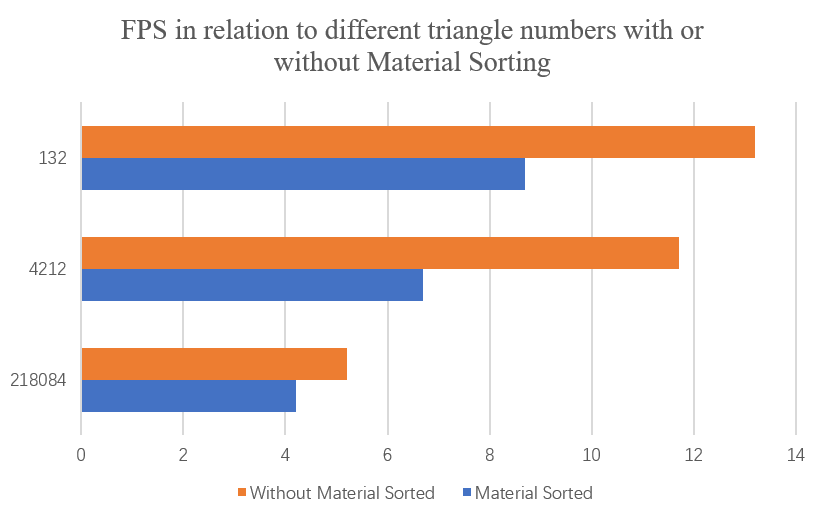
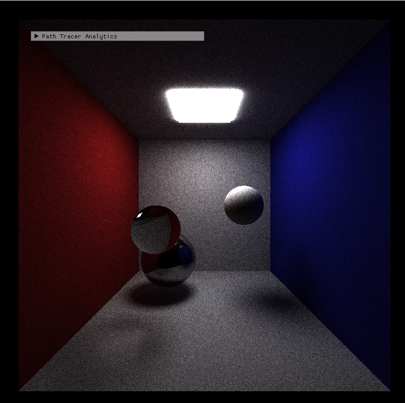
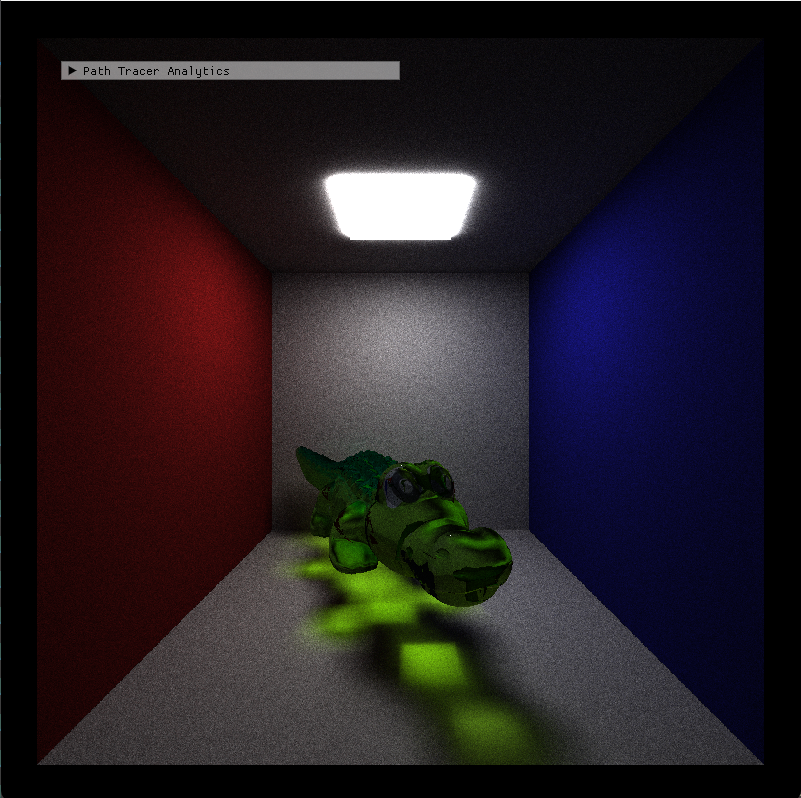
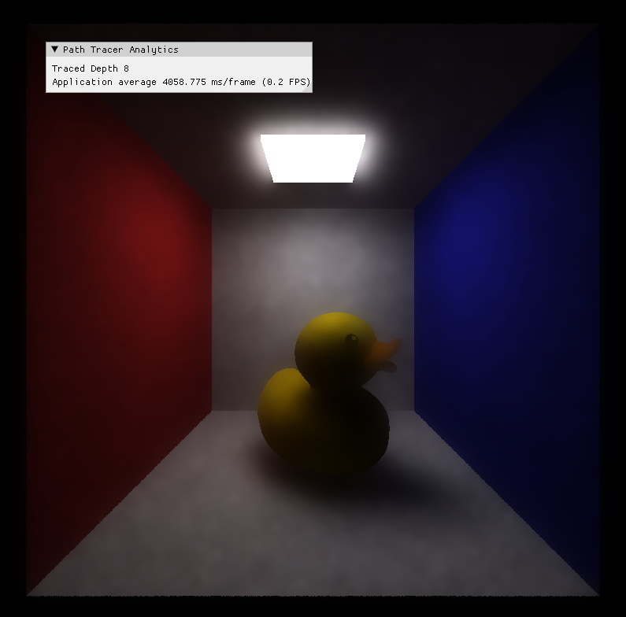

CUDA Path Tracer
================

**University of Pennsylvania, CIS 565: GPU Programming and Architecture, Project 3**

* Hanting Xu
* [GitHub](https://github.com/HantingXu), [LinkedIn](www.linkedin.com/in/hanting-xu-25615b28b).
* Tested on: (Personal Computer) Windows 11, i7-12700H @ 2.70GHz 32GB, GeForce RTX 3070 Ti Laptop GPU

* Show Case:

## Path Tracing

### Handling Different Materials
* Emissive, diffuse, specular and refractive objects are all handled. For future work, more parameters should be introduced to control the roughness of the objects. This could be implemented by setting different probability for the direction of reflection lights.

### Mesh Loading & Texture Mapping
* Third Party Reference:
For obj file loading, the [sample code](https://github.com/tinyobjloader/tinyobjloader) for tinyOBJ is used in this project. And for gltf mesh loading, the [code](https://github.com/syoyo/tinygltf) in tinyGLTF is used for loading gltf meshes. Also, simple texture mapping is supported, but just for base color. The program gives no support for the normal mapping or roughness mapping. If a object is not given a valid texture, the program would generate a procedural texture for it automatically. Note : All the textures and objects address that are wished to be added into the scene should be entered as the full path in the scene file.

### Antialiasing
* The implementation for antialiasing is quite simple, which is just randomly slightly shift the ray direction of each pixel at the start of every iteration.

### Depth Of Field
* Depth of field simulate the defocusing effects that of lens. This effect is simulated by putting disk at a depth in front of our image plane and adjusting the light direction to create a effect of blur. For more information, please refer to the [book](https://raytracing.github.io/books/RayTracingInOneWeekend.html).

### Gaussian and SVGF Denoising
* Gaussian Denoise: It is a really primitive filter. Basically blurs everything. You can change the blurring radius as you want.

* SVGF: Different from gaussion which simply deals with the obtained image, SVGF allows us to maintain the boundary of each objects by taking the surface normal, albedo, depth and object index into consideration.

### BVH Tree Building and Traversal On GPU
* BVH Tree construction: The construction of the tree is on GPU side. It is a simple implementation of this [article](https://developer.nvidia.com/blog/thinking-parallel-part-iii-tree-construction-gpu/) from Nvdia. This can be devided into the steps following: Building Morton Codes, Sorting Morton Codes, Splitting BVH Nodes and Building Bounding Boxes. My code basically follows every steps in the article. For Splitting Node, I refers to this [paper](https://developer.nvidia.com/blog/parallelforall/wp-content/uploads/2012/11/karras2012hpg_paper.pdf). The only difference from my implementation and the article is that, I didn't use the atomic operation for building bounding boxes in the last step, but just naively update each level iteratively. Future work could be done to support atomic operation, which should speedup the performance.

* BVH Tree traversal: For BVH tree traversal, my implementation is based on this [article](https://developer.nvidia.com/blog/thinking-parallel-part-ii-tree-traversal-gpu/), which avoids the recursive traversal by maintaining a stack for the nodes that should be traversed later.

### Performance Analysis
* According to my observation, antialiasing, DoF effect, denoising don't have a significant effect on the performance, especially when the triangle count becomes large.

* Material Sorting: In my original thought, sorting light paths according to their material before shading should increase the performance. However, according to data gather, it may not be true. The performance without sorting seems to be better than that of the sorted ones under different triangle numbers in the scene. Sorting overheads might accounts for this or I just implemented it wrong?

* BVH: Using BVH traversal to find the intersection have a huge boost on the performance, especially when the faces numbers increased. The graph below demonstrates its influence.

### Discoveries
* Before I put all the vertices, normal and uv data all into the Triangle Struct, I used to store them into seperate device arrays. Even though it looks messier, which is a main reason I packed them together, its performance is actually better than the current version. This is probably because this way of reading data more efficient.

### Show Case

* 
* 
* 
* 
* 
