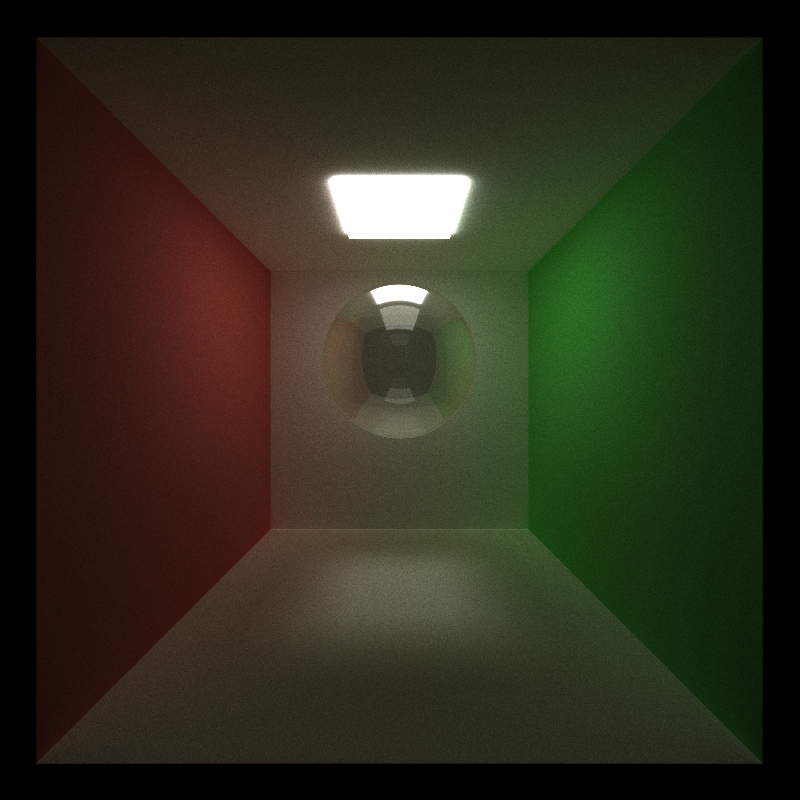

CUDA Path Tracer
================

**University of Pennsylvania, CIS 565: GPU Programming and Architecture, Project 3**

Han Wang

Tested on: Windows 11, 11th Gen Intel(R) Core(TM) i9-11900H @ 2.50GHz 22GB, GTX 3070 Laptop GPU

# Overview

This project is a Monte Carlo path tracer run on GPU based on CUDA. It is a rendering algorithm that simulates the behavior of light in a scene by tracing rays from the camera into the scene. Using a GPU and CUDA for Monte Carlo path tracing allows for massive parallelization, speeding up the ray tracing and light simulation steps. CUDA is a parallel computing platform and application programming interface (API) model that efficiently utilizes the GPU's parallel processing capabilities.

# Render features:

### 1. Refraction (e.g. glass/water)
|reflect|reflect+refrect(glass)|difffuse
|:-----:|:-----:|:-----:|
|||

In this part, I did make three materials including reflected metal,  reflect+refrect glass, and normal diffuse material used for comparison. I tried to make the refract and reflect portion getting close to the real world's glass and successfully built my glass ball. It is easy to see that there are lighted areas below the glass ball showing that the light passed through the glass ball. In contrast, I also put the same ball but with the diffusion surface, the area below the ball is shadowed and dark.

### 2. Physically-based depth-of-field
|with DOF|without DOF|
|:-----:|:-----:|
||

In this part, I write an interesting camera effect called depth of field. It refers to the range within a scene that appears in sharp focus, creating a clear and visually pleasing image. The DOF effect is achieved by controlling the focal length of the camera lens and the aperture size, determining how much of the scene is in focus and how much is blurred. This technique allows for artistic control over the perception of depth, emphasizing certain subjects while softening the background or foreground, enhancing the overall visual impact of the image or video.

### 3. Stochastic Sampled Antialiasing
|with Antialiasing|without Antialiasing|
|:-----:|:-----:|
||

### 4. Subsurface scattering
|Subsurface scattering|diffuse surface|
|:-----:|:-----:|
||

### 5. defining object motion, and motion blur
|motion blur direction 1|motion blur direction 2|
|:-----:|:-----:|
||

