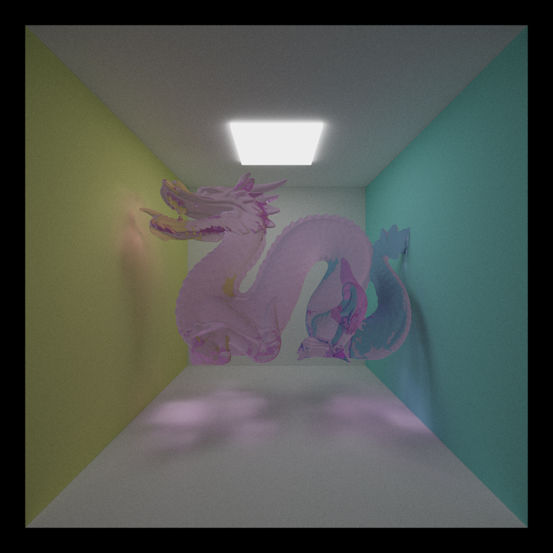

CUDA Path Tracer
================

**University of Pennsylvania, CIS 565: GPU Programming and Architecture, Project 3**

* Saksham Nagpal  
  * [LinkedIn](https://www.linkedin.com/in/nagpalsaksham/)
* Tested on: Windows 11 Home, AMD Ryzen 7 6800H Radeon @ 3.2GHz 16GB, NVIDIA GeForce RTX 3050 Ti Laptop GPU 4096MB

## Summary
This project is a learning attempt turned into a definitive milestone in my journey of learning CUDA. The aim of making a path tracer using CUDA and C++ is to replicate the behaviour of the graphics pipeline while manually being in-charge of the GPU-side kernel invocations. Using CUDA, I map each of the steps in the graphics pipeline (i.e. vertex shader, rasterization, fragment shader, etc.) into equivalent kernel invocations, thus solidfying both experience with CUDA as well as knowledge of the graphics pipeline. This project also turned out to be a good way of keeping me true to my understanding of the core graphics concepts such as coordinate transformations and barycentric interpolation. By implementing a combination of visually pleasing and computationally accelerating features, I was able to generate some fun renders such as these:

## Representative Outcomes  
_247,963 triangles, 5000 iterations, max 10 bounces per ray_
   

_Stanford Dragon - 871,306 triangles, 5000 iterations, max 8 bounces per ray_
 

## Features Implemented

1. BSDFs - Diffuse, Perfectly Specular, Perfectly Reflective, Imperfect Specular/Diffuse, Refractive
2. Acceleration Structure - Bounding Volume Heirarchy (BVH)
3. Stochastic Sampled Antialiasing
4. Physically-Based Depth of Field
5. Support for loading glTF meshes
6. Texture Mapping for glTF meshes
7. Stream Compaction for ray path termination
8. First bounce caching
9. Material Sorting
10. Reinhard operator & Gamma correction

## Path Tracer

A path tracer, in summary, is an effort to estimate the **Light Transport Equation (LTE)** for a given scene. The LTE is a methematical representation of how light bounces around in a scene, and how its interactions along the way with various kinds of materials give us varied visual results.

The Light Transport Equation
--------------
#### Lo(p, &#969;o) = Le(p, &#969;o) + &#8747;S f(p, &#969;o, &#969;i) Li(p, &#969;i) V(p', p) |dot(&#969;i, N)| _d_&#969;i

The [PBRT](https://pbr-book.org/3ed-2018/Light_Transport_I_Surface_Reflection/The_Light_Transport_Equation#) book is an exceptional resource to understand the light transport equation, and I constantly referred it throughout the course of this project.

# Performance Analysis

Here I will document the attempts I made to boost the performance of my pathtracer - my hypothesis on why I thought the change could result in a potential performance improvement, and my actual findings along with supporting metrics.

## Stream Compaction for Ray Path Termination

For each iteartion, we bounce a ray around the scene until it terminates, i.e., either hits a light source or reaches some terminating condition (such as max depth reached, no scene geometry hit, etc.). After each iteartion of scene intersection, if we were to compact the ray paths, then potential performance gains could result due to the following reasons:
1. **Reducing the number of kernel threads:** Instead of calling the scene intersection kernel always with number of threads equal to the number of pixels in our scene, we could invoke the kernel only with as mnay threads as there are unterminated rays. This should result in less copy-over to and from the device to host, and thus giving us a better memory bandwidth.
2. **Coalescing Memory:** In our array of rays, each iteration would cause rays at various random indices to get terminated. If we were to compact away the terminated rays and partition our non-terminated rays into contiguous memory, then that should enable warps to retire and be available to the scheduler for more work. Coherent memory should also hasten access times, thereby potentially adding to the performance gain.

### Metrics:

 

* **Open Scene:** For the open scene, an actual benefit is seen at higher depth values. This makes sense, since in an open scene there is a high probability for a ray to hit no scene geomtery, and therefore not reach the light source, In such a scenario, removing all the terminated rays at each iteartion would give us a much smaller subset of rays to work with in the next iteration. Since Stream Compaction's performance for our case is memory bound, it makes sense for the offset to occur at higher depths wherein termination of paths actually starts making up for the cost of stream compaction. For our case, looking at the graph we see that stream compaction starts becoming more performant than naive path termination _scene depth = 6_ onwards.

* **Closed Scene:** For a closed scene, there is a much higher probability for rays to reach the light source by bouncing around the scene numerous times. This is corroborated by the grpah, wherein we do not see the number of unterminated rays decreasing with depth count unlike the open scene case. Hence, stream compaction happens to be just an unnecessary overhead in this case, and is never able to offset the naive path termination's performance.

## Material Sorting

Another potential candidate for a performance boost is sorting the rays and intersections based on the material indices. Every path segment in a buffer is using one large shading kernel for all BSDF evaluations. Such differences in materials within the kernel will take different amounts of time to complete, making our kernel highly divergent. Therefore, sorting the rays to make paths interacting with the same material contiguous in memory before shading could potentially give us better performance by reducing **Warp Divergence**.

### Metrics:

 

We see that for our case, at such a small level, material sorting is not really giving us a benefit. In fact, it is actually incurring an extreme overhead. The reason for this could be the small scale and the simplpicity of our scenes, where  there is no significant gain that could offset the hit we take from sorting each ray and intersection based on material.
