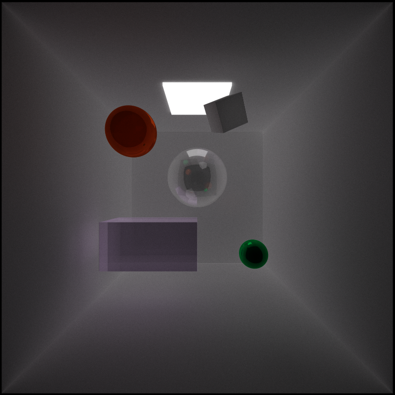
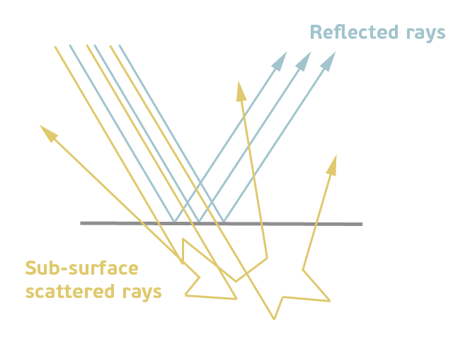
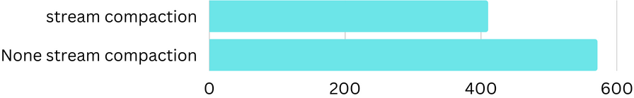

CUDA Path Tracer
================

**University of Pennsylvania, CIS 565: GPU Programming and Architecture, Project 3**

Han Wang

Tested on: Windows 11, 11th Gen Intel(R) Core(TM) i9-11900H @ 2.50GHz 22GB, GTX 3070 Laptop GPU

# Overview

This project is a Monte Carlo path tracer run on GPU based on CUDA. It is a rendering algorithm that simulates the behavior of light in a scene by tracing rays from the camera into the scene. Using a GPU and CUDA for Monte Carlo path tracing allows for massive parallelization, speeding up the ray tracing and light simulation steps. CUDA is a parallel computing platform and application programming interface (API) model that efficiently utilizes the GPU's parallel processing capabilities.

# Render features:

### 1. Refraction (e.g. glass/water)
|reflect|reflect+refrect(glass)|difffuse
|:-----:|:-----:|:-----:|
|||

In this part, I made three materials including reflected metal,  reflect+refrect glass, and normal diffuse material used for comparison. I tried to make the refract and reflect portion getting close to the real world's glass and successfully built my glass ball. It is easy to see that there are lighted areas below the glass ball showing that the light passed through the glass ball. In contrast, I also put the same ball but with the diffusion surface, the area below the ball is shadowed and dark.

### 2. Physically-based depth-of-field
|with DOF|without DOF|
|:-----:|:-----:|
||

In this part, I write an interesting camera effect called depth of field. It refers to the range within a scene that appears in sharp focus, creating a clear and visually pleasing image. The DOF effect is achieved by controlling the focal length of the camera lens and the aperture size, determining how much of the scene is in focus and how much is blurred. This technique allows for artistic control over the perception of depth, emphasizing certain subjects while softening the background or foreground, enhancing the overall visual impact of the image or video.

### 3. Stochastic Sampled Antialiasing
|with Antialiasing|without Antialiasing|
|:-----:|:-----:|
||

From the image comparison, we can see that at the edge of the sphere, there is a great difference between antialiasing and no antialiasing. The edge with antialiasing is greatly smoother than without it. The operation is also simple, we just apply a small random float number between the iterations of the path. Because we basically need an average between iterations, the average step in antialiasing is already completed.

### 4. Subsurface scattering
|Subsurface scattering|diffuse surface|
|:-----:|:-----:|
||

before analyzing and talking about the generated output, it would be better to see the below image by Autodesk:

As shown in the above picture, we can see that the basic idea of subsurface scattering is to not let the ray penetrate through the sphere directly. In contrast, the ray should remain in the ball and scatter inside. Thus my implementation of subsurface scattering is just simulating this process. In the condition that the ray is inside the object, we set the probability that it will scatter inside. The first two image shows the contrast between the normal diffuse and subsurface scattering. 

### 5. defining object motion, and motion blur
|motion blur direction 1|motion blur direction 2|
|:-----:|:-----:|
||

I realize this motion blurs by using the basic path tracer's "iter and average" mechanism. What I'm doing is moving the object's position during each iteration. After doing so, we need to update the transform matrix and inverse transform matrix and transpose the inverse transform matrix. I defined a movement vector at the top of the .cu file, but it is also easy to develop other animation curves by using different move curves.

In the above-displayed image, I used a sin curve to describe the movement of the object, thus the images show a more clear shadow in the both ending of the movement track.
  

# Analysis

### Stream Compaction
Based on my test, I have the following graph:
# Average run-time used per iteration (MS) lower is better

It's easy to see that after using stream compaction, the performance largely improved because the unused and invalid data was terminated early. With the compact, the data size needs to be reduced. There are more detailed benefits, please view my previous project Stream Compaction.

### Open Space & close space
|in the box|without the box|
|:-----:|:-----:|
||

Based on the image, we can easily see that we need an average of 634.047 MS to generate an iter in the box while we only need 104.308 MS to generate an iter without the box. It's obvious that we need less time to iter without a box. The reason is also obvious: There is less light bouncing in the open space compared to the inside box, thus the iteration terminates early and needs fewer resources. 
# reference

https://www.pbr-book.org/3ed-2018/Camera_Models/Projective_Camera_Models#ProjectiveCamera::focalDistance
https://www.pbr-book.org/3ed-2018/Monte_Carlo_Integration/2D_Sampling_with_Multidimensional_Transformations#ConcentricSampleDisk
https://en.wikipedia.org/wiki/Schlick%27s_approximation
561 HW6 (personal reference)
