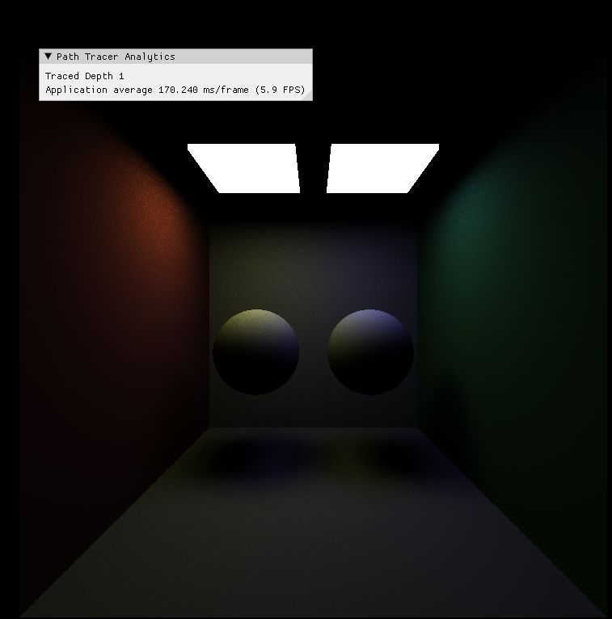
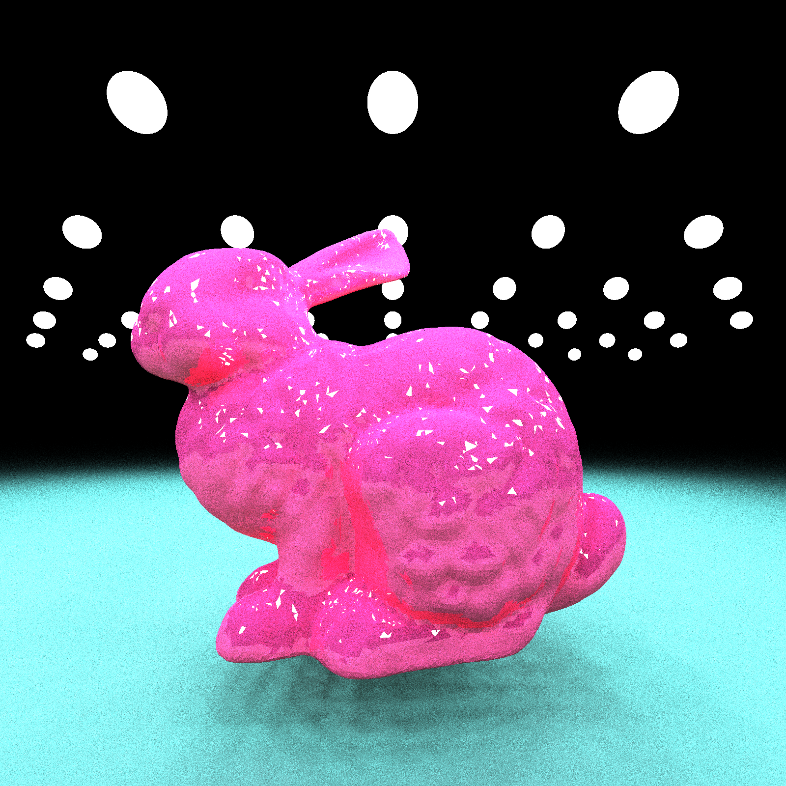
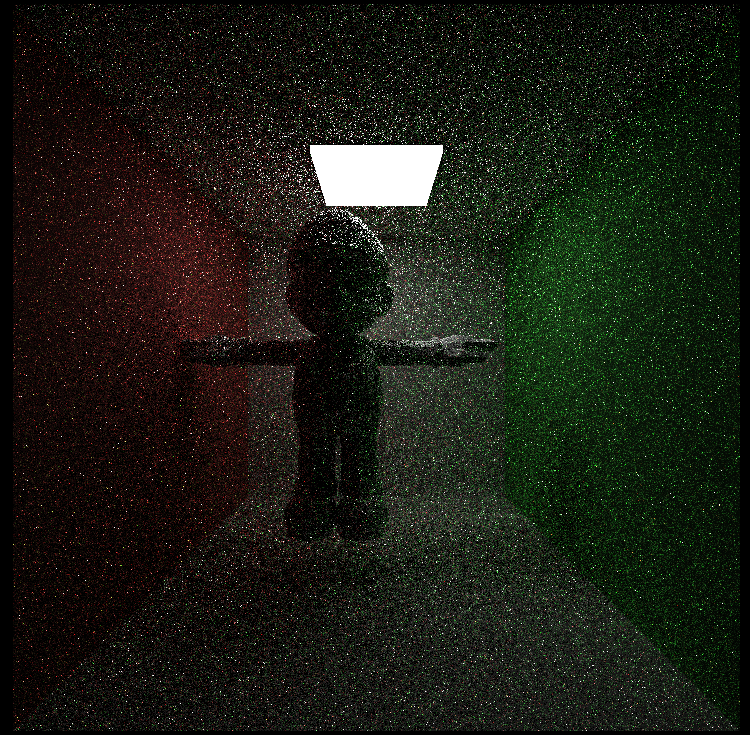

CUDA Path Tracer
================

**University of Pennsylvania, CIS 565: GPU Programming and Architecture, Project 3**

* Janet Wang
  * [website](https://xchennnw.github.io/en.github.io/)
* Tested on: Windows 11, i7-12700H @ 2.30GHz 16GB, Nvidia Geforce RTX 3060 Ti  8054MB

## Features
* OBJ mesh loading & BVH
* Materials (Diffuse, Perfect Specular, Refraction, Glass, Plastic)
* Direct lighting (A full lighting Integrator)
* Stratified sampling for random number sequences

#### Obj Mesh Loading & BVH
I use the tinyObj for parsing and loading the obj format meshes. After meshed are loaded, a list containing all the triangles in the scene is transported to GPU for intersection computing.

To accelerate the intersection process, I added a BVH structure. It is constructed on CPU, and then a list of BVH nodes and a list of index of triangles used by BVH nodes are transported to GPU. As expected, it significantly improves the intersection performance.

#### Materials
| Diffuse             | Perfect Specular    | Pure refraction   |    Plastic        |        Glass      |
| ------------------- | ------------------- | ----------------- | ----------------- |------------------ |
|  |  | | | |
Glass = 50% chance of refraction + 50% chance of reflection (With Fresnel dielectric evaluation).
Plastic = 50% chance of diffuse + 50% chance of reflection (With Fresnel dielectric evaluation).

####  Direct lighting (A full lighting Integrator)
At first, I added a kernal to compute the direct lighting for each bounce in each path. And then I added a full integrator which combines the direct lighting and global illumination. For optimization, I added Russian roulette to give some chance to terminate the paths that have relatively low light throughput. Compared with the naive method, it renders a more converged image in a shorter period of time. 

In the future, implementing an MIS sampling would further improve the performance of this part, especially if a more complex material system with various roughness is added.
| Only direct lighting    | Full lighting       |
| ----------------------- | ------------------- |
|  |  |

Same scene at same number of iterations:
| Naive Integrator        | Full lighting Integrator|
| ----------------------- | ----------------------- |
|  |      |

#### Stratified sampling
Images below show the 1st iteration of the wahoo scene. Actually the improvement is not quite obvious.
| Without Stratified sampling | With Stratified sampling (20 x 20)|
| --------------------------- | --------------------------------- |
|         |                  |

## Performance Analysis

#### Stream Compaction I: the termination of rays within a single iteration

#### Stream Compaction II: the performance effect on open and closed scenes
