CUDA Path Tracer
======================

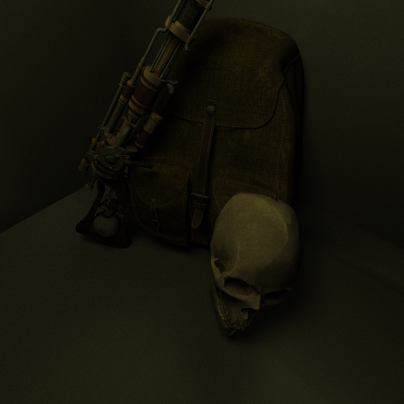

**University of Pennsylvania, CIS 565: GPU Programming and Architecture, Project 3**

* Gene Liu
  * [LinkedIn](https://www.linkedin.com/in/gene-l-3108641a3/)
* Tested on: Windows 10, i7-9750H @ 2.60GHz, 16GB RAM, GTX 1650 Max-Q 4096MB (personal laptop)
  * SM 7.5

# Project 3: CUDA Path Tracer

This project implements a CUDA based Monte Carlo path tracer that aims to produce realistic lighting and coloring conditions on various scenes. The path tracer shoots rays through each pixel of the image plane, bounces the rays at each intersection depending on the material of the intersected object, and aggregates color based off the material properties of the objects hit. This allows for accurate simulation of light to produce highly detailed scenes.

## Base Features

### Ideal Diffuse, Perfectly Specular BSDFs

| Ideal Diffuse | Perfect Specular |
|---------------|------------------|
| 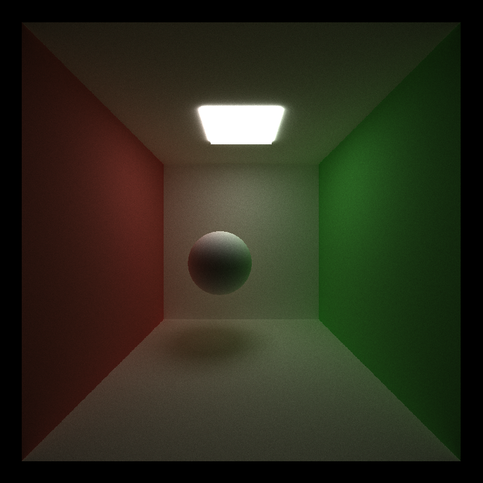 | 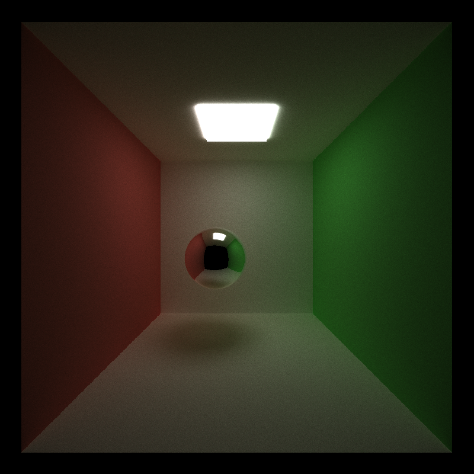 |

Simple BSDF ray scattering for both ideal diffuse and perfectly specular materials was implemented. An ideal diffuse surface scatters rays uniformly at random in the hemisphere centered around the surface normal, while a perfectly specular material reflects the ray along the surface normal.

### Path Termination with Stream Compaction

At the end of every ray bounce, the program evalutes which rays can be terminated and removes them from the ray pool. A ray path can be terminated upon reaching a path with no intersection or upon hitting a light source. This is done using thrust's `thrust::partition`, which allows the reshuffling of all unterminated rays to be contiguous in the path memory. 

To analyze the performance benefits of this stream compaction, the cornell box scene was used. The camera was positioned inside the box, and by adding an additional front wall the impact of stream compaction on a closed scene(cornell box with additional wall) and an open scene(cornell box with open side) was assessed, with a ray max depth of 8.

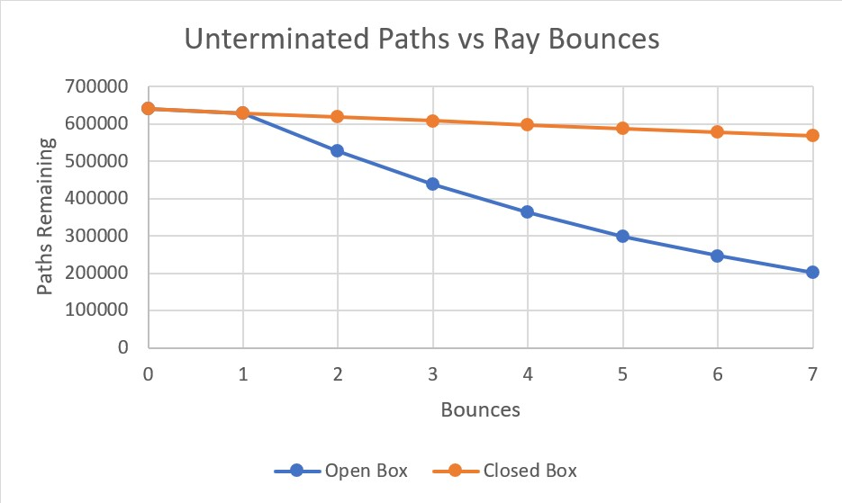

As expected, it seems to take longer for rays to terminate within a closed box, simply as it is more difficult for rays to reach the termination condition of hitting a light source or intersecting nothing. In particular, it seems that opening a side of the cornell box allows for around 50% of all rays to terminate in between 4 to 5 bounces, and 70% to terminate by 7 bounces. 

The difference in path termination can be seen in the material sorting graph, as implied from the open and closed box performance disparity. When paths terminate before max depth, as in an open box condition, each iteration performs less work testing intersections and aggregating color, as there are less rays to do so on. Thus, when path termination is more likely, we see increased performance compared to situations where rays cannot be terminated.

### Material Sorting

After assessing ray intersections, this path tracer offers the option to sort the path segments by material id as to allow intersections with the same material to be contiguous in memory. This would theoretically allow for less warp divergence as the same materials are located consecutively in memory. The performance impact of this feature was tested similarly to stream compaction, with the same open/closed cornell box.

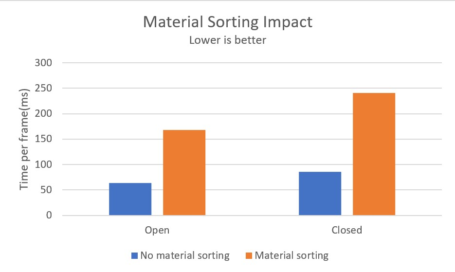

Surprisingly, it seems that material sorting actually decreases overall performance. This is likely due to the overhead introduced by sorting with `thrust::sort_by_key` outweighing its benefits. This could also be due to the low amount of materials within these scenes not causing enough warp divergence for the sorting to show benefits. Theoretically, a scene with mucuh more materials would likely see some more benefits from the material sorting.

### First Bounce Cache

A possible optimization in path tracing is to cache the results of the first ray bounce to reuse in future iterations, since if the camera position of direction do not change, the initial rays from the image plane will always intersect the scene at the same points. The performance impact of this first bounce cache was analyzed on the default cornell box scene with an ideal diffuse sphere. The ray max depth was varied from 1 to 8 on this scene with both the first bounce cache on and off.

It seems that the first bounce cache does not significantly improve or harm performance in general at any ray depth greater than 1. At a depth of 1, the cache helps, obviously as the only intersection that needs to be found in the scene is cached and reused. As the ray depth increases, starting from the first intersection point seems to have no difference compared to starting at the camera. This could be due to the first intersection being relatively simply to compute within this scene, or in general.

## Advanced Features

### glTF 2.0 Mesh Loading

This project also includes the ability to import custom meshes apart from the given simple cube and sphere primitives. Most glTF 2.0 meshes are supported and can be rendered. [tinygltf](https://github.com/syoyo/tinygltf/) is used to load the meshes into `tinygltf` data structures, which are then parsed and converted to data formats usable by the path tracer. Meshes with multiple components(glTF nodes, meshes, and prims) can be parsed, and the base color associated with a glTF prim overrides the scene material designated. Base color and normal textures are also applied, but will be described in the next section. Some example custom meshes, apart from the ones in the final showcase image above, are shown below. The sources for these meshes are linked in the resources section below.

| Avocado (682 triangles) | Low poly goose (1098 triangles) |
|---------------|------------------|
| 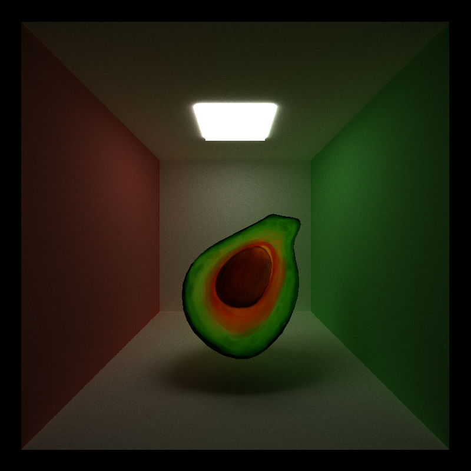 | 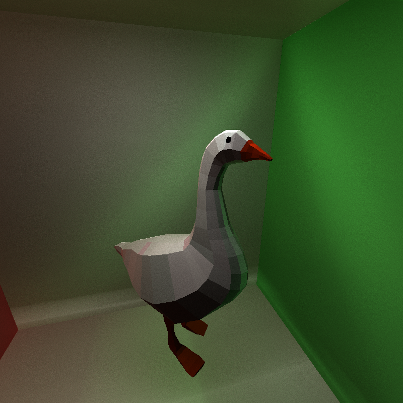 |

| Fox totem (4598 triangles) | Viper steam carbine (23764 triangles) |
|---------------|------------------|
| 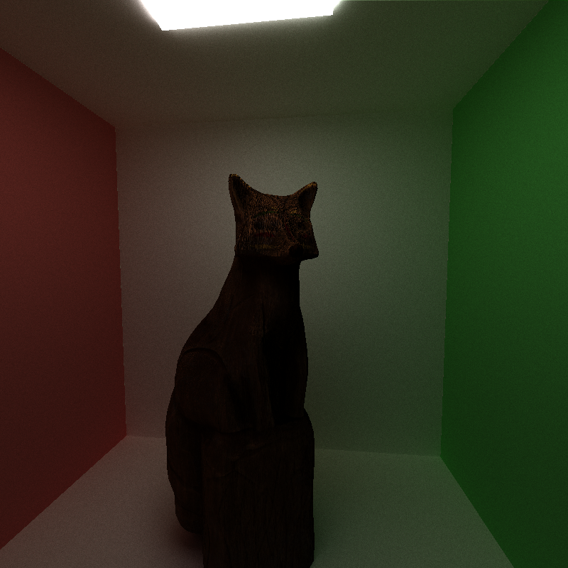 | 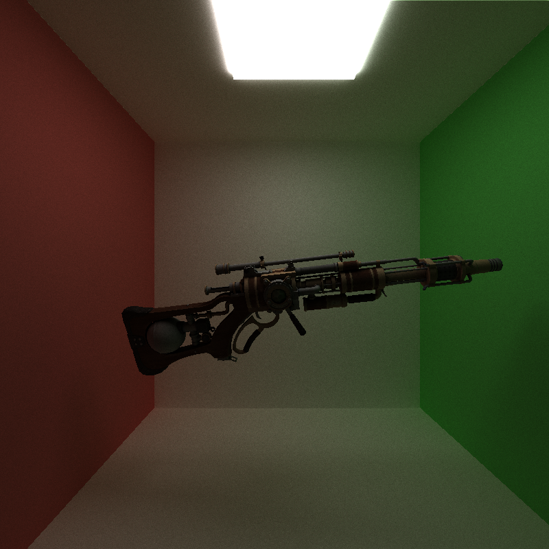 |

### Texture and Normal Mapping

Textures from glTF files can be loaded alongside the triangle mesh and applied correctly. This allows for higher mesh detail both in color and in surface texture. The corresponding textures are loaded into GPU global memory, then the corresponding value per pixel is calculated through barycentric interpolation. 

If a base color texture for a glTF prim exists, this color takes precedance over both the glTF material base color and the scene defined material base color, as it provides a more accurate coloring of the object. Similarly for normals, the priority first goes to normal map interpolated normals, then glTF defined per vertex normals, then finally a manually calculated normal using the cross product on the specific triangle intersected.

The combination of the normal and base color textures is demonstrated below.

| Base color | Normal map | Combined |
|------------|------------|----------|
| 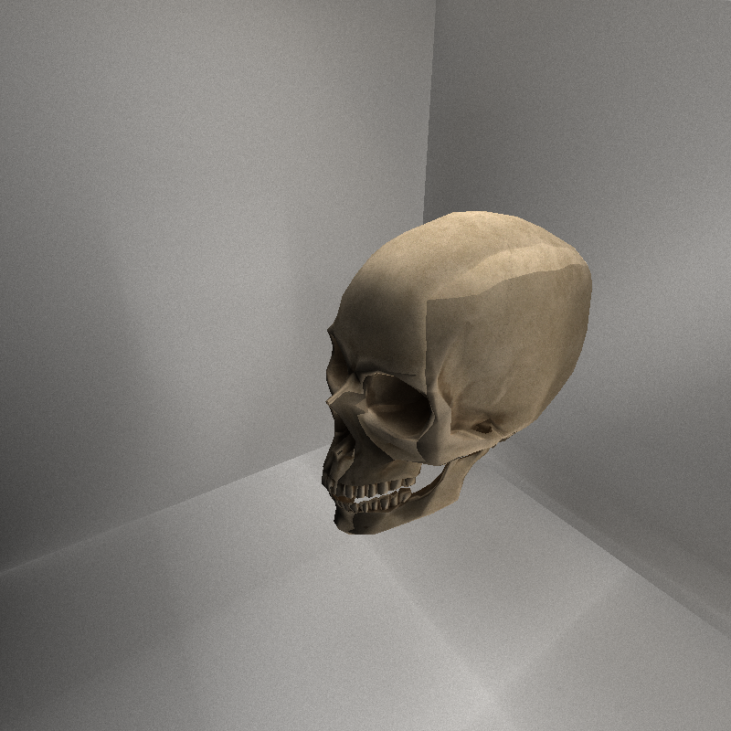 | 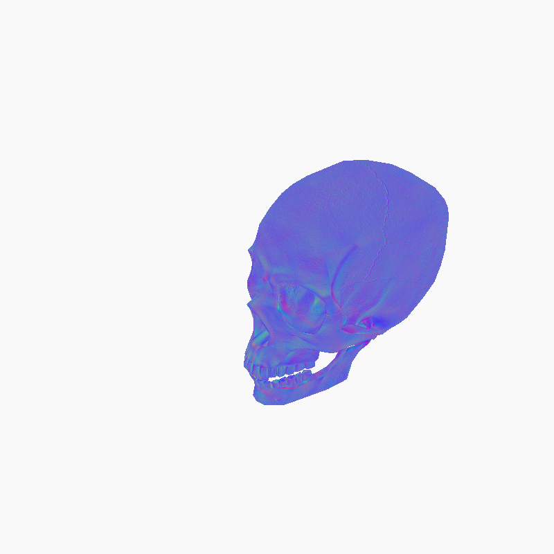 | 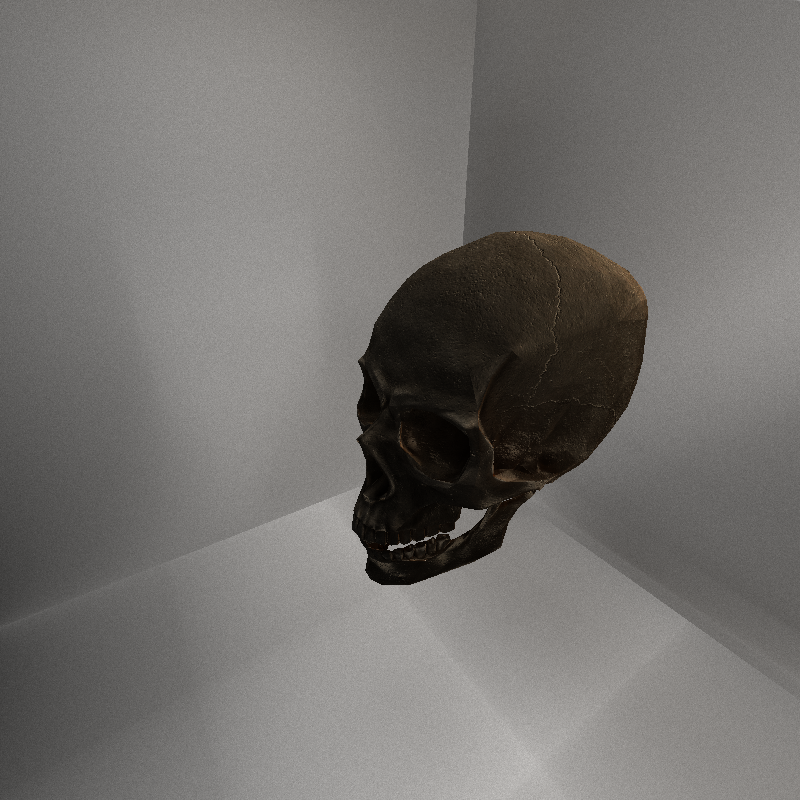 |

### SAH BVH

Many of the high detail custom meshes can have many thousands of triangles, making it difficult to compute intersections if done in the naive method of comparing each ray to every scene primitive(cubes, spheres and every triangle on every mesh). To accelerate this process, a BVH is implemented, which groups scene primitives in a tree like structure with bounding boxes, allowing for log time traversal and scene intersection calculations.

The BVH tree construction utilized a SAH based heuristic in a top down construction format. The construction of the BVH itself does take non negligible time, but after this setup the BVH tree can just be traversed for intersections while the program runs. To assess the performance benefits of BVH, scenes were created with a single mesh within a cornell box, then run both with BVH and without to compare the time per frame difference. 

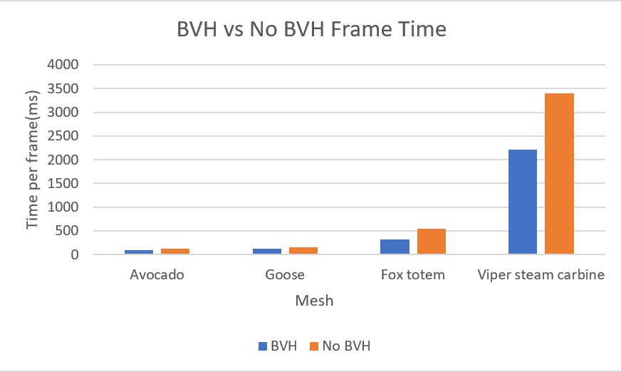

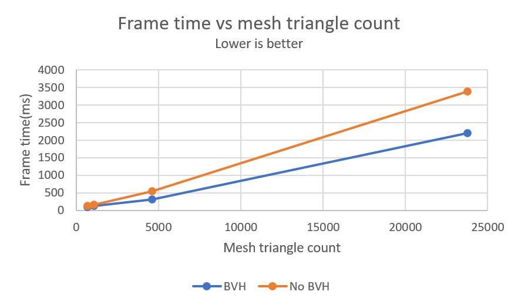

It seems that while my BVH implementation does show improvements compared to the naive iteration method, the difference is not as significant as the theoretical logarithmic speedup. Although I closely followed the SAH BVH based tutorial as listed in the resources, this could still be due to a variety of reasons. For example, my implemented BVH encompasses both primitive scene geometries(cubes, spheres) as well as triangles from each triangle mesh, while the one from the tutorial only considers the triangles themselves. The bounding boxes of these prims are often larger within the scenes I tested, which could make BVH tree traversal rather inefficient as it becomes difficult to eliminate larger areas(due to the nodes encompassing the scene prims bounding them) without traversing to the leaf node. This scale difference could cause imbalance in the tree, making traversal overall less efficient. The overhead associated with stack based tree traversal combined with this could have caused the overall performance to not reach expected levels. To improve this result, separating these prims and performing BVH traversal only on triangle meshes in the scene while naively iterating through the scene prims could be tested.

## Resources

#### Meshes:

[Avocado](https://github.com/KhronosGroup/glTF-Sample-Models/tree/master/2.0/Avocado)

[Low poly goose](https://sketchfab.com/3d-models/goose-low-poly-3318893e41fc4d2f9f497776da95c13a)

[Fox totem](https://sketchfab.com/3d-models/fox-totem-9eb70d72fe124566beedf01fd4330ba9)

[Viper steam carbine](https://sketchfab.com/3d-models/viper-steam-carbine-ece6c588b9a34e1aa9af28b80b20d166)

[Skull](https://sketchfab.com/3d-models/low-poly-skull-00bdf83344db408abea079f0df04523f)

[Old soviet backpack](https://sketchfab.com/3d-models/old-soviet-backpack-bb89dfa7ec13478e85645497dfeafdcd)

#### Libraries and Tutorials

[SAH BVH tutorial](https://jacco.ompf2.com/2022/04/18/how-to-build-a-bvh-part-2-faster-rays/)

[tinygltf](https://github.com/syoyo/tinygltf/)
