 # CUDA GPU-Accelerated Path Tracing

**University of Pennsylvania, CIS 565: GPU Programming and Architecture, Project 2**

* Ruijun(Daniel) Zhong
    * [LinkedIn](https://www.linkedin.com/in/daniel-z-73158b152/)    
    * [Personal Website](https://www.danielzhongportfolio.com/)
 * Tested on: Windows 11 pro, 12th Gen Intel(R) Core(TM) i7-12700K 3.61 GHz 32.0 GB, NVIDIA GeForce RTX 3070 Ti (personal computer)

 ## Abstract
 Path tracing is a method used in computer graphics to create realistic images by simulating how light interacts with objects. However, this process can be very demanding on a computer's resources, especially when aiming for high-quality images. Enter NVIDIA's CUDA, a technology that allows for faster computations using graphics processing units (GPUs). In this project, I explore how CUDA can make path tracing faster and more efficient.

# Visual Features
 ## GLTF Model & Procedural CheckerBoard Texture & HDR SkyBox
 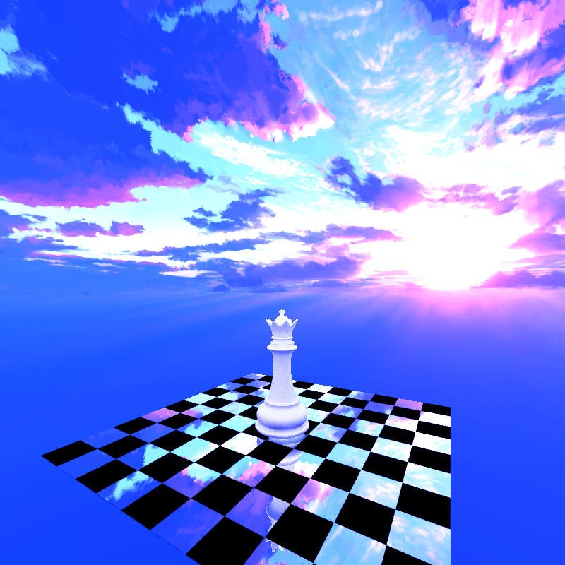

 ## Infinite Procedural Shapes & Procedural Textures
 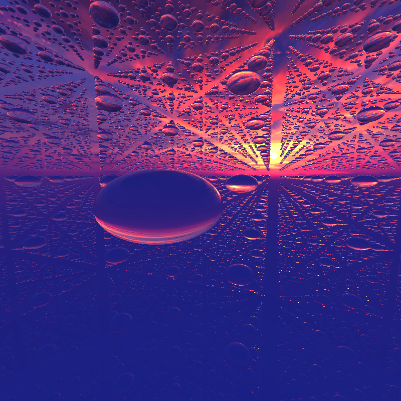  
  Showing:
  * Material: PBR Diffuse, PBR Glass, PBR Metal, Texture Map, Perlin Noise Texture, Ring Texture
  * Shape: Torus with Displacement, Cylinder, Capsule, Displacement+ SmoothUnion of Bended Cube and Sphere

 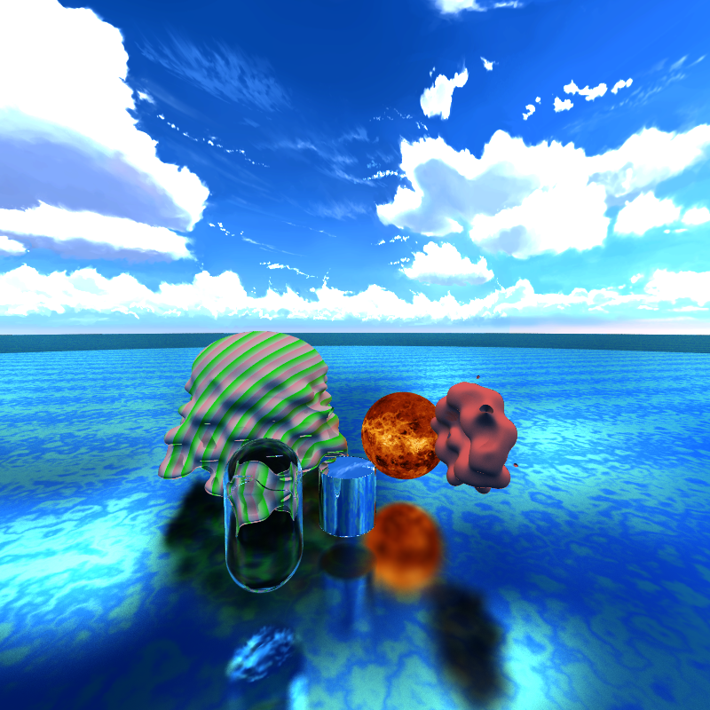

 ## PBR depth-of-field (by jittering rays within an aperture)
 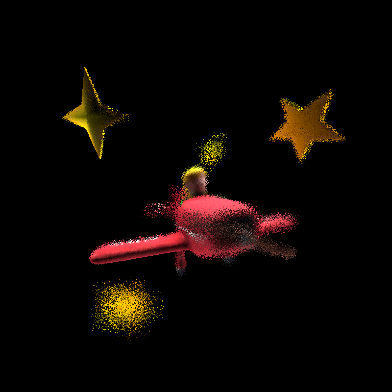
 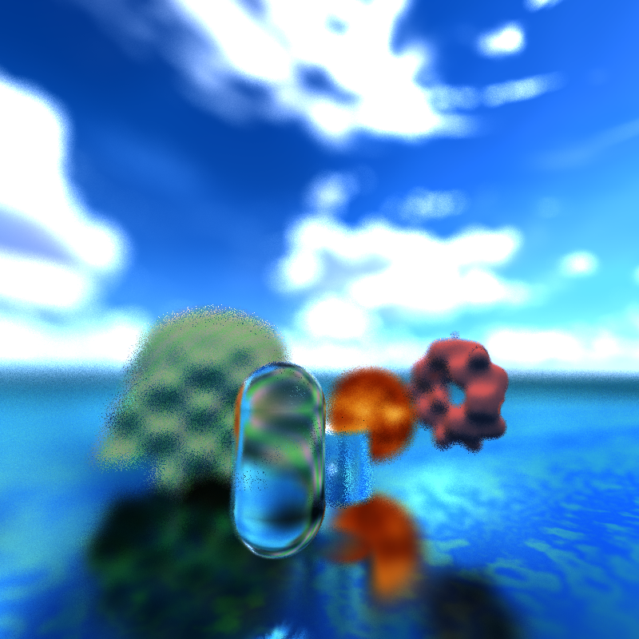

 ## PBR Schlick's approximation of Diffuse, Glass, Metal with random sphere scene
 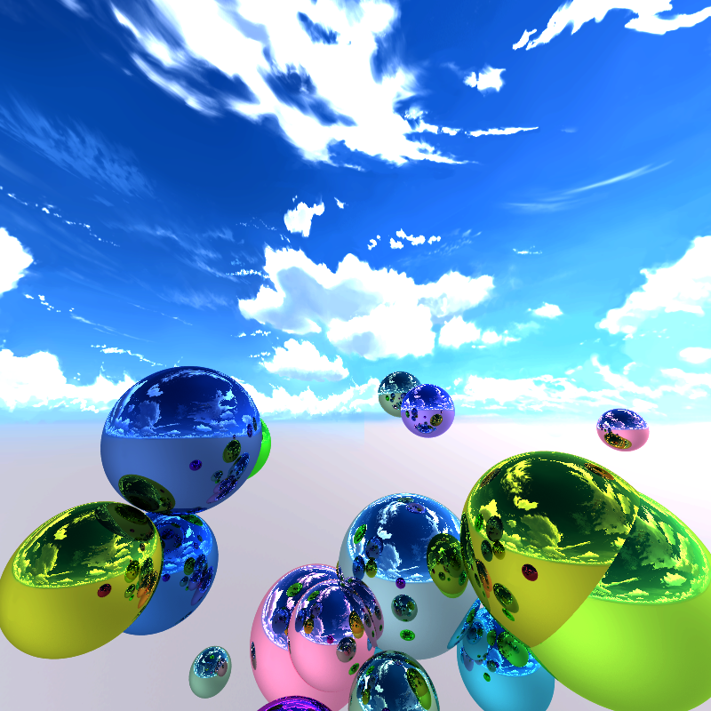
 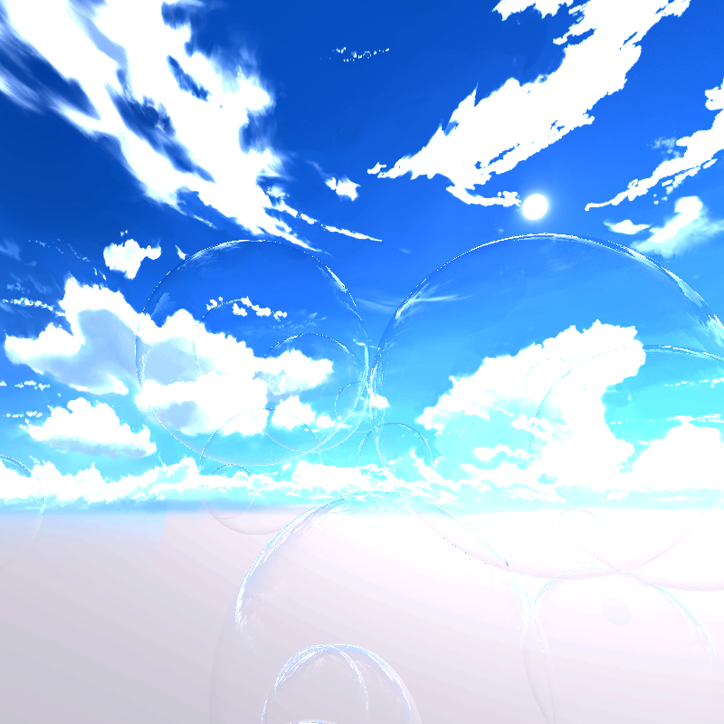

 ## MSAA Antialising with random ray
 * Without Antialising  

 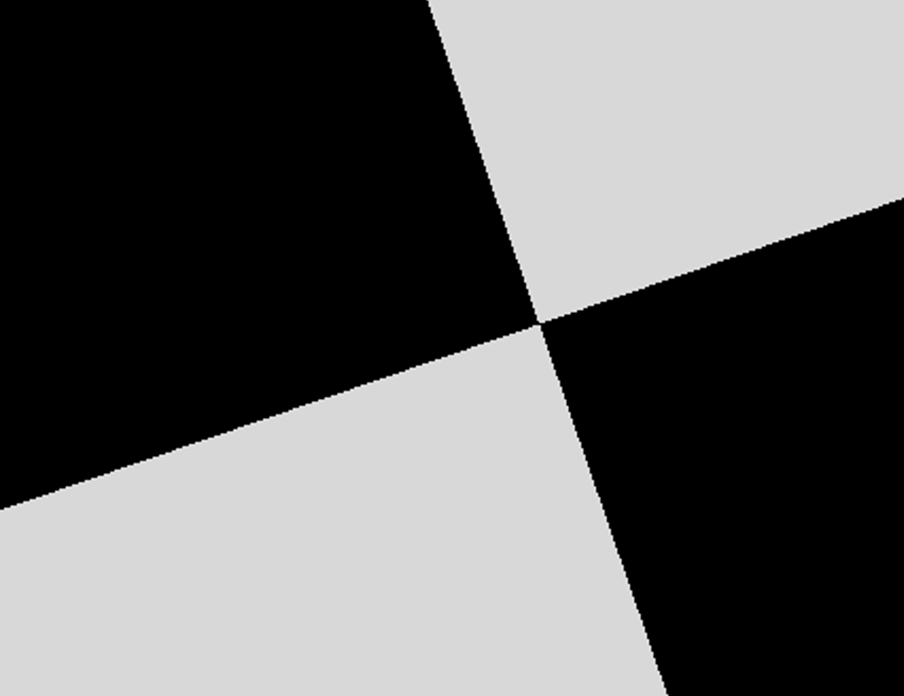
 * With Antialising(50 x more random ray per pixel) 

 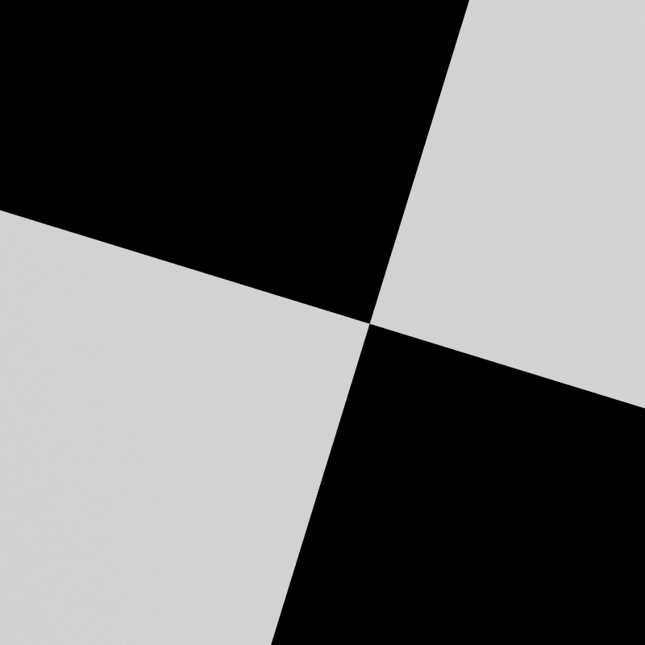

# Optimize Feature & Analysis
 * Caching FirstBounces: As we frequently intersect the same primary rays originating from the camera with the scene, we can cache the first bounce. This allows subsequent rays to read from the cache.

 * Compaction: Remove terminated path(ray that hits nothing), and then move the active path to the front of the "array"

 * Material Sorting: When rays bounce and hit materials, the resulting data can be mixed up and out of order. During shading, threads can work on different materials at once, causing inefficiency. To fix this, we sort the data by material type first, so threads work on the same materials together.

 * Denoise: Please check [Denoiser](https://github.com/DanielZhong/Project3-CUDA-Path-Tracer/tree/denoiser) Branch!

 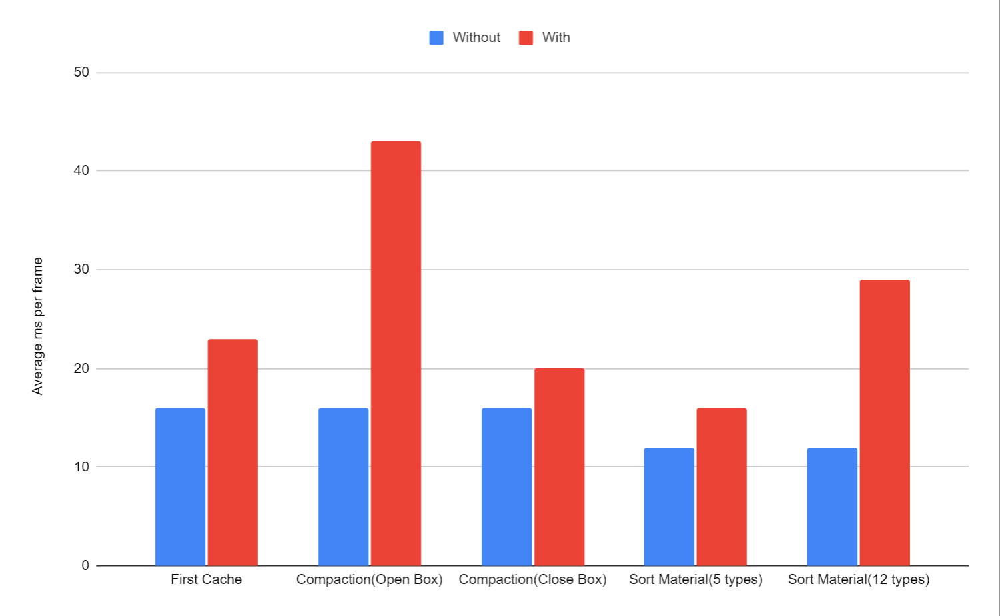
 Based on the provided chart, compaction significantly impacts the open box scene because there are more terminated rays in this setting. Refer to the chart below for a comparison of ray numbers between the closed box and the open scene. Furthermore, as the number of material types increases, the sorting of materials becomes more pronounced.
 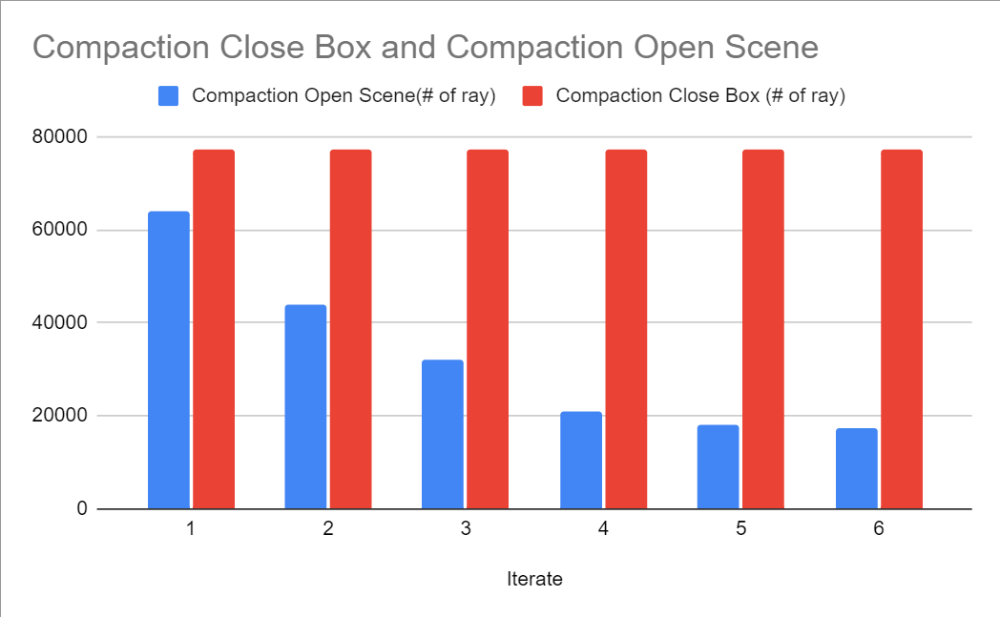

# Bugs
  Solution to this bug: make sure z axis is positive for both left and right hand coordinate
  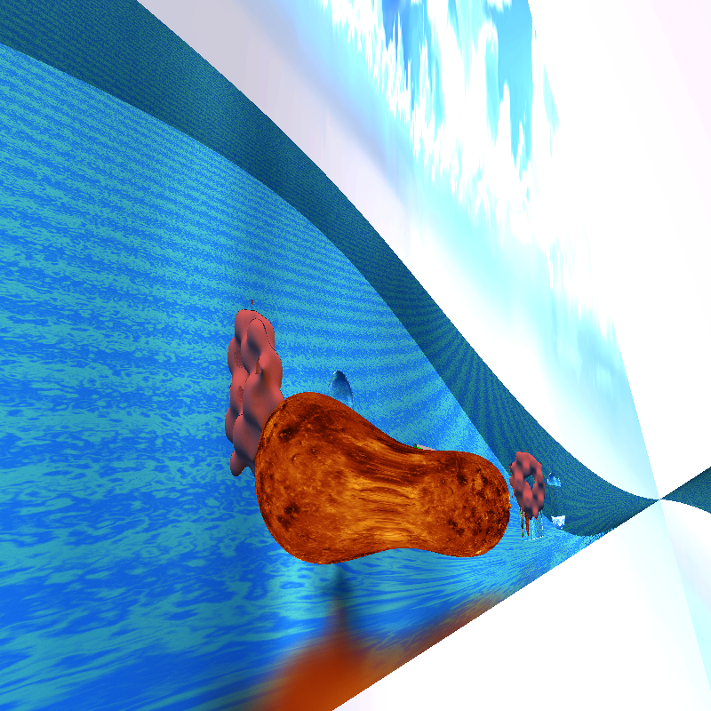
  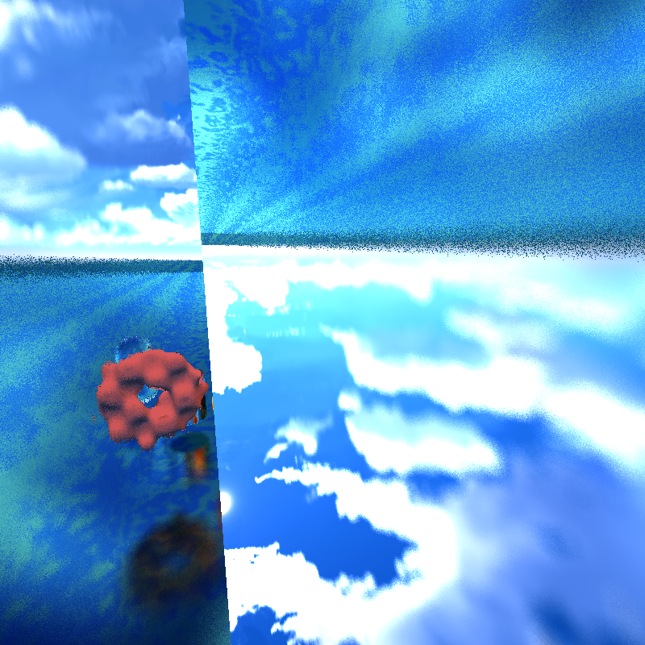  
  AntiAlising isn't correct(Solution: make sure random ray apply to all stages including generate ray, intersection, shading etc.)  
  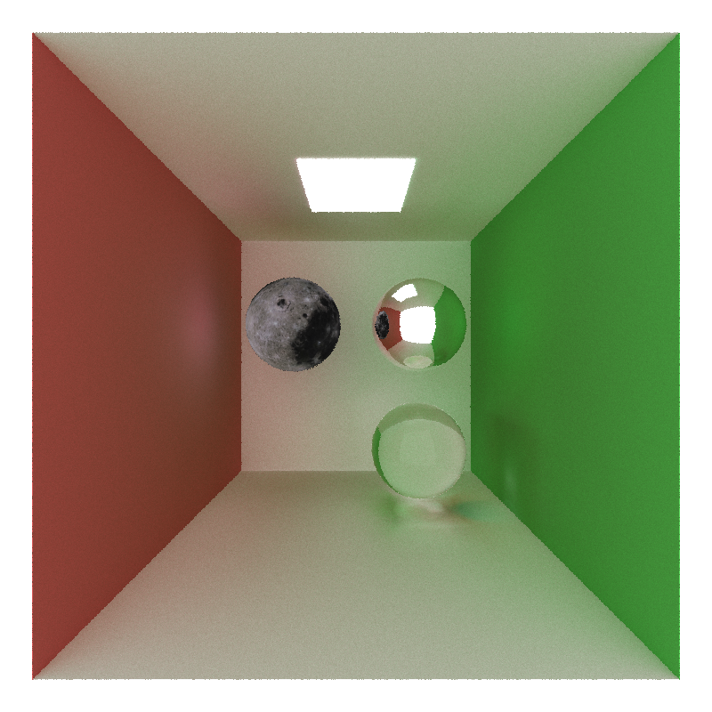  
  Material Sorting will mess up if turn on antialising
  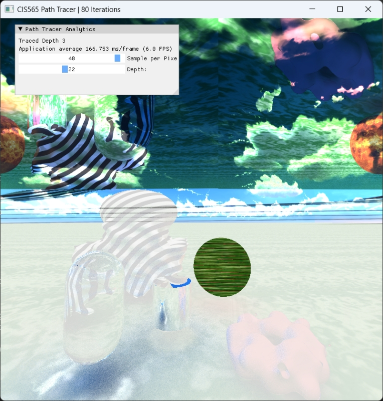  
  Other intersting bugs that can't show directly through picture:
  * Glass material keep showing error(Solution: rewrite sphere intersection)
  * GLTF obj not loading(Solution: reExport from modeling application and make sure the format is match the triangle intersection in accesor, bufferview, mesh etc.)
  * Metal and Glass not reflecting skybox
  * Failed to implement BVH, incorrect normal value
  * etc.

# References
 ### Some ideas were inspired by:  
 [_Ray Tracing in One Weekend_](https://raytracing.github.io/books/RayTracingInOneWeekend.html) including:
 * Diffuse, Metal, Glass Material
 * Sphere Intersection Test
 * (MSAA) Camera Multisampleing Antialiasing with random ray

 [_Ray Tracing: The Next Week_](https://raytracing.github.io/books/RayTracingTheNextWeek.html) including:
 * Skybox Sphere Texture
 * Procedure Texture(Perlin Noise)

 [_Ray-Tracing: Rendering a Triangle_](https://www.scratchapixel.com/lessons/3d-basic-rendering/ray-tracing-rendering-a-triangle/moller-trumbore-ray-triangle-intersection.html) including:
  * Triangle Intersection Test(Moller-Trumbore algorithm)

 [_Inigo Quilez_](https://iquilezles.org/articles/normalsSDF/) including:
 * SDF Normalize Formula

 [_iquilezles.org_](https://iquilezles.org/articles/distfunctions/) including:
 * Procedure Shape Formula

 [_syoyo/tinygltf_](https://github.com/syoyo/tinygltf/) & [Reddit](_https://www.reddit.com/r/vulkan/comments/oeg87z/loading_some_indexed_gltf_meshes_cause_weird/#:~:text=TRIANGLE_LIST%20topology.%20Here%20is%20my%20code%20for,tinygltf::Model%20&model%2C%20int%20accessorIndex%20%7B%20auto%20accessor_) including:
 * Extract GLTF object mesh to triangle index buffer

[_cgtrader_](https://www.cgtrader.com/) & [_SolarsSystemScope_](https://www.solarsystemscope.com/textures/) including:
 * gltf 3d model and textures

[_Schlick's approximation_](https://en.wikipedia.org/wiki/Schlick's_approximation) including:
 * PBR Diffuse, Metal, Glass with Frensel effects using Schlick's approximation
 
 [_pbrt_](https://www.pbr-book.org/3ed-2018/Camera_Models/Projective_Camera_Models#ProjectiveCamera::lensRadius) including:
 * Physically-based depth-of-field (by jittering rays within an aperture)