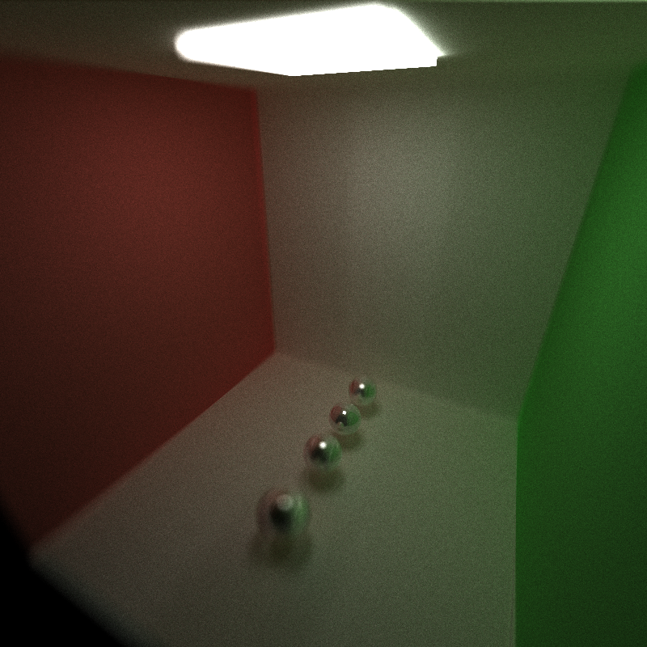

CUDA Path Tracer
================

**University of Pennsylvania, CIS 565: GPU Programming and Architecture, Project 3**

Han Wang

Tested on: Windows 11, 11th Gen Intel(R) Core(TM) i9-11900H @ 2.50GHz 22GB, GTX 3070 Laptop GPU

# Overview

This project is a Monte Carlo path tracer run on GPU based on CUDA. It is a rendering algorithm that simulates the behavior of light in a scene by tracing rays from the camera into the scene. Using a GPU and CUDA for Monte Carlo path tracing allows for massive parallelization, speeding up the ray tracing and light simulation steps. CUDA is a parallel computing platform and application programming interface (API) model that enables efficient utilization of the GPU's parallel processing capabilities.

# Finished features:

### 1. Refraction (e.g. glass/water)
) 

### 2. Physically-based depth-of-field

### 3. Stochastic Sampled Antialiasing

### 4. Subsurface scattering

### 5. defining object motion, and motion blur

