CUDA Path Tracer
================

**University of Pennsylvania, CIS 565: GPU Programming and Architecture, Project 3**

* Han Yang
  *  [LinkedIn](https://www.linkedin.com/in/han-yang-0031231a3/), [personal website](https://bdwhst.wixsite.com/portfolio), etc.
* Tested on: Windows 11, i9-12900HX @ 2.30GHz 16GB, RTX4080 laptop 12GB

## Usage

Command line arguments: `.\cis565_path_tracer.exe scenefile.txt`

`w`,`a`,`s`,`d` to move camera in first person style, `q` save current picture, press `left mouse button` to rotate camera

## Showcase

| Wanna play chess? (1080*1080 10000spp) |
| :------------------------------------: |
|         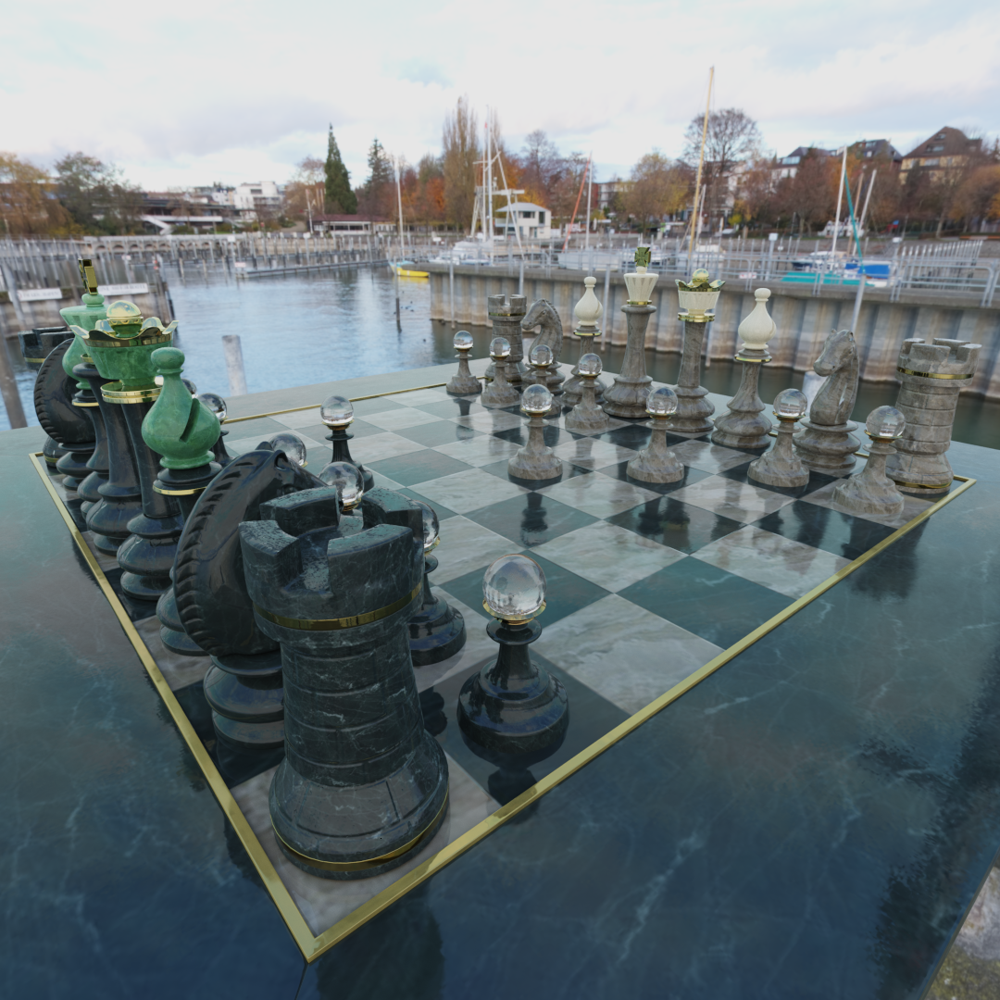          |


| Large `wavefront-obj` scene load and render (with alpha cutoff) (1920*1080 2000spp): |
| :----------------------------------------------------------: |
|                 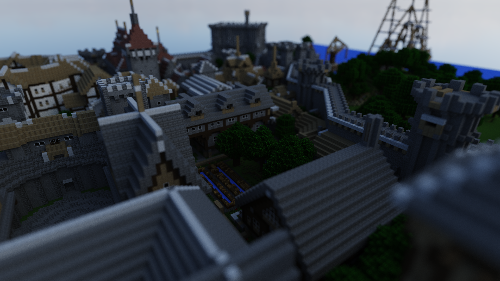                  |


| Metallic Workflow PBR with normal mapping (1080*1080 5000spp): |
| :----------------------------------------------------------: |
|                 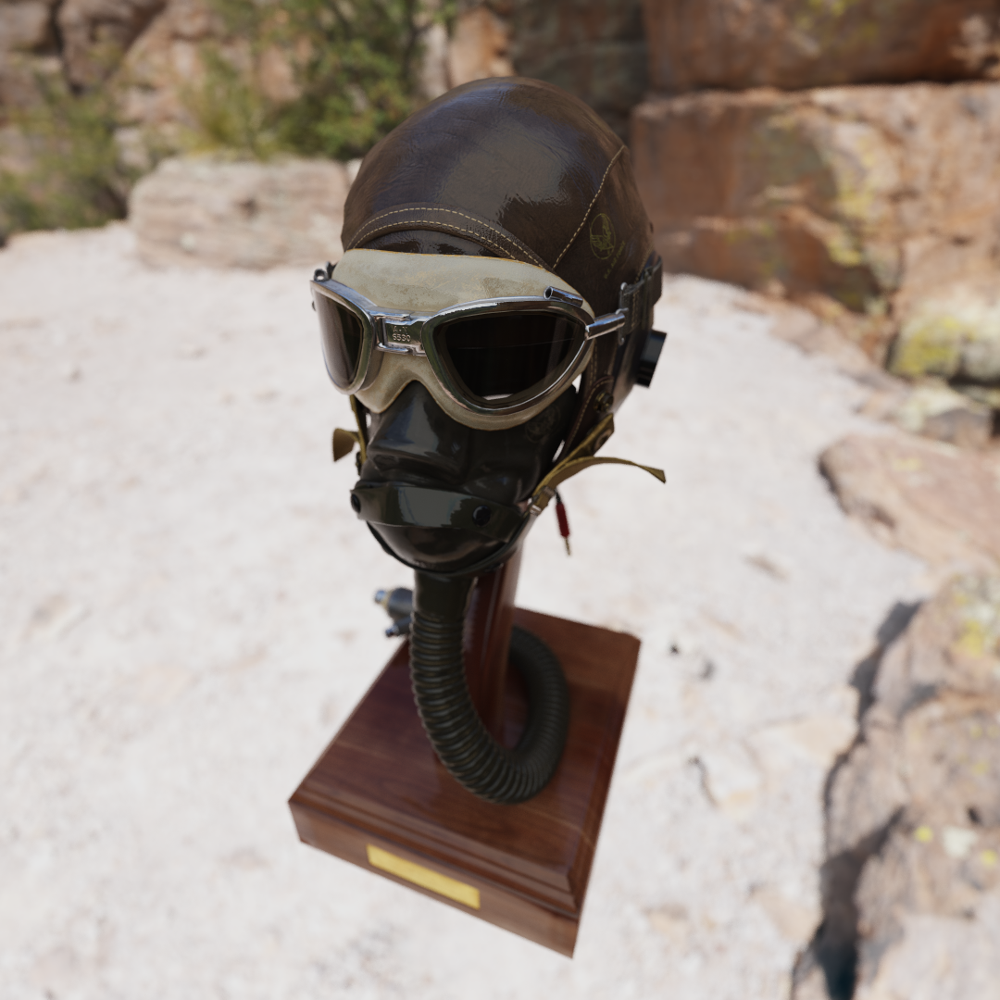                  |
|                  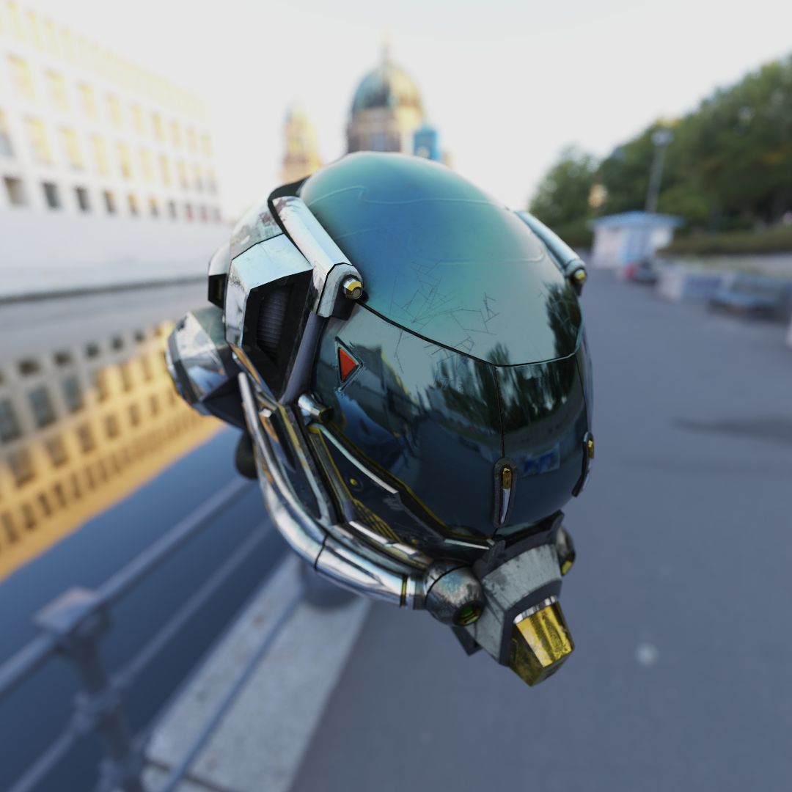                   |


| Refraction and reflection (here I intentionally used per face normal) (1080*1080 5000spp): |
| :----------------------------------------------------------: |
|                   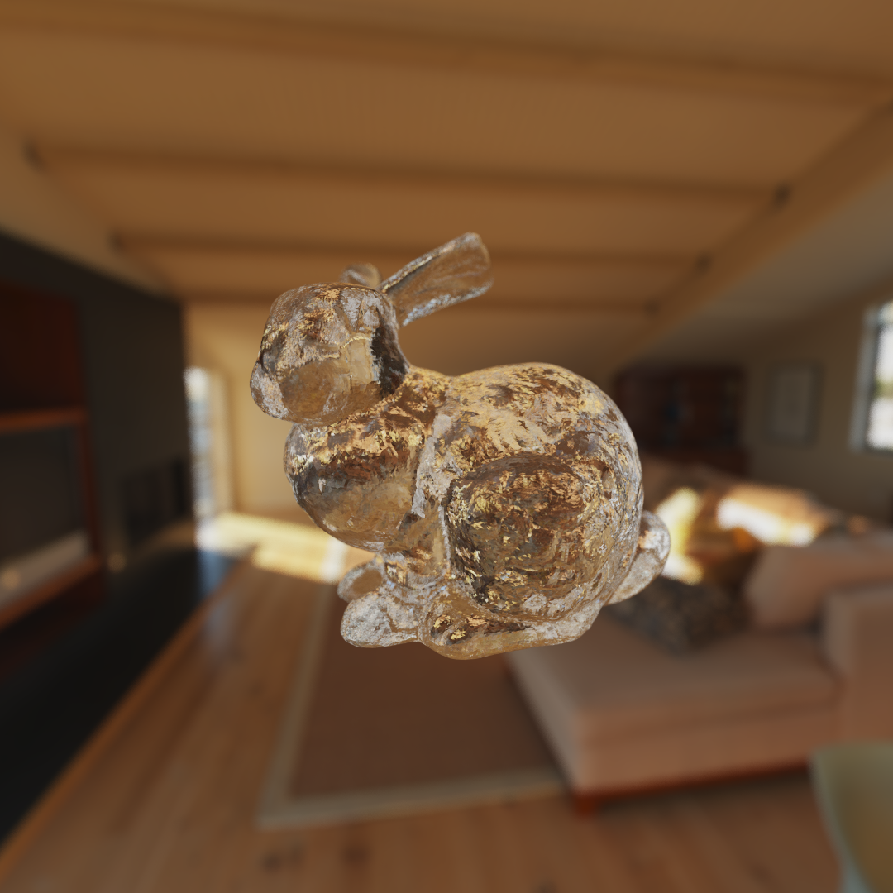                   |


| Sponza(1080*1080 100spp with denoiser): |
| :-------------------------------------: |
|     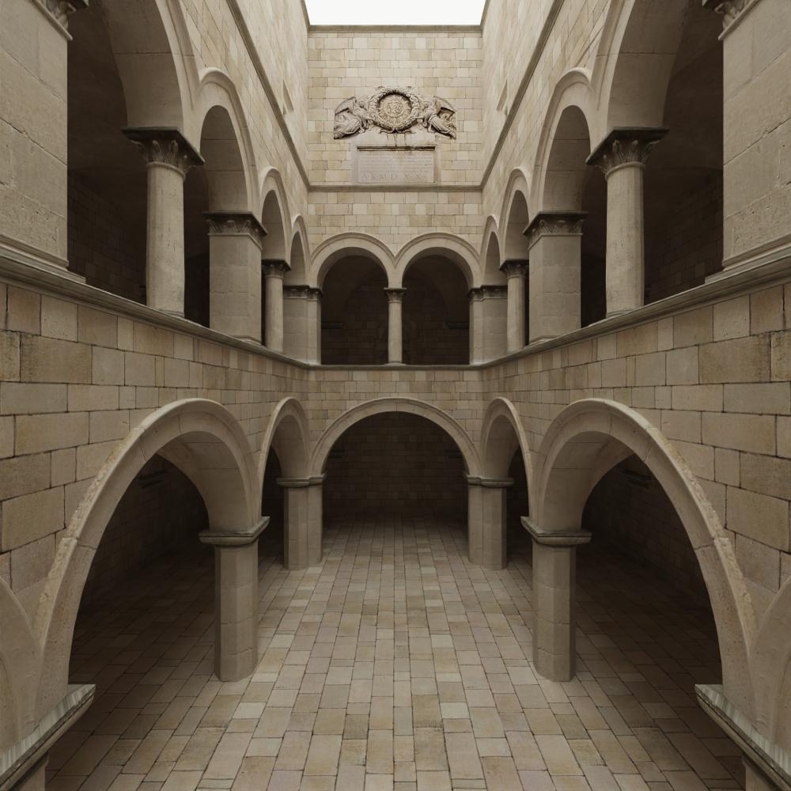     |


| The good old cornel box (800*800 5000spp): |
| :----------------------------------------: |
|    |


## Principles and Analysis

### Path tracing basics

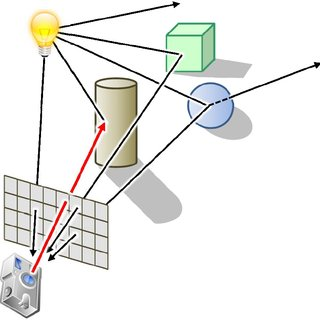

Path tracing, an intrinsic algorithm utilized in rendering high-quality images, navigates through the pixel plane, sending rays into a scene to detect object intersections and eventually determine pixel color based on the light interactions. This process, consisting of intersection testing and light scattering, can be greatly expedited by leveraging the parallel processing capabilities of Graphics Processing Units (GPUs). The process of ray tracing is shown below:

##### Step 1: Ray Emission and Intersection Testing

- **Ray Emission**: Starting with a camera, rays are cast through each pixel into the scene.

- **Intersection Testing**: Each ray is tested for intersections with all objects within the scene.

- **Nearest Intersection Detection**: Among all intersection points, the nearest one to the camera is chosen for subsequent calculations.

##### Step 2: Ray Interaction with Material

- **Material Interaction**: Upon reaching the intersection point, the ray undergoes interactions (reflection and refraction) determined by the material properties at that point.

- **Emissive Material Check**: If the intersected material is emissive, the path terminates. The radiance is accumulated by multiplying the emissive color (irradiance) of the material and all transmissive factors (BSDF: Bidirectional Scattering Distribution Function) of the materials encountered along the path.

##### Step 3: Continuous Ray Path

- **Path Continuation**: For non-emissive materials, the ray may proceed, reflecting or refracting based on the material properties until a termination condition is met (like reaching a maximum number of bounces or hitting an emissive material).

#### GPU-Accelerated Path Tracing

Leveraging GPU parallelism, each pixel’s path can be assigned to an individual GPU thread, optimizing the efficiency and speed of the path tracing process.

#### Parallelization Strategy:

- **Pixel-to-Thread Mapping**: Allocate each pixel's path to a distinct GPU thread to ensure concurrent processing of multiple rays.

#### Kernel Separation:

- **Intersection Kernel**: One kernel is dedicated to handling ray-object intersection tests and identifying the nearest intersection point.

- **Scattering Kernel**: A separate kernel manages the reflection and refraction of rays at the intersection points.

### Ray compaction and sorting by BSDF

#### Section 1: Addressing Ray Termination through Stream Compaction

##### Stream Compaction Overview

When conducting ray tracing on a GPU, certain rays might terminate earlier than others due to reaching an emissive material or exceeding the bounce limit. Stream compaction becomes an instrumental strategy in managing such diverse ray lifetimes efficiently.

##### The Utility of Stream Compaction in Ray Tracing

- **Efficiency Optimization**: Stream compaction ensures that threads in the GPU are utilized optimally by gathering and processing only the rays that are still active.

- **Reducing Idle Threads**: By relocating active rays to be contiguous in memory and computation, the algorithm reduces the number of idle GPU threads, which might otherwise be waiting due to terminated rays.

##### Implementation of Stream Compaction

- **Identifying Active Rays**: The algorithm must discern between active and terminated rays.
- **Memory Coalescing**: Actively traced rays are then repositioned contiguously in memory, ensuring efficient memory access patterns and reducing wasted computation.

|                               | Cornell Sphere | stanford bunny (144046 triangles) | rungholt (6704264 triangles) |
| ----------------------------- | -------------- | --------------------------------- | ---------------------------- |
| Delay Without compaction (ms) | ~10            | ~17                               | ~4000                        |
| Delay With compaction (ms)    | ~12            | ~13                               | ~91                          |

Compaction incurs a overhead of scanning and scattering, so when the scene is very simple, it's not very useful, but when the scene is more complex, we should definitely enable ray compaction.

#### Section 2: Enhancing Performance via Material Consistency in Warp Execution

##### The Potential of Warp-Level Optimization

When dealing with light scattering in GPU-based ray tracing, ensuring that all threads within a warp handle the same material type could, theoretically, enhance computational performance and efficiency.

##### Reasons for Improved Performance with Material Homogeneity

- **Coherent Memory Access**: Threads within a warp accessing the same material properties can utilize cached data, reducing the latency of memory accesses.

- **Reduced Divergence**: Uniform material processing across threads minimizes control flow divergence, facilitating simultaneous execution and enhancing warp efficiency.

##### Implementation of Ensuring Material Consistency

1. **Material Sorting**: Rays could be sorted based on intersected material types (BSDF function), thereby grouping rays that interact with the same material.

*In practice, I didn't get a speedup by sorting the material, I think it's mainly because the sorting overhead outruns the gain of coherent access and reduced divergence. And I don't have a scene full of objects with diverse materials.*

### First intersection caching

When anti-aliasing is not enabled, we can cache the first intersection information for each ray.

|                            | Cornell Sphere | rungholt (6704264 triangles) | stanford bunny (144046 triangles) |
| -------------------------- | -------------- | ---------------------------- | --------------------------------- |
| Delay With caching (ms)    | ~13            | ~88                          | ~14                               |
| Delay Without caching (ms) | ~13            | ~91                          | ~13                               |

In a large scene, first intersection caching will slightly improve performance. This is because using intersection cache will incur the overhead of copying, so when scene is not too complex, the copying of the cached value will be the bottle neck. But when scene is very complex, copying from the cache is actually faster than traverse a deep BVH tree.

### Anti-aliasing and depth of field

|              No DOF               |              DOF               |
| :-------------------------------: | :----------------------------: |
|  | 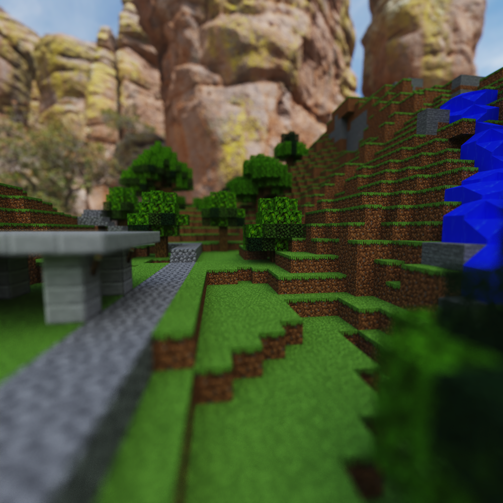 |

Nothing fancy about anti-aliasing, just added random jitter to each pixel location to get multiple samples inside a pixel and average them. 

As for depth of field, I've used a simple thin lens model, that jitters the ray with focal length and lens radius.

### GLTF loading

GLTF (GL Transmission Format) is widely used for transmitting 3D models and scenes due to its ability to efficiently encapsulate complex hierarchical structures. In these structures, nodes can contain transformations and be parented in a hierarchy, meaning the transformation of each node is influenced by its ancestors.

When considering a GLTF scene, it's crucial to comprehend that the spatial properties (position, rotation, and scale) of each node are not only influenced by its local transformations but also by the transformations of all its ancestor nodes. Hence, to compute the global transformation of a node, one must traverse from the root of the hierarchy down to the node, accumulating transformations along the path.

Topological sorting ensures that every parent node is processed before its children, guaranteeing that when a node’s transformation is computed, all its ancestors have already been processed, making their global transformations available.

### Metallic workflow (with microfacet BSDF importance sampling)

Physically based shading is a shading model that aims to mimic the way light interacts with surfaces in the real world. The metallic workflow is one of the widely used approaches in PBS to achieve realistic materials and lighting in 3D graphics. 

In a metallic workflow, materials are described primarily using three main properties:

- **Base Color:** This denotes the inherent color of a material.
- **Metallic:** This parameter indicates whether a material is metallic (value = 1) or non-metallic/dielectric (value = 0). Intermediate values are typically not physically accurate and are used sparingly for artistic purposes.
- **Roughness:** This controls how smooth or rough a surface is, affecting how it scatters light.

The formula for metallic workflow BSDF is as follow:

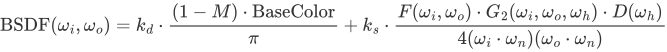

Here I choose to use frensel-schlick approximation, GGX-normal distribution and smith geometry term for F, D and G term.

#### Texture Maps:

In the metallic workflow, texture maps play a vital role in defining how a material looks. Artists will typically author or acquire the following maps:

- **Base Color Map:** Contains the color information for the material.
- **Metallic and Roughness Map:** Provides per-pixel control over the metallic and roughness of the material.
- **Normal Map:** This is used to add surface detail without increasing the geometric complexity of the 3D model.

For normal mapping, we need a proper way to generate tangents from existing normals and texture coordinates. The GLTF specification says: *When tangents are not specified, client implementations SHOULD calculate tangents using default [MikkTSpace](https://registry.khronos.org/glTF/specs/2.0/glTF-2.0.html#mikktspace) algorithms with the specified vertex positions, normals, and texture coordinates associated with the normal texture.*

#### Importance sampling of GGX visible normal distribution

Visible normals distribution are basically normals that are visible to a certain viewing angle.

The importance sampling is based on pdf function of visible normals:

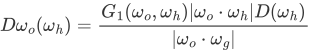

This is a function which considers the shadowing and masking effect of microfacets, and if you plug it into the rendering equation with microfacet BSDF, you will find out that the denominator will have a more stable pdf than using just normal distribution, and thus the firefly artifacts are not likely to happen.

### Multiple importance sampling

Different sampling strategies can be beneficial in different scenarios within a rendering context:

- **Light Sampling**: Aims at directly sampling light sources to gather direct illumination.
- **BRDF Sampling**: Focuses on sampling according to the material properties of surfaces. (previous section)

Different sampling techniques might be optimal for different scenarios, and the challenge lies in integrating these diverse strategies effectively. Multiple Importance Sampling amalgamates various sampling techniques, assigning weights to each technique based on its efficacy in a given scenario, and then amalgamating them in a way that minimizes variance.

The following scene is tested with 100spp

|      Light sample only (100spp)      |      BRDF Sample Only (100spp)       |
| :----------------------------------: | :----------------------------------: |
|       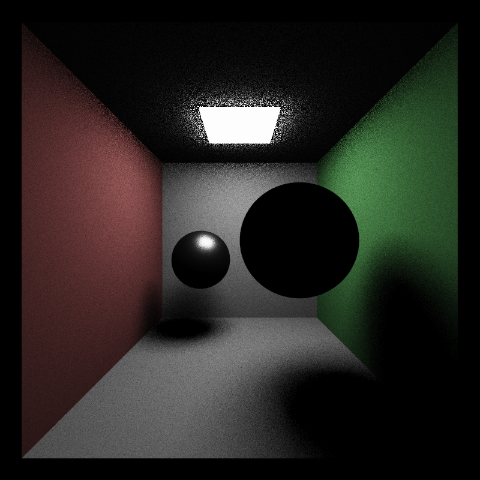       |       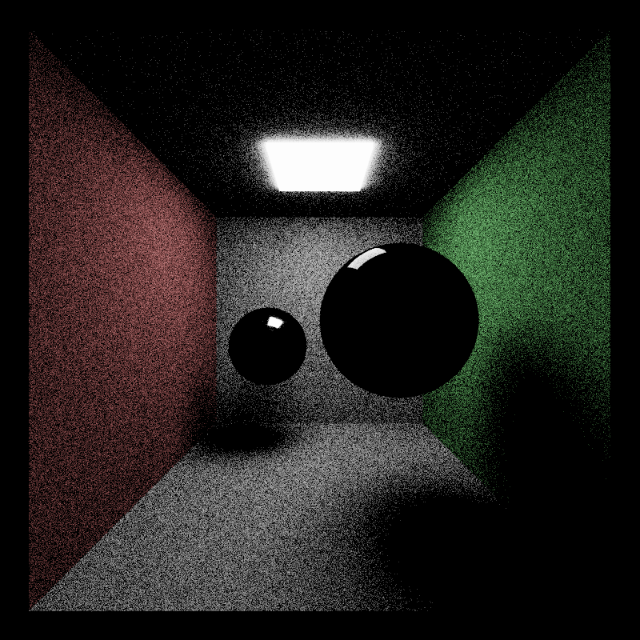        |
| **Combined (trace depth=2, 100spp)** | **Combined (trace depth=8, 100spp)** |
|     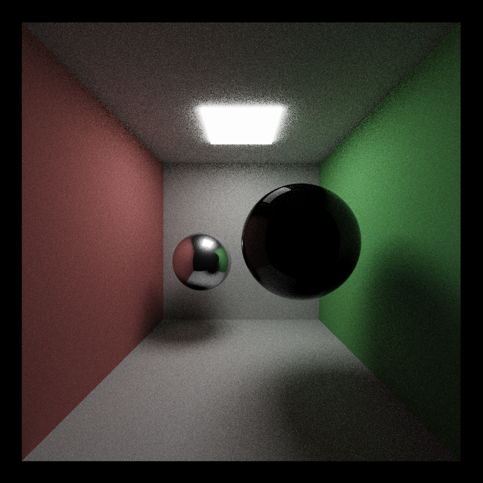      |     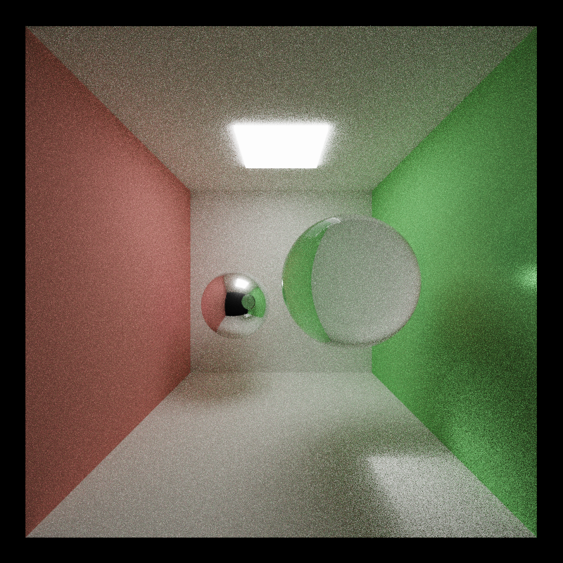     |


### BVH building and traversal

Computing each object when doing ray intersection is quite slow (takes O(N) time), so a great idea is to divide the objects by their spatial location (bounding box), and build a tree recursively from such partition, then traversal of a tree will only take O(logN) time. Here I choose surface area heuristic for objects partition. The basic idea is we can use an array to store all objects in the scene, at each partition step, compute the benefit of divide current array into two smaller array, if this benefit is greater than naively iterating over the current array, then we will perform a partition, and recursively divide the two smaller array.

Due to limited numbers of registers and shared memory, we need to perform a stack-less traversal of the tree, here I implemented two different methods.

#### State machine traversal

##### Determining Near and Far Child Nodes for Rays

- Identify the ray's dominant direction to establish the maximum tracing axis.
- Assign the 'near' child node based on the ray's origin and direction relative to the spatial division in the binary tree. Conversely, determine the 'far' child.

##### Traversal States

1. **From Child**: Ascended from a child node.
2. **From Parent**: Descended from a parent node.
3. **From Sibling**: Navigated from a sibling node.

##### Node Navigation with Hit/Miss Data

- **Hit**: Move to near child, test intersections in leaf nodes.
- **Miss**: Progress to far child or sibling.

###### Pseudocode

```
void traverse(Ray ray, Node* node) {
    int current = nearChild(root); // Initialize with the nearest child of the root
    char state = FROM_PARENT; // Starting state is descending from the parent

    while (true) {
        switch (state) {
            case FROM_CHILD:
                if (current == root) return; // If back at root, traversal is complete

                if (current == nearChild(parent(current))) {
                    current = sibling(current);
                    state = FROM_SIBLING; // (1a) Transition to checking the sibling
                } else {
                    current = parent(current);
                    state = FROM_CHILD; // (1b) Go back to check the parent
                }
                break;

            case FROM_SIBLING:
                if (boxTest(ray, current) == MISSED) {
                    current = parent(current);
                    state = FROM_CHILD; // (2a) Ray missed, check the parent
                } else if (isLeaf(current)) {
                    processLeaf(ray, current); // Ray-primitive intersections for leaves
                    current = parent(current);
                    state = FROM_CHILD; // (2b) After processing, transition back to parent
                } else {
                    current = nearChild(current);
                    state = FROM_PARENT; // (2c) Check the children of current node
                }
                break;

            case FROM_PARENT:
                if (boxTest(ray, current) == MISSED) {
                    current = sibling(current);
                    state = FROM_SIBLING; // (3a) Ray missed, check the sibling
                } else if (isLeaf(current)) {
                    processLeaf(ray, current); // Ray-primitive intersections for leaves
                    current = sibling(current);
                    state = FROM_SIBLING; // (3b) Transition to sibling after processing leaf
                } else {
                    current = nearChild(current);
                    state = FROM_PARENT; // (3c) Check the children of current node
                }
                break;
        }
    }
}

```

**Pros:** Only store extra parent link per node, memory efficient, a feasible solution for stack-less traversal

**Cons:** A lot of divergence, not very performant

#### Multi-threaded BVH

Advances the idea of state machine, we can directly store nodes with hit link and miss link for each of the six direction (+X,-X,+Y,-Y,+Z,-Z)

###### Pseudocode

```
void traverse(Ray ray, Node* node) {
	int axis = chooseAxisFromRay(ray);
	int curr = getStartingPointFromAxis(axis);
	while(curr>=0&&curr<BVHArraySize)
	{
		bool intersected = boxTest(ray, curr);
		if(intersected)
		{
			if(isLeaf(curr))
				leafIntersect(ray, curr);
			curr = hitNode(curr);
		}
		else
		{
			curr = missNode(curr);
		}
	}
}
```

**Pros:** Simple and very performant

**Cons:** Uses more memory than state machine method, but compared to texture memory usage, this is usually neglectable

#### Comparisons of stack-less traversal

statistics on the glass bunny scene (1080*1080, 144046 triangles)

|                                              | Naive | State machine | MTBVH |
| -------------------------------------------- | ----- | ------------- | ----- |
| FPS                                          | ~0.4  | ~54           | ~77   |
| Additional GPU Memory used (MB, theoretical) | 0     | ~8            | ~38   |

### Denoise

Used intel's open image denoiser, added normal and albedo information as auxiliary buffer.

Sponza scene with 100 spp:

|         No denoiser         |            Denoised             |
| :-------------------------: | :-----------------------------: |
| 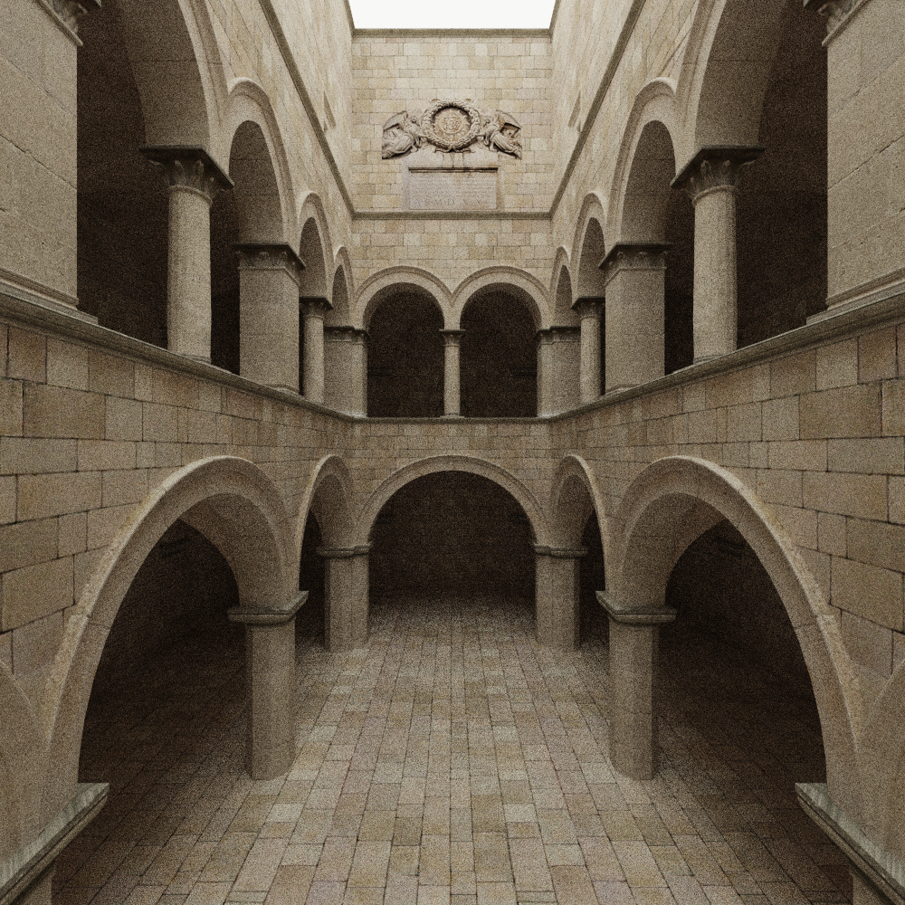 |  |


## References

[Ray tracing in one weekend]: https://raytracing.github.io/
[PBRT]: https://pbr-book.org/
[Efficient Stack-less BVH Traversal for Ray Tracing]: https://www.researchgate.net/publication/255969699_Efficient_Stack-less_BVH_Traversal_for_Ray_Tracing
[Implementing a Photorealistic Rendering System using GLSL]: https://arxiv.org/abs/1505.06022
[Ray Tracing Gems II]: https://www.realtimerendering.com/raytracinggems/rtg2/index.html
[McGuire Computer Graphics Archive]: https://casual-effects.com/data/
[Multiple Importance Sampling]: https://graphics.stanford.edu/courses/cs348b-03/papers/veach-chapter9.pdf
[Sampling the GGX Distribution of Visible Normals]: https://jcgt.org/published/0007/04/01/paper.pdf#page=11&amp;zoom=100,139,815

