CUDA Path Tracer
================

**University of Pennsylvania, CIS 565: GPU Programming and Architecture, Project 3**

* Alan Qiao
* Tested on: Windows 11 22H2, Intel Xeon W-2145 @ 3.70GHz 64GB, RTX 3070 8GB (Dorm Workstation)

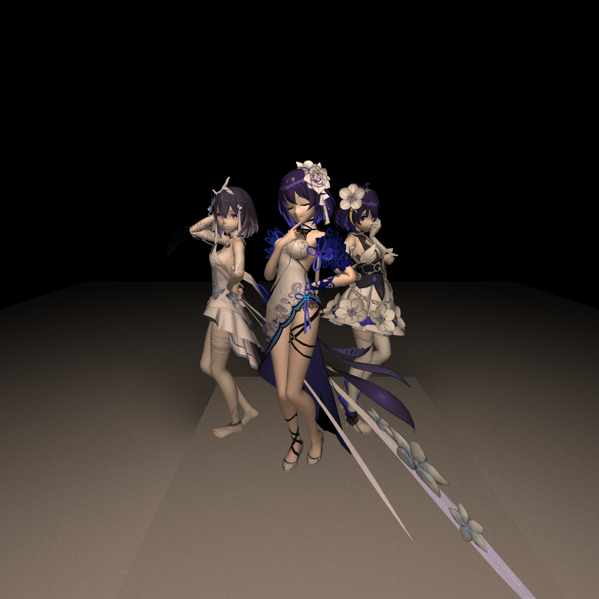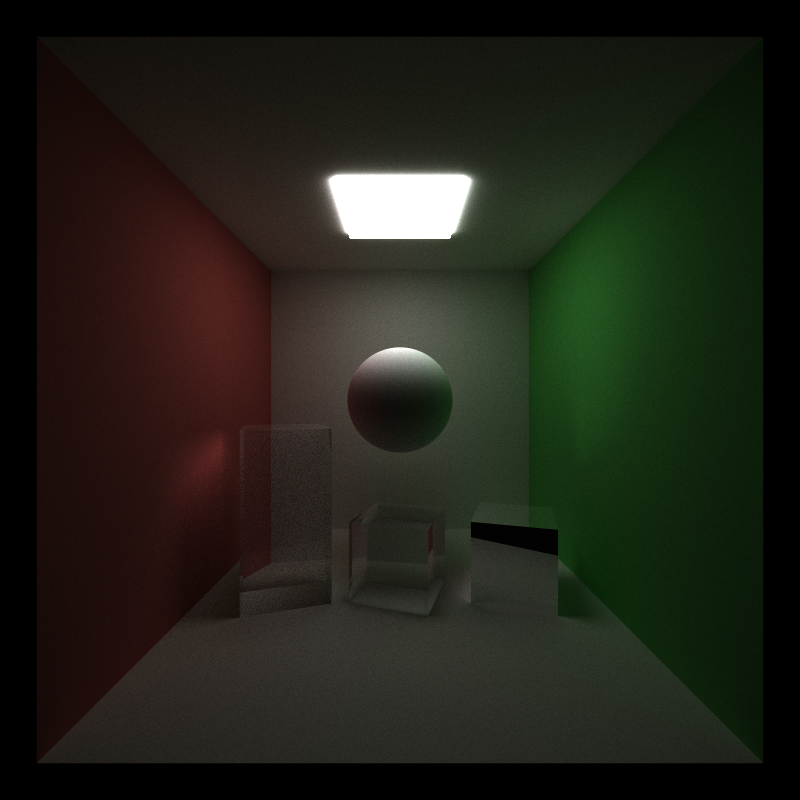

# Introduction

This project demonstrates a relatively basic implementation of a CUDA path tracer where the final image is displayed through OpenGL. The project offers a naive path tracer that implements the Light Transport Equation for Lambertian diffuse materials, specular transmission, specular reflection, and Fresnel Dielectrics.  

The camera model simulates a pinhole camera, with support for adjustable depth of field and stochastic antialiasing. The camera can be moved using the middle mouse button, rotated with the left mouse button, and zoomed in and out with the right mouse button.  

Objects in the scene can be specified in two ways.
1. Basic geometries. 
    1. Currently, only cubes and sphere are supported. 
    2. Each geometry can be supplied with a different transformation.
    3. Geometry materials support diffuse coloring, a different specular color for optional reflection or refraction with custom index of refraction, and any combination of these. Colors cannot have alpha channel.
2. GLTF Meshes
    1. Currently, only `.gltf` and `.glb` files with embedded textures are supported. 
    2. The mesh as a whole can be transformed by specifying a custom transformation.
    3. Meshes must consist only of traingles as primitives. Vertex position, normal, and uv information is required for correct rendering. Only diffuse shading with textures is implemented. Transparency in textures is supported.

To execute the path tracer, call the built executable in the command line with the commandline argument `address/to/your/scene_name.txt`. Examples of the expected format for scene files can be found in the included demos under `scenes/`.  

# Background
Consider taking a picture of a park with a camera. Light from a light source, such as the sun, shines on objects like trees, flowers or grasses. Some light is reflected by these objects into the cameras lens, and the camera captures the light it detected pixel by pixel into a picture.

Path tracing is a computer graphics rendering technique that tries to simulate this idea. 
Path tracing tries to get an acccurate representation of how light would illuminate objects, both directly and indirectly, by tracing paths of light as they travel through a scene. Instead of following light rays from the light source, rays are traced backwards from the camera into the scene.

For each pixel in the rendered image:

A ray ("camera ray") is shot from the camera into the scene.
If this ray intersects a surface, the intersection point becomes a new starting point.
From this point, a new ray ("bounce ray" or "scatter ray") is shot in a random direction based on the material's reflection properties.
This process is repeated, bouncing off surfaces, until a predefined depth or until a light source is hit.
Each bounce gathers light (or color) from the objects it interacts with. The gathered light values are combined to calculate the final color of the pixel.

### Naive Path Tracing
In "naive" path tracing, every time a ray hits a surface, a single random bounce direction is chosen. This is the simplest method that would capture shadows and colored colored reflections from other objects in the scene. Because it only traces one path per ray, each iteration of naive path tracing can be rather noisy. This noise can be reduced by averaging the results of multiple samples per pixel, but there can still be some artifacts that are difficult to eliminate even with many samples.

#### Advantages:

1. Physically Accurate: Path tracing can produce images with photorealistic qualities, capturing complex lighting interactions.
2. Unified Model: Instead of separate algorithms for shadows, reflections, and refractions, path tracing offers a unified approach to handle all these effects.

#### Limitations:

1. Noise: Naive path tracing can produce noisy images, especially in areas with indirect light.
2. Computationally Intensive: Achieving noise-free images requires many samples, making it computationally expensive.
3. Poor parallelization: Even though rendering is embarassingly parallel, it is difficult to leverage the full potential of GPU rendering enabled by CUDA programming as naive path tracing reuses the same gemometry data across threads and iterations, but these buffers are often too big to fit into shared memory. Furthermore, there are a lot of kernel calls, but each call tends to do relatively little work. Lastly, in a complex scene, there can be a lot of branching that results from the unified nature of the model, resulting in many idle threads.

# Features
The base path tracing loop is exactly as described in the background section. For a specified depth and number of iterations, the path tracing keeps sampling up until the specified depth and averaging the results until the total number of iterations are reached.  
In a single cycle, the path tracer first generates rays from the camera, one per pixel. Next, each ray is tested against the entire scene for intersection with the closest object. Then, for each intersection, the color contribution from that surface is accumulated and a new ray is generated based on the material properties. The process of computing intersections and scaterring the rays repeats until either a light is hit, at which point the ray returns a final color for coloring this pixel, or the max depth is reached, in which case black is returned as the color for this pixel. These returned colors are then accumulated into the current rendered image, average for the number of iterations, and the final image displayed to screen.  
To leverage parallel computing capabilities, this loop is split into four kernel functions: generate camera rays, compute intersections, shade and scatter rays, and gather the ray data and update the image buffer. This way, kernels of different sizes taking different data can be launched to more optimally compute for the distinctly different tasks.

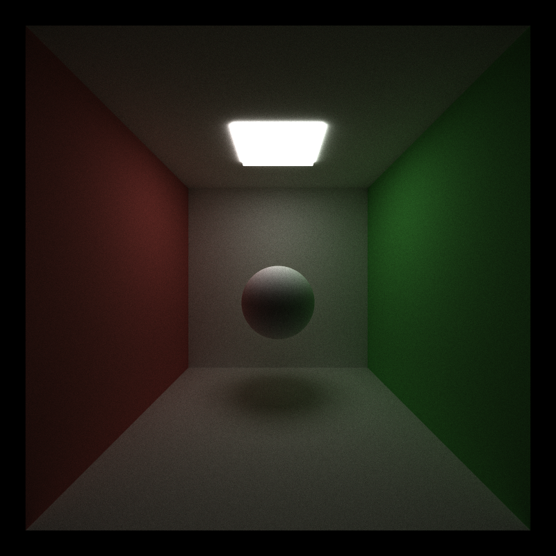
This is what the base path tracer produces for a cornell scene with a single square light and diffuse sphere. There's a shadow of the sphere on the floor, slight imprints of the colors of the walls and a sheen from the light.

## Path Tracing Loop Optimizations
The first of optimizations that could be made are to the loop itself. Splitting up into 4 kernels allows for some work in between the kernels to reduce the number of threads needed at the next stage.

For this section, we will be experimenting with the following two scenes:
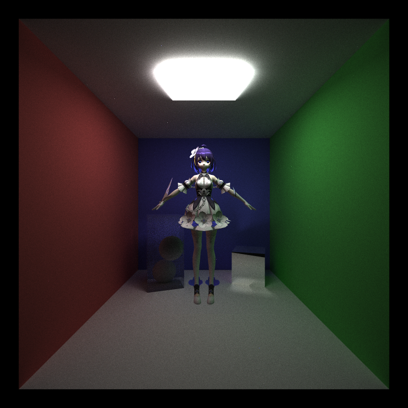

On the left is the open box demo. It consists of 5 diffuse cubes for walls, 1 Fresnel Dielectric glass cube, 1 reflective mirror cube, 2 diffuse spheres, 1 emissive cube as the light, and a Seele mesh with 23079 triangles. There are a total of 30 materials, consisting of 6 geometry materials and 24 texture materials.  

On the right is the closed box demo. It has all the same components as the open box demo exept that there is one extra diffuse blue cube wall behind the camera. 

By default, both scenes are rendered at 800x800 resolution with trace depth of 8 for a total of 10,000 sample iterations. 

### Early Ray Termination
If a camera doesn't intersect with the scene. That ray will simply return the color black. Similarly, any rays that failed to reach a light after `MAX_DEPTH` bounces should also return black. The last kind of rays that would terminate early are those that hit a light before max depth is reached. All of these early terminated rays can be easily distinguished by setting `remainingBounces = 0`. This means we can launch the kernels in the next iteration without these rays as they all already have their final colors. We can't simply discard these rays from memory as we still need to accumulate their color.  
The solution is to partition the rays buffer by the condition `remainingBounces > 0`. By placing all rays that have terminated at the back, we can launch a kernel with `num_active_paths` threads.

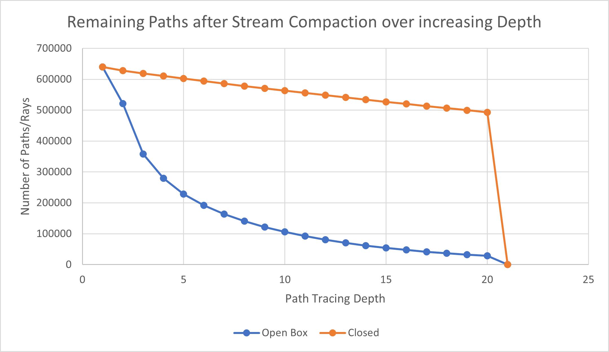
Figure 1: Number of paths remaining with stream compaction for early ray termination with respect to path tracing depth. Two cornell scenes that are identical except one box has an open face while the other is fully closed are used. Number of active rays hits 0 on the 21st path in both scenes as the max depth is 20.

As seen in this graph, the effect of stream compaction with partitioning is most prominent after a few bounces with diminishing returns. In the open box case, this makes sense because as the rays bounce around more, there is a greater chance that it bounces out the open face into void and thus get terminated for no intersection. In the closed box case, the effect of stream compaction is much smaller as rays are trapped in a box and will certainly collide with a surface. Notice, however, that there is a nearly linear trend in the number of rays terminating in the closed box case, suggesting that about an equal number of rays hit the light in a given pass. Another interesting observation is that most rays actually fail to terminate by the 20th bounce and so nearly 90% of the rays shot are actually wasted in the closed box case.

### First Bounce Cache
In a simple model where the camera always generates the same rays for each pixel, that is, a ray extending outwards from the center of each pixel in the camera's viewport, the first bounce of any sample iteration would always hit the same objects. As a result, we can cache this ray to save one iteration of intersection computation.

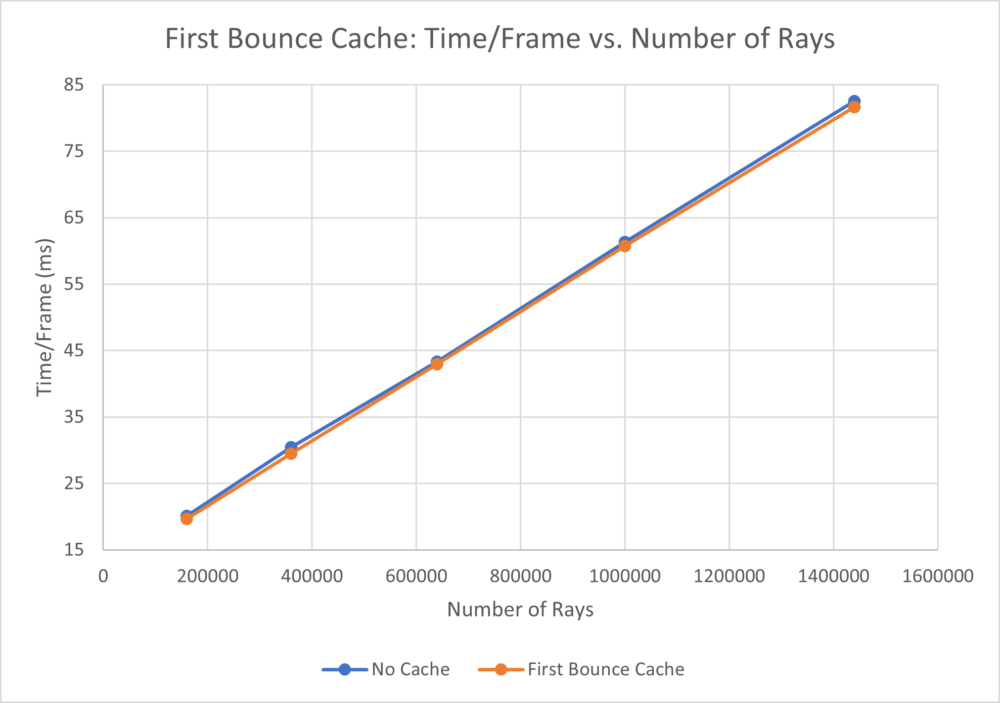
Figure 2: Time required to render each frame in the closed box scene with respect to the number of rays generated by the camera. The lower the Time/Frame the better.

It turns out that first bounce cache creates a negligible improvement even as the number of rays that are cached increases. One possible explanation for this is that the cost of computing intersections in a scene with relatively few geometries is small enough that it is not much greater than the cost of copying a cached buffer to the intersections buffer in memory. Perhaps with an even more complex scene there would be a more significant effect, but for the closed box demo, the improvement is negligible.

Furthermore, this technique inherent conflicts with other camera based features like stoachastic antialiasing and depth of field adjustment. Thus, this technique was not used in the final implementation.

### Material Sorting
As there is a single shading kernel that is responsible for shading all the different materials, there is inevitably a lot of branching that occurs as a result of threads calling different device functions to shade for different materials. Since CUDA schedules threads in warps, it may be possible to reduce the idle time from branching by sorting the paths by material so that there is a higher chance an entire warp would have threads all calling the same branch.

Figure 3: The effect of sorting rays by material before shading in rendering the closed box demo and the open box demo. The lower the Time/Frame the better.

It is clear from the graph that the cost of sorting rays by material significantly outweighs the benefit of branching reduction. This makes sense as modern GPUs have much better performance with some branching and even if threads are idle, the time of computing a new ray direction and shading in each branch is so small that the idle is still significantly smaller than sorting, which tends to be a very expensive operation even with GPU parallelization.

## Base Naive Path Tracing
For basic path tracing, how a ray is colored and where it is scattered next is dependent on the properties of the material it intersects, and this is simulated by the light transport equation. The three most basic forms are diffusion, specular reflection, and specular transmission. The following images showcases all these shading scenarios.

The leftmost cuboid features both specular reflection and specular transmission with an index of refraction of 1.55, intended to simulate glass. The middle cube has only specular transmission with an index of refraction of 1.55. The rightmost cube has only specular reflection, and is intended to simulate a mirror. The top sphere is a diffuse sphere with a grayish-white diffuse color.

### Diffusion
A diffusive material diffuses light in all directions with equal probaility. This creates the matte looking texture that we see in most rougher opaque objects. The color of light diffused depends on the color of the material, and to some extend also the influence of reflected light from other nearby materials.  
This is most obvious on the diffuse sphere in the middle, where reflections from the walls and the light can be seen lightly on the edges of the sphere, while the base color of the sphere, a grayish white, is still visible overall.

### Specular Reflection
Specular reflection describes the mirror-like reflection of light. That is, when light hits the surface, it is reflected in the exact opposite angle relative to the surface normal. Since light coming from the same direction always bounces off in the same manner, we get a consistent reflection of incoming rays, and hence the mirroring proprety.  

 In code, this is simply implemented as the reflection of the incoming ray across the surface normal, and the color is simply the color of the incoming ray influenced by the color of the material itself. (Yes, you can make a blue mirror here by specifying a specular color)    

 The rightmost cube is a mirror with a white specular color, so it just reflects light coming to it. On the faces visible, we see the influence of the floor, the back wall, and the green wall. The bit of black reflects the lack of light from the void outside the box. We can also see some light reflected on the floor to the left face of the mirror cube that comes from the mirror reflecting direct light from the light source.

### Specular Transmission
Specular transmission essentially describes refraction through a uniform material. When light enters a medium that is denser, it bends slightly towards the surface normal of the incident surface separating the mediums, and when it enters a medium that is less dense, it bends away from the surface normal. This results in the bending effect we see on a stick that is half-submerged in water.  

For this implementation, specular transmission is simulated using snell's law to calcualte the bending of the ray. Unlike reflection, transmitted rays pass into the object and then out from the other side, hence the name transmission. The incident ray color is influenced by the specular color of the transmissive material similar to specular reflection.  

This can be seen in the middle cube, where we can clearly see the floor and wall behind it, but there is some slightly distortion to the position of the wall corner. We also see some red light from the left wall that passes through the cube, showing on both the left and right face.

### Fresnel Dielectric
In reality, when light strikes a specular surface, some of it is reflected and some of it is refracted. The Fresnel equations describes this ratio of reflected light to refracted light. The full set of equations describes much more than just transmission to reflection ratio, but for this purpose we are only interested in teh transmission and reflection coefficients.  

In this implementation, when a ray hits a dielectric surface, there is a 50% chance that it will be sampled using specular reflection, and 50% chance that it will be sampled using specular transmission. The color, or intensity, of the new resultant ray is then attenuated by the corresponding coefficient to account for the correct ratio of influence. However, since on any iteration only either of reflection or refraction is sampled, the effect of each ray is doubled so that when averaged out across samples, the effect would be the same as taking both a reflection and refraction sample on each iteration.

This can be seen on the left glass cuboid. While it is slightly difficult to see the different between this glass cuboid and the center transmissive cube, the light reflected on the red wall gives a more obvious indication that reflection is also happening.  

### Further Improvements
The additional performance cost of implementing these different shaders is relatively small as each sampling function takes about the same amount of computation, and the branching time from four brief branches isn't too noticeable. Compared to the most basic cornell box with one diffuse sphere, the extra geometries introduced a mere 6ms additional rendering time per frame. 

One major limitation of this implementation though is that the exact sampling code can also run on the CPU, which means that the parallel architecture of the GPU is not leveraged at all beyond the parallelization benefits from the Path Tracing Loop. In fact, there is little room for improvement to the sampling functions themselves as they are just solving a few simple equations. A more thorough, but definitely more useful change, especially with a sufficiently complex scene, would be to separate the shading kernel into several dedicated kernels, one for each type of material. This will resolve the impact of branching. However, it is also unclear how effective this would be given the expensive cost of material sorting discussed earlier.

In terms of additional sampling methods, two methods that would increase the photorealisticness of the simulation greatly are microfacet sampling and subsurface scattering. Microfacet sampling allows for the simulation of materials with various roughness, which would allow the simulation of a much greater variety of real-life materials. Subsurface scattering on the other hand would improve the realisticness of materials like skin, where some light can pass through and be visible as a change to the surface color of the material.

## Camera Effects
While pinhole camera with an infinitely small aperture is not possible in the real world, we can simulate some realistic effects as well as improve the quality of our render by tweaking the way we generate rays from the camera. These changes are often computationally inexpensive but can make dramatic differences in the output.

### Stochastic Antialiasing
Aliasing describes the jagged edges that result from the fact that pixels have area and thus can't perfectly represent an edge between two surfaces. This can result in the diagonal stairscase outlines you sometimes see in certain video games, or, in cases where the primitives sampled are small enough relative to the pixel size, the complete omission of some detail or even gaps. This is caused by the camera always shooting out rays form the center of a pixel, causing the region in between two pixel centers to be missed. Take a look at the closed box demo rendered without antialiasing below on the left.

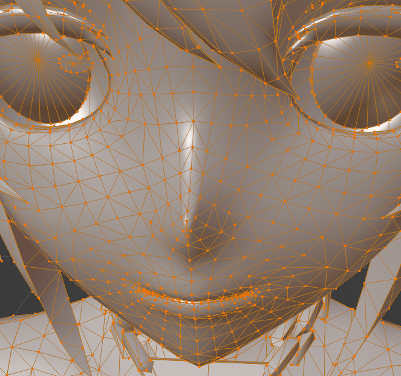

There are rough edges at corners of the walls and around the contour of Seele. These jagged edges are the result of these pixel samples only select either of the two intersecting materials as the color of the entire pixel.

Another interesting and jarringly artifact is the gap straight down the middle of Seele's face. This particular model of Seele has a rather abrubt height change towards the center line of the face to represent the protrusion from the nose arch. It is clear from the wireframe on the right that from a front view, there are only a few very narrow traingles that account for most of the elevation change. This can result in a very unique situation where the sampled ray intersects with her face exactly on the edge between the triangles that define the two sides of her nose bridge. It happens that neither triangle considers the ray as in bounds and thus it passes straight through the mesh to the back wall, and returns the blue color of the wall as the pixel color.

All of these artifacts can be solved by stochastic antialiasing, which is a very simple technique that jiggers the positions within a pixel from which a ray is generated between different samples. Using a uniform jigger, we will sample the entirety of the pixel with approximately equal weighting given enough samples. This way, the averaged pixel color would be a blend of the colors of all surfaces within the pixel, resulting in a smoother transition and elimination of a rays unexpectedly tunneling through meshes. Below is a side by side comparison of the render without aliasing from above and a render with antialiasing to illustrate the difference.

The additional computational cost per ray of stochastic antialiasing is just taking two uniform samples between [0, 1] and adding it to the position of the ray. Again, this cost is negligible compared to the other more expensive parts of the cycle, and performs similarly to a CPU implementation. (The parallelization of ray generation on GPU is certainly faster than sequential generation on CPU, but this difference is not a result of antialiasing implementation)

### Depth of Field
Real cameras have lenses that focus light through a finite-sized aperture on the the receptors on the camera's film plane. Lenses can only focus on a single plane, and as a result objects that are further away from the focus plane will appear blurrier. This bigger the aperture, the greater this effect. In practice, objects do not have to be exactly on the plane of focus to appear in sharp focus. There is actually a region of focus, which is called the lens' depth of field.

For this implemention, this effect is simulated using the thin-lens approximation, which specifies a simple set of equations to calculate where a light ray would focus on the focal plane based on the angle and position at which it passes through the lens. For each ray generated, we simply transform it by how it would bend given where it would pass through the imaginary lens. The refractive properties of the thin less would effective create a cone that pentrates through the plane of focus, where a circle of rays coming from beyond the plane of focus would focus onto a single point on the lens, causing all their rays to blend into one, resulting in the blurry effect.

Below we demonstrate some renders with different combinations of focal distance and lens radius.

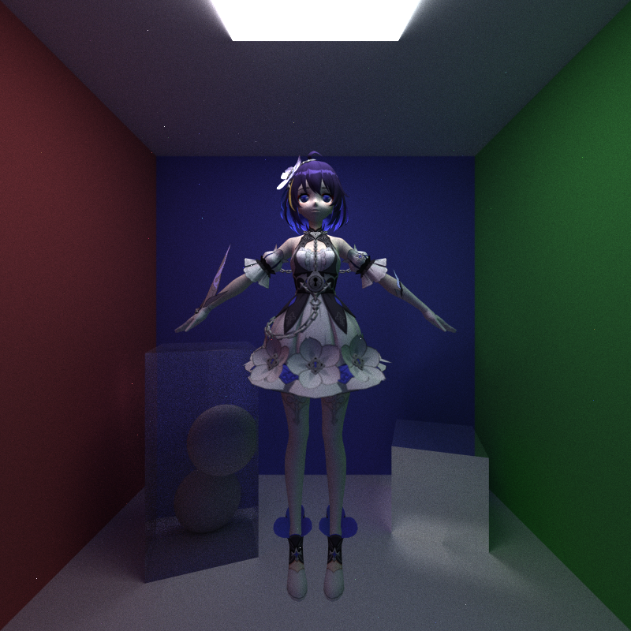
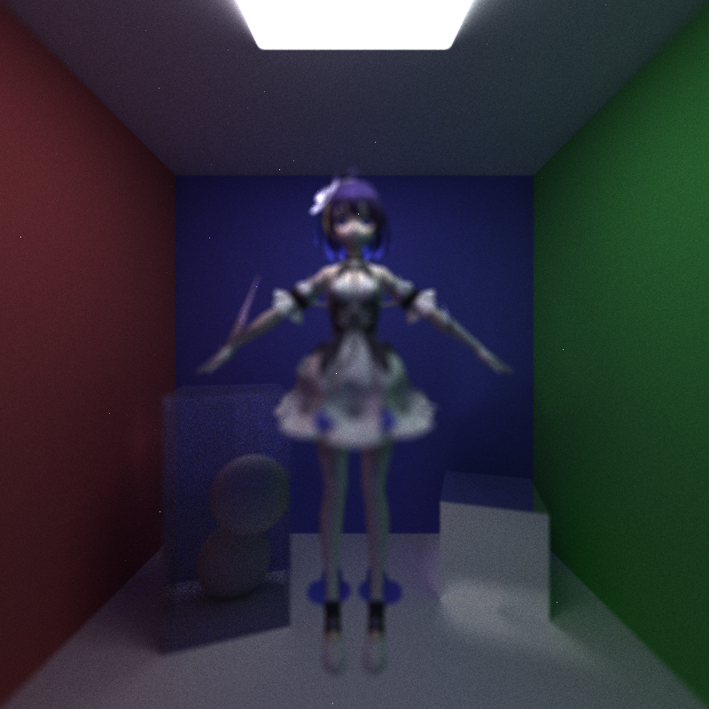

The computational cost of depth-of-field is a bit more noticeable. For the closed box demo, it adds on average 4ms per frame. This cost is independent of the focal distance and lens radius used. Perhaps the primary cause of this noticeable computational increase is that the thin lens equation involves divisions, and divisions are notoriously expensive arithmetic operations. Unfortunately, this division value cannot be cached as each ray uses a different divisor. Similar to antialiasing, the CPU implementation of this function would not be different.

## Mesh Rendering
While spheres and cubes are great primitives to start with, they are very tedious to work with for constructing more complex models. Mesh based models, which are commonly used in CAD software for modeling pretty much anything from people to objects, are constructed from many interconnected triangles. The primary benefits of using triangles are that they are small to store, can approximate a smooth surface very well given enough suffiently small triangles, and for any point inside a triangle, its position, normals, and uvs can easily be interpolated using just the three vertices. Thus, any renderer isn't complete without support for mesh rendering. Since mesh rendeirng is much more difficult to implement and debug, this project only supports one rather particular format.

### GLTF Mesh Loading
GLTF is a newer standard for storing meshes that can conveniently hold vertex, normals, uvs, and even material and texture data in one file. It also has support for animation, armatures, and other features commonly used in 3D animations, but those are not used in this implementation.

Mesh loading is done on the GPU side with help from the TinyGLTF library for decoding the binary `.glb` format and json `.gltf` format. For each model in the file, we traverse iteratively through the models in every node and load its primitives into memory as a buffer of triangles. Each vertex of the triangles stores its position, normal, and uv. Once a mesh is fully loaded, it is linked to a geometry by specifying a starting index for its primitives in the buffer, and a count of the number of primitives to indicate the end of its occupied segment in the buffer. The path tracer can then interact with these triangle primitives by checking for intersection and then shading through its normal pipeline. The cost of checking mesh intersection is enormous. More details on this will be discussed in the Bounding Volume Hiearchy section.

### Albedo texture mapping

For more intricate models, it doesn't make sense to just specify a single material for each primitive. Within the space of a primitive, there can be a blend of colours or heterogeneous speckles, like realistic human skin. To faciliate this level of detail, a commonly used technique is to create a square image known as a texture and sample from the texture for the color to apply for a given mesh-ray intersection. Each vertex in a traingle records a 2D vector called uv, which is a normalized coordinate for sampling a texture. Furthermore, using barycentric interpolation, the exact point to sample on a texture can be computed for any point on a triangular primitive.  

In this implementation, each Triangle struct contains the three vertices and their data as well as an index to the relevant texture to sample. When a triangle is selected as the intersecting object, the shader then will look for its uv to extract the relevant color from the referenced texture, and shade it using diffuse shading.

The outcome of GLTF mesh loading and albedo texture shading are demonstrated below in two scenes involving one and three Seele models respectively. Both scenes have two 4800K light sources acting as diffuse lights for portrait photography and a white diffuse box on the bottom for flooring.

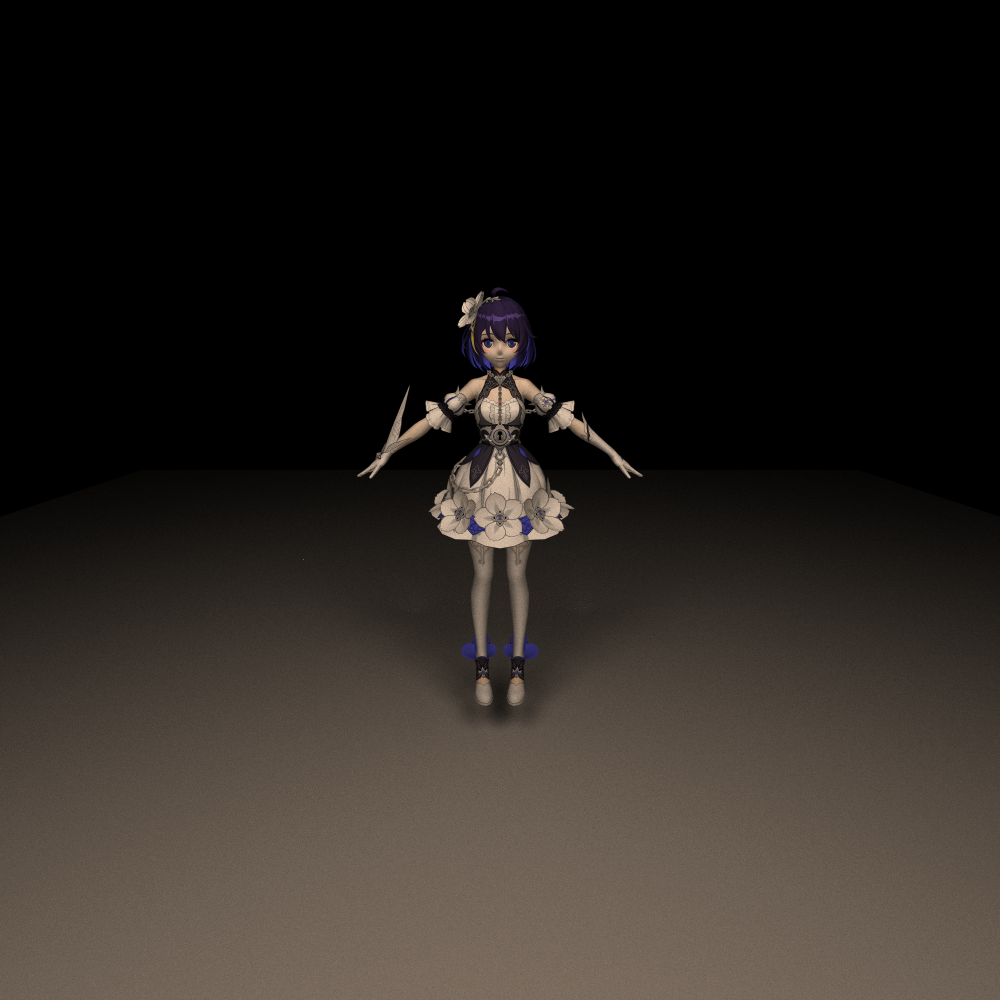

In terms of performance, most of the time is spent on the overhead cost of loading the textures from GLTF file, which is done on the CPU side by looping through the set of materials and associated textures to load them into memory buffers. The textures are then copied into GPU memory using CUDA dedicated texture objects. These objects are optimized for hardware level texture sampling, which makes the cost of sampling a texture for diffuse shade not too different from directly passing a diffuse color vector from global memory. Thus, while the start time has increased, the actual rendering time per frame does not change significantly between texture sampling and direct shading.

### Bounding Volume Hierarchy
While naively looping through all the geometries in the scene works for simple scenes like the cornell boxes, this approach no longer works once meshes are introduced. The Seele model in open box and closed box demo as well as the single Seele demo consists of 23079 triangles. Naively iterating through all these traingles to test for intersection would take an extremely long time compared to checking 5 - 10 basic geometries in the basic cornell scenes. This clearly does not scale well as the three Seele scene, which is still a relatively simple scene, has 73788 triangles, and thus 73788 checks per ray generated.

To reduce the number of checks required for finding an intersection, one option is to use a Bounding Volume hierarchy. The basic concept behind this is that each mesh is contained within an axis-aligned bounding box, which is then recursively subdivided into smaller bounding boxes containing less primitives. Each subdivision occurs along one axis so that all child bounding boxes remain axis-aligned. Axis-alignment allows a box to be specified with just two coordinates of opposing corners, thus minimizing the memory footprint required to define this structure. Depending on the BVH construction method, the number of checks required for finding an intersection between a mesh and a ray can be reduce to at least $\log(n)$, where $n$ is the number of primitives in the mesh.

In this implementation, the surface area heuristic is used to determine the cost of making a division. For each subdivision, the axis is split into 8 bins, thus performing 7 checks for potential split and picking the one with the least cost. This implementation typically results in a shallower hierarchy, thus reducing the number of bounding box checks, but in turn may increase the number of primitive intersection checks in a leaf bounding box depending how sparsely the primitives are distributed.

The construction of the BVH was done on the CPU because recursive subdivision does not work well on the GPU. While it is technically possible to implement parallel recursive construction using stacks and some careful controls, the complexity of avoiding undesired concurrent writing to the same memory buffer slot, maintaining the recursion stack, and recurisve sub-kernel launching makes the speed improvement insufficient to justify the extra implementation time. In fact the BVH construction for three Seeles took approximately 2 seconds, which is acceptable considering that this is a one-time initialization cost.

For BVH traversal on the GPU side, this is implemented as a pseudo-recursive traversal using a stack. Each bounding box that the ray intersects is pushed into the stack and then its children boxes checked until a triangle is intersected or all intersecting bounding boxes have been tested.

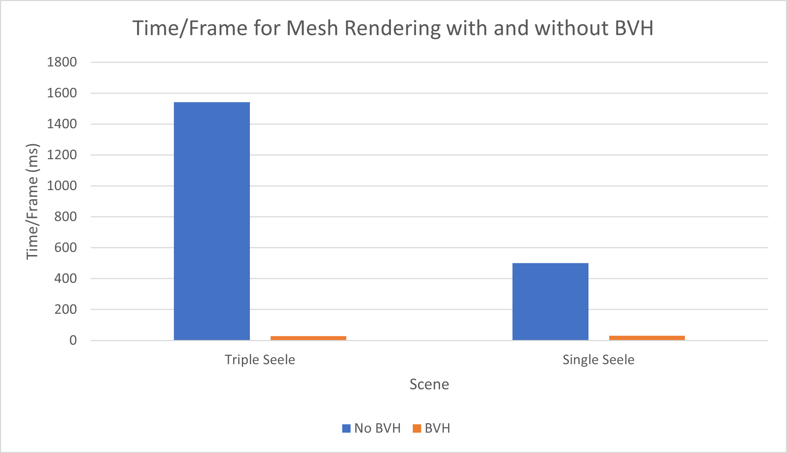
Figure 4: The render time per frame for the three Seele scene and a single Seele scene with and without BVH. Both scenes have the same number of lights and non-mesh geometries for equal comparison. The lower Time/Frame the better.

It is clear from the graph that the performance improvement from using BVH is significant, and the impact becomes even more prominent as the number of meshes increase. In both the single and triple Seele scene, the render time per frame for the BVH implementation was about 30ms, but the naive intersection algorithm scales linearly with the number primitives, taking about 500ms for one Seele mesh and about 1550ms for three Seele meshes. Compared to a CPU implementation of BVH, the per ray traversal performance would not be dramatically different as the same recursive process would be performed to check for intersection.

### Further Improvements
The current support for mesh rendering is limited to a very particular format. For GLTF based models, more general support can be achieved by setting up the option to read material properties and thus shade a mesh with a uniform material with varying roughness, specular properties etc. Another additional feature would be to support importing textures directly from image files. This would allow support for gltf files without embedded textures and open up the option for supporting other file formats that do not support embedded textures like classic obj files. Texture mapping could also be expanded to support other kinds of maps, such as normal maps.

In terms of performance, a stackless implementation of BVH could increase performance even further for even more complex scenes. The BVH could also be expanded to take other geometries so that sufficiently complex scenes consisting of other basic geometries could also benefit from less intersection tests.

Furthermore, the memory footprint of the current mesh implementation can be improved by storing a separate buffer of vertices and have triangles store pointers to these vertices instead of copies. This can potentially reduce the memory footprint of a mesh dramatically as each vertex in a connected mesh can be shared by multiple triangles. For example, most vertices in the wireframe of Seele's face shown in the Antialiasing section are shared by 4 or 8 triangles, which means the memory footprint can be decreased by approximately 6 times.

## References
* Physically Based Rendering 3rd Edition [&#x1F517;](https://pbr-book.org/3ed-2018/contents)
* "How to build a BVH" - JBIKKER [&#x1F517;](https://jacco.ompf2.com/2022/04/13/how-to-build-a-bvh-part-1-basics/)
* TinyGLTF [&#x1F517;](https://github.com/syoyo/tinygltf)

## Model Attributions
* Seele - Stygian Nymphs: 神帝宇/Mihoyo [&#x1F517;](https://www.aplaybox.com/details/model/lUlYznLigW7V)
* Seele - Stygian Nymphs New Years Outfit: 神帝宇/Mihoyo [&#x1F517;](https://www.aplaybox.com/u/359396473)
* Seele - Herrscher of Rebirth: 神帝宇/Mihoyo [&#x1F517;](https://www.aplaybox.com/details/model/4a70Pb6y7VaC)
* GLTF Box: Cesium [&#x1F517;](https://github.com/KhronosGroup/glTF-Sample-Models/tree/master/2.0/BoxTextured)
* Monkey Textured: Three.js Tutorials [&#x1F517;](https://sbcode.net/threejs/textured-gltf/)