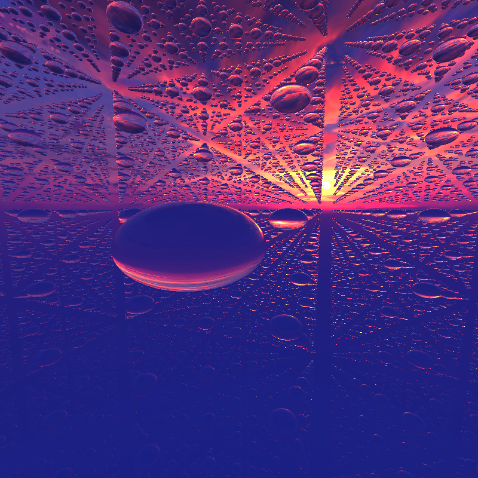
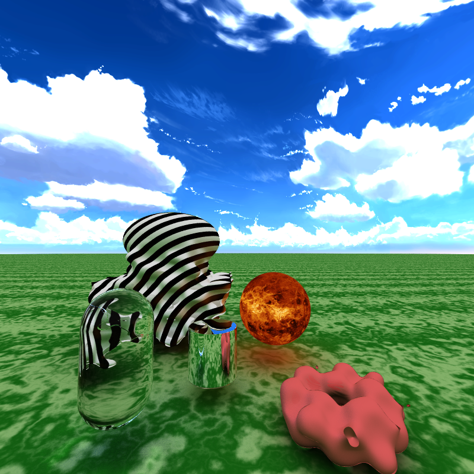
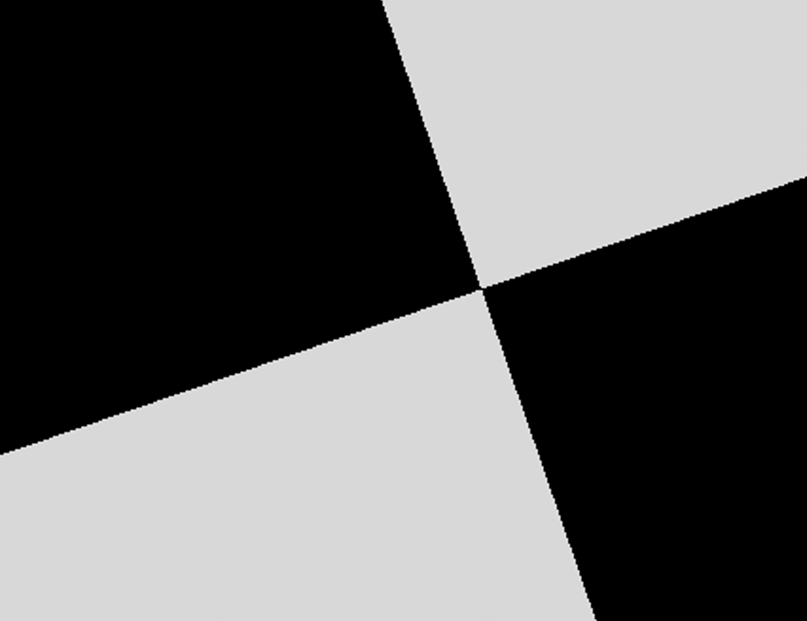
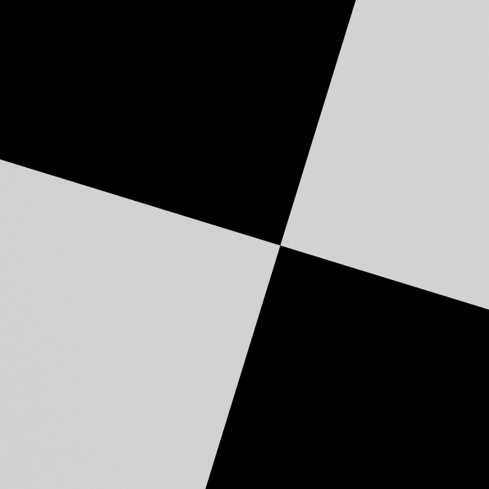

 # CUDA GPU-Accelerated Path Tracing

**University of Pennsylvania, CIS 565: GPU Programming and Architecture, Project 2**

* Ruijun(Daniel) Zhong
    * [LinkedIn](https://www.linkedin.com/in/daniel-z-73158b152/)    
    * [Personal Website](https://www.danielzhongportfolio.com/)
* Tested on: Windows 11 pro, 12th Gen Intel(R) Core(TM) i7-12700K 3.61 GHz 32.0 GB, NVIDIA GeForce RTX 3070 Ti (personal computer)
======================
 ## Abstract
Path tracing is a method used in computer graphics to create realistic images by simulating how light interacts with objects. However, this process can be very demanding on a computer's resources, especially when aiming for high-quality images. Enter NVIDIA's CUDA, a technology that allows for faster computations using graphics processing units (GPUs). In this project, I explore how CUDA can make path tracing faster and more efficient.

 ## GLTF Model & Procedural CheckerBoard Texture & HDR SkyBox
 

 ## Infinite Procedural Shapes & Procedural Textures
   
  Showing:
  * Material: Diffuse, Glass, Metal, Texture Map, Perlin Noise Texture, Ring Texture
  * Shape: Torus with Displacement, Cylinder, Capsule, Displacement+ SmoothUnion of Bended Cube and Sphere

 

 ## MSAA Antialising with random ray
 * Without Antialising  

 
 * With Antialising(50 x more random ray per pixel) 

 

## References
 ### Some ideas were inspired by:  
 [_Ray Tracing in One Weekend_](https://raytracing.github.io/books/RayTracingInOneWeekend.html) including:
 * Diffuse, Metal, Glass Material
 * Sphere Intersection Test
 * (MSAA) Camera Multisampleing Antialiasing with random ray

 [_Ray Tracing: The Next Week_](https://raytracing.github.io/books/RayTracingTheNextWeek.html) including:
 * Skybox Sphere Texture
 * Procedure Texture(Perlin Noise)

 [_Ray-Tracing: Rendering a Triangle_](https://www.scratchapixel.com/lessons/3d-basic-rendering/ray-tracing-rendering-a-triangle/moller-trumbore-ray-triangle-intersection.html) including:
  * Triangle Intersection Test(Moller-Trumbore algorithm)

 [_Inigo Quilez_](https://iquilezles.org/articles/normalsSDF/) including:
 * SDF Normalize Formula

 [_iquilezles.org_](https://iquilezles.org/articles/distfunctions/) including:
 * Procedure Shape Formula

 [_syoyo/tinygltf_](https://github.com/syoyo/tinygltf/) & [Reddit](_https://www.reddit.com/r/vulkan/comments/oeg87z/loading_some_indexed_gltf_meshes_cause_weird/#:~:text=TRIANGLE_LIST%20topology.%20Here%20is%20my%20code%20for,tinygltf::Model%20&model%2C%20int%20accessorIndex%20%7B%20auto%20accessor_) including:
 * Extract GLTF object mesh to triangle index buffer

[_cgtrader_](https://www.cgtrader.com/) including:
 * gltf 3d model and textures

 
 