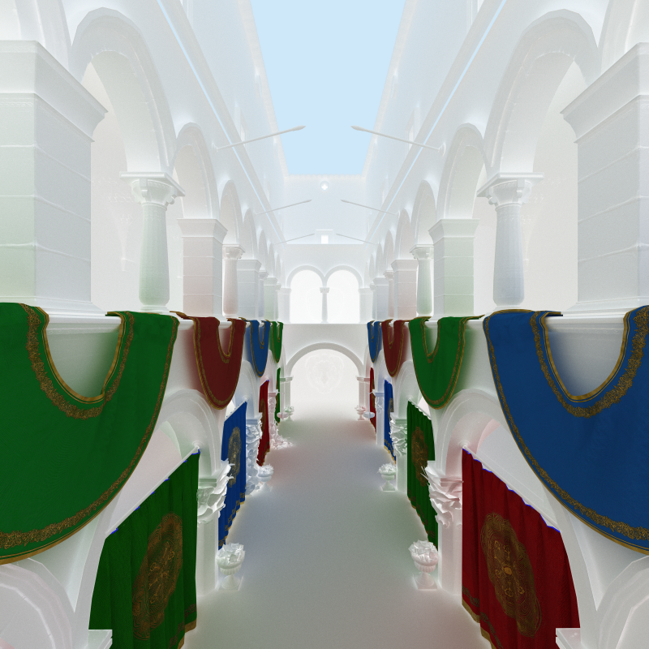

CUDA Path Tracer
================

**University of Pennsylvania, CIS 565: GPU Programming and Architecture, Project 3**

* Han Yang
  *  [LinkedIn](https://www.linkedin.com/in/han-yang-0031231a3/), [personal website](https://bdwhst.wixsite.com/portfolio), etc.
  
* Tested on: Windows 11, i9-12900HX @ 2.30GHz 16GB, RTX4080 laptop 12GB

## Principles

Path tracing basics

Stream compaction

Metallic workflow importance sampling

Multiple importance sampling

Anti-aliasing and depth of field

GLTF loading

## Showcase

Wanna play chess? 

Large `wavefront-obj` scene load and render (with alpha cutoff):

Metallic Workflow PBR with normal mapping:

Refraction and reflection:

Sponza:

