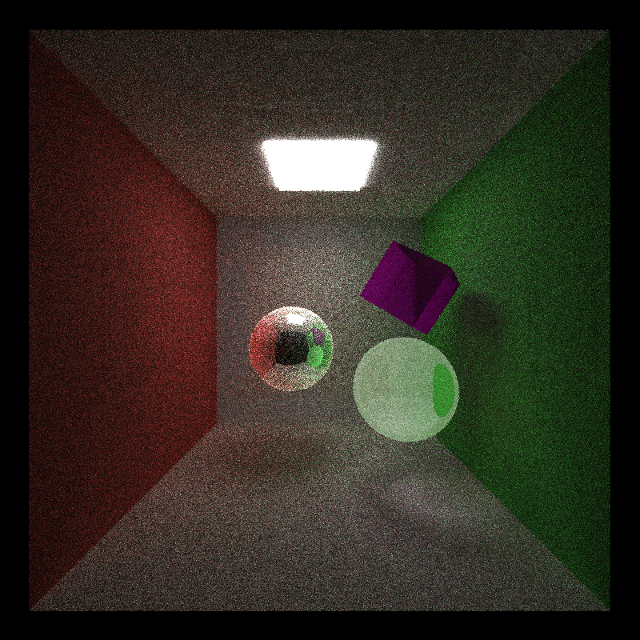

CUDA Path Tracer
================

**University of Pennsylvania, CIS 565: GPU Programming and Architecture, Project 3**

* Zhiyu Lei
  * [LinkedIn](https://www.linkedin.com/in/zhiyu-lei/), [Github](https://github.com/Zhiyu-Lei)
* Tested on: Windows 22, i7-2222 @ 2.22GHz 22GB, GTX 222 222MB (CETS Virtual Lab)

### Project Description

* A shading kernel with BSDF evaluation for diffuse and specular-reflective surfaces
* Path continuation/termination using Stream Compaction
* Sorting intersections and pathSegments by material types
* Refraction with Frensel effects using Snell's law
* Stochastic Sampled Antialiasing
* Direct lighting by taking a final ray directly to a random point on an emissive object acting as a light source
* Jittered sampling for Monte Carlo ray tracing
