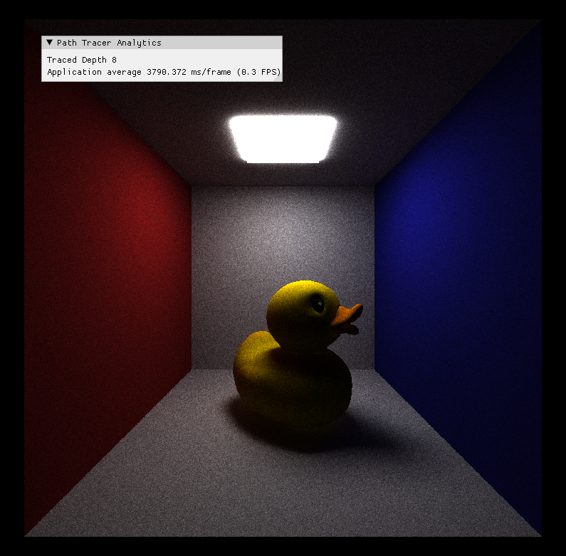

CUDA Path Tracer
================

**University of Pennsylvania, CIS 565: GPU Programming and Architecture, Project 3**

* Hanting Xu
* Tested on: (TODO) Windows 22, i7-2222 @ 2.22GHz 22GB, GTX 222 222MB (Moore 2222 Lab)

## Path Tracing

### Handling Different Materials
### Mesh Loading & Texture Mapping

### Antialiasing
### Depth Of Field
### Gaussian and SVGF Denoising
### BVH Tree Building and Traversal On GPU

### Light Path Stream Compaction
### Discoveries
