# CUDA Path Tracer

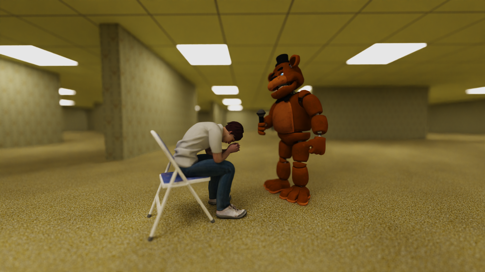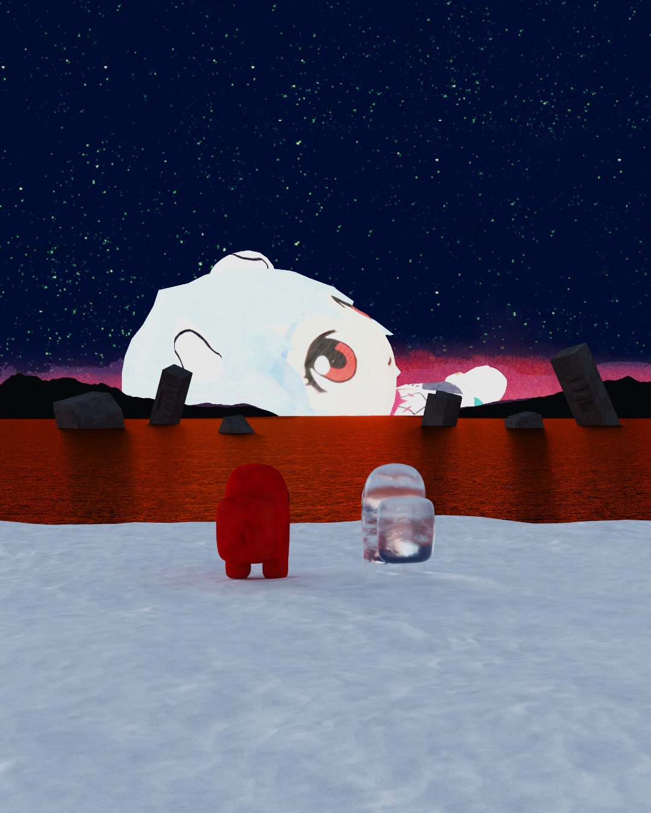

**University of Pennsylvania, CIS 5650: GPU Programming and Architecture, Project 3**

* Aditya Gupta
  * [Website](http://adityag1.com/), [GitHub](https://github.com/AdityaGupta1), [LinkedIn](https://www.linkedin.com/in/aditya-gupta1/), [3D renders](https://www.instagram.com/sdojhaus/)
* Tested on: Windows 10, i7-10750H @ 2.60GHz 16GB, NVIDIA GeForce RTX 2070 8GB (personal laptop)
  * Compute capability: 7.5

## Introduction

This project is a CUDA path tracer with various features, including but not limited to diffuse and specular shading, glTF and texture loading, depth of field, and denoising. The following is an explanation of the path tracer's features, as well as performance analysis of different optimizations and enhancements.

## Features

### BRDFs

#### Lambertian shading

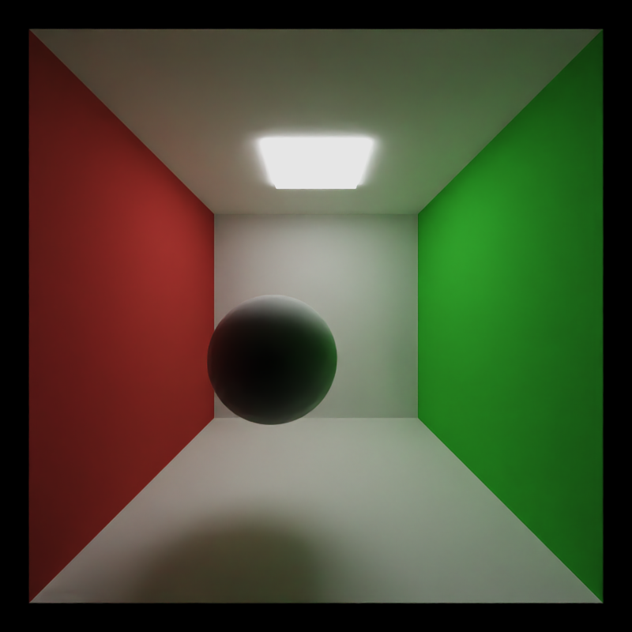

Basic Lambertian shading, shown here in a Cornell box scene.

#### Specular reflection and refraction

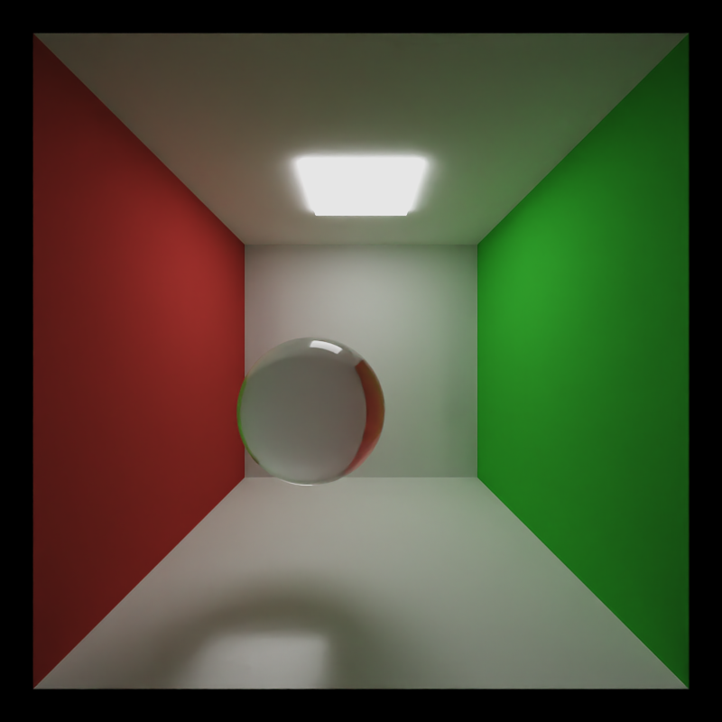

Perfect specular reflection and refraction, shown in the same Cornell box scene as above.

Note that this project also has code for microfacet reflection and refraction but it currently does not work properly. The second render at the top of the page does use a roughness value of 0.3 for the transparent character but the calculations aren't entirely accurate even if the effect looks cool.

### Scene building tools

#### glTF mesh loading

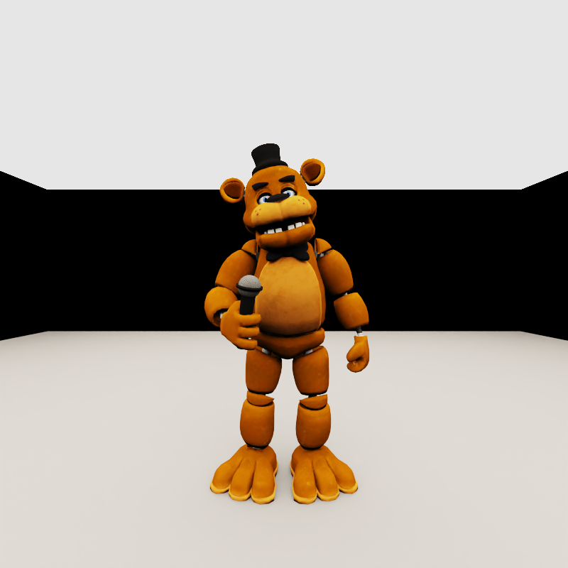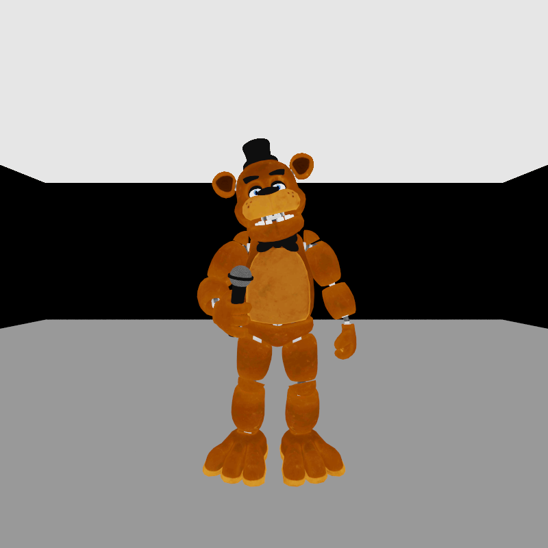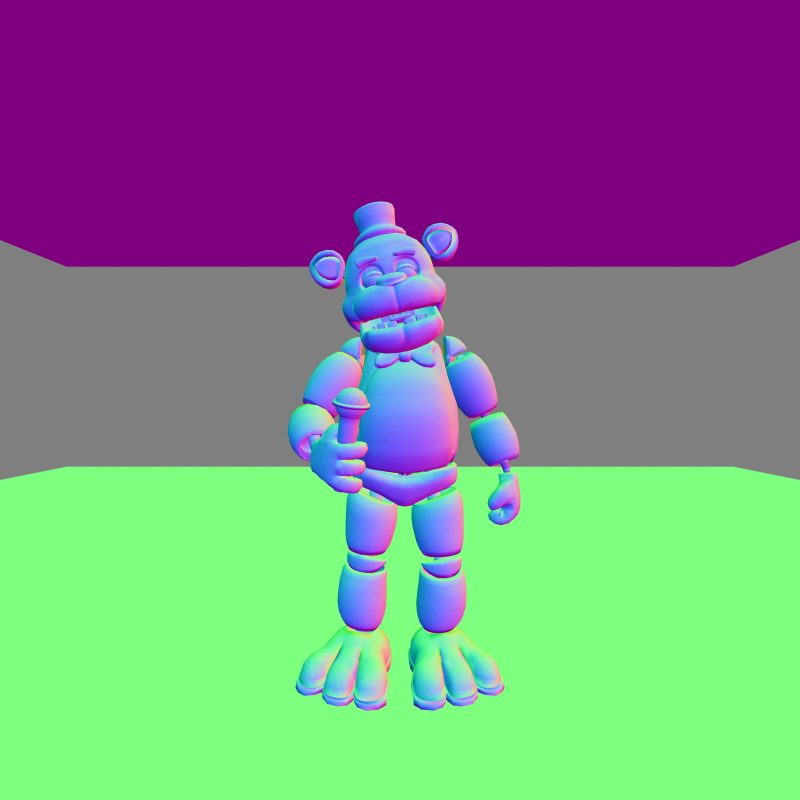

Using [tinygltf](https://github.com/syoyo/tinygltf). The above images show, from left to right:
- Final render
- Albedo (base color)
- Normals (with normal map applied)

#### Environment map lights

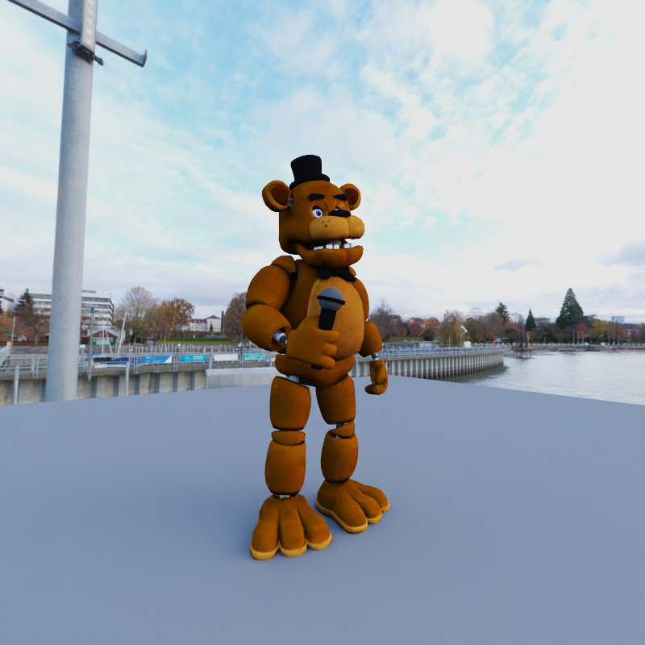

#### BVH construction and traversal

The [above scene](#environment-map-lights) renders at 40.9 FPS using a BVH and 2.2 FPS without a BVH. The mesh has 17,386 triangles and it takes about 11.5 ms to construct the BVH.

More detailed performance analysis is given [below](#bvh).

### Other features

#### Depth of field

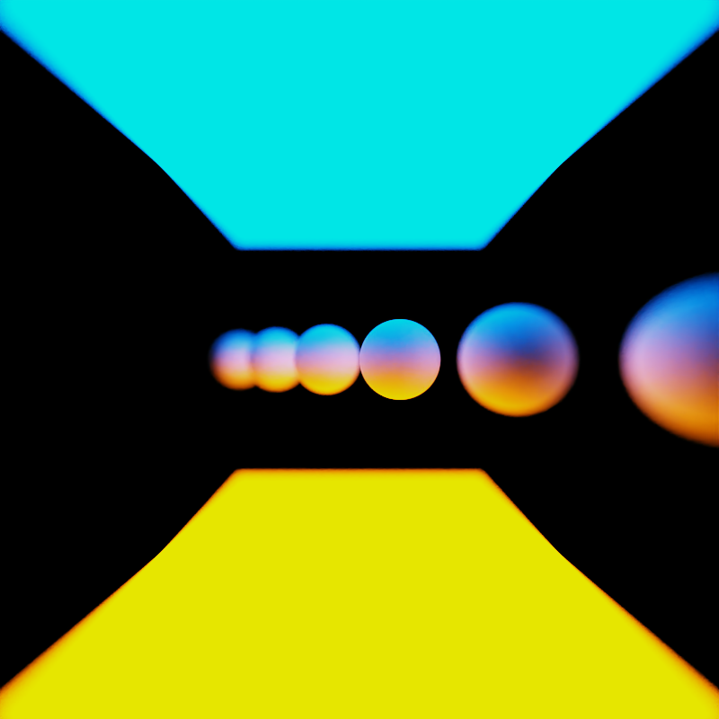

Using a thin lens camera model.

#### Denoising

Using [Intel Open Image Denoise](https://www.openimagedenoise.org/). Left is raw output and right is denoised. Both images were taken after 20 samples per pixel (~8 seconds). Denoising also takes albedo and normals into account (see example auxiliary images [above](#gltf-mesh-loading)).

## Performance Analysis

I started with the following set of parameters:
- 1D block size of 768, 2D block size of 8x8
- Enable BVH, partition rays, and russian roulette
- Disable sorting rays by material and first bounce cache
- Max ray depth = 8
- Denoising every 3 frames

Most of the following analyses refer to the two scenes at the [top of this page](#cuda-path-tracer): Open (red ocean with a bright plushie in the backround) and Closed (yellow room with a guy in a chair). Open was rendered at 1080x1350 and Closed was rendered at 1920x1080.

### Block size

First, I compared various 1D block sizes to find which one would give the best performance. 1D block dimensions are used for most of the kernels, including checking for intersections and shading materials.

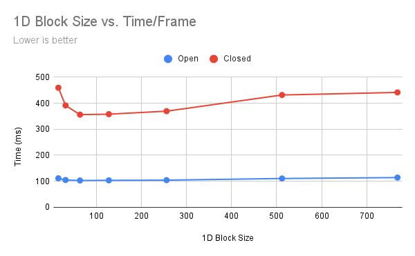

From this, I found that a 1D block size of 64 gave the best performance. Then, I compared 2D block sizes, which are used solely for generating initial rays from the camera:

There was almost no difference between the performance given by these block sizes, so I stuck with the original size of 8x8.

### Partition rays

By default, after every round of intersections and shading, the path tracer partitions the rays by whether they have bounces left. Then, only those that can still bounce are considered for the next round. With this feature, the number of rays drops with each successive round:

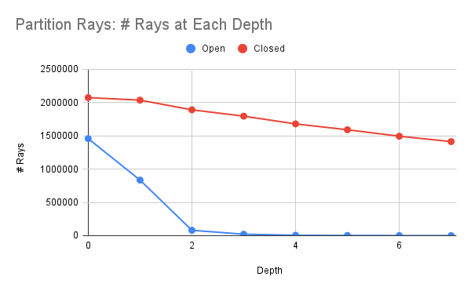

However, this feature is toggleable. When partitioning is off, the path tracer will instead send all rays to all kernels every time and simply return immediately in threads where the associated ray has no bounces left.

Comparing the two options, I initially thought partitioning would increase performance since all warps would be densely packed. However, the results surprised me:

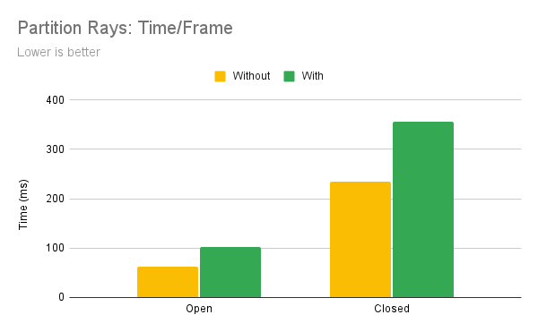

Looking at the Nsight timeline provides somewhat of an explanation:

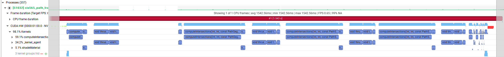

I'm not sure why there's such a large gap between calls to the CUDA kernels and calls to `thrust::partition`, but that would explain the significant performance downgrade when using partitioning. With that in mind, I disabled ray partitioning for the remaining analyses.

### Sort rays by material type

Another feature is the ability to sort rays by their material type. This hypothetically leads to increased performance in the shading kernel since adjacent threads will process the same material and will have less divergence. However, in practice, the cost of sorting is simply too much and this feature actually degrades performance:

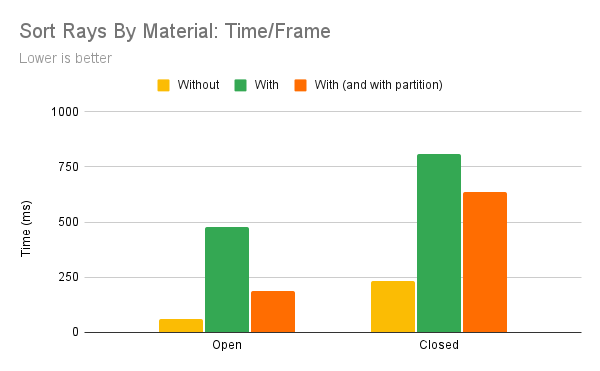

Interestingly, enabling ray partitioning in addition to sorting increased performance compared to just enabling sorting. However, the time per frame was still significantly higher than with neither feature enabled. After seeing these results, I decided to keep ray sorting disabled for the remaining analyses.

### Russian roulette path termination

Yet another performance feature is Russian roulette path termination, which involves terminating rays with probability proportional to their light contribution. Rays that survive have their contributions multiplied proportional to the termination probability to ensure the final image remains consistent. This feature activates after 3 ray bounces and can significantly decrease the number of rays, especially for closed scenes:

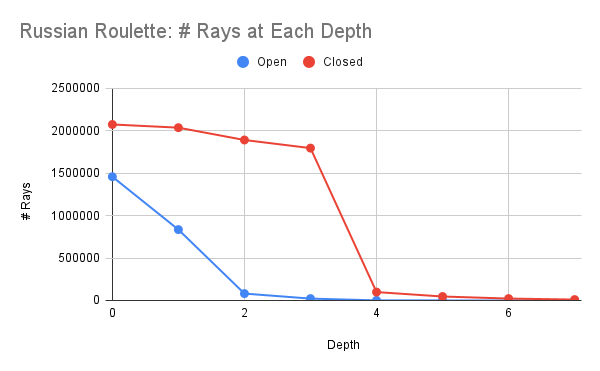

The drop off is clearly visible after depth 3. Having less rays to deal with leads to increased performance:

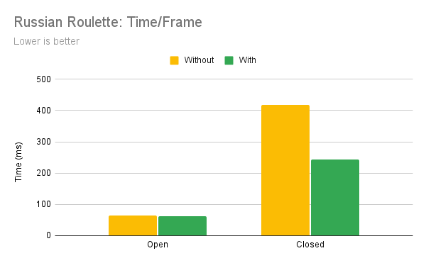

The difference is negligible for Open but very significant for Closed. Given that this feature increases performance without diminishing image quality, I opted to keep it enabled.

### First bounce cache

This one involves caching the first intersection of the first iteration of rays and reusing that for subsequent iterations. This option exists for performance comparisons but does not make sense to use for actual renders because it doesn't play nice with anti-aliasing or depth of field. Additionally, the performance improvement is relatively insignificant:

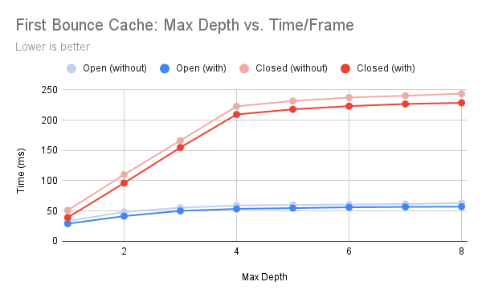

The effect is more pronounced when the maximum ray depth is low, but it diminishes at higher depths (which would be required for more complex scenes).

### BVH

A BVH (bounding volume hierarchy) is a data structure used to accelerate testing for ray intersections. It is a tree structure where each node has a bounding volume and deeper nodes represent smaller volumes, which allows for pruning away large subtrees and minimizing the number of intersection checks. The BVH construction algorithm considers the surface area of potential child nodes when determining how to split a tree node while maximizing traversal efficiency.

For this feature, I tested performance with simpler scenes since running Open and Closed without a BVH would take a prohibitively long amount of time. These are the two scenes I tested with:

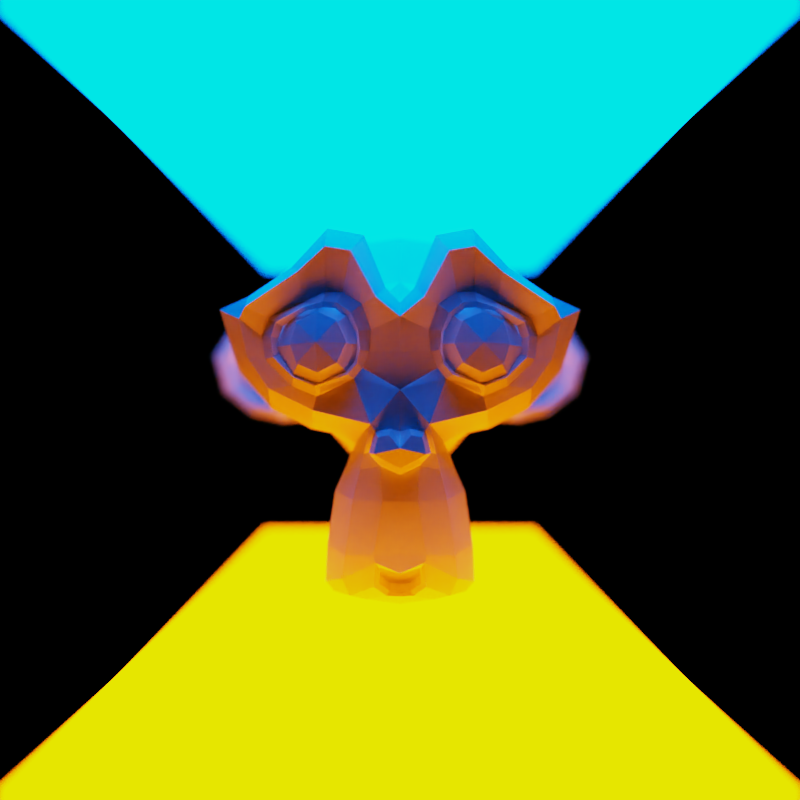

Both scenes were rendered at 800x800. The left scene (monkey) contains 968 triangles and took around 0.5 ms to construct the BVH. The right scene (Freddy Fazbear) contains 17,386 triangles and took around 11.5 ms to construct the BVH.

Here is the associated performance data:

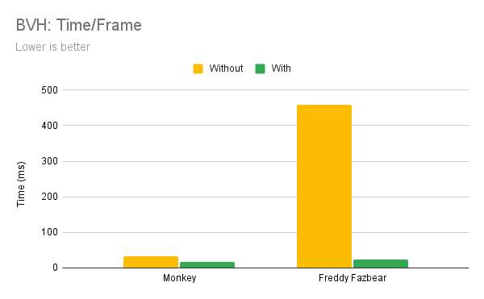

The monkey scene saw about a 2x speedup while the Freddy Fazbear scene saw an almost 20x speedup. The speedup is much more pronounced for larger scenes. Without BVH construction, rendering more complex scenes like Open and Closed would likely not be possible (or at least very annoying).

A potential future optimization could be to implement stackless BVH traversal, which could reduce the resources required by each thread and allow for higher occupancy. Additionally, there could be better heuristics than surface area for splitting tree nodes, which could also lead to higher traversal performance.

### Denoising

Denoising does decrease rendering performance since it uses the GPU. Here's what that looks like:

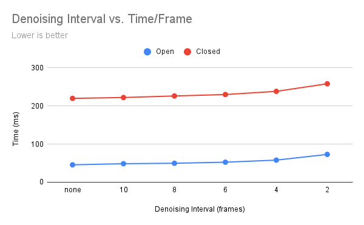

The highest performance is of course with no denoising, and performance decreases as the denoising interval decreases. I decided to use an interval of 3 frames to maintain a balance between image update frequency and performance.

## Bloopers

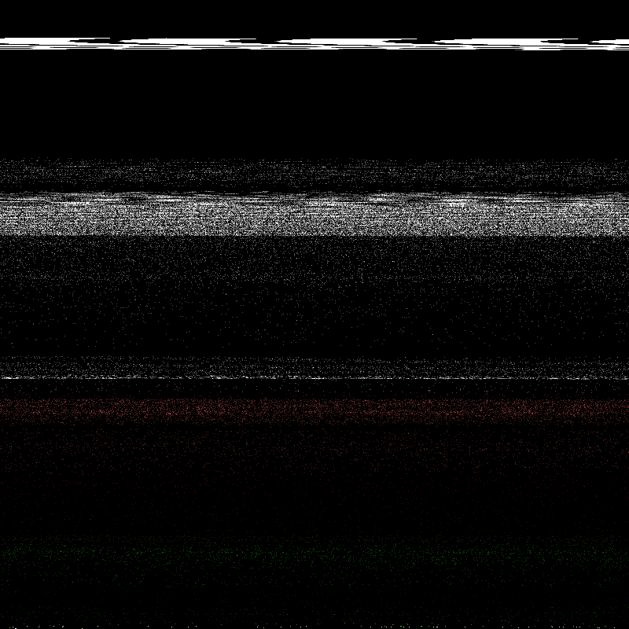

This appeared when I sorted intersections by material ID without also sorting the path segments in tandem.

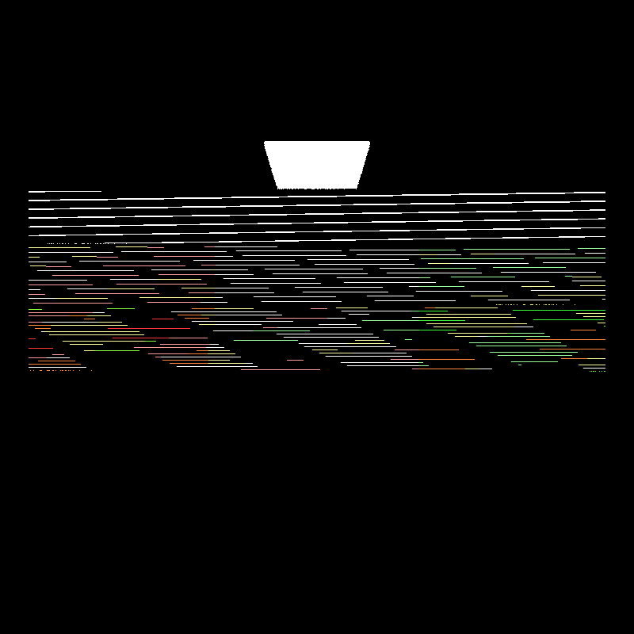

Really not sure where this came from, but it appeared while I was working on the first bounce cache.

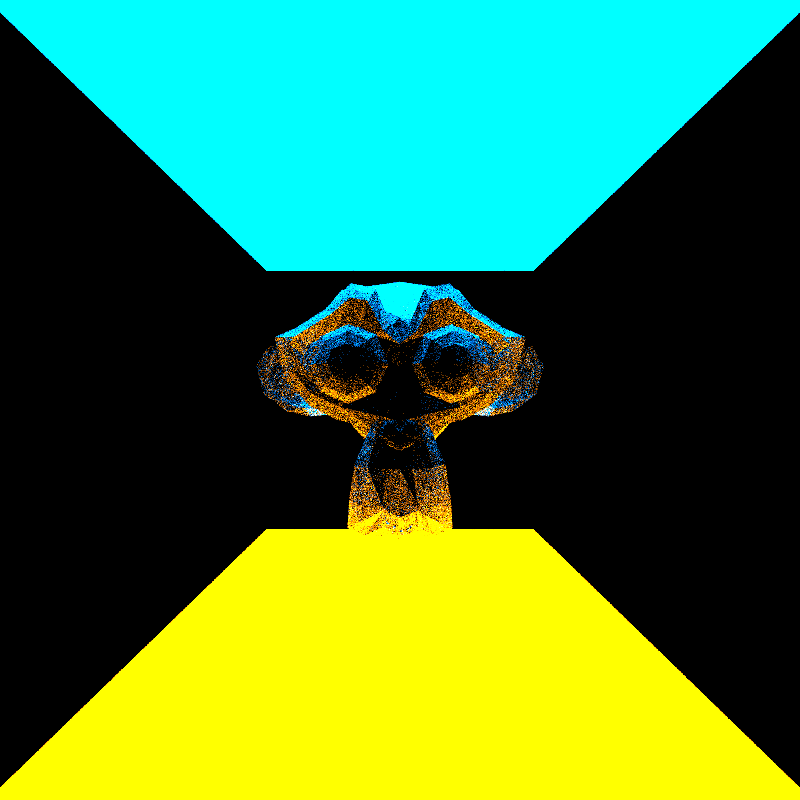

Evil monkey.

Seems like the monkey exploded?

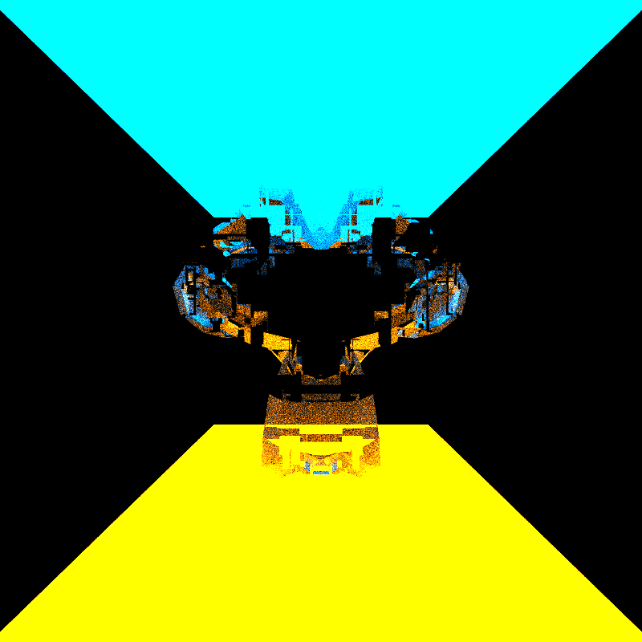

The monkey is empty inside, just like me after spending more than two weeks on this assignment.

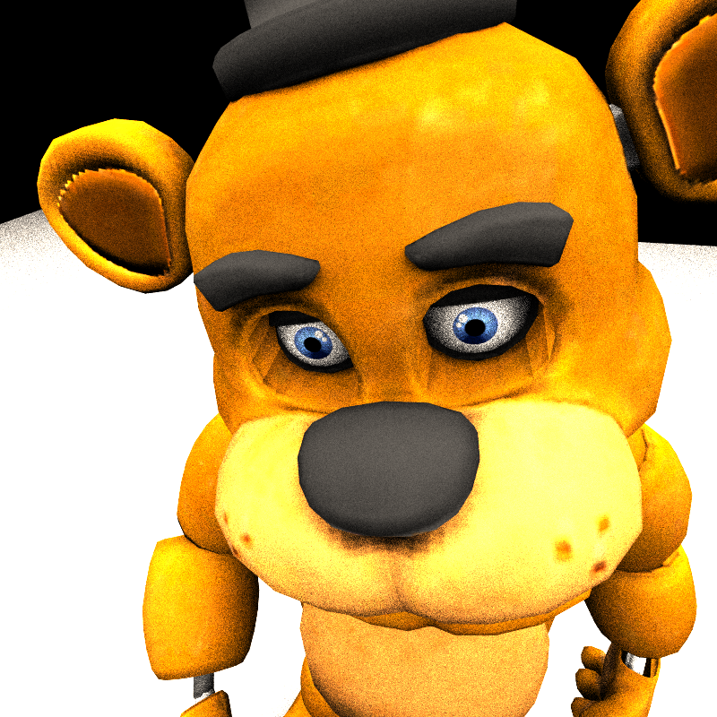

🤨 (I was trying to fix the shading artifacts on the eye sockets.)

## Attribution

### Code

- BVH tutorial: https://jacco.ompf2.com/2022/04/13/how-to-build-a-bvh-part-1-basics/
- Barycentric coordinates: https://gamedev.stackexchange.com/questions/23743/whats-the-most-efficient-way-to-find-barycentric-coordinates/23745#23745
- Normal map: http://www.thetenthplanet.de/archives/1180

### Models

- Freddy Fazbear: https://sketchfab.com/3d-models/fnaf-ar-freddy-fazbear-f6e019333d694cbfbb2f3fbc9e791763
- Chair: https://sketchfab.com/3d-models/metal-folding-chair-c4428a7f4a2f472689a914a3373befc3
- Hair: https://sketchfab.com/3d-models/anime-style-short-hair-c396587aee6a4e63a6476c1400b613eb
- Human character: https://www.mixamo.com/
- Backrooms: https://sketchfab.com/3d-models/simple-backrooms-b7e72135d97b4c81b6c135413e6e2168
- Among Us crewmate: https://sketchfab.com/3d-models/among-us-astronaut-clay-20b591de51eb4fc3a4c5a4d40c6011d5
- Rei plush: https://sketchfab.com/3d-models/rei-ayanami-plushie-0bda564e1d804c2f84950cec57db15d3
