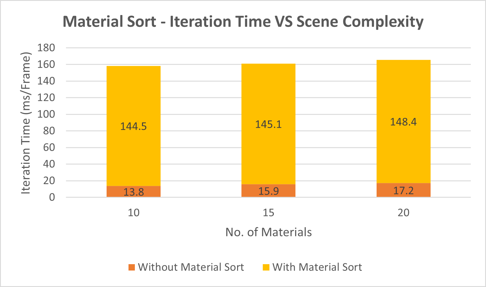
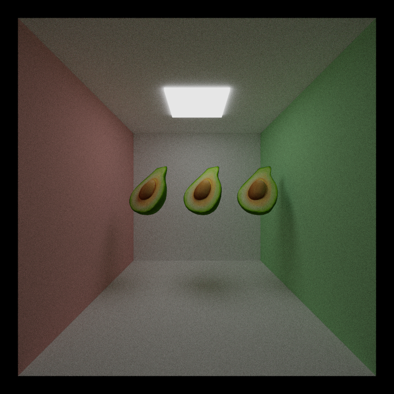

CUDA Path Tracer
================

**University of Pennsylvania, CIS 565: GPU Programming and Architecture, Project 3**

* Saksham Nagpal  
  * [LinkedIn](https://www.linkedin.com/in/nagpalsaksham/)
* Tested on: Windows 11 Home, AMD Ryzen 7 6800H Radeon @ 3.2GHz 16GB, NVIDIA GeForce RTX 3050 Ti Laptop GPU 4096MB

## Summary
This project is a learning attempt turned into a definitive milestone in my journey of learning CUDA. The aim of making a path tracer using CUDA and C++ is to replicate the behaviour of the graphics pipeline while manually being in-charge of the GPU-side kernel invocations. Using CUDA, I map each of the steps in the graphics pipeline (i.e. vertex shader, rasterization, fragment shader, etc.) into equivalent kernel invocations, thus solidfying both experience with CUDA as well as knowledge of the graphics pipeline. This project also turned out to be a good way of keeping me true to my understanding of the core graphics concepts such as coordinate transformations and barycentric interpolation. By implementing a combination of visually pleasing and computationally accelerating features, I was able to generate some fun renders such as these:

## Representative Outcomes  
_247,963 triangles, 5000 iterations, max 10 bounces per ray_ 
 

_Stanford Dragon - 871,306 triangles, 5000 iterations, max 8 bounces per ray_
 
 
  

## Features Implemented

1. [BSDFs - Diffuse, Perfectly Specular, Perfectly Reflective, Imperfect Specular/Diffuse, Refractive](#visual-one)
3. [Stochastic Sampled Antialiasing](#visual-two)
4. [Physically-Based Depth of Field](#visual-three)
5. [Support for loading glTF meshes](#visual-four)
6. [Texture Mapping for glTF meshes](#visual-four)
7. [Reinhard operator & Gamma correction](#visual-five)
8. [First bounce caching](#perf-one)
9. [Stream Compaction for ray path termination](#perf-two)
10. [Material Sorting](#perf-three)
11. [Acceleration Structure - Bounding Volume Heirarchy (BVH)](#perf-four)

## Path Tracer

A path tracer, in summary, is an effort to estimate the **Light Transport Equation (LTE)** for a given scene. The LTE is a methematical representation of how light bounces around in a scene, and how its interactions along the way with various kinds of materials give us varied visual results.

The Light Transport Equation
--------------
#### Lo(p, &#969;o) = Le(p, &#969;o) + &#8747;S f(p, &#969;o, &#969;i) Li(p, &#969;i) V(p', p) |dot(&#969;i, N)| _d_&#969;i

The [PBRT](https://pbr-book.org/3ed-2018/Light_Transport_I_Surface_Reflection/The_Light_Transport_Equation#) book is an exceptional resource to understand the light transport equation, and I constantly referred it throughout the course of this project.

# Visual Features

 The following features were implemented in this path-tracer to make the renders look more _physically-based_.

 ## 1. Bidirectional Distribution Functions (BSDFs)

 BSDF is a function that defines a material in terms of how it scatters rays when light interacts with it. This path tracer implements the requisite BSDFs to support perfectly diffuse, perfectly specular, imeprfect specular/diffuse, and refractive materials.

 |  |  |  |  |
|:--:|:--:|:--:|:--:|
| *Diffuse (Lambertian)* | *Partially Diffuse/Specular* |  *Perfectly Specular* |  *Perfectly Refractive* |

## 2. Stochastic Sampled Anti-Aliasing

Ray generation for each pixel, if not perturbed, will be deterministic. This means that the rays generated from the camera in each iteration would hit the same geometry always. This gives visibly jagged _aliased_ edges in the final render. To prevent this, we can select different points on each pixel in each iteartion using [Stratified Sampling](https://pbr-book.org/3ed-2018/Sampling_and_Reconstruction/Stratified_Sampling). This way, each ray originating from the camera is 'jittered' by a small amount, giving the much needed random seed to the path tracer. Since we accumulate pixel colours over iterations, the random jitterling helps averaging out the abrupt jagged edges to smoothly-shaded ones. This feature can be toggled ON/OFF using the preprocessor directive `ANTI_ALIASING` in the `utilities.h` file.

|  |  |
|:--:|:--:|
| *Visibly Aliased Edges* | *After Anti-Aliasing* |

## 3. Physically-Based Depth of Field

The camera model assumed until now is a _thin-lens model_, that allow light to pass only through a very small aperture to reach the camera film. Real cameras instead have lenses of a finite-sized aperture with a certain _lens radius_ and a _focal plane_. The larger the aperture, i.e. the _lens radius_, the shorter are the exposure times to accurately capture an image. However, such lenses can only focus on the _focal plane_, and any nearer/farther objects appear blurrier. PBRT describes a [thin-lens approximation](https://pbr-book.org/3ed-2018/Camera_Models/Projective_Camera_Models#TheThinLensModelandDepthofField) for such a camera model, which we implement in our path tracer. The concept is fairly straightforward:
1. Generate a random point on the surface of the disc.
2. Determine the intersection point on the plane for the ray assuming a pinhole camera model.
3. The origin of the ray now becomes the randomly generated point on the lens, and its direction is the vector from this new origin towards the point calculated on the film.

Such a simple yet physically accurate implementation allowed us to get the following interesting visual results:

<table>
  <tr>
    <td align="center"><b>Lens Radius = 0.01</b></td>
    <td align="center"><b>Lens Radius = 0.1</b></td>
    <td align="center"><b>Lens Radius = 0.6</b></td>
  </tr>
  <tr>
    <td></td>
    <td></td>
    <td></td>
  </tr>
  <tr>
    <td colspan="3" align="center"><i>Focal Length = 6.3, 1000 iterations, trace depth = 8</i></td>
  </tr>
</table>
A very small lens radius approximates the pin-hole camera, and therefore we get an almost clear render. As we increase the lens radius, more and more light enters the lens surface, and all of it that does not get focused onto the focal plane ends up giving a blurry effect. The above sequence of images shows the results of varying the lens radius while keeping the focal length fixed.  

<table>
  <tr>
    <td align="center"><b>Focal Length = 4</b></td>
    <td align="center"><b>Focal Length = 6</b></td>
    <td align="center"><b>Focal Length = 8</b></td>
  </tr>
  <tr>
    <td></td>
    <td></td>
    <td></td>
  </tr>
  <tr>
    <td colspan="3" align="center"><i>Lens Radius = 0.4, 1000 iterations, trace depth = 8</i></td>
  </tr>
</table>  

The above sequence of images correctly demonstrate the concept of focal length - this is the distance at which our camera is able to 'focus'. Everything nearer to or further away from the camera gets blurred.

This feature can be toggled ON/OFF using the preprocessor directive `DEPTH_OF_FIELD` in the `utilities.h` file.

## 4. Supporting glTF Meshes & Texture Mapping

Given the wide usage of glTF file format in the industry for its ease of defining scenes and animations, I always wanted some experience of working with it. So I took this project as an opportunity to gain some ahnds-on experience with the same. Since this pathtracer is an attempt to replicate the graphics pipeline, there are certain things that I needed to do in the opposite way while working with glTF files, since its format is specifically meant to be handled as-is by the graphics pipeline, which is totally absent here. Such tasks included:
1. Reading the triangulated mesh's indices from the glTF's buffer view so as to replicate the `Primitive Assembly` step of the graphics pipeline.
2. Use **Barycentric Interpolation** to interpolate normals for proper shading and UVs for texture sampling.

|  | &rarr;|  | &rarr;|  | &rarr;|  |
|:--:|:--:|:--:|:--:|:--:|:--:|:--:|
| *Flat Normals generated by edge cross product* |&rarr;| *Barycentric Interpolated Normals* |&rarr;| *Loading the model's texture map* |&rarr;| *Sampling texture using Barycentric Interpolated UVs* |

## 5. Reinhard Operator and Gamma Correction

[Renhard Operator or Tone Mapping](https://expf.wordpress.com/2010/05/04/reinhards_tone_mapping_operator/) is implemented to map the High Dynamic Range (HDR) to a lower range that is capable of being processed by the output devices.
`Reinhard Operator: color.rgb = color.rgb/(1 + color.rgb)`

[Gamma Correction](https://www.cambridgeincolour.com/tutorials/gamma-correction.htm) defines a relationship between the pixel's numerical value and it's actual luminance so that our eyes can see the colors as they were captured by a digital camera.
`Gamma Correction: color.rgb = pow(color.rgb, 1/2.2)`

This feature can be toggled ON/OFF using the preprocessor directive `REINHARD_GAMMA` in the `utilities.h` file.

|  |  |
|:--:|:--:|
| `REINHARD_GAMMA` OFF | `REINHARD_GAMMA` ON|

# Performance Analysis

Here I will document the attempts I made to boost the performance of my pathtracer - my hypothesis on why I thought the change could result in a potential performance improvement, and my actual findings along with supporting metrics.

## 1. First Bounce Caching

As a rudimentary optimization, one could try caching the first ray intersections with the scene geometry. The first set of rays generated from the camera per pixel is deterministic, and hence the first intersections would always be the same. Therefore, one can expect a small performance boost from this optimization. Note that this optimization would be invalidated as soon as **Multi-Sampled Anti Aliasing (MSAA)** is implemented, since in that case the first set of generated rays would no longer remain deterministic. This feature can be toggled ON/OFF using the preprocessor directive `FIRST_BOUNCE_CACHED` in the `utilities.h` file, although this feature won't be turned on at all if `ANTI_ALIASING' is turned ON.

### Metrics:

 

As expected, caching the first bounce indeed results in a small performance gain. However, this gain becomes less and less significant with increasing trace depth of rays, potentially offset due to more computationally expensive intersections.

## 2. Stream Compaction for Ray Path Termination

For each iteartion, we bounce a ray around the scene until it terminates, i.e., either hits a light source or reaches some terminating condition (such as max depth reached, no scene geometry hit, etc.). After each iteartion of scene intersection, if we were to compact the ray paths, then potential performance gains could result due to the following reasons:
1. **Reducing the number of kernel threads:** Instead of calling the scene intersection kernel always with number of threads equal to the number of pixels in our scene, we could invoke the kernel only with as mnay threads as there are unterminated rays. This should result in less copy-over to and from the device to host, and thus giving us a better memory bandwidth.
2. **Coalescing Memory:** In our array of rays, each iteration would cause rays at various random indices to get terminated. If we were to compact away the terminated rays and partition our non-terminated rays into contiguous memory, then that should enable warps to retire and be available to the scheduler for more work. Coherent memory should also hasten access times, thereby potentially adding to the performance gain.

This feature can be toggled ON/OFF using the preprocessor directive `STREAM_COMPACTION` in the `utilities.h` file.

### Metrics:

 

* **Open Scene:** For the open scene, an actual benefit is seen at higher depth values. This makes sense, since in an open scene there is a high probability for a ray to hit no scene geomtery, and therefore not reach the light source, In such a scenario, removing all the terminated rays at each iteartion would give us a much smaller subset of rays to work with in the next iteration. Since Stream Compaction's performance for our case is memory bound, it makes sense for the offset to occur at higher depths wherein termination of paths actually starts making up for the cost of stream compaction. For our case, looking at the graph we see that stream compaction starts becoming more performant than naive path termination _scene depth = 6_ onwards.

* **Closed Scene:** For a closed scene, there is a much higher probability for rays to reach the light source by bouncing around the scene numerous times. This is corroborated by the grpah, wherein we do not see the number of unterminated rays decreasing with depth count unlike the open scene case. Hence, stream compaction happens to be just an unnecessary overhead in this case, and is never able to offset the naive path termination's performance.

## 3. Material Sorting

Another potential candidate for a performance boost is sorting the rays and intersections based on the material indices. Every path segment in a buffer is using one large shading kernel for all BSDF evaluations. Such differences in materials within the kernel will take different amounts of time to complete, making our kernel highly divergent. Therefore, sorting the rays to make paths interacting with the same material contiguous in memory before shading could potentially give us better performance by reducing **Warp Divergence**.

This feature can be toggled ON/OFF using the preprocessor directive `MATERIAL_SORT` in the `utilities.h` file.

### Metrics:

 

We see that for our case, at such a small level, material sorting is not really giving us a benefit. In fact, it is actually incurring an extreme overhead. The reason for this could be the small scale and the simplpicity of our scenes, where  there is no significant gain that could offset the hit we take from sorting each ray and intersection based on material.

## 4. Acceleration Structure - Bounding Volume Heirarchy (BVH)

BVHs are widely used acceleration structures, and I had always wanted to implement one. There are very many versions out there of BVHs, both in terms of implementation as well as traversal. I implemented a very basic version referring to [PBRT](https://pbr-book.org/3ed-2018/Primitives_and_Intersection_Acceleration/Bounding_Volume_Hierarchies).

**Construction**
1. Assign each geometry(primitive/triangle) its own **Axis-Aligned Bounding Box (AABB)**.
2. Start with the root node, which is assigned an AABB that is a union of the AABBs of all the primitives in the scene.
3. At every iteration, determine the axis which has the longest spanning range for all the AABBs' centroids. Split the geometry on that axis, and the two halves are made the two child nodes of the current node.
4. The above process is repeated until nodes containing single primitives are encounterd, which are then made then leaf nodes of the tree.
5. Once this tree is constructed, a **linearized version of the tree** is constructed so that it can be stored in an array and sent over to the GPU for traversal.

**Traversal**
1. On the GPU, a stack-based traversal is sued to determine the ray's intersection with the scene.
2. The root node is first pushed onto the stack.
3. When the traversal begins, the stack is popped, and the popped element is checked if it is a leaf node, and if it is, then scene intersection is calculated. If this turns out to be the closest hit yet, we replace the current closest hit parameters with the results from this intersection.
4. If the popped node is not a leaf, then both its children's AABBs are checked for intersection against the ray. If a child's AABB is intersected by the ray, it is pushed onto the stack.

This feature can be toggled ON/OFF using the preprocessor directive `USE_BVH` in the `utilities.h` file.

### Metrics:

To test the performance of the BVH, I start with a simple scene containg 682 triangles, and then I keep adding instances of the same mesh at every iteration of the test.

|  |  |  |  |  |
|:--:|:--:|:--:|:--:|:--:|
| *1st Test: 682 triangles* | *2nd Test: 1364 triangles* |  *3rd Test: 2046 triangles* |  *4th Test: 2728 triangles* |  *5th Test: 4092 triangles* |

The following graph clearly demonstartes the significant FPS boost we receive from using a BVH. Not only do we get a performance gain, but it also offsets the naive performance by more than 2X.

 

To compare the FPS trends of the with- and without-BVH cases, I used a logarithmic scale for a better comparison of the trend:

 

The log scale clearly shows how well the FPS fall-off is counter-acted by the Bounding Volume Heirarchy. In fact, many of the renders in this project would not even have been possible without implementing an acceleration structure.

# Bloopers!

 _* Gentle self-reminder of why we need random sequences. Uniformity is not always great, clearly. *_
   

_Wrong ray transformation sent me in the depths of the depths of the...depths...of...depth of field._  
   

_Sorry Suzanne, I didn't know glTF specified the number of channels for the texture in the model itself!._   
   

# Refernces
* [tinygltf](https://github.com/syoyo/tinygltf/) for loading/supporting glTF meshes.
* [Physicall Based Rendering: From Theory To Implementation](https://pbrt.org/).
* [Watermelon Fruit Model](https://sketchfab.com/3d-models/watermelon-fruit-f120452f84bf4e979139b106bf9f096c) by [catafest](https://sketchfab.com/catafest) licensed under [CC-BY-4.0](http://creativecommons.org/licenses/by/4.0/).
* [Avocado Model](https://github.com/KhronosGroup/glTF-Sample-Models/tree/master/2.0/Avocado) was taken from the Khronos Group glTF sample models repository.
* [Orange Fruit](https://sketchfab.com/3d-models/orange-fruit-cbdf758f21924c168c1c3da1afed9754) by [polyplant3d](https://sketchfab.com/polyplant3d) licensed under [CC-BY-4.0](http://creativecommons.org/licenses/by/4.0/).
* [The Utah Teapot](https://skfb.ly/BYQA) by 3D graphics 101 licensed under [Creative Commons Attribution-NonCommercial](http://creativecommons.org/licenses/by-nc/4.0/).
* [Stanford Bunny Zipper reconstruction)](https://skfb.ly/BSyr) by 3D graphics 101 licensed under [Creative Commons Attribution-NonCommercial](http://creativecommons.org/licenses/by-nc/4.0/).
* [Alec Jacobson Common 3D Test Models](https://github.com/alecjacobson/common-3d-test-models)
