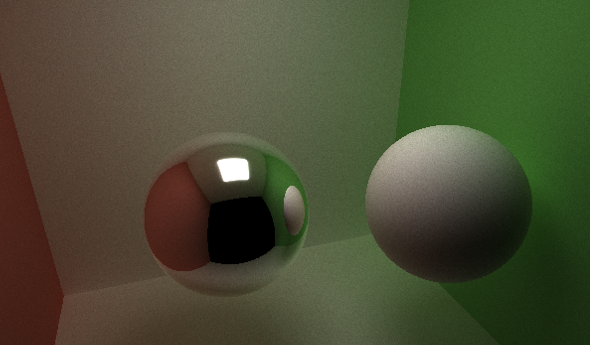

CUDA Path Tracer
================

**University of Pennsylvania, CIS 565: GPU Programming and Architecture, Project 3**

* Xitong Zheng
  * [LinkedIn](https://www.linkedin.com/in/xitong-zheng-5b6543205/), [Instagram](https://www.instagram.com/simonz_zheng/), etc.
* Tested on: Windows 11, i7-12700k 32GB, GTX 4090 24GB

## Brief Intro
This is a CUDA-based path tracer capable of rendering globally-illuminated images very quickly. \
Why cuda? Because cuda is natively good at paralling rays and shading. To utiliza more parallism and improve occupancy, paths/rays are further divided into small path segments and processed in parallel. More performance improvement tricks are included in later part.

### Details

#### Ideal Diffuse surfaces and Perfectly specular-reflective (mirrored) surfaces

#### Path continuation/termination using Stream Compaction

To avoid wasting time on paths that have already terminated, stream compaction is used to remove the terminated paths from the path pool. I use `thrust::stable_partition` to do this, which gives me an easy calculation of the still in-flight paths.

#### Sort path based on material type

Since path are randomly terminated for different reasons. Some hit light sources and other reach the maximum bounce limit. The memory access is not coalesced. To improve the performance, I sort the path based on the material type. This allows path rearrange in the blocks of materials and implys their status of keep bounceing or not. This should make the memory access pattern more coalesced and theoritally improve the performance.

#### Toggleable cache first bounce intersections
I cache the first bounce intersection for each path. This is because the first bounce intersection is the same for all the paths. So it is a waste of time to calculate it for each iteration.

#### Refraction with Frensel effects using Schlick's approximation

#### Anti-aliasing

With 4x anti-aliasing, the image is much smoother than the one without anti-aliasing. The image without anti-aliasing is shown below.

#### Depth of field
| depth of field with small aperture      | depth of field with big aperture      |
|:-------------------------------------------:|:-------------------------------------------:|
|  | |

#### Direct light

| With direct light      | Without direct light      |
|:-------------------------------------------:|:-------------------------------------------:|
|  | |

With direct light, the image is brighter than the one without direct light.

#### ObJ Mesh loading with bounding volume intersection culling

#### Open Image AI denoiser

The above two pictures are basically the same scene and you can easily find the outcome applied with open image AI denoiser is much clearear than the one without denoiser.

Here I use first hit intersection to act as the albedo and normal filter of the pixel.

#### Performance Analysis

Stream compaction vs Non-stream compaction

I use the gear scene to test the performance of stream compaction. 

- bounding box intersection culling
`#define BOUND_BOX 1` in the intersections.h to toggle the bounding box intersection culling. 
The result is shown below.

