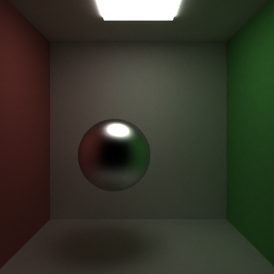

CUDA Path Tracer
================

**University of Pennsylvania, CIS 565: GPU Programming and Architecture, Project 3**

* Zhenzhong Tang
  * [LinkedIn](https://www.linkedin.com/in/zhenzhong-anthony-tang-82334a210), [Instagram](https://instagram.com/toytag12), [personal website](https://toytag.net/)
* Tested on: Windows 11 Pro 22H2, AMD EPYC 7V12 64-Core Processor (4 vCPU cores) @ 2.44GHz 28GiB, Tesla T4 16GiB (Azure)

---
## Overview

A path tracer is a rendering technique that simulates the behavior of light in a scene. It uses Monte Carlo method to estimate the radiance at each pixel of an image by tracing the path of light through the scene. The algorithm is iterative and parallel in nature, so it runs intuitively and fairly well on CUDA. And it is able to simulate many effects that are difficult with other rendering techniques, such as soft shadows, depth of field, caustics, ambient occlusion, and indirect lighting.

Stanford Bunny with Blue-tinted Glossy Material in Cornell Box, rendered in $2000 \times 2000$ resolution with $1000$ samples per pixel and $8$ light bounces.

Cow with Stainless Steel Material and Procedural Texture in Cornell Box, rendered in $2000 \times 2000$ resolution with $1000$ samples per pixel and $16$ light bounces.

## Visual Features

### Material System

Material system is adopted on the above rendering implementation from [glTF Specification](https://registry.khronos.org/glTF/specs/2.0/glTF-2.0.html#appendix-b-brdf-implementation).

- **Albedo**: The color of the material.
- **Metallic**: The ratio of diffuse and specular reflection. A value of $0$ means the material is dielectric, and a value of $1$ means the material is metal.
- **Roughness**: The roughness of the material. A value of $0$ means the material is perfectly smooth, and a value of $1$ means the material is pure diffuse reflection.
- **IOR**: The index of refraction of the material. A value of $1$ means the material is vacuum, and a value of $1.5$ is a good compromise for most opaque, dielectric materials.
- **Opacity**: The opacity of the material. A value of $0$ means the material is fully transparent, and a value of $1$ means the material is fully opaque.
- **Emittance**: The emittance of the material. A value of $0$ means the material is not emissive, and a value greater than $0$ means the material is emissive, controlling the brightness of the material.

Using the `metallic` and `roughness` parameter, the material can be either dielectric or metal, and its reflection model can be either diffuse or specular. In addition with multiple importance sampling, the path tracer is able to render imperfect specular materials and produce better roughness effect. Also, by controlling the `ior` and `opacity` of dielectrics, the material can produce glass-like refraction with fresnel effect.

|| Diffuse | Imperfect Specular | Pure Specular |
|-:| :----------: | :-----------: | :----------------: |
|**Dielectric**|  |  |  |
|**Metal**|  |  |  |
|**Glass**|  |  |  |

Use the material system, we can mimic many real-world materials. For example, we have the following materials like aluminum, titanium, stainless steel, and different glasses.

| More of Metal | More of Glass |
| :----: | :---: |
|  |  |

And many Suzanne

| Glass | Aluminum | Yellow Plastic | Stainless Steel |
| :----: | :---: | :---: | :---: |
|  |  |  |  |

All scenes rendered in $800 \times 800$ resolution with $2000$ spp and $8$ light bounces.

### Anti-Aliasing

Anti-aliasing can be achieved by jittering rays within a pixel. In the following example, the image is rendered in low resolution to exaggerate the effect.

| AA OFF | AA ON |
| :----: | :---: |
|  |  |

All scenes rendered in $200 \times 200$ (up-sampled to $800 \times 800$) resolution with $2000$ spp and $8$ light bounces.

### Physically-Based Depth-of-Field

Depth-of-field can be achieved by jittering rays within an aperture. In the following example, the aperture is modeled as a circle with a radius of $0.5$ and the focal length is $10$.

| DoF OFF | DoF ON |
| :-----: | :----: |
|  |  |

All scenes rendered in $800 \times 800$ resolution with $2000$ spp and $8$ light bounces.

### Mesh Loading

With the help of [tinyobjloader](https://github.com/syoyo/tinyobjloader) and [tinygltf](https://github.com/syoyo/tinygltf/) libraries, the path tracer is able to load `.obj` and `.gltf` files (partially). Thus, we can render more complex scenes.

### Procedural Textures

Procedural textures can be achieved by using the barycentric interpolated uv coordinate of the intersection point. Check out the following example.

| Gradient Mario | Checkerboard Mario |
| :-----: | :----: |
|  |  |

All scenes rendered in $800 \times 800$ resolution with $1000$ spp and $8$ light bounces.

### Open Image Denoise

[Open Image Denoise](https://www.openimagedenoise.org/) is a high-performance, high-quality denoising library for ray tracing. It is able to remove noise from rendered images without losing much details. Additional filters like albedo and normal map are added to the denoiser pre-filter to improve the quality of the denoised image. The following example shows the effect of the denoiser with $200$ samples per pixel, a relatively low sample rate.

| Denoiser OFF | Denoiser ON |
| :----------: | :---------: |
|  |  |

All scenes rendered in $800 \times 800$ resolution with $200$ spp and $8$ light bounces.

## Performance Features and Analysis

### Stream Compaction

### First Bounce Caching

### Material Sorting

### Bounding Volume Hierarchy

## References
