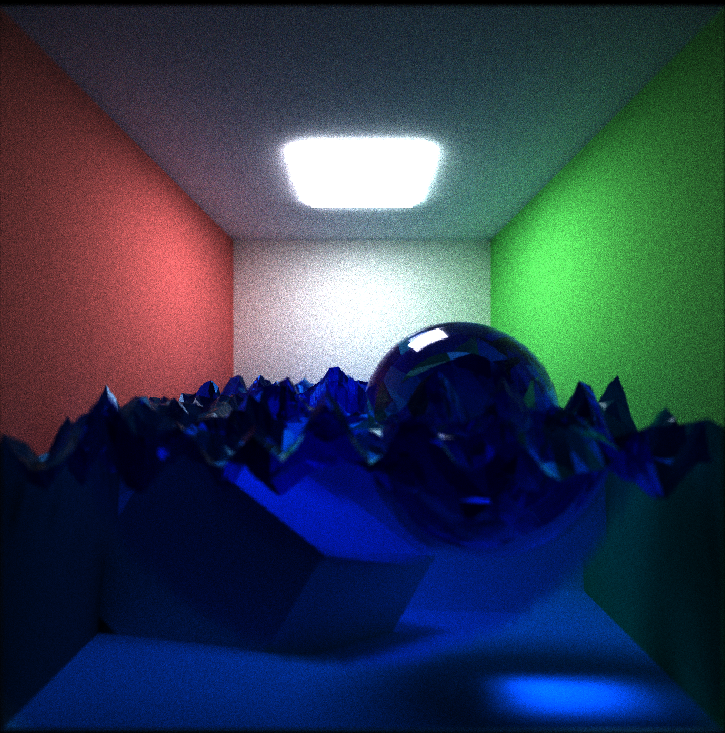
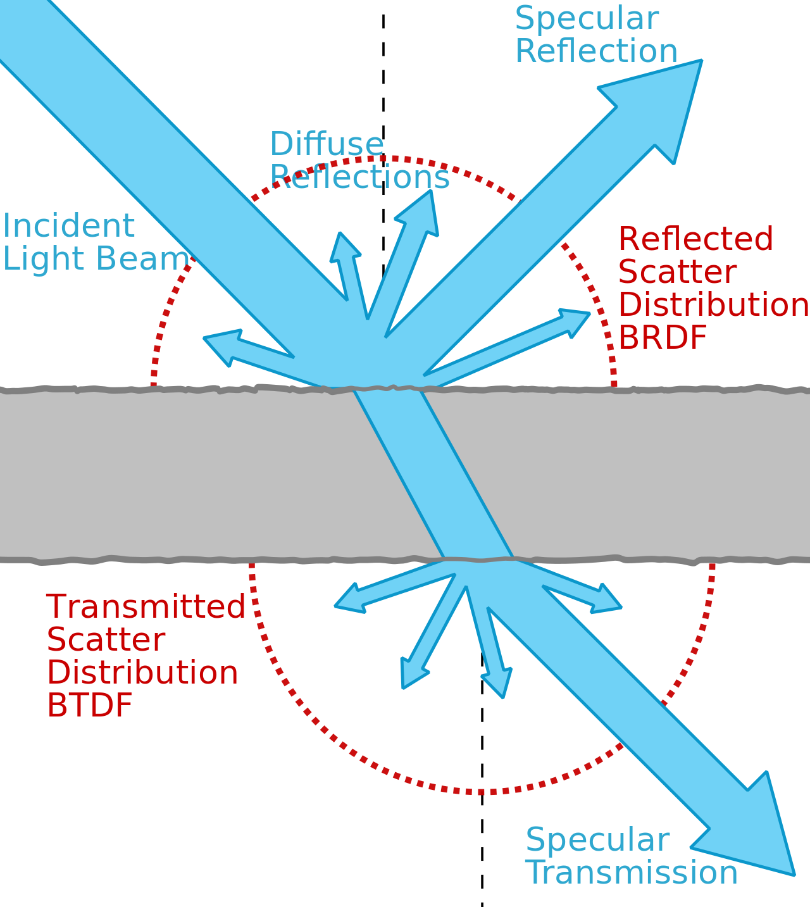

CUDA Path Tracer
================

**University of Pennsylvania, CIS 565: GPU Programming and Architecture, Project 3**

* Yinuo (Travis) Xie
  * [LinkedIn](https://www.linkedin.com/in/yinuotxie/)
* Tested on: Windows 10, 12th Gen Intel(R) Core(TM) i7-12700 @ 2.10 GHz, 16GB, NVIDIA GeForce RTX 3060 Ti (Personal Computer)

# CUDA-Path-Tracer

---

## Table of Contents

- [CUDA Path Tracer](#cuda-path-tracer)
- [CUDA-Path-Tracer](#cuda-path-tracer-1)
  - [Table of Contents](#table-of-contents)
  - [Overview](#overview)
  - [What is Path Tracing?](#what-is-path-tracing)
    - [How Does It Work?](#how-does-it-work)
    - [Understanding the Path Tracing Image](#understanding-the-path-tracing-image)
  - [Core Features](#core-features)
    - [🌟 BSDF Evaluation](#-bsdf-evaluation)
    - [🌟 Perfectly Specular-Reflective Surfaces](#-perfectly-specular-reflective-surfaces)
    - [🚀 Path Continuation/Termination](#-path-continuationtermination)
    - [🚀 Sorting by Material Type](#-sorting-by-material-type)
    - [🚀 Caching First Bounce Intersections](#-caching-first-bounce-intersections)
  - [Advanced Features](#advanced-features)
    - [🌟 Refraction and Imperfect Reflections](#-refraction-and-imperfect-reflections)
    - [🌟 Depth of Field](#-depth-of-field)
    - [🌟 Stratified Sampling](#-stratified-sampling)
    - [🌟 Mesh Loading](#-mesh-loading)
    - [🚀 BVH Acceleration](#-bvh-acceleration)
  - [Performance Analysis](#performance-analysis)
    - [🌟 Analysis of Sorting Material](#-analysis-of-sorting-material)
    - [🌟 Analysis of BVH Accelerator](#-analysis-of-bvh-accelerator)
  - [Bloopers](#bloopers)
    - [🌟 Over-Enthusiastic Rays on Light Source Encounters](#-over-enthusiastic-rays-on-light-source-encounters)
    - [🌟 Trials and Tribulations with BVH Construction](#-trials-and-tribulations-with-bvh-construction)
  - [References](#references)

---

## Overview
This project showcases a GPU-driven path tracer developed with CUDA. The tracer is equipped with a range of sophisticated features and optimizations, including refractive capabilities, imperfect reflections, and a BVH acceleration structure. These enhancements are geared towards achieving a balance between realism and optimal performance.

---

## What is Path Tracing?

Imagine you're in a dark room and you switch on a light bulb. The light from the bulb bounces around, reflecting off walls, objects, and even passing through transparent things like glass. Now, if we were to draw this scene, how would we capture how all this light interacts? That's where path tracing comes in!

---

### How Does It Work?

1. **Shooting Rays**: When we use path tracing, we're like photographers. Instead of light coming from a bulb and hitting our eyes, we imagine the opposite. We send out many "probes" or rays from our eyes (or the camera) and see where they go. Think of it like throwing a bunch of tiny ropes from your eyes and seeing what they touch.

2. **Bouncing Around**: These rays don't just stop when they hit something. They can bounce off objects (like how a ball bounces off a wall), go through transparent things, or get absorbed (like how a sponge soaks up water). Every time a ray bounces, it collects a bit of color or light.

3. **Gathering Information**: After bouncing a few times, these rays return to the camera, bringing with them all the colors and light they've picked up. The computer then uses this information to paint one pixel of the image.

4. **Repeating Millions of Times**: For an image, this process happens millions or billions of times. Each ray captures a tiny part of the scene, and together, they create the final picture.

Path tracing is like a detective for light. It figures out how light travels and interacts in a scene to create a picture. It's a way to draw pictures on a computer that look very close to real life. But, because it tries to be so accurate, it can take a lot of time and computer power to create just one image. So, while it's great for making super realistic pictures, it might be a bit slow for things like video games that need fast action. You can also check out this [video](https://www.youtube.com/watch?v=pW0twrqfJ8o) released by NVIDIA Game Developer for a more detailed explanation of path tracing.

(Image Credit: [Path Tracing](https://callistaenterprise.se/blogg/teknik/2022/01/05/go-opencl-pathtracer/))

---

### Understanding the Path Tracing Image

In the image provided, we can see a simplified representation of how path tracing works:

* **Camera**: This is the starting point for our "light detective". When creating an image, it's like our eye looking at the scene.

* **Image**: This grid represents the final picture we're trying to make. Each square (or pixel) on this grid will be painted based on the information the rays bring back to the camera.

* **View Ray**: The red line labeled 'View Ray' is a probe sent out from the camera to investigate the scene. It's like a scout that goes out to see what light and color it can find. When this ray hits the orange sphere (our scene object), it collects information about its color.

* **Light Source**: This is the source of light in our scene. Light rays come from this source, illuminating the scene.

* **Shadow Ray**: After the view ray hits the object, it sends out another probe (the blue line) towards the light source. This 'Shadow Ray' checks to see if the point on the object is in shadow or if it's directly lit. If something blocks the shadow ray before it reaches the light (like if there was another object in between), that spot on the orange sphere would be in shadow.

* **Scene Object**: This is an object in our scene that the view ray has hit. It can be anything from a ball, like in the image, to more complex things like trees, buildings, or people.

The combination of these rays and how they interact with the scene lets the computer decide what color each pixel on the image grid should be. So, after sending out millions of these rays and collecting their stories, we end up with a complete, realistic-looking picture!

---
## Core Features

Our path tracing project integrates core features designed to achieve lifelike renderings with optimal efficiency. Here's a detailed overview of each feature:

---
### 🌟 BSDF Evaluation

**Overview:**

(Image Credit: [Wikipedia](https://en.wikipedia.org/wiki/Bidirectional_scattering_distribution_function))
 
The BSDF (Bidirectional Scattering Distribution Function) evaluates how light interacts with surfaces. Different materials have unique reflection and refraction characteristics, and BSDF is integral to capturing these nuances.

* **Incident Light Beam**: Represents incoming light, usually from a primary source such as the sun.
  
* **Specular Reflection**: Direct reflection observed on smooth surfaces, characterized by the arrow bouncing upwards.
  
* **Reflected Scatter Distribution (BRDF)**: Depicts the scattered light on surfaces, especially rough or matte ones. The BRDF circle visualizes the dispersion of this light.
  
* **Transmitted Scatter Distribution (BTDF)**: Illustrates light transmission and its subsequent scattering through transparent or translucent materials.
  
* **Specular Transition**: Represents the direct transmission of light through the material, analogous to specular reflection but in transmission.

---
### 🌟 Perfectly Specular-Reflective Surfaces

**Overview:**

To emulate pristine mirror-like reflections, this feature ensures that surfaces within our rendered scenes can capture and depict their environment with an unparalleled degree of clarity.

---

### 🚀 Path Continuation/Termination

**Overview:**

Efficiency is paramount. While numerous rays are dispatched to elucidate the scene, it's crucial to determine the continuation or termination of each ray's path based on its contribution. Using `thrust::stable_partition`, we categorize rays into:

* **🟢 Active Rays**: Continuously contributing to the scene's illumination and color.
  
* **🔴 Terminated Rays**: Rays that have been determined to no longer make a significant contribution, and thus are removed from further computations.

**Analysis:**
The graph below demonstrates the decreasing number of paths as the number of bounces increases. So, by terminating paths that no longer contribute, we can significantly reduce the number of rays that need to be processed.

---

### 🚀 Sorting by Material Type

**Overview:**
 
Rays are organized based on the material they intersect, a crucial step for performance optimization in CUDA. When rays are sorted this way, threads that process rays intersecting similar materials can be batched together. This results in coherent memory access patterns, reducing divergence and ensuring that memory fetches from the global memory are efficient. In the realm of CUDA operations, memory access patterns play a pivotal role in determining the performance. Coherent memory accesses ensure that data fetched into the cache is used optimally by multiple threads, thus reducing memory bandwidth requirements and accelerating the overall rendering process.

---

### 🚀 Caching First Bounce Intersections

**Overview:**

Initial intersections between rays and objects are cached, a strategy that's especially beneficial since the first generated rays across frames are consistent. By storing these intersections, we sidestep redundant calculations for unchanged rays in subsequent frames or iterations. 

---
## Advanced Features

Beyond our foundational capabilities, our path tracing project incorporates a set of sophisticated features designed to further the realism and efficiency of our renderings. Delving into the specifics:

---
### 🌟 Refraction and Imperfect Reflections

**Overview:**  
This feature accurately depicts the behavior of light as it refracts through transparent objects and reflects off rough surfaces.

* **Fresnel Equations:** A pivotal aspect of this simulation is the use of the Fresnel equations. These equations determine the proportion of light that's reflected \( R \) versus refracted \( T \). Given by:
  
  \[ R(\theta) = R_0 + (1 - R_0)(1 - \cos(\theta))^5 \]
  
  Where \( R_0 \) is the reflectance at normal incidence and \( \theta \) is the angle of incidence. The refraction ratio \( T \) is then:

  \[ T = 1 - R \]

  This computed \( R \) subsequently informs the probabilistic decision between reflection and refraction, allowing for a realistic mix of both.

* **Roughness:** Another enhancement is the material-specific 'roughness' parameter. The roughness value, denoted as \( \alpha \), gauges the dispersion of the reflected ray. The reflection direction \( \mathbf{r} \) is perturbed based on \( \alpha \) using a microfacet model:

  \[ \mathbf{r} = \mathbf{r_0} \times (1 - \alpha^2) + \alpha^2 \times \text{random\_direction()} \]

  Here, \( \mathbf{r_0} \) is the perfect reflection direction. A higher \( \alpha \) induces greater perturbations, leading to "imperfect" or diffused reflections.

**Visual Demonstrations:**  
The first graph delineates the triad of light behaviors: diffuse, reflection, and refraction.

The subsequent visualization renders the identical scene, but with a roughness coefficient of 0.5. The nuanced reflections and refractions on the sphere, attributable to its roughness, are palpably discerned.

---
### 🌟 Depth of Field

**Overview:**  
Depth of field (DoF) is a renowned cinematographic and photographic effect, replicating the focus variations of a camera lens. It lends an additional layer of realism, making it invaluable for rendering scenes with prominent depth variations.

**Implementation:**  
Our path tracer emulates DoF through a technique akin to the "thin-lens" approximation. Here's how it's achieved:

1. **Lens Sampling:** For each camera ray, a random point on a lens (or aperture) of a given radius is sampled. This random sampling within the aperture circle can be represented mathematically as:

   \[ (u, v) = \text{radius} \times (\sqrt{\text{random1()}}, 2\pi \times \text{random2()}) \]

   Where \( (u, v) \) are the offsets within the lens circle, and `random1()` and `random2()` yield uniform random numbers between 0 and 1.

2. **Focal Point Calculation:** The focal distance determines the point in the scene where the rays converge, hence appearing sharp. Rays diverging from this focal point progressively blur, creating the DoF effect. Given a focal distance \( f \), and using the above offsets, the ray's direction is slightly perturbed to intersect the focal plane at the desired point.

3. **Ray Casting:** The modified ray, originating from the sampled point on the lens and passing through the calculated focal point, is cast into the scene. Rays converging at this focal point render objects sharply, while those diverging produce the characteristic blur.

**Visual Demonstration:**  
The image below showcases the application of DoF, accentuating the foreground object while rendering the background with a soft, defocused blur. The image on the left is rendered without DoF, while the image on the right is rendered with DoF. As the image shows, when the DoF is applied, the camera focuses on one object and other objects are blurred.

  
  

---
### 🌟 Stratified Sampling

**Overview:**  
Stratified sampling is a variance-reduction technique that aims to diminish noise in rendered images. By dividing the pixel into uniform grids and sampling each cell individually, we ensure that the samples are more evenly distributed, thereby reducing clustering and gaps between samples. In our implementation, the grid's dimension is determined by taking the square root of the number of samples per pixel, and then a random sample within each grid cell is taken. 

 \[ \mathbf{dim} = \sqrt{\mathbf{pixelcount}} \]

**Visual Demonstration:**  
The comparison below illustrates the efficacy of stratified sampling. While both images are rendered with similar sample counts, the one on the right—benefitting from stratified sampling—displays notably reduced noise. Pay particular attention to the regions circled in red; the improved clarity around object edges in the stratified image is evident.

---

### 🌟 Mesh Loading

**Overview:**  
To incorporate intricate geometries into our scenes, we've integrated the `tinyobjloader`, facilitating the loading of meshes along with their associated materials. Post-loading, meshes are triangulated, and the constituent vertices and triangles are systematically archived within a `Geom` structure. Concurrently, the materials undergo processing and alignment to the respective triangles in the scene.

**Visual Demonstration:**  
Below are scenes enriched with loaded meshes. The first image showcases a sports car rendered with 20 samples per pixel, and the subsequent one is a detailed head rendered with 100 samples per pixel. Given the extensive mesh details, fewer samples manifest as visible noise. Nonetheless, the fidelity of the mesh structures and their associated materials is evident.

---

### 🚀 BVH Acceleration

*Image Credit: [Jbikker's Blog](https://jacco.ompf2.com/2022/04/13/how-to-build-a-bvh-part-1-basics/)*

**Overview:**  
The Bounding Volume Hierarchy (BVH) is a tree-based data structure designed to optimize ray-primitive intersection tests. By spatially organizing scene primitives into hierarchical bounding volumes, the BVH allows for efficient culling of large portions of the scene, leading to substantially faster ray-tracing.

**Detailed Steps:**

1. **Scene Partitioning & BVH Node Creation:**  
   * Start by treating the entire scene as a single bounding volume.
   * Each node in the BVH represents a bounding volume containing a subset of the scene's primitives (triangles, in our case).
   * For the root node, this volume encompasses all the primitives.

2. **Surface Area Heuristic (SAH):**  
   * SAH is used to determine the optimal split for each bounding volume.
   * The heuristic evaluates the cost of splitting a set of primitives at a particular position.
   * The split that minimizes this cost, i.e., has the lowest SAH value, is chosen. This typically results in balanced partitions which minimize the expected cost of intersection tests.

3. **Bucketing for SAH:**  
   * To efficiently compute the SAH for various potential splits, the primitives are grouped into \( \sqrt{n} \) buckets.
   * For each bucket, compute the bounding volume and the number of primitives it contains.
   * The potential split positions lie between these buckets, and the SAH for each potential split is computed based on these bucket-bound volumes.

4. **Recursive BVH Construction:**  
   * After determining the best split using SAH, the current set of primitives is divided into two subsets.
   * The BVH is constructed recursively for these subsets, creating left and right child nodes.
   * This recursion continues until a termination condition is met, such as reaching a maximum tree depth or a node containing fewer than a threshold number of primitives.

5. **Tree Flattening:**  
   * Once the BVH is constructed, it's often beneficial to flatten the tree into a linear array structure for more efficient traversal on the GPU. This involves a depth-first traversal of the tree and storing nodes in a contiguous array.

6. **Ray Traversal & Intersection Tests:**  
   * When tracing a ray, the ray is tested against the bounding volumes in the BVH.
   * If a ray intersects a node's bounding volume, the ray must be tested against the child nodes.
   * If a ray does not intersect a node's bounding volume, the node's content and its descendants can be skipped.
   * Ultimately, this reduces the overall number of ray-primitive intersection tests, as large portions of the scene can be culled quickly based on these bounding volume tests.

For detailed information on BVH construction, check out PBRT's [BVH Construction](https://pbr-book.org/3ed-2018/Primitives_and_Intersection_Acceleration/Bounding_Volume_Hierarchies#:~:text=Bounding%20volume%20hierarchies%20(BVHs)%20are,a%20hierarchy%20of%20disjoint%20sets.) chapter.

## Performance Analysis

Post the meticulous integration of core and advanced features, I embarked on a comprehensive performance analysis, gauging the efficiency of our enhancements. Anticipating substantial performance uplifts, especially from accelerative techniques like material sorting and the BVH accelerator, we were met with unexpected results. The following graphics elucidate the performance metrics of our path tracer across varied configurations:

### 🌟 Analysis of Sorting Material

**Observations:**  
From the data presented, it's evident that material sorting offers some performance advantage in scenes dense with geometries (4908 Geoms). This suggests that the benefits of material sorting become more pronounced as scene complexity escalates. Conversely, in less intricate scenes, the computational expenditure associated with sorting seems to eclipse its performance benefits, leading to a minor drop in efficiency.

**Potential Reasons:**  

1. **Memory Coalescing in CUDA:**
    * Material sorting ideally results in rays intersecting with similar materials being processed in a grouped manner. This can lead to more coherent and sequential memory access patterns, especially in CUDA's parallel execution environment. In dense scenes, with a plethora of materials, this coalesced memory access can result in more cache hits and reduced memory latency, driving the performance improvements observed.
    * Conversely, in simpler scenes where there might already be a degree of inherent memory coherence, the benefits of coalesced access might be less pronounced, rendering the sorting operation's overhead more dominant.

2. **Overhead of Sorting:**
    * Sorting operations, depending on their algorithmic complexity and the data set size, can introduce a tangible computational overhead. In scenes with a limited number of geometries, this overhead might not be adequately compensated by the subsequent gains in memory access efficiency. As a result, the net performance might witness a slight downturn.
    * In contrast, for complex scenes laden with geometries, the one-time cost of sorting might be dwarfed by the prolonged benefits it offers throughout the ray-tracing process, explaining the observed performance boost.
  
### 🌟 Analysis of BVH Accelerator

**Observations:**  
The BVH accelerator, heralded for drastically optimizing ray-primitive intersection tests, surprisingly didn't exhibit a clear advantage in our tests. I suspect that there were some potential issues with my BVH implementation, which might have offset the performance gains, even though the scene rendered correctly.

**Potential Reasons:**  

1. **BVH Construction Overhead:** The time taken to construct the BVH, especially for complex scenes, might offset the time saved during ray intersection tests.
2. **Suboptimal BVH Parameters:** Factors like the chosen heuristic, tree depth, or leaf node size can significantly influence BVH performance. There's a possibility that our current BVH configuration isn't optimal for the given scenes.
3. **BVH Traversal Overhead:** The time taken to traverse the BVH and perform ray intersection tests might offset the time saved by culling large portions of the scene. This is especially true for scenes with a limited number of primitives, where the BVH traversal overhead might eclipse the time saved by culling.

---
## Bloopers

Every development journey has its share of pitfalls and surprises, and this project was no exception. The unpredicted outcomes—both entertaining and enlightening—paved the way for deeper understanding and course corrections. Below are some standout bloopers that graced our development journey:

---
### 🌟 Over-Enthusiastic Rays on Light Source Encounters

In my early endeavors to implement ray termination, I inadvertently overlooked the scenario where rays intersect with the light source. Consequently, instead of terminating, these rays zealously persisted in their scene traversals. This unceasing bouncing augmented the scene's luminance with each bounce, leading to an unusually radiant render.

---
### 🌟 Trials and Tribulations with BVH Construction

Crafting the BVH is a nuanced art, laden with intricacies. Even minute deviations—be it in determining the split positions or defining the bounding volumes—can cascade into pronounced anomalies. Below are some peculiar renders that emerged from these BVH construction missteps:

To navigate these construction challenges, one of our go-to debugging strategies entailed rendering the bounding volumes of the BVH nodes. This visual representation facilitated an intuitive understanding of the BVH layout, enabling us to swiftly spot and rectify anomalies (not implemented in the final submission).

---
## References

* [Physically Based Rendering](https://pbr-book.org/3ed-2018/contents)
* Mesh Loading: [tinyobjloader](https://github.com/tinyobjloader/tinyobjloader)
* OBJ Models: [McGuire Computer Graphics Archive](https://casual-effects.com/data/)
