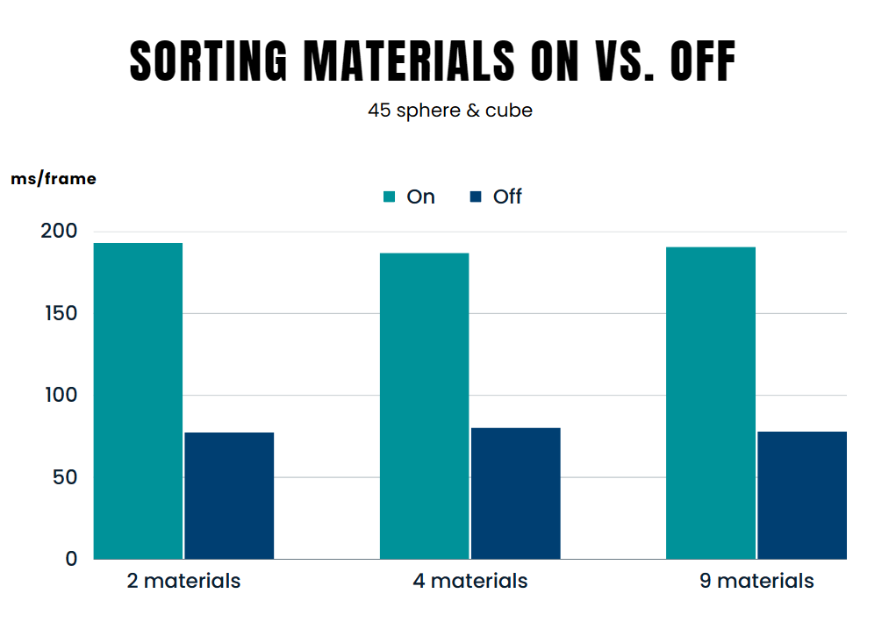
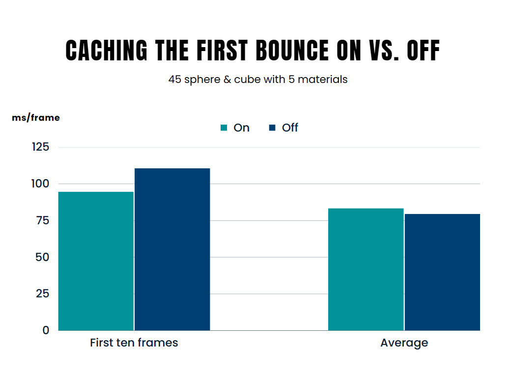
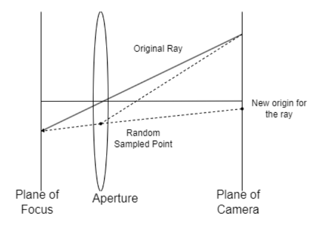
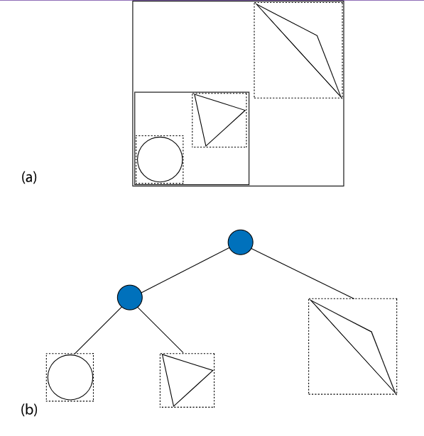
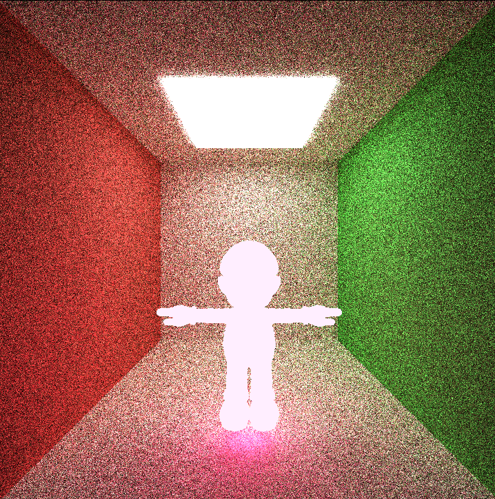
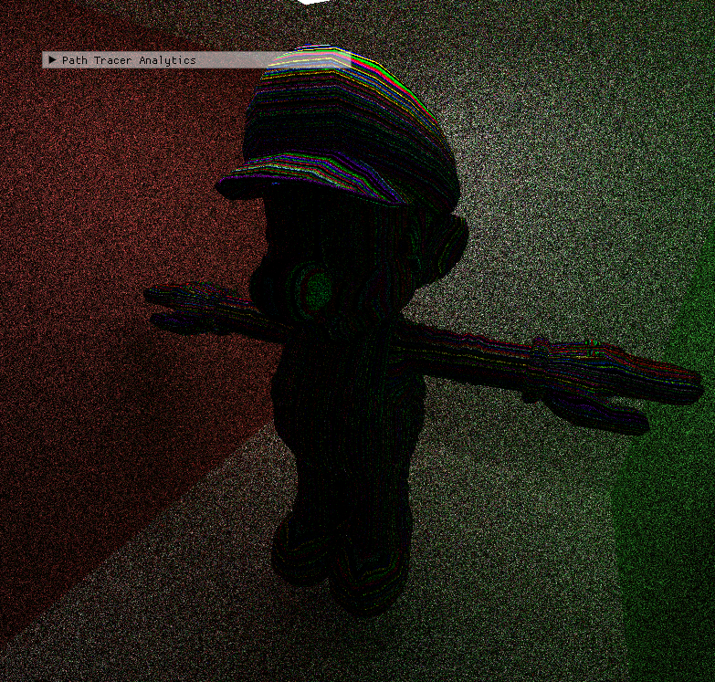
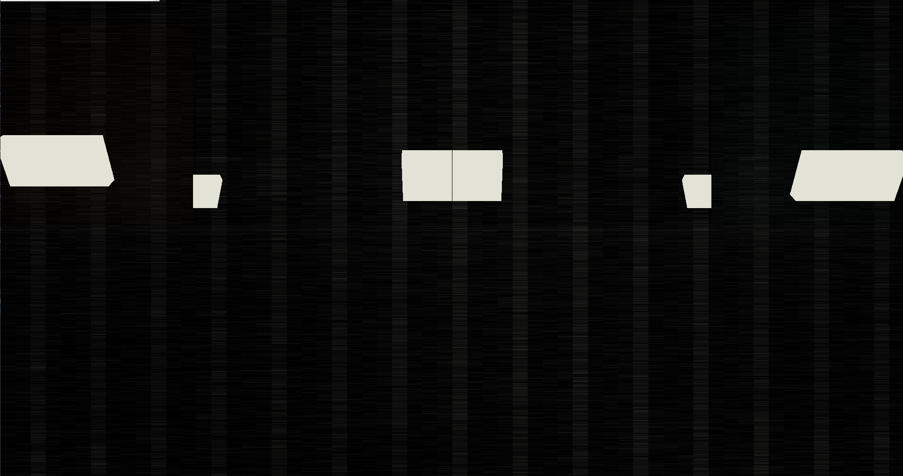

CUDA Path Tracer
================

**University of Pennsylvania, CIS 565: GPU Programming and Architecture, Project 3**

* Xiaoyue Ma
  * [LinkedIn](https://www.linkedin.com/in/xiaoyue-ma-6b268b193/)
* Tested on: Windows 10, i7-12700H @ 2.30 GHz 16GB, GTX3060 8GB

# Overview

### Rifle


### Reaper


### Squid Game


This project harnesses the power of CUDA-enabled GPU for rapid path tracing, generating high-quality, globally-lit visuals. Path tracing works by sending out rays from the camera. These rays, when they meet reflective or refractive surfaces, keep traveling until they intersect with a light source. Leveraging parallel processing, this method accurately determines the overall light intensity at a specific spot on an object, resulting in a lifelike representation. Incorporating CUDA guarantees peak performance in Physically-based Rendering.

# Table of Contents  
[Features](#features)   
[Results and Analysis](#result)   
[Bloopers](#bloopers)    
[Reference](#reference)

# <a name="features"> Features</a>
## Core features
* [Ideal Diffuse surfaces](#diffuse)

* [Perfectly specular-reflective](#perf-specular)

* [Imperfect specular-reflective](#imperf-specular)

* [Path termination with Stream Compaction](#stream_compaction_term)

* [Sorting rays by materials](#ray_sorting)

* [Caching the first bounce intersections](#cache)

## Additional features
* [Refraction](#refract)

* [Physically-based depth-of-field](#dof)

* [Stochastic Sampled Antialiasing](#ssaa)

* [Obj & Mesh Loading](#mesh)

* [Texture mapping & Procedural texture](#texture)

* [Direct lighting](#directlighting)

* [Subsurface scattering](#bssrdf)

* [Bounding Volume Hierarchy](#bvh)


# <a name="result">Results and Analysis</a>

## Shading Kernel with BSDF Evaluation

### <a name="diffuse">Ideal Diffuse</a>
   
The diffuse BSDF provides a surface with a matte appearance. It uses cosine-weighted sampling at the points where rays intersect the surface to decide the direction of subsequent rays and then evaluates these rays as they emanate from the surface.


### <a name="perf_specular"> Perfectly Specular Reflective</a>   

A perfectly specular surface reflects rays at the same angle as they arrive, imparting a mirror-like appearance to the surface. The function 'glm::reflect' is utilized to produce this perfectly reflected ray. 


### <a name="imperf-specular">Imperfect Specular Reflective</a>   

In path tracing, both perfect and imperfect specular surfaces are simulated using probability distributions from [GPU Gems 3, Chapter 20](https://developer.nvidia.com/gpugems/gpugems3/part-iii-rendering/chapter-20-gpu-based-importance-sampling). Imperfect surfaces blend perfect specular and diffuse reflections for a more natural metallic look.

|Perfect Specular|IOR 0.3|IOR 0.5|
|---|---|---|
| | |

## <a name="stream_compaction_term">Path Termination by Stream Compaction</a>
The following code outlines path termination via stream compaction. The approach involves utilizing the 'ray terminated' function to identify and mark rays that have ceased bouncing. By employing the stream compaction algorithm, we can segregate active from terminated rays, enhancing performance through improved thread locality. We have analyzed the performance in [Stream-Compaction-Project](https://github.com/CaballoMa/Project2-Stream-Compaction).

```
#if STREAM_COMPACTION
	PathSegment* path_end = thrust::stable_partition(thrust::device, dev_paths, dev_paths + num_paths, isPathCompleted());
	num_paths = path_end - dev_paths;
	iterationComplete = (num_paths == 0);
#endif

struct isPathCompleted
{
    __host__ __device__ bool operator()(const PathSegment& pathSegment) {
    	return pathSegment.remainingBounces > 0;
    }
};
```


## <a name="ray_sorting">Sorting Rays</a>
When rays strike diverse materials, their BSDF computations differ, causing some rays to conclude swiftly and others to linger. This results in asynchronous thread completions. To optimize this, radix sort can categorize rays based on material type. By clustering rays affecting similar materials in memory, we enhance efficiency by rapidly ending idle warps and reallocating them.

```
#if SORT_MATERIAL
	thrust::sort_by_key(thrust::device, dev_intersections, dev_intersections + num_paths, dev_paths, dev_materialIds());
#endif

struct dev_materialIds
{
    __host__ __device__ bool operator()(const ShadeableIntersection& intersect1, const ShadeableIntersection& intersect2)
    {
    	return intersect1.materialId < intersect2.materialId;
    }
};

```
### Performance Analysis - Sorting Materials On vs. Off   
I displayed 45 spheres and cubes within the scene and applied 2, 4, and 8 different materials to them for a side-by-side comparison. The data from the figure indicates that enabling material sorting doesn't enhance performance. I attribute this to two factors: firstly, the computation speed for coloring these materials is relatively similar; and secondly, the quantity of objects and materials in the scene might be insufficient, causing the sorting process itself to consume a significant portion of the performance. 

<p align="center">
  
</p> 

## <a name="cache">Caching the First Bounce Intersections   </a>
In the path tracer, multiple iterations are conducted to achieve the final result. Recognizing that without anti-aliasing, the initial bounces across iterations remain consistent, I've implemented a caching mechanism. By storing the first bounce intersections during the initial iteration, we can bypass generating them in subsequent rounds. This optimization, while only yielding minor performance enhancements according to my tests, streamlines the process as each ray consistently originates from the same pixel location.

```
#if	CACHE_FIRST_BOUNCE && ! ANTI_ALIASING
	if (iter > 1) {
		cudaMemcpy(dev_intersections, dev_cache_intersections, pixelcount * sizeof(ShadeableIntersection), cudaMemcpyDeviceToDevice);
	}
		
#endif
	computeIntersections << <numblocksPathSegmentTracing, blockSize1d >> > (
		depth
		, num_paths
		, dev_paths
		, dev_geoms
		, hst_scene->geoms.size()
		, dev_intersections
		, dev_triangles
		, dev_bvh_nodes
		);

#if CACHE_FIRST_BOUNCE && ! ANTI_ALIASING
	if (iter == 1)
	{
		cudaMemcpy(dev_cache_intersections, dev_intersections,
			pixelcount * sizeof(ShadeableIntersection), cudaMemcpyDeviceToDevice);
	}
#endif

```

### Performance Analysis - Caching the First Bounce On vs. Off  
 In the initial **ten** frames of the rendering process, enabling **Caching the First Bounce** considerably improves rendering speed. However, when **Caching the First Bounce** is activated towards the end, the system has to verify if **iter** exceeds **1**, which slightly reduces the speed compared to when it's not activated.

<p align="center">
  
</p> 

## <a name="refract">Refraction</a>
The images utilize Schlick's approximation to achieve refraction effects. The results incorporate the function glm::refract, based on Snell's law, to determine the direction of the refracted ray.  
 
|IOR 1.33|IOR 1.77|IOR 2.42|
|---|---|---|
| | |

## <a name="dof">Depth of Field</a>
In path tracing, Depth of Field is achieved by jittering rays within an aperture, mirroring the real-world function of a lens. This introduces noise to rays that strike objects at the focal length, resulting in a blurry effect. According to [PBRT 6.2.3](https://pbr-book.org/3ed-2018/Camera_Models/Projective_Camera_Models): 
<p align="center">
  
</p> 

real-world lenses are disk-shaped, causing rays to focus at a specific distance based on the lens radius and focal distance. The thin lens approximation used here omits lens curvature or thickness. To replicate this effect, a point within a disk is randomly selected as the ray origin for each generated sample ray.


## <a name="ssaa">Stochastic Sampled Anti-aliasing</a>
Stochastic sampled anti-aliasing, implemented through jittering initial rays at the first bounce of each iteration, aims to reduce aliasing by averaging pixel colors from surrounding areas. This technique disperses high frequencies into low frequencies, which, given the human eye's sensitivity to low frequencies, creates the perception of reduced aliasing. While this method enhances image quality, it does compromise the efficiency of first bounce caching since ray directions vary each iteration. Essentially, anti-aliasing divides a pixel into multiple sample points, calculates their colors, and then assigns the pixel the average color, using Stochastic Sampling to determine the sample locations.

**Apperantly, the image with Antialiasing is better:** 

|Without Antialiasing| With Antialiasing|
|---|--|
| | | 

## <a name="mesh">Obj & Mesh Loading</a>
Utilizing the [tinyObjLoader](https://github.com/tinyobjloader/tinyobjloader), it parses the .obj file's data to assemble scene triangles using vertex, face, normal, and texture information. Before rendering the mesh through ray-triangle intersections, it first performs bounding volume intersection culling by examining rays against a volume encompassing the entire mesh.     
<p align="center">
  
</p> 

<p align="center">
  
</p> 

## <a name="texture">Texture mapping & Procedural texture </a>


My pathtracer efficiently loads textures, applying them to the mesh using the specified UV coordinates. I've also incorporated a rudimentary procedural texture to gauge performance differences, but the variations between the two seem negligible (Cuz they generate color on CPU side quickly, so I dont think they are different...).

<p align="center">
  
</p> 

## <a name="directlighting">Direct Lighting</a>
In path tracing, Direct Lighting(fake) directs the final ray towards a random point on a random light source, brightening the image and speeding up convergence. By recording intersections during bounces, the last or penultimate ray targets a previously noted point on the light source, optimizing light intensity information.

|Without the Direct Light|Direct Light in the last bounce|Direct Light in penultimate bounce|
|---|---|---|
| | |

## <a name="bssrdf">Subsurface scattering </a>

Incorporating principles from [PBRT 11.6](https://pbr-book.org/3ed-2018/Volume_Scattering/The_BSSRDF), my pathtracer adeptly handles subsurface scattering. Upon detecting materials with subsurface attributes, it initializes a BSSRDF model. It differentiates whether a ray is inside or outside an object based on its alignment with the surface normal. For rays inside, it calculates Fresnel reflectance to decide between single or multiple scattering, updating the ray's color accordingly. Rays outside are refracted and their colors adjusted based on the BSSRDF's single scattering function. The system then decrements the ray's remaining bounces, effectively simulating light's intricate interactions within translucent materials.

|BSSRDF without Texture|BSSRDF with Texture|
|---|---|
|||


## <a name="bvh">Bounding Volume Hierarchy </a>

In path tracing, accurately determining attributes like surface normal, and ray's distance necessitates intersection with the scene's geometry. While basic engines might test intersections with every scene primitive, this becomes inefficient with detailed meshes.

To enhance efficiency, the Bounding Volume Hierarchy (BVH) is used. This structure, formed of Axis Aligned Bounding Boxes (AABBs), simplifies ray-scene intersections. Rather than rays intersecting each triangle, they engage with BVH nodes. Only after a parent node registers a hit does its child node undergo evaluation. This reduces the costly triangle intersection tests to only when an AABB in a leaf node is hit.

For my BVH node division, I adopted an approach similar to PBRT's: splitting based on the triangle centroid extent within the node. Shifting from CPU to GPU required the tree to be stored as an array in a depth-first manner for efficient memory and processing. Traversal on the GPU was iterative using a stack, assessing nodes for intersections and evaluating leaf nodes directly.

<p align="center">
  
</p> 

I built my BVH leveraging insights from [Jacco's Blog](https://jacco.ompf2.com/2022/04/13/how-to-build-a-bvh-part-1-basics/). However, the current BVH iteration doesn't necessarily hasten intersection calculations. While visualization confirms the BVH's structural accuracy (but the level is too high!!!), there's room for improvements, such as tree depth optimization and memory management for larger models.

<p align="center">
  
</p> 

I used the spatial median split. This approach can sometimes result in very uneven segmentation, so the depth of the BVH can be much deeper than expected. Consider an extreme case where the centroid of all triangles is assumed to be on the same side of some axis, so that each partition will place only one triangle in one child and all the other triangles in another child. This results in a very large depth of BVH. Without intervention, the program may get deep BVH.

# <a name="bloopers">Bloopers</a>
### Emmmmmmm  
    

### Ooops   
   

### what is it?
   


# <a name="reference">Refrence</a>
*  [GPU Gems 3, Chapter 20 Imperfect specular surfaces](https://developer.nvidia.com/gpugems/gpugems3/part-iii-rendering/chapter-20-gpu-based-importance-sampling)
* [PBRT 6.2.3 DOF](https://pbr-book.org/3ed-2018/Camera_Models/Projective_Camera_Models) 
* [tinyObjLoader](https://github.com/tinyobjloader/tinyobjloader)  
* [PBRT 11.6 BSSRDF](https://pbr-book.org/3ed-2018/Volume_Scattering/The_BSSRDF)  
* [BVH Build](https://jacco.ompf2.com/2022/04/13/how-to-build-a-bvh-part-1-basics/)
