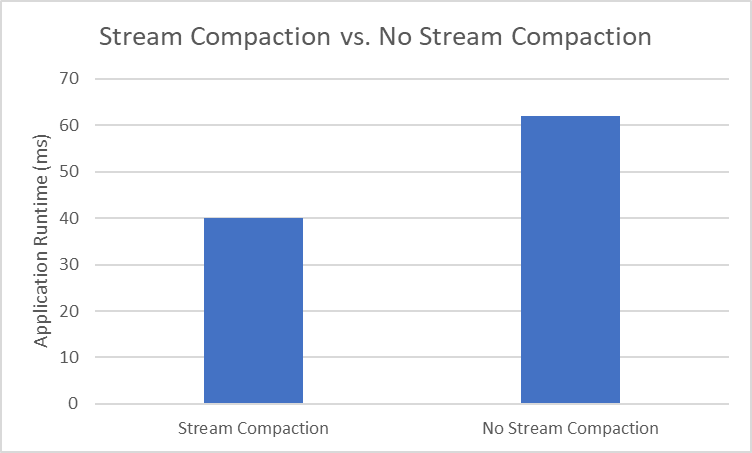

CUDA Path Tracer
================

* Linda Zhu
    * [LinkedIn](https://www.linkedin.com/in/lindadaism/)
* Tested on: Windows 11, i7-12800H @ 2.40GHz 16GB, NVIDIA GeForce RTX 3070 Ti (Personal Laptop)

## Overview

Welcome to the GPU Path Tracer project, a CUDA-based implementation focusing on efficient ray tracing and rendering. 

Built upon fundamental concepts from Physically-based Rendering (PBR), this path tracer integrates with glTF/glb/OBJ files for mesh loading and materials. The essence of this project lies in simulating light physics, enabling effects such as soft shadows, caustics, motion blur, and depth-of-field. 

Leveraging the CUDA API from NVIDIA, we efficiently parallelize CPU-bound tasks, significantly reducing rendering time and enhancing the realism of rendered scenes.This endeavor extends our understanding of CUDA kernel functions, memory coalescence, and acceleration spatial data structures. To achieve a high-quality, low-noise final output, we perform 5000 path traces with a maximum of 8 bounces for each call, optimizing the convergence of results.

## Table of Contents
* [Highlights](#scenes)
	* [Cyberpunk Animal Kingdom](#zoo)
	* [English Tearoom](#tearoom)
* [Path Tracer Basics](#path-tracer-basics)

* [Visual Features](#visual-features)
	* [Material Shading](#material-shading)
	* [Stochastic Sampled Anti-Aliasing](#anti-aliasing)
	* [Motion Blur](#motion-blur)
	* [Runtime Object Movement](#motion)
	* [Physically-Based Depth-of-Field](#dof)
	* [Arbitrary Mesh Loading (glTF, GLB, OBJ)](#mesh-loading)

* [Performance Improvements](#performance)
	* [Path Termination with Stream Compaction](#stream-compaction)
    * [Material Based Sorting](#material-sorting)
    * [First Bounce Ray Caching](#first-bounce-caching)
	* [Bounding Box Culling for Mesh Loaders](#mesh-bb-culling)
	* [Acceleration Structure: Bounding Volumn Hierarchy](#bvh)

* [Other Scenes & Bloopers!](#bloopers)
* [Building Instructions](#installation)
* [References](#references)

## <a name="path-tracer-basics">Path Tracer Basics</a>
Path tracing is a rendering algorithm that emulates the behavior of light as it interacts and propagates through a scene, mirroring real-world light dynamics. In a path-traced image, the scene encompasses comprehensive topological data of all objects within the image. Each pixel in the image is rendered by calculating the incident light on that pixel's corresponding object, considering the object's material color and properties. Consequently, the resulting image adheres to the physical principles governing light in reality, yielding a highly realistic visual representation.

The first diagram below shows the three fundamental ways light translate in the scene. Light may bounce uniformly in a hemisphere around the point of intersection (Diffuse) or it may only bounce in a perfectly reflective direction (Pure Specular). As the light bounces around in the scene, it picks up color from the material. 

There is a fundamental difference between the path tracing and real-world light bounce: the light in path tracing starts from the eye, usually placed with the camera, and tries to reach the light source (middle figure below), while in real-world the light comes from the light source to the eye (right figure below). Therefore, path tracing is also called "backward tracing".

  
  
  

*Left: [Bidirectional Scattering Distribution Functions (BSDF)](https://en.wikipedia.org/wiki/Bidirectional_scattering_distribution_function), Middle: How Light Bounces in a Path Tracer, Right: How Light Bounces in Real-world*

Implementation-wise, all the observed light behavior above translates into the ultimate **Light Transport Equation**:

Given a point `x` on a surface, the output radiance `Lo`, to direction `ωo` is the self emittance `Le` plus an integral of the product of:
- The incident radiance `Li`, the BSDF `f`, and the cosine term `cosθ`

The integration takes all possible incident directions `ωi` into account, over an entire domain of sphere space `S`.

## <a name="visual-features">Visual Features</a>
### <a name="material-shading">Shading Kernel with BSDF Evaluations</a>
We evaluate Bidirectional Scattering Distribution Function (BSDF) for various materials, including diffuse, perfectly reflective, refractive, glass, plastic and lambertian transmissive. BSDF describes the probability that light incoming along a ray `wi` will leave along a direction `wo`. The output `wi` is the new direction for the ray to bounce.

The table below shows a variation of sphere's materials in comparison with the white diffuse material of the box.

Reflective |  Refractive |  Glass |  Plastic  |  Transmissive (Experiment)
--- | --- | --- | --- | ---
 |  |  |  | 

- Diffuse BRDF: For ideal diffuse surfaces, light is dispersed equally in all directions within the hemisphere centered about the normal. We use random sampling (cosine-weighted scatter function) to choose the ray direction in `calculateRandomDirectionInHemisphere`.
- Specular BRDF: For perfectly specular reflective surfaces, there's ONLY one possible direction for the outgoing ray. This `wi` is determined using `glm::reflect`, which reflects `wo` about the surface normal. This yields a mirror-like reflectance model.
- Specular BTDF: For refractive surfaces, there's also ONLY one possible direction for the outgoing ray, but in the opposite hemisphere of the normal.According to Snell's Law, we first assess the refraction eligibility by validating the condition `ior * sin_theta < 1.f`, where `ior` is the specified index of refraction and `theta` the angle of incident light. we then use `glm::refract` to compute the scattered ray. At some points of interesection, this may yield total internal reflection, at which point the ray should be reflected outwards similar to the Specular BRDF.
- Glass BxDF: Glass material combines both Specular BRDF and Specular BTDF. The proportion of reflection versus refraction is controlled by the Fresnel Dielectrics term. This term governs a higher reflection component when the surface normal is nearly perpendicular to the viewing direction, and conversely, a greater refraction component when the surface normal aligns more closely with the viewing direction. 
- Plastic BxDF: Similar to glass, plastic material combines two BSDFs, Specular BRDF and Diffuse BRDF. Based on Fresnel evaluation, it generates a partially rough and partially mirror-like surface.
- Diffuse BTDF (need fix): Some experiment of lambertian transmission model. Results didn't turn out great. In theory, this is virtually identical to a diffuse BRDF model, but the hemisphere in which rays are sampled is on the other side of the surface normal compared to the hemisphere of diffuse reflection.

### <a name="anti-aliasing">Stochastic Sampled Anti-Aliasing</a>
Ray tracing is a point sampling process; the rays used to assess light intensities are infinitely thin. However, each pixel of a rendered image has a finite width. Ray tracing in its basic form overcomes this incompatibility by tracing a single primary ray through the centre of each pixel and using the color of that ray as the color of the entire pixel. Since the resultant color of each pixel is based upon one infinitely small sample taken within the centre of each pixel, and because pixels occur at regular intervals, frequency based aliasing problems often arise.

Stochastic sampling anti-aliases scenes through the use of a special sample distribution which replaces most aliased image artifacts with noise of the correct average intensity. In practice, we provide a small, random jitter in the x and y directions of a pixel grid cell, modifying the ray direction (see figure below). Due to this jitter, the rays hit different nearby location in each of the cells and the color values get averaged out for the target pixel.

Results:

No Anti-Aliasing | Anti-Aliasing
--- | ---
 | 
  |  

### <a name="motion-blur">Motion Blur</a>
Although there are many approaches to achieve motion blur in a path tracer, the general idea is to average samples at different times in the animation. In my implementation, I choose to jitter the ray origin every frame by some random degree stepping towards the destination based on an input velocity vector before I perform `computeIntersections`. 

`ray.origin += randomNum * geometry.velocity;`

Here randomness is determined by a noise function of range [-1, 1]. Since each jitter step is not continuously increasing or decreasing, i.e. the sampled ray can be anywhere in between two destinations: one unit down along the velocity vector from the origin and one unit down along the opposite direciton of the velocity from the origin, we are basically oscillating around the object's original position. Throughout time this yields an illusion of object travelling in space, but really the object is moving back and force instead of in one direction. I think this is a work-around to hack motion blur given that we don't need to directly handle timeframe. In the next section I will introduce another method that actually simulates real object motion (the 3rd image in the table below)to create the blurry effect.

In this example, the sphere has a velocity of [1, 1, 0] and box [-4, 0, 1].

Static Scene | Motion Blur | Runtime Movement
--- | --- | ---
 |  | 

### <a name="motion">Runtime Object Movement</a>
For the runtime object movement, we update the transformation of the object at every iteration by some time step: 

`timeStep = 1 / (scene->state.iterations * 0.1f)`

This time step means how long we want our geometry to arrive at the next intermediate position before we run out of iterations. At the updated position the pixel is shaded again based on the object's material while mixing with its previous color, yielding an effect of motion blur. As we can see from the third image above, the objects are moving continuously in one correct direction until they reach the final destination. 

One drawback of this method is that it causes a significant performance drop if there is a large number of dynamic objects in the scene. This is because in the main `pathtrace` kernel, we are constantly performing naive matrix/vector multiplications, calling `glm::inverse` and `glm::inverseTranspose`, and using `cudaMemcpy` to transfer updated geometry transformation to the GPU. These are all cost-heavy operations so I do not recommend enable this feature for busy simulations. (TODO performance analysis)

Nevertheless, the motion blur effect is a fun feature to work on, and gives you a lot of surprises as you will later see in the bloopers.

### <a name="dof">Physically-Based Depth-of-Field</a>
To achieve the thin lens effect and depth of field (DOF), two key parameters are essential: `FOCAL_DISTANCE` and `APERTURE`. `FOCAL_DISTANCE` determines the focus point's distance where objects appear sharp. `APERTURE` serves as a measure of the desired blur for out-of-focus elements. In terms of implementation, first we identify the target we want to focus on, aka the focal point, in the scene based on `FOCAL_DISTANCE`. Next, we introduce blur to the remaining scene by adjusting the ray's origin and recalculating its direction, originating from the new point of origin and aligning with the focal point. This technique simulates the desired depth of field and a realistic thin lens effect.

Aperture = 0.8 for varying focal length below:
No DOF | Focal Dist  = 10.0 | Focal Dist = 8.0 | Focal Dist = 6.0
--- | --- | --- | ---
 |  |  |   

### <a name="mesh-loading">Arbitrary Mesh Loading</a>
In order to render more complex as well as visually interesting scenes, we need to support loading artibrary mesh robustly. I used both the [TinyglTF](https://github.com/syoyo/tinygltf/) and the [tinyobjloader](https://github.com/tinyobjloader/tinyobjloader) libraries to parse raw data and load custom mesh in glTF, GLB and OBJ formats. Since neither `tinygltf` and `tinyobj` built-in classes are GPU-compatible, I defined additional `struct`s to store the geometry's triangulation information, including vertex positions and normals. Furthermore, to simplify the process of transmitting nested struct arrays to the GPU, we opted to condense the vertex data of each mesh into a single extensive buffer housing all the necessary data for every mesh. The Mesh struct itself solely retains the index offset for each set of data. This approach mirrors GLTF/OpenGL's definition of Vertex Buffer Objects (VBOs), presenting an avenue to streamline the GLTF/OBJ files to GPU translation process.

Classic sample models in the realm of Computer Graphics:

Utah Teapot | Stanford Bunny | Standford Dragon | (CG@Penn) Mario
--- | --- | --- | ---
 |  |  |   

## <a name="performance">Performance Analysis</a>
We use the default scene without anti-aliasing, stream compaction, first ray caching and material sorting, as the benchmark to compare with the optimizations below.

### <a name="stream-compaction">Stream Compaction</a>
In a path tracer, rays are traced through the scene to simulate light interactions. However, once a ray's path is terminated (e.g., it hits a light source or reaches a maximum number of bounces), there's no need to continue processing that ray. Stream compaction involves removing these terminated rays from further computations, thus avoiding unnecessary operations and associated memory accesses. In practice, we use the `thrust::partition` kernel to partition paths based on completion. This technique is crucial for efficiency and performance optimization in GPU programming and leverages key GPU architecture concepts. Below are some of the advantages:

1. Better Resource Utilization:
Stream compaction helps optimize memory and computation resources on the GPU. By eliminating inactive rays (terminated or absorbed), we free up valuable memory and processing cycles for active rays, improving overall utilization.

2. Warp Efficiency and Divergence Reduction:
In GPU architecture, threads are organized into warps, which execute instructions in parallel. When some threads terminate early, they no longer contribute to the computation, reducing the likelihood of warp divergence. Stream compaction helps maintain a cohesive and synchronized execution path, allowing all threads remain engaged in meaningful work.

3. Faster Computation and Convergence:
By removing inactive rays, we reduce unnecessary calculations, enabling faster traversal through the rendering process. Stream compaction accelerates convergence by focusing computational resources on active rays, converging to a noise-free, accurate rendering output more efficiently.

*Figure 1. Stream Compaction Performance, Unterminated Rays After Each Bounce for One Iteration*

*Figure 2. Stream Compaction Performance, Average Execution Time with/without Stream Compaction*

This gives noticeable performance gain as less paths have to be processed by the kernel after each bounce. 

### <a name="material-sorting">Material Sorting</a>
### <a name="first-bounce-caching">First Bounce Ray Caching</a>
### <a name="bvh">Bounding Volumn Hierarchy</a>

## <a name="bloopers">Other Scenes & Bloopers!</a>
Time step set too big so the sphere quickly flew out of the box.

## <a name="installation">Building Instructions</a>
All the `macro`s are defined in `utilities.h` where you can toggle the corresponding features. The variable names should be quite self-explanatory given the descriptive comments. Any additional heads-up in terms of running the project is listed below:

1. To render basic sphere & cube geometry, disable both BB culling and BVH.

## <a name="references">References</a>
* Assets
    * [Common 3D Test Models](https://github.com/alecjacobson/common-3d-test-models/tree/master)
    * [glTF Sample Models](https://github.com/KhronosGroup/glTF-Sample-Models/tree/master/2.0)
    * [CesiumGS SampleData](https://github.com/CesiumGS/cesium/tree/master/Apps/SampleData/models)
* Implementations
    * Material Shading: [BSDFs](https://pbr-book.org/3ed-2018/Materials/BSDFs#BSDF), [Reflective Models](https://pbr-book.org/3ed-2018/Reflection_Models), [GPU Gems 3, Chapter 20](https://developer.nvidia.com/gpugems/gpugems3/part-iii-rendering/chapter-20-gpu-based-importance-sampling)
    * Anti-Aliasing: [Paul Bourke's Raytracing Notes](https://paulbourke.net/miscellaneous/raytracing/#:~:text=Stochastic%20Sampling&text=The%20method%20antialiases%20scenes%20through,a%20preset%20number%20of%20cells.)
    * Object Motion: [Time Interval Ray Tracing for Motion Blur](http://www.cemyuksel.com/research/papers/time_interval_ray_tracing_for_motion_blur-high.pdf)
    * Camera Lens Effect: [The Thin Lens Model and Depth of Field](https://www.pbr-book.org/3ed-2018/Camera_Models/Projective_Camera_Models#TheThinLensModelandDepthofField)
    * Mesh Loading: [tinygltf](https://github.com/syoyo/tinygltf/), [glTF-Tutorials](https://github.com/KhronosGroup/glTF-Tutorials/), [tinyobjloader](https://github.com/tinyobjloader/tinyobjloader), ChatGPT :)
    * Steam Compaction: [GPU Gems 3, Chapter 39](https://developer.nvidia.com/gpugems/gpugems3/part-vi-gpu-computing/chapter-39-parallel-prefix-sum-scan-cuda)
    * Bounding Volumn Hierarchy: [How to Build a BVH - Part 1](https://jacco.ompf2.com/2022/04/13/how-to-build-a-bvh-part-1-basics/), [How to Build a BVH - Part 2](https://jacco.ompf2.com/2022/04/18/how-to-build-a-bvh-part-2-faster-rays/), [The Surface Area Heuristic](https://medium.com/@bromanz/how-to-create-awesome-accelerators-the-surface-area-heuristic-e14b5dec6160), [Efficient Ways to Compute Barycentric Coordinates](https://gamedev.stackexchange.com/questions/23743/whats-the-most-efficient-way-to-find-barycentric-coordinates/23745#23745)

