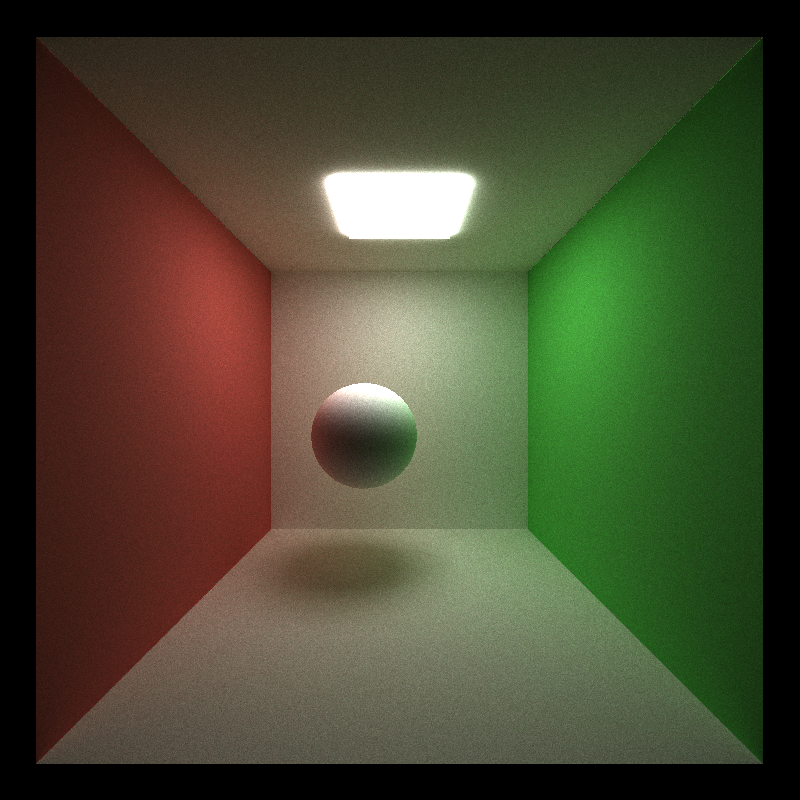
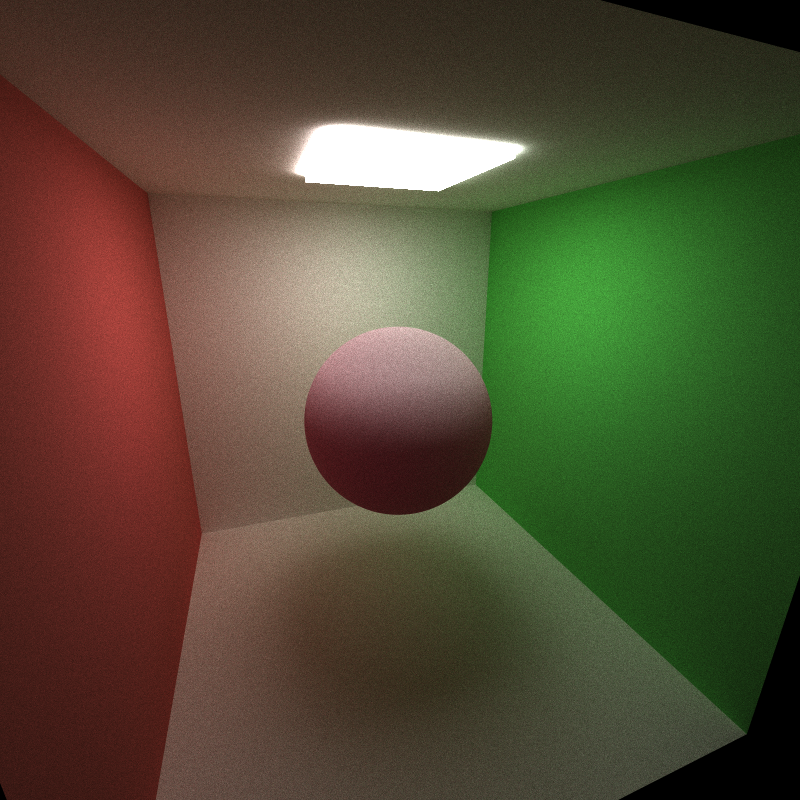

CUDA Path Tracer
================

**University of Pennsylvania, CIS 565: GPU Programming and Architecture, Project 3**

* Tong Hu
* Tested on: Windows 11, Ryzen 7 1700X @ 3.4GHz 16GB, RTX 2060 6GB (Personal Desktop)

# Visual Improvement
## Different surfaces material

The visualization of light on surfaces is predominantly governed by the material properties of the object. Based on different material properties, Combining with various sampling methods, we can greatly simulate the visual effects produced by the interaction of light with objects. Following two figures from wikipedia described the reflection and refraction of light.

  

    
    
Reflection of light

  

  
  

     
    
Refraction of light

  

On an ideal diffuse surface, light scatters uniformly in all directions, irrespective of the incident angle. Such surfaces appear soft and non-glossy. Examples might include chalk, unpolished wood, or matte paint. 

A perfectly specular-reflective surface acts like a mirror, reflecting light in a singular direction dictated by the law of reflection. Such surfaces exhibit sharp, clear reflections and are found in materials like polished metals or mirrors. 

A refractive object, like glass or water, can transmit light due to a change in medium and cause refraction. The precise nature of this bending is governed by the material's refractive index. Additionally, such materials can also reflect light. Thus, after intersecting the ball's surface, the direction of the path will be randomly selected between reflection and refraction.

Following are images rendered for a ball with ideal diffusive surface, a ball with perfectly reflective surface, and a refractive ball with IOR equals 1.5.

  
  

    
    
Diffusion

  

  
  

     
    
Reflection

  

  
  

     
    
Refraction

  

## Anti-aliasing

The anti-aliasing is implemented based on stochastic sampling. For each pixel, instead of shooting a ray through its center, the ray's direction is slightly jittered to simulate sampling multiple locations within a pixel by setting a random offset. This makes the rendered image smoother and more realistic. Following two images shows the difference between disable and enable anti-aliasing.

  

    
    
Without Anti-aliasing

  

  
  

     
    
With Anti-aliasing

  

## Physically-based depth-of-field

When simulating depth of field, the camera model can be enhanced to account for lens properties, including aperture size and focus distance. Instead of shooting rays straight out of a pixel (as in a pinhole camera model), rays are cast from points sampled across the aperture, converging them onto a focal point in the scene. Based on this simulation, the rendered images will have parts in sharp focus while other parts are blurred.

Displayed below are images spanning a range of focus distances, from near to far, all captured with an aperture setting of 1. The focus distance are calculated for each ball, so that each image focuses on different balls.

  

    
    
focus distance: 7.6

  

  
  

     
    
focus distance: 8.7

  

  

     
    
focus distance: 12.6

  

  

     
    
focus distance: 15

  

When the focus distance is set to 10, targeting the center ball, an increase in the aperture size causes areas not in focus to become progressively more blurred, as shown in following images.

  

    
    
aperture: 0.5

  

  
  

     
    
aperture: 1

  

  

     
    
aperture: 2

  

## Motion Blur

For simulating motion blur, we incorporate the elements of time and velocity into our rendering calculations. By sampling random time points within the duration of a single frame, we can capture the movement of objects, thereby creating a blurring effect in the final image, which simulates the natural perception of rapid motion in the real world. Importantly, the randomly generated time values are square-rooted, ensuring that there's a higher sampling density towards the end of the motion, intensifying the blur effect in that phase.

  

    
    
Static

  

  
  

     
    
Motion Blur

  

## Subsurface Scattering

In our renderer, subsurface scattering (SSS) is simulated to capture the complicated behavior of light as it penetrates and scatters within a material. The process involves tracing rays multiple times inside the object, accounting for light attenuation and the probability of scattering versus exiting. Each interaction is influenced by the material's specific absorption and scattering coefficients.

In the comparison between the two sets of images, the presence of subsurface scattering becomes evident. With subsurface scattering, there's a harmonious blend of light and shadow, resulting in a more gradual transition between illuminated and shaded areas. Furthermore, this technique allows light to permeate the object, enhancing its depth and realism.

  

    
    
Without Subsurface Scattering

  

  
  

     
    
Subsurface Scattering

  

  

    
    
Without Subsurface Scattering

  

  
  

     
    
Subsurface Scattering

  

# Performance Improvement
## Stream Compaction

After applying stream compaction, we observe a decline in the number of remaining paths at each depth. In the open box scenario, paths decrease more rapidly as many exit the box, ending the tracing process earlier. In contrast, for the closed box scenario, only small amount of paths that intersect the light source terminates earlier, while most persist until they've bounced the maximum number of times.

## Material Sorting

Implementing material sorting is intended to enhance rendering efficiency. By grouping by material, we aim to optimize memory access. However, from following graph we can tell that when we enable the material sorting, rendering the image takes even more time. The increased time could be attributed to the overhead from sorting, especially given that the variety of material types isn't substantial enough to manifest the benefits of such sorting.

## Cache First Bounce

From following graph we can tell that caching the first bounce in path tracing expedites the rendering process. However, as the max depth increases, the time-saving difference between using caching and not diminishes. This is because, even though we optimize the first bounce, the computation becomes increasingly dominated by the subsequent bounces as depth increases.

# Reference

Pysically based rendering: https://pbr-book.org/3ed-2018/contents

Ray Tracing in One Weekend: https://github.com/RayTracing/raytracing.github.io

Ray Tracing Gems I/II: https://www.realtimerendering.com/raytracinggems/

Diffuse reflection (wikipedia): https://en.wikipedia.org/wiki/Diffuse_reflection

Refraction (wikipedia): https://en.wikipedia.org/wiki/Refraction
