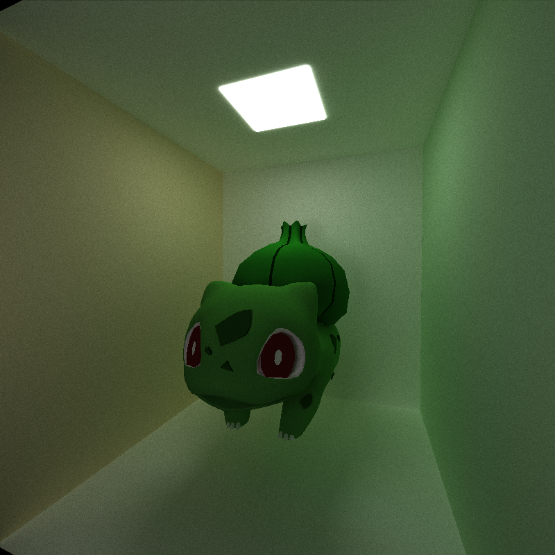

CUDA Path Tracer
================

**University of Pennsylvania, CIS 565: GPU Programming and Architecture, Project 2**

Jason Li   ([LinkedIn](https://linkedin.com/in/jeylii))
* Tested on: Windows 10, Ryzen 5 3600X @ 3.80GHz 32 GB, NVIDIA RTX 4070 

# **Summary**
This project is a GPU Path Tracer implemented using C++ and CUDA. It is able to load arbitrary meshes from glTF files and stores & accesses the data for such files in a BVH (Bounding Voume Hierarchy) data structure.

Example Scene             |  
:-------------------------:|
  |
 
# **Features**
## **Basic Path Tracing using BSDFs**
The first feature to implement was shading the scene using path tracing instead of the naive shading method. For the scattering of light, three BSDF (Bidirectional Scattering Distribution Functions) were implemented - ideal diffuse shading, perfect specular shading, and a mix of the two. Ideal diffuse shading is calculated using a cosine-weighted random direction in the hemisphere of intersection, while perfect specular shdaing is calculated using the `glm::reflect()` function. Below are some comparisons between the BSDFs mentioned using examples from the default Cornell Box scene.

### Examples of BSDFs
Ideal Diffuse             |  Perfect Specular         | Mixed
:-------------------------:|:-------------------------:|:-------------------------:
  |   |  

## **Stream Compaction**
One optimization that was made was using stream compaction to terminate paths before their set trace depth was reached. The paths are compacted once per iteration; after each path's color is accumulated. This is implemented using the `thrust::partition()` function from NVIDIA's Thrust CUDA Library. Below is a performance analysis of the inclusion of stream compaction.
### Compaction Performance Analysis
Stream Compaction Graph             |  
:-------------------------:|
  |

We can examine the impact of the use of stream compaction on the path tracer by looking at the number of paths remaining after each iteration and use of stream compaction. For this analysis, I used the default Cornell Box scene and compared the average number of paths remaining after each iteration (with an initial path number of 640000) both when the box was open and when it was closed.

We can see in the graph above that when rendering a closed box, the impact of stream compaction is small. After 8 iterations, the number of paths in use (not compacted) decreased from the initial path number of 640000 to about 565000, which is about an 11.7% decrease in number of paths. Each iteration decreased the number of active paths by about 1.5 to 2.5%, which is not insignificant especially for larger trace depths, but is quite small.

When rendering an open box, however, the impact of stream compaction is clearly much more pronounced. After 8 iterations, the average number of paths in use decreased from 640000 to only about 129000, about an 80% decrease in number of paths. Each iteration decreased the number of active paths by anywhere from 15-25%, which is quite significant and leads to clear performance benefits.

This difference in performance increase is explained by the conditions of compaction. When a path either reaches a source of emittance and thus has no remaining bounces or does not intersect any geometry and thus goes out of bounds, we compact it away. In the closed box scene, the only reason a path would get compacted is if it hits a source of emittance; in the open box, a path could get compacted if it either hits the source of emittance or if it leaves the box and goes out of bounds. Because one side of the box is removed in the closed box instance, this is clearly much more likely and leads to a much higher proportion of compaction and thus a larger performance difference made.

## **Sorting Paths by Material**
Another optimization that was implemented was making paths contiguous in memory by material type during each iteration. 
This occurs once per iteration, once the intersections are computed and each path is associated with a material type. This is implemented using the `thrust::sort_by_key()` function from NVIDIA's Thrust CUDA Library. Below is a performance analysis of the inclusion of this optimization.
### Material Sorting Performance Analysis 
Material Sorting Graph             |  
:-------------------------:|
  |

This optimization was attempted by sorting the paths by material during each iteration, before the path's shading is calculated. Theoretically, this may result in a performance increase as after sorting, adjacent threads access the same material during the shading kernel, leading to less memory operations performed. Due to the memory operation bottleneck on performance on the GPU, this may result in a performance increase.

However, for our purposes and scenes rendered, the effect was the opposite. Sorting by material during each iteration seemed to generally result in a performance decrease in this case. This is likely due to the additional overhead time cost added by calling the sort function on every iteration, which outweighs the performance benefits of accessing the same material on adjacent threads.

In the cases shown by the graph above, I loaded two different scenes: the Cornell Open Box scene, which uses 5 materials, and the scene used for the first screenshot of this document, which includes 24 materials. In both cases, the use of material sorting during each iteration decreased performance. In the case of the Cornell Box with 5 materials, the time to load each frame increased from about 29ms to about 75ms, which corresponds to a performance decrease of around 250%. In the case of the Piplup scene with 24 materials, the time to load each frame increased from about 131ms to about 181ms, a performance decrease of 138%. This suggests that as the number of materials which are rendered in a scene increases, the affect of material sorting on performance improves, and at some larger number of materials, it may result in a performance increase instead of decrease for our renderer. I did not attempt to load more complex scenes with a greater number of materials, but finding this "cutoff" for material sorting performance would be an interesting extension. 

## **First Bounce Caching**
The last basic optimization made was caching the intersections from the first path bounce (directly after the leave the camera) to be used across all subsequent iterations of path tracing. This occurs in the first iteration right after intersection computation. This is implemented by copying the information about the first bounces into a designated memory location on the GPU and copying the information back from that memory location into each following first iteration's intersection buffer using `cudaMemcpy()`. Below is a performance analysis of the inclusion of this optimization.
### First Bounce Caching Performance Analysis
First Bounce Caching Graph             |  
:-------------------------:|
  |

The effect on performance of caching the first bounce of the paths is slight but consistently evident. This was measured using the Cornell Open box scene with different tracing depths. For all tracing depths measured, first bounce caching did slightly increase the average performance. 

This was most evident for smaller depths. For a trace depth of 2, using first bounce caching resulted in a performance increase of about 6.5%, and for a trace depth of 3, the performance increase seen was about 2.5%. However for all following depths, this performance increase stayed at anywhere from around 1 to 2% instead. The performance increase of first bounce cache is most significant when less bounces are used, which is expected behavior because as the number of bounces decreases, the proportion of work saved by using the cache to load only the first bounce increases significantly. For larger trace depths, the work saved in just the first bounce becomes much less significant when looking at overall performance.

## **glTF File Mesh Loading & Rendering**
One advanced feature that was added was the loading and rendering of arbitrary meshes from one *or multiple* glTF files. To do this, a "GLTF" entry can be included in the `.txt` file used to load the scene for each glTF file to be loaded; the path and filename of the `.gltf` file must be included on the next line. The meshes included in these files were parsed and read using the `tinygltf` library, [which can be found here](https://github.com/syoyo/tinygltf). This functionality is currently limited to meshes without textures; only meshes purely using RGB values to color the scene can be loaded. Below are some examples of various meshes loaded in through this feature; all attributions for the models used can be found at the bottom of this document as well as above each image.

### glTF Scene Examples
[Piplup Scene](https://skfb.ly/6Vt7x)  |  
:-------------------------:|
  |

[Bottle Scene](https://skfb.ly/o7CKp)  |  
:-------------------------:|
  |

[Trees Scene](https://skfb.ly/6BOWV)  |  
:-------------------------:|
  |

[Bulbasaur Scene](https://skfb.ly/6SZ9B)  |  
:-------------------------:|
  |

## **Hierarchical Spatial Data Structure - BVH**
One advanced feature that was added was the storing of spatial data such as the position and normal of triangles in a hierarchical spatial data structure - in this case, a BVH (Bounding Volume Hierarchy) data structure was used. [This tutorial](https://jacco.ompf2.com/2022/04/13/how-to-build-a-bvh-part-1-basics/) was used as a guideline for a basic BVH implementation, however various changes were made to adapt the tutorial's code for use on the GPU, (as the given code is meant for the CPU) and also to integrate the data structure with the glTF loading and rendering feature. In this implementation, because each mesh from a glTF file is stored as separate objects, each mesh was assigned its own root BVH node. The nodes are stored in a vector passed to the GPU, and they contain the necessary indices to both traverse the BVH tree and find the associated geometries, on the GPU.

This feature greatly aided in rendering the much more advanced meshes loaded in through glTF and had a significant positive impact on performance. A performance analysis is included below.

### BVH Performance Analysis
BVH Graph             |  
:-------------------------:|
  |

The graph above compares the time required to render a frame on average for glTF meshes of different complexities loaded when using BVH to the time required when not using BVH. For the implementation without using BVH, we check for intersections by naively looping through all triangles in the mesh and checking whether the path intersects. For the implementation using BVH, we first traverse the BVH for the mesh to find the leaf node in the BVH which contains the intersecting geometry, then check for any intersections within that leaf node.

It is clear from this graph that the use of BVH results in a massive difference in performance, especially for scenes with a larger number of triangles. For the least complex scene (Water Bottle), the use of BVH resulted in a performance increase of 83%, while for the most complex scene analyzed, the use of BVH resulted in a performance increase of 1465%. The table below summarizes these numbers:

Scene             | Number of Triangles | Time per frame without BVH (ms) | Time per frame with BVH (ms) | Performance increase
:-------------------------:|:-------------------------:|:-------------------------:|:-------------------------:|:-------------------------:|
Water Bottle | 746 | 64.3 | 35.1 | 83.19%
McCree | 2600 | 202.5 | 56.3 | 259.68%
Bulbasaur | 7000 | 331.3 | 44.9 | 637.86% 
Piplup | 11100 | 490.3 | 39.5 | 1141.27%
Trees | 46900 | 1601.67 | 125.3 | 1465.10%

This performance increase is expected behavior. When *n* is the number of triangles in the mesh, traversing the BVH has a time complexity of *O(logn)*, while naively checking intersections with every triangle in the mesh has a time complexity of *O(n)*. These time complexities reflected in the following graph, which re-plots the previous graph as a line chart. Note how the time per frame without BVH increases approximately linearly with the number of triangles in the scene, while the time per frame with BVH increases at a much lower rate, which could be approximated by a logarithmic function.

BVH Time Complexity Graph             |  
:-------------------------:|
  |

One current limitation of the BVH feature in this particular path tracer is that BVH construction is handled on the CPU, after all objects are read from the scene file. Information about the BVH and associated geometries is then copied onto the GPU, which iterates through the data structure to find intersections between paths and the geometry. However, the performance of the BVH structure can be further increased by moving the BVH construction to the GPU, parallelizing all aspects of the data structure. The performance difference would be negligible for static scenes such as the ones loaded in this path tracer, as construction only occurs during initialization, but for scenes which include animation and morphing, construction and modification of the BVH data structures may occur multiple times, so it would be beneficial to move these functions to the GPU and avoid excessive memory operations when modifying the BVH. For the scope of this project, CPU-side construction is enough, as GPU-side construction would be much more complex. 

## **Attributions**
### The following coding resources were used as reference or used as a library in this project:
- [TinyglTF](https://github.com/syoyo/tinygltf)
- [BVH Tutorial](https://jacco.ompf2.com/2022/04/13/how-to-build-a-bvh-part-1-basics/)

### The following free-to-download models were used to test and demonstrate the functionality of this project:

- [Piplup](https://skfb.ly/6Vt7x)
- [Trees](https://skfb.ly/6BOWV)
- [Water Bottle](https://skfb.ly/o7CKp)
- [McCree](https://skfb.ly/6sBDo)
- [Bulbasaur](https://skfb.ly/6SZ9B)
