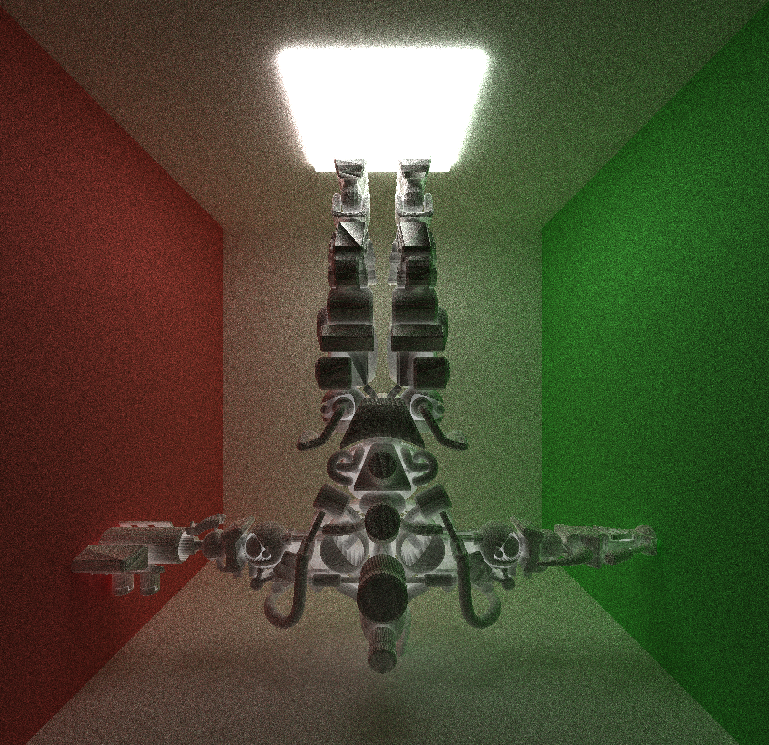

CUDA Path Tracer
================

**University of Pennsylvania, CIS 565: GPU Programming and Architecture, Project 3**

* Xinyu Niu
* [Personal website](https://xinyuniu6.wixsite.com/my-site-1)
* Tested on: Windows 11, i9-13980HX @ 2.20GHz 16GB, RTX 4070 16185MB (Personal)

## Introduction

This project focuses on implementing a CUDA-based path tracer capable of rendering globally-illuminated images very quickly. 
Path tracing is an algorithm rooted in ray tracing that involves projecting rays from the camera. When one of these rays intersects with a reflective or refractive surface, the algorithm continues recursively until it encounters a light source. In essence, the algorithm calculates the total illuminance reaching a specific point on an object's surface, aiming for the outcome of achieving physically precise rendering.

## Implemented Features

In this project, I completed the following features:

### Core Requirements

* A shading kernel with BSDF evaluation for ideal diffuse surfaces and perfect specular-reflective surfaces.
* Path continuation/termination using Stream Compaction
* Toggleable material sorting
* Toggleable option to cache the first bounce intersection.

### Extra Features

#### Visual Improvements
* Evaluation for refraction with Fresnel effects
* Physically-based depth-of-field
* Stochastic Sampled Antialiasing
* Texture mapping(I did this mainly for making scenes so I didn't implement procedurral texture for performance comparison)
* Direct lighting
* Simple motion blur effect

#### Mesh Improvements
* Mesh loading for .obj files
* Mesh loading for .gltf files
* Toggleable bounding volume intersection culling

#### Performance Improvements

* BVH tree

## Analysis

### BSDF

Three fundamental shading techniques are in use: pure diffuse, pure reflection, and a combination of reflection and refraction. Diffuse shading entails randomly selecting a new direction within the hemisphere, reflection involves reflecting the incident ray direction based on the surface normal, and refraction utilizes Schlick's approximation to simulate the Fresnel effect.

#### Ideal Diffuse

#### Perfect Specular

#### Refractive

### Physically based Depth of Field

The implementation if based on PBRT[6.2.3]. We introduce two additional camera parameters: lensRadius and focalDistance. We proceed by sampling points on a concentric disk determined by the lensRadius, followed by introducing jitter to the camera ray based on this sampled position and the focalDistance.

### Stochastic Sampled Antialiasing

#### Without AA

#### With AA

### Direct Lighting

It's hard to see the different between the two renders. The one with direct lighting converges faster.

#### Naive

#### Direct Light

### Motion Blur

I added a simple jittering for motion blur, the velocity of motion could be changed in the macro MOTION_VELO.

### Mesh Loading
I implemented mesh loading for both .obj and .gltf files. The performance analysis of using or not using bounding box/BVH will be discussed later.

#### .obj bunny

### .gltf

