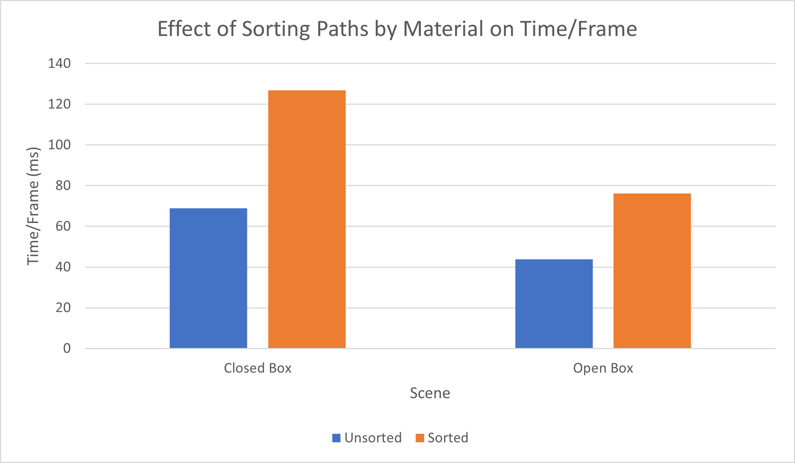

CUDA Path Tracer
================

**University of Pennsylvania, CIS 565: GPU Programming and Architecture, Project 3**

* Alan Qiao
* Tested on: Windows 11 22H2, Intel Xeon W-2145 @ 3.70GHz 64GB, RTX 3070 8GB (Dorm Workstation)

# Introduction

This project demonstrates a relatively basic implementation of a CUDA path tracer where the final image is displayed through OpenGL. The project offers a naive path tracer that implements the Light Transport Equation for Lambertian diffuse materials, specular transmission, specular reflection, and Fresnel Dielectrics.  

The camera model simulates a pinhole camera, with support for adjustable depth of field and stochastic antialiasing. The camera can be moved using the middle mouse button, rotated with the left mouse button, and zoomed in and out with the right mouse button.  

Objects in the scene can be specified in two ways.
1. Basic geometries. 
    1. Currently, only cubes and sphere are supported. 
    2. Each geometry can be supplied with a different transformation.
    3. Geometry materials support diffuse coloring, a different specular color for optional reflection or refraction with custom index of refraction, and any combination of these. Colors cannot have alpha channel.
2. GLTF Meshes
    1. Currently, only `.gltf` and `.glb` files with embedded textures are supported. 
    2. The mesh as a whole can be transformed by specifying a custom transformation.
    3. Meshes must consist only of traingles as primitives. Vertex position, normal, and uv information is required for correct rendering. Only diffuse shading with textures is implemented. Transparency in textures is supported.

To execute the path tracer, call the built executable in the command line with the commandline argument `address/to/your/scene_name.txt`. Examples of the expected format for scene files can be found in the included demos under `scenes/`.  

# Background
Consider taking a picture of a park with a camera. Light from a light source, such as the sun, shines on objects like trees, flowers or grasses. Some light is reflected by these objects into the cameras lens, and the camera captures the light it detected pixel by pixel into a picture.

Path tracing is a computer graphics rendering technique that tries to simulate this idea. 
Path tracing tries to get an acccurate representation of how light would illuminate objects, both directly and indirectly, by tracing paths of light as they travel through a scene. Instead of following light rays from the light source, rays are traced backwards from the camera into the scene.

For each pixel in the rendered image:

A ray ("camera ray") is shot from the camera into the scene.
If this ray intersects a surface, the intersection point becomes a new starting point.
From this point, a new ray ("bounce ray" or "scatter ray") is shot in a random direction based on the material's reflection properties.
This process is repeated, bouncing off surfaces, until a predefined depth or until a light source is hit.
Each bounce gathers light (or color) from the objects it interacts with. The gathered light values are combined to calculate the final color of the pixel.

### Naive Path Tracing
In "naive" path tracing, every time a ray hits a surface, a single random bounce direction is chosen. This is the simplest method that would capture shadows and colored colored reflections from other objects in the scene. Because it only traces one path per ray, each iteration of naive path tracing can be rather noisy. This noise can be reduced by averaging the results of multiple samples per pixel, but there can still be some artifacts that are difficult to eliminate even with many samples.

#### Advantages:

1. Physically Accurate: Path tracing can produce images with photorealistic qualities, capturing complex lighting interactions.
2. Unified Model: Instead of separate algorithms for shadows, reflections, and refractions, path tracing offers a unified approach to handle all these effects.

#### Limitations:

1. Noise: Naive path tracing can produce noisy images, especially in areas with indirect light.
2. Computationally Intensive: Achieving noise-free images requires many samples, making it computationally expensive.
3. Poor parallelization: Even though rendering is embarassingly parallel, it is difficult to leverage the full potential of GPU rendering enabled by CUDA programming as naive path tracing reuses the same gemometry data across threads and iterations, but these buffers are often too big to fit into shared memory. Furthermore, there are a lot of kernel calls, but each call tends to do relatively little work. Lastly, in a complex scene, there can be a lot of branching that results from the unified nature of the model, resulting in many idle threads.

# Features
The base path tracing loop is exactly as described in the background section. For a specified depth and number of iterations, the path tracing keeps sampling up until the specified depth and averaging the results until the total number of iterations are reached.  
In a single cycle, the path tracer first generates rays from the camera, one per pixel. Next, each ray is tested against the entire scene for intersection with the closest object. Then, for each intersection, the color contribution from that surface is accumulated and a new ray is generated based on the material properties. The process of computing intersections and scaterring the rays repeats until either a light is hit, at which point the ray returns a final color for coloring this pixel, or the max depth is reached, in which case black is returned as the color for this pixel. These returned colors are then accumulated into the current rendered image, average for the number of iterations, and the final image displayed to screen.  
To leverage parallel computing capabilities, this loop is split into four kernel functions: generate camera rays, compute intersections, shade and scatter rays, and gather the ray data and update the image buffer. This way, kernels of different sizes taking different data can be launched to more optimally compute for the distinctly different tasks.

This is what the base path tracer produces for a cornell scene with a single square light and diffuse sphere. There's a shadow of the sphere on the floor, slight imprints of the colors of the walls and a sheen from the light.

## Path Tracing Loop Optimizations
The first of optimizations that could be made are to the loop itself. Splitting up into 4 kernels allows for some work in between the kernels to reduce the number of threads needed at the next stage.

For this section, we will be experimenting with the following two scenes:

On the left is the open box demo. It consists of 5 diffuse cubes for walls, 1 Fresnel Dielectric glass cube, 1 reflective mirror cube, 2 diffuse spheres, 1 emissive cube as the light, and a Seele mesh with 23079 triangles. There are a total of 30 materials, consisting of 6 geometry materials and 24 texture materials.  

On the right is the closed box demo. It has all the same components as the open box demo exept that there is one extra diffuse blue cube wall behind the camera. 

By default, both scenes are rendered at 800x800 resolution with trace depth of 8 for a total of 10,000 sample iterations. 

### Early Ray Termination
If a camera doesn't intersect with the scene. That ray will simply return the color black. Similarly, any rays that failed to reach a light after `MAX_DEPTH` bounces should also return black. The last kind of rays that would terminate early are those that hit a light before max depth is reached. All of these early terminated rays can be easily distinguished by setting `remainingBounces = 0`. This means we can launch the kernels in the next iteration without these rays as they all already have their final colors. We can't simply discard these rays from memory as we still need to accumulate their color.  
The solution is to partition the rays buffer by the condition `remainingBounces > 0`. By placing all rays that have terminated at the back, we can launch a kernel with `num_active_paths` threads.

Figure 1: Number of paths remaining with stream compaction for early ray termination with respect to path tracing depth. Two cornell scenes that are identical except one box has an open face while the other is fully closed are used. 

As seen in this graph, the effect of stream compaction with partitioning is most prominent after a few bounces with diminishing returns. In the open box case, this makes sense because as the rays bounce around more, there is a greater chance that it bounces out the open face into void and thus get terminated for no intersection. In the closed box case, the effect of stream compaction is much smaller as rays are trapped in a box and will certainly collide with a surface. Notice, however, that there is a nearly linear trend in the number of rays terminating in the closed box case, suggesting that about an equal number of rays hit the light in a given pass. Another interesting observation is that most rays actually fail to terminate by the 20th bounce and so nearly 90% of the rays shot are actually wasted in the closed box case.

### First Bounce Cache
In a simple model where the camera always generates the same rays for each pixel, that is, a ray extending outwards from the center of each pixel in the camera's viewport, the first bounce of any sample iteration would always hit the same objects. As a result, we can cache this ray to save one iteration of intersection computation.

Figure 2: Time required to render each frame in the closed box scene with respect to the number of rays generated by the camera.

It turns out that first bounce cache creates a negligible improvement even as the number of rays that are cached increases. One possible explanation for this is that the cost of computing intersections in a scene with relatively few geometries is small enough that it is not much greater than the cost of copying a cached buffer to the intersections buffer in memory. Perhaps with an even more complex scene there would be a more significant effect, but for the closed box demo, the improvement is negligible.

Furthermore, this technique inherent conflicts with other camera based features like stoachastic antialiasing and depth of field adjustment. Thus, this technique was not used in the final implementation.

### Material Sorting
As there is a single shading kernel that is responsible for shading all the different materials, there is inevitably a lot of branching that occurs as a result of threads calling different device functions to shade for different materials. Since CUDA schedules threads in warps, it may be possible to reduce the idle time from branching by sorting the paths by material so that there is a higher chance an entire warp would have threads all calling the same branch.

Figure 3: The effect of sorting rays by material before shading in rendering the closed box demo and the open box demo.

It is clear from the graph that the cost of sorting rays by material significantly outweighs the benefit of branching reduction. This makes sense as modern GPUs have much better performance with some branching and even if threads are idle, the time of computing a new ray direction and shading in each branch is so small that the idle is still significantly smaller than sorting, which tends to be a very expensive operation even with GPU parallelization.

## Base Naive Path Tracing

### Specular Transmission

### Fresnel Dielectric

### Further Improvements

## Camera Effects

### Stochastic Antialiasing

### Depth of Field

## Mesh Rendering

### GLTF Mesh Loading

### Albedo texture mapping

### Bounding Volume Hierarchy

### Further Improvements

## Final Demonstrations

## References
* Physically Based Rendering 3rd Edition [&#x1F517;](https://pbr-book.org/3ed-2018/contents)
* "How to build a BVH" - JBIKKER [&#x1F517;](https://jacco.ompf2.com/2022/04/13/how-to-build-a-bvh-part-1-basics/)
* TinyGLTF [&#x1F517;](https://github.com/syoyo/tinygltf)
