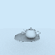
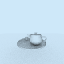
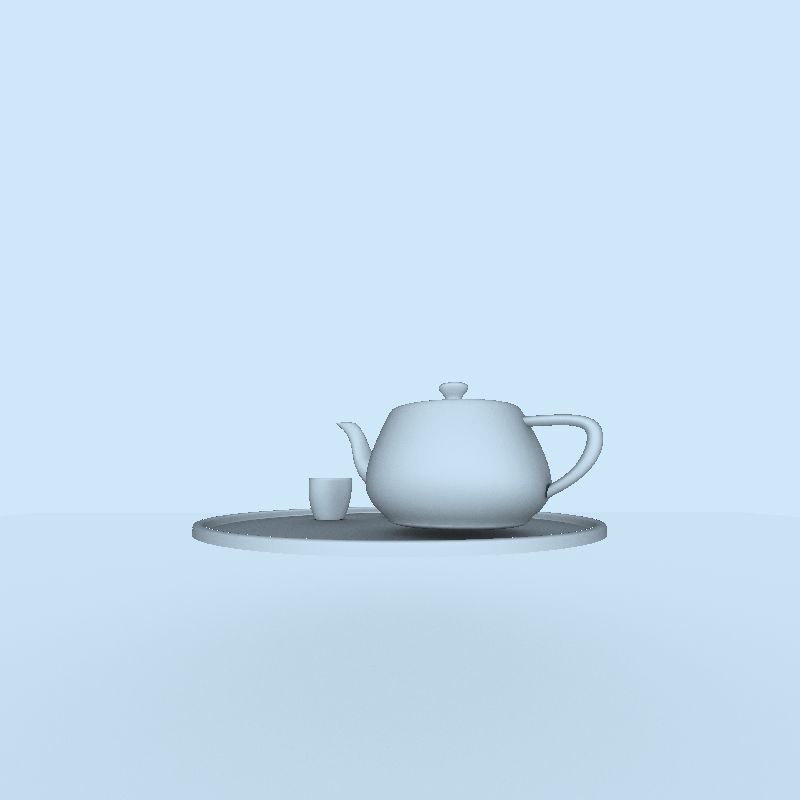
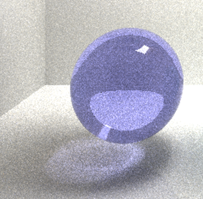
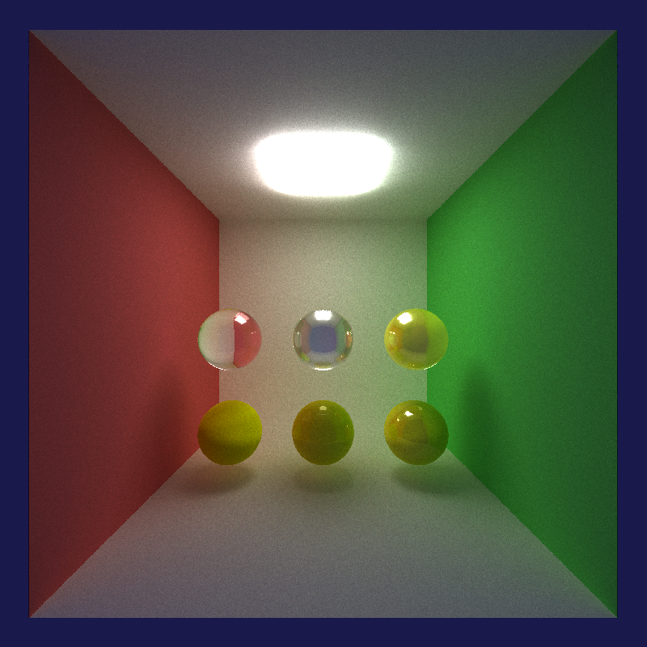
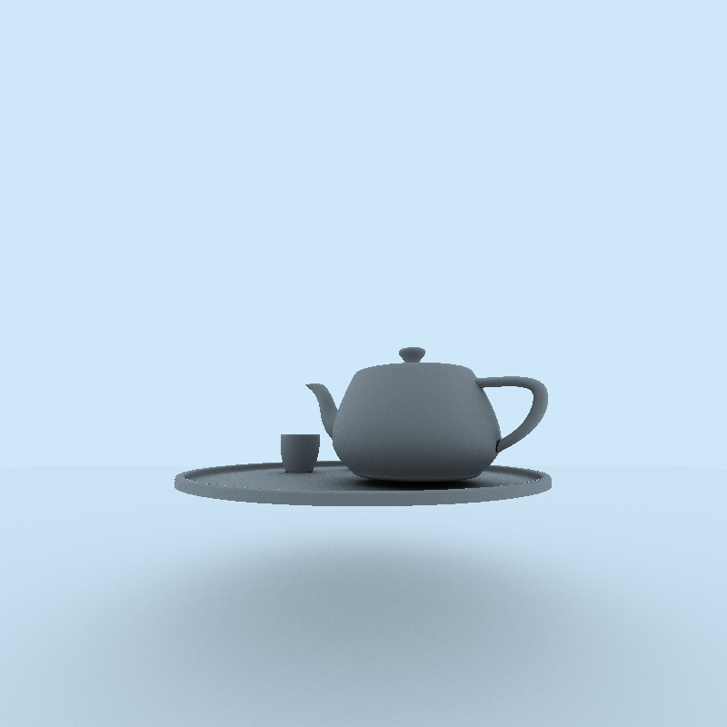
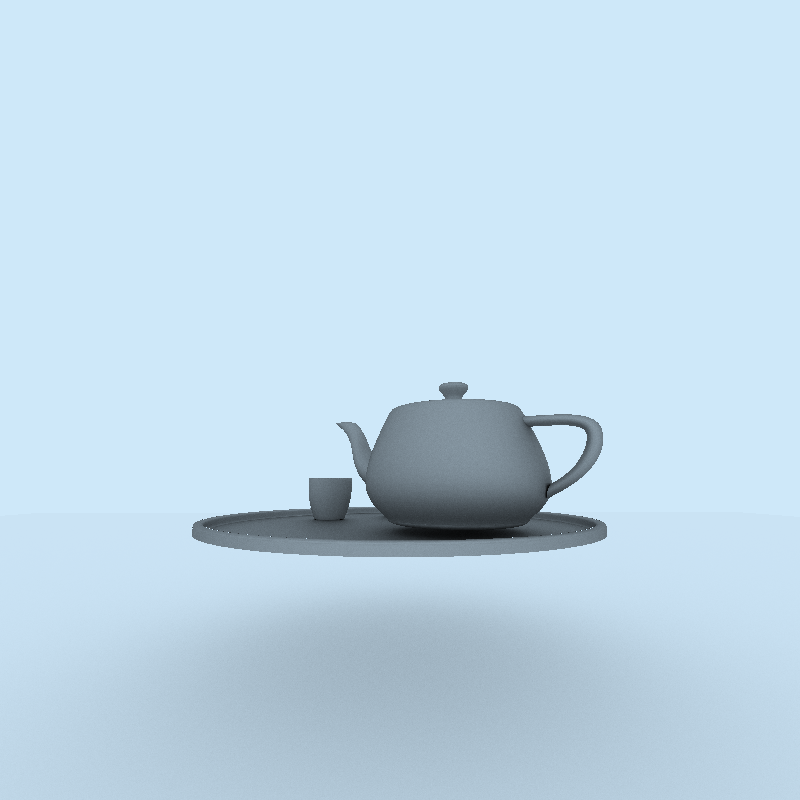
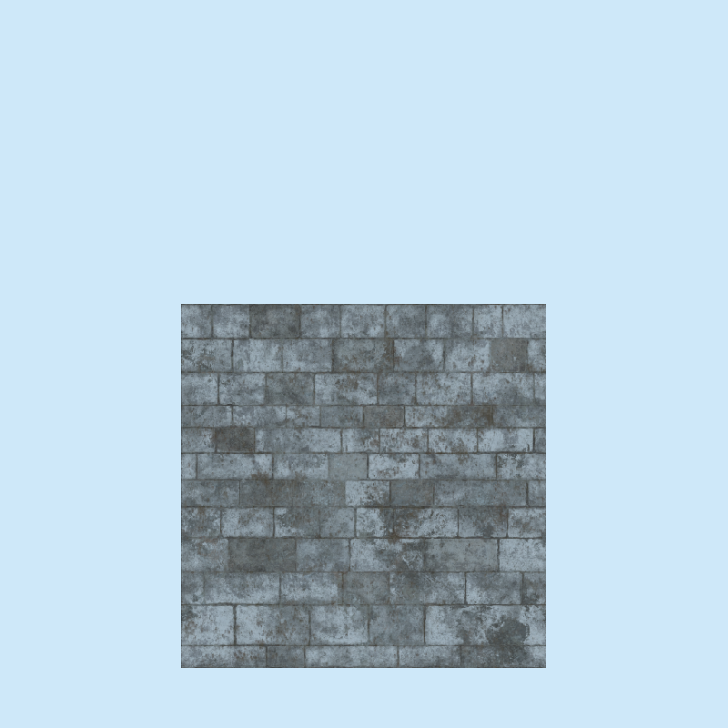
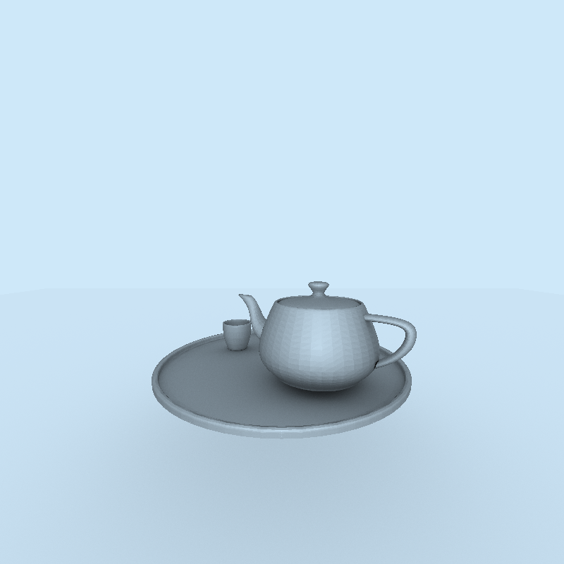

CUDA Path Tracer
================

**University of Pennsylvania, CIS 565: GPU Programming and Architecture, Project 3**

* Xiaoxiao Zou
  * [LinkedIn](https://www.linkedin.com/in/xiaoxiao-zou-23482a1b9/)
* Tested on: Windows 11, AMD Ryzen 9 7940HS @ 4.00 GHz, RTX 4060 Laptop 

### Features

Visual:
* Anti-aliasing - :two: points
* Mirror - :zero: points
* Refraction - :two: points (glass with specular component)
* Plastic Material - :question: points (mixture of diffuse, refraction, specular material)
* Phong / Blinn-Phong with cosine lobine importance sampling - :question: points 
* Microfacet Model with Blinn-Phong - :question: points 
* Texture/Normal Mapping with mesh loading - :six: points

Mesh: 
* Obj/Mtl file loading - :two: points

Performance:
* First Bounce Cache - :zero: points
* Stream Compaction - :zero: points
* Material Sort - :zero: points
* BVH - :six: points

Note: some of the features are real time adjustable by clicking on some keys. 

#### First Bounce Cache (C-enabled, V-Disabled)
This speeds up the performance for most situations. 

#### Antialiasing (A-enabled, Q-Disabled)
This feature give smooth shaded picture. This feature does not give apparently visual improvement for large resolution and samples since the ray is scattered out on diffuse material, after certain amount of sampling, it gets smooth shaded. Since for antialiasing, the first bounce is not always same, we cannot cach the first bounce anyway. In my program, once the first bounce is on, antialiasing will also be turned off.

For resolution 80*80 at sample 500

alias vs antialias

#### Material Sort (M-enabled, N-Disabled)
This feature actually slow down the process when number of materials and geometry are relatively small.

#### Materials & Shading (0-Phong, 1-BlinnPhong, 2-BlinnPhong with Microfacet)

* background-color/lighting

Instead of giving it skybox (requires image loading and reading), give a background color/lighting can also light up the space, especially for complicated scene like sponza. Skybox can also be achieved by importing a mesh of box with texture mapping in my program, but slow down the program. 

* refraction

Refract ray based on ior in order to refract ray. Reflect ray if the ray reached the critical angle (total internal reflection). 

* specular highlight (importance sampling with cosine lobe) or Phong shading

This method gives a cosine lobe sampling at reflected direction, which takes in a extra specular exponent (Ns in mtl, exponent in txt, range from 0-1000) to determine how scattered the ray. 

Image showned Ns of 
[0.0 0.2 0.5] [1.0 10 100]

* mixture of multiple materials

This method gives possibility to generate various types of materials, plastic material (specular+diffuse), colored glass ball with reflection (specular+ diffuse +refract), and etc. 

Image showned:

First row: pure glass, glass with reflection, glass with diffuse and specular

Second row: pure diffuse, plastic (diffuse with specular), plastic with higher specular

* Blinn-Phong

Sampling at reflected angles will cost problems at gazing angles due to reflected rays close to the surface. Then blinn phong can sample at half vector in order to get better result. For example, the plate here is all dakened in phong model.

phong vs blinn-phong

* Blinn-Phong with Microfacet

However, Blinn-Phong darkened the whole image, also did not give enough specular reflection as it should be for teapot. Microfacet gives some geometrical property to the surface since in real world, most plane is not perfectly flatten. Microfacet can give some variance to the surface by distributing normals. 

blinn-phong vs blinn-phong Microfacet

#### Obj/Mtl file & texture loading 

Reading files using tinyobj and stb_image, then copy over data to GPU. Texture mapping significally slow down the performance since the image array is large when image resolution is high. Normal mapping is implemented in order to give some depth of the texture for each triangle. 

* normal mapping

texture without normal vs texture with normal

* smooth shading/shading normals

I also implemented smooth shading by interpolating the normals of vertices for each intersection on triangles. 

triangle rendered vs smoothed triangle

All together->sponza

#### Bounding Volume Hierarchy

BVH gives huge speed up for mesh loading. My BVH is constructed top-down on CPU with sorting at longest axis each iteration and split into half. Then, traverse the tree on GPU using stack (my stack is iterable->may causing problem when huge amount of intersection on list)
