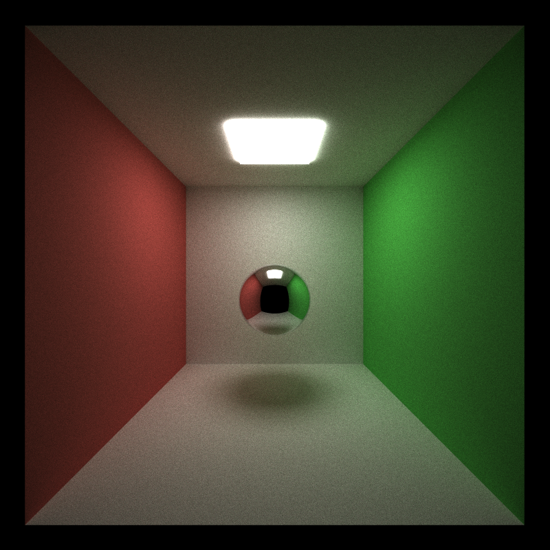

CUDA Path Tracer
================

**University of Pennsylvania, CIS 565: GPU Programming and Architecture, Project 3**

* Yue Zhang
  * [LinkedIn](https://www.linkedin.com/in/yuezhang027/), [personal website](https://yuezhanggame.com/).
* Tested on: Windows 11, i9-13900H @ 2.60GHz 32GB, NVIDIA GeForce RTX 4070 Laptop 8GB (Personal Laptop)
* Compute capability: 8.9

## Final Visual Output

## Features
This is a project implmenting a CUDA path tracer with GPU-accelerated intersection tests, shading and other features to increase performance in reality and speed.

  * :zero: BSDF shading evaluation.
  * :zero: Path continuation/termination using Stream Compaction.
  * :zero: Material type sort
  * :zero: First Bounce Cache
  * :two: Refraction (e.g. glass/water) with Frensel effects evaluation.
  * :two: Physically-based depth-of-field.
  * :two: Stochastic Sampled Antialiasing.
  * :two: Direct lighting, MIS and full integrator with environment lighting.
  * :four: Subsurface scattering.
  * :two: OBJ mesh loading.
  * :six: Kd tree hierarchical spatial data structures.
  * :three: Better random number sequences for Monte Carlo ray tracing

### BSDF evaluation
As a basepoint of rendering, I implemented BSDF evaluation function for multi material integration.

|Diffuse Reflection|Specular Reflection|Specular Refraction|Fresnel refraction|Microfacet Reflection|
|------|-------|-------|------|------|
||||||

The specular reflection and refraction takes a single direction to shoot next light ray. Here is an imperfect reflection screenshot by randomly sampling a range of outgoing direction. The imperfect reflection method is illustrated [here](https://developer.nvidia.com/gpugems/gpugems3/part-iii-rendering/chapter-20-gpu-based-importance-sampling).

I use Frensel effects to simulate different reflectance based on the viewer's viewing angle on material media like glass and water. The implementation conduct fresnel evaluation upon the ray, and randomly select the specular reflection and specular refraction model based on the fresnel evaluation value.

I use microfacet model (Torrance–Sparrow Model) to evaluation the BRDF for objects with roughness. This model modeled surfaces as collections of perfectly smooth mirrored microfacets 

### Shading Models (Naive, direct lighting, MIS, full integrator)

I implemented four shading models to check the difference in rendering quality and render time. 

|Naive|Direct lighting|MIS|Full integrator|
|------|-------|-------|------|
|||||

Here is the performance comparision for naive, mis and full integrator models:

MIS performs best due to only one bounce over the scene. For complex scene, the full integrator calculates a lot of sampling, which slower its speed. In the other side, the full integrator gets a better sampling in acculated color, thus converge in a faster speed. Note the three models are of different size due to differnt shape, which may affect comparision between same light model on different scene.

### Path continuation/termination using Stream Compaction
After all rays process the shading kernel function, the program is going to terminate the rays with 0 remaining bounce. I completed this by `thrust::partition` to seperate the ray to continue and the ray to finish computation. This function use a `isPathValid` struct to move finished ray backwards and leave the remaining continution in the front. I use `num_paths` to record the rest active rays.

### Material type sort & First Bounce cache
There are two toggable acceleration choice in shading kernel. I use `thrust::sort_by_key` to sort the intersections by material id for material type sort. When depth = 0, I stashed the intersection information in `dev_first_bounce_cache` and read the information from it when at the first iteration.

Here is the performance comparision for the two toggable choice:

Since the scene doesn't apply much material, the material sort option is always a negative optmization when the cost of sorting is over the conflict in branch for threads in same block. First intersection bounce cache is usually a small optmization over the native one.

### Physically-based depth-of-field
Physically-based depth-of-field is implemented from sampling a random point on a concentric disk. The point is projected on a plane of focus, and the ray is updated by the focal distance and lens radius. The ray's origin is permuted by the random point with respective to lens radius and the direction is updated from the new origin to computed point on plane of focus.

Here are some figures of cameras with different focal distances: 
|Focal distance = 5|Focal distance = 10|Focal distance = 20|
|------|-------|-------|
||||

We may see with different focal distance. The object will be clearer when its distance to camera is close to focal distance.

Here are some figures of cameras with different radius of lens:
|Lens Radius = 0.5|Lens Radius = 5|
|------|-------|
|||

The bigger radius of lens results in a more random sample point, which leads to a more blurry result.

### Stochastic Sampled Antialiasing
We use a stratified sampling to permute the generated ray's origin a little bit to do antialiasing. Here is the comparision of result with and without antialiasing
|With antialiasing|Without antialiasing|
|------|-------|
|||
|||

The figure without anti-aliasing has a zigzag edge on the ball. With a larger jittering range, the figure may become more blurry but less zigzag edges.

### Subsurface scattering
I use a medium in material to record the probability of ray to be absorbed or be scattered inside the medium. Non-scattering medium with high absorb distance or isotropic scattering medium with high scattering distance would act as a specular transmission material. The isotropic scattering medium with low scatter distance would act as jade or wax, since the ray will scatter longly inside the material.

I modified the shading function to see whether the ray is inside a medium (under object's surface). If the ray is in a medium, we sample the medium with a randomized distance with respect to scatter coefficient and a throughput with absorb coefficient. If the scatter distance is less than the distance from the ray origin to the next surface, we make a scatter event to ignore BSDF sampling and return without a remainingBounce decrease. Finally, we sample the medium for a scatter direction.

Here is a blue sphere with subsurface scattering:

### OBJ mesh loading
Here I use tinyobj loader to help reading the obj files and organize the vertex, normal and texcoord information into struct `Triangle`. I treated each triangle as a `Geom` in ray intersection computation.

Here are two bunnys load from obj file:

### Kd tree hierarchical spatial data structures
I use a kd tree to hierarchically divide a scene into bunch of bounding box. The ray will do bounding box intersection before calculating intersection with `Geom`s.

In kd tree construction, I implemented a vector of `Geom`s and its axis aligned bounding box. For each `KDTreeNode`, the algorithm will recursively calculate the bounding box containing all bounding box of the input vector. The vector of `Geom`s is sorted by center of its bound box and divided in medium to left sub tree and right sub tree. 

After the KDTree is setup, I flatten it into a GPU structure without pointer to other node and redudant information. It has a `GeomStart` entry and a `numGeoms` to identify the list of geoms in this node. It also has a `rightOffset` to show the right children's position in the array (the position of left child is always 1 + currentIndex).

Here is the performance comparision for the same scene with and without kd tree:

For the scene is closed, the bouncing ray will affect frame rate largely even with a scene acceleration structure. In the open scene, the kdtree works perfectly with a great improvement than the native intersection method.

### Better random number sequences for Monte Carlo ray tracing
I implemeted a stratified random sampling ([ref](https://fja05680.github.io/BFS_Sequences/BFS%20Sequences.pdf)) on hemisphere to sample a point based on the resolution (100 per side here) of one grid. Different from the original cosine-weighted random method, it used another random number to genereate the grid to sample before sampling in one small grid.

||Random(original)|Stratified|
|--|--|--|
|100 iter|||
|300 iter|||
|5000 iter|||

From the result, I don't see much a difference in noise points count. 

## 3rd party credit
I grabbed the models from the following links:
[Cat](https://www.turbosquid.com/3d-models/cat-version-3d-model-1613622)
[Bunny, Dragon](https://graphics.stanford.edu/data/3Dscanrep/)
[Pallete](https://free3d.com/3d-model/paint-palette-brush-66047.html)
[Board](https://free3d.com/3d-model/easel-3071.html)

Also I use [tinyObj](https://github.com/tinyobjloader/tinyobjloader) to load obj and [hdrloader](https://www.flipcode.com/archives/HDR_Image_Reader.shtml) to load hdr image as environmental light source.

## Blooper

Wierd fireflys on the imperfect reflection.

Get some texture indexing error at the last minute, have to give up.