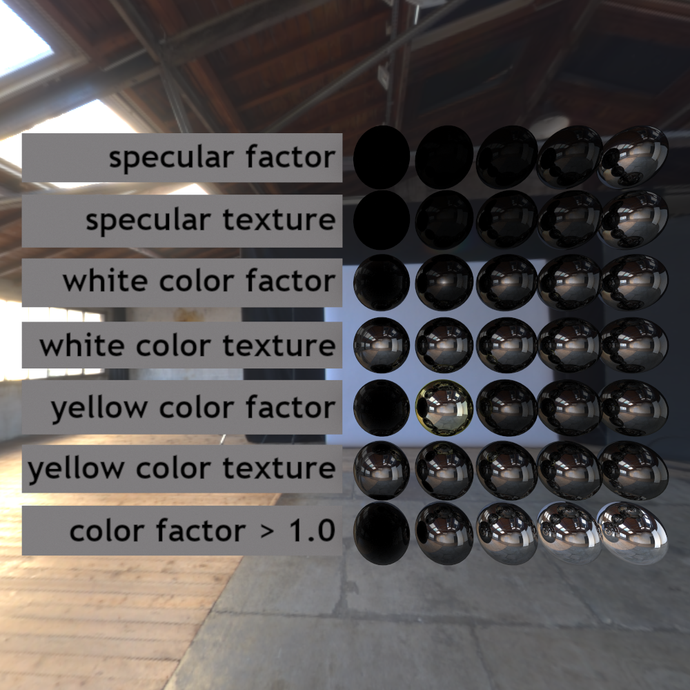

CUDA Path Tracer
================

**University of Pennsylvania, CIS 565: GPU Programming and Architecture, Project 3**

* Gehan Zheng
  * [LinkedIn](https://www.linkedin.com/in/gehan-zheng-05877b24a/), [personal website](https://grahamzen.github.io/).
* Tested on: Windows 10, AMD Ryzen 7 5800H @ 3.2GHz 16GB, GeForce RTX 3060 Laptop 6144MB (Personal Laptop)

This is a CUDA path tracer that supports GLTF loading, BVH, PBR metallic workflow, and other features. 

## Representative Outcome


<p align="center">Maserati Hybrid Car (ACES)</p>

Model link: [3D model Maserati Hybrid Car Exterior
](https://www.turbosquid.com/3d-models/3d-model-car-maserati-1661391#)

## Features

* 2️⃣ Refract.
* 2️⃣ Anti-aliasing.
* 6️⃣ glTF loading & Normal mapping (compared with a basic procedural texture).
* Environment map.
* 6️⃣ BVH (Muti-threaded BVH construction, SAH).
* PBR metallic workflow (microfacet BRDF, specular reflection).
* Physically-based metal material.
* 2️⃣ Physically-based depth-of-field.
* Final rays post processing.

### Refract

To demonstrate the refraction, a glass material is needed. It is implemented using two BSDF, one for reflection and one for refraction. Since we only have one ray at a time, we need to randomly choose between reflection and refraction. The probability of choosing reflection is calculated using fresnel equation. The returned BSDF should be scaled based on the rule of russian roulette. In the function of sampling refraction, we need to calculate the refracted ray direction using snell's law. If the ray is inside the object, the index of refraction should be inverted.

The following image uses a glass cube and a glass bunny to demonstrate the refraction, uses a mirror back wall to demonstrate the reflection.


<p align="center">Cornell box with a bunny (Reinhard)</p>

### Anti-aliasing

To implement anti-aliasing, one only need to jitter the ray direction.

| Anti-aliasing                                     | No Anti-aliasing                                    |
| ---------------------------------------------- | ---------------------------------------------- |
| ||


If you zoom in, you can see sharp edges in the image without anti-aliasing.

### GLTF loading & Normal mapping

It is the most difficult part of this project but also the most interesting part. A GLTF file is a json file that contains all the information of a scene. To fully make use of the information, textures, materials, meshes, nodes and materials are needed to be loaded.

#### Textures

Since we are using CUDA, we need to load the textures into CUDA memory then we use cudaTextureObject_t and tex2D function to access the texture. A GLTF file defines different types of texture, including base color, metallic, roughness, normal, occlusion, emissive, and specular color, etc. These textures should be access in different ways. For example, a convention is that the blue and green channel of the metallicRoughness texture is used for metallic and roughness, respectively, while the red channel of the occlusion texture is used for occlusion.


<p align="center">Zeta Gundam</p>

Model link: [msz-006 Zeta Gundam](https://sketchfab.com/3d-models/msz-006-zeta-gundam-c79a648bdd1b4ccfbf11f2dc5f836a66)

#### Normal mapping

In GLTF, normal map is a color map usually defined in tangent space, which means every normal that we can read from the normal map is a rgb value converted from a unit vector in tangent space of the triangle. Sometimes a GLTF file will provide tangents, so we only need to first convert the color value into a unit vector, then perform a matrix multiplication to convert the normal from tangent space to world space. Otherwise, we need to calculate the tangent and bitangent of the triangle. After we get convert the normal to world space, we can use it in our sampling function.

I also implemented a basic procedural texture (a checkerboard texture) to compare with the normal mapping. The following image shows the difference between the procedural texture and the normal mapping.

| Procedural                                     | Texture map                                    |
| ---------------------------------------------- | ---------------------------------------------- |
|  |  |

Model link: [Purkersdorf Chair by Koloman Moser free 3D model](https://www.cgtrader.com/free-3d-models/interior/other/purkersdorf-chair)

From the image, we can see that the procedural texture is not as smooth as the texture map, and it shows some artifacts. In contrast, the texture map is smooth and has no artifacts.
#### Meshes

The way we access vertices of a triangle is the same as what we do in an OBJ file. We need to get the pointer of positions, texcoords, normals and use the index to access the corresponding vertex. The tricky part is that the size of the index is not fixed. It can be 16-bit or 32-bit. So we need to use the accessor to get the size of the index and use the correct type to access the index. These data are stored in a class called `TriangleDetail` for each triangle. The vector of `TriangleDetail` will be copied to CUDA memory and used for computing the intersection.

#### Nodes

In GLTF, nodes are organized in a tree structure. Each node can have a mesh, a transformation matrix, and a list of children. We need to traverse the tree to get all the nodes and meshes and also compute the transformation matrix for each node. This part allows us to load a complex scene.

#### Materials

GLTF defines a material as a combination of different textures and parameters, which is mainly used for realtime rendering. Since it performs many additional calculations, and we are using path tracing, where we don't know how to compute the pdf for this combination of materials, we can apply the idea of russian roulette again to randomly choose one BSDF from the material. The basic material comprises a diffuse BSDF, a metal BSDF and a specular BSDF, which is actually a microfacet BSDF. Aside from these three BSDF, GLTF also supports extensions for clearcoat, sheen, transmission, and specular, etc. I implemented the transmission BSDF and specular BSDF. Since it is a path tracer, I implemented transmission in a way different from GLTF's specification. Also, since GLTF defines the metal BSDF which is not physically based, I implemented a physically based metal BSDF.


<p align="center">MaterialsVariantsShoe (Reinhard)</p>

### Environment map

Asides from loading a GLTF file, by default, the program will also load an HDR environment map specified by the setting file. Most of the time, the environment map contains three float channels. We need to pad the fourth channel with 1.0f to make it a float4 texture. Besides, the value of the environment map often exceeds 1.0f, in this case we need to clamp it or we will see white dots in the image. We sample the environment map when the ray hits nothing, and we map the direction of the ray to a unit square to get the uv.

### BVH

Accerlation structure is needed to speed up the rendering. I implemented a MTBVH using the SAH method. MTBVH means multi-threaded BVH. Threaded binary tree facilitates traversal in a particular order, which is by nature a good way to traverse the tree without a stack. 

MTBVH uses 6 BVHs for traversal. For the first BVH, I use the SAH method. Each round when generating a subtree, I first sort the bounding boxes, then traverse through different partition methods, using the sum of the areas of the bounding boxes of the left and right subtrees as a cost function. This results in a subtree with the smallest sum of areas. Once obtained, I generate a threaded binary tree structure by traversing. Because the sorting is based on the positive x-axis direction, the first BVH generated is optimal for rays pointing in the positive x direction. The remaining BVHs are generated by sorting the first BVH in different directions. The reason for doing this is: the traversal order of the threaded binary tree is fixed, but in reality, the bounding boxes that should be accessed first for rays from different directions are different. Having 6 threaded binary trees ensures that rays from every direction can use the optimal threaded binary tree. 

To allow rays from each direction to map to the corresponding BVH, I use a cubemap texture that stores values from 0-5. This way, directly sampling the cubemap automatically provides the corresponding index.

### PBR metallic workflow

his part heavily relies on [the GLTF specification](https://registry.khronos.org/glTF/specs/2.0/glTF-2.0.html#appendix-b-brdf-implementation). Here is a diagram of the workflow.


based on the formula provided in the specification, we can take F (the result of the fresnel equation) as the probability of choosing the specular reflection BSDF. When the generated random number is less than F, we return the specular reflection sample function, otherwise, we return the diffuse BSDF. The specular reflection BSDF is a microfacet BSDF, which is defined as:

$$
\text{MicrofacetBRDF} = \frac{G D}{4 \, \left|N \cdot L \right| \, \left| N \cdot V \right|}
$$

where $G$ is the geometric term, $D$ is the distribution term, $N$ is the normal, $L$ is the light direction, and $V$ is the view direction. I uses GGX's distribution term and Smith's geometric term.


<p align="center">A test scene of PBR metallic workflow: MetalRoughSpheres</p>


#### KHR_materials_specular

For GLTF that uses this extension, we need another BSDF according to the [specification](https://github.com/KhronosGroup/glTF/blob/main/extensions/2.0/Khronos/KHR_materials_specular/README.md). This extension defines two parameters: specular color, specular factor which can be either a texture or a constant value. Here `fresnel_mix` and `F` are changed.



<p align="center">SpecularTest</p>


### Physically-based metal material

To render a metal material, we need $\eta_t$ and $k$. $\eta_t$ is the index of refraction of the metal, and $k$ is the extinction coefficient. The formula for calculating the fresnel reflectance is formula (8.3) in [8.2 Specular Reflection and Transmission
](https://pbr-book.org/3ed-2018/Reflection_Models/Specular_Reflection_and_Transmission)

Here is a table of $\eta_t$ and $k$ for some metals.

|    | $\eta_t$                                 | $k$                                  |
| -- | ------------------------------------ | ---------------------------------- |
| Au | 0.142820060, 0.374143630, 1.43944442 | 3.97471833, 2.38065982, 1.59981036 |
| Cu | 0.199023, 0.924777, 1.09564          | 3.89346, 2.4567, 2.13024           |
| Al | 1.64884, 0.881674, 0.518685          | 9.18441, 6.27709, 4.81076          |

| Au                                     | Cu                                    | Al |
| ---------------------------------------------- | ---------------------------------------------- | ---------------------------------------------- |
|  |  |  |

Model link: [FORK AND SPOON](https://www.cgtrader.com/free-3d-models/household/kitchenware/fork-and-spoon-b39de876-8364-4921-a9a4-9d1337affdd7)

With the index of refraction of the medium and the index of refraction of the metal, we can get eta and use the formula to calculate the fresnel factor. Again, we use russian roulette to randomly choose between reflection and refraction.

This material is not defined in GLTF's specification including the extension, so I defined a custom extension. Here is a snippet of the json file specifying the material `Al`.

```json
	"materials":[
		{
			"doubleSided":true,
			"extensions":{
                "CUSTOM_materials_metal":{
                    "etat":[1.64884, 0.881674, 0.518685],
                    "k":[9.18441, 6.27709, 4.81076]
                }
			},
			"name":"Al"
		}
	],
```
### Physically-based depth-of-field

To achieve depth of field, one must first specify the aperture size and focal length. Randomly sample on a circle with the aperture size as the radius, and then connect these sample points to the position on the camera's forward vector at a distance equal to the focal length from the camera's position. The rays' origins are set to these sample points, and their directions are set to the connecting direction. These rays can then be used to achieve the depth of field effect.


| No DOF                                     | DOF                                    |
| ---------------------------------------------- | ---------------------------------------------- |
| ||

<p align="center">MaterialsVariantsShoe (Reinhard), aperture size = 0.01, focal length = 0.15.</p>

### Final rays post processing

Since the color of the final rays is in linear space, we need to use gamma correction to convert it to sRGB space. We can also use tone mapping to make the image look better. These are the two tone mapping operators I implemented. **All images in this README are after gamma correction.** Some of them are also after tone mapping.

* Reinhard : $c' = \frac{c}{c + 1}$.
* ACES: $c' =\frac{c  (c  (2.51c + 0.03) + 0.024)} {(c(3.7c + 0.078) + 0.14)}$.

| Linear                                     | Gamma correction                                    |
| ---------------------------------------------- | ---------------------------------------------- |
|  |  |

| ACES                                     | Reinhard                                    |
| ---------------------------------------------- | ---------------------------------------------- |
|  |  |

<p align="center">A street rat</p>

Model link: [street_rat](https://polyhaven.com/a/street_rat)

## Performance Analysis

### Sort by material

The potential benefit of sorting by material is that it can reduce warp divergence. However, since the number of materials is usually small, the benefit is not obvious.


From the bar chart, we can see that sorting by material usually does not improve performance. But for SpecularTest, sorting by material can improve performance a bit because the number of materials is rather large.

### First bounce cache

Since first bounce cache will be used in every iteration, it will reduce time spent on generating the first bounce rays.
However, Stochastic Sampled Antialiasing will not work.

The following image shows the difference between using first bounce cache and not using first bounce cache when rendering Car scene(232682 triangles).


From the bar chart, we can see that first bounce cache can improve performance a lot. However, when max depth is large, the performance improvement is not obvious. This is because the first bounce cache is only used in the first iteration. When max depth is large, the first iteration only takes a small portion of the total time.

### BVH

For testing BVH, I used two scenes: Cornell box and Cornell box with bunny.


From the bar chart, we can see that BVH can improve performance even for a small scene. For a large scene, the performance improvement is more obvious.

### Stream compaction


From the bar chart, we can see that stream compaction reduces time spent on computing intersections. While it also increases time spent on stream compaction, the overall performance is improved.

define `DISABLE_COMPACTION` to 1 to disable stream compaction.

### Open vs. closed scenes


I expect that the performance of the closed scene is worse than the open scene. This is because the open scene has more rays that will terminate sooner. Stream compaction can improve performance a lot for the open scene, but not for the closed scene. The result is as expected.

### Performance impact of each feature

* Refract and other materials: Slower. More materials results in more warp divergence. Besides, many materials take more time to compute.
* Anti-aliasing: No too much impact. The time spent on jittering is little.
* glTF loading & Normal mapping (compared with a basic procedural texture): No too much impact. Time spent on loading depends on the size of the scene. 
* Environment map: No too much impact. The only change is that we need to sample the environment map when the ray hits nothing, which is not too much time.
* BVH (Muti-threaded BVH construction, SAH):each ray: Faster a lot. After BVH is built, the time spent on testing redundant intersections is reduced.
* Final rays post processing: No too much impact. 
### Does each feature benefit or suffer from being implemented on the GPU?

* Refract and other materials: Benefit. Each ray can be processed in parallel.
* Anti-aliasing: Benefit. Each ray can be generated in parallel.
* glTF loading & Normal mapping (compared with a basic procedural texture): Suffer. We need to copy the data to CUDA memory.
* Environment map: Suffer. We need to copy the environment map to CUDA memory.
* BVH (Muti-threaded BVH construction, SAH): no benefit when building BVH. Sufer when copying the BVH to CUDA memory. Benefit when traversing the BVH for each ray.
* Final rays post processing: Benefit. Each pixel can be processed in parallel.

## Third-party code
1. [tinygltf](https://github.com/syoyo/tinygltf)
2. GLM library

## Reference

1. [glTF™ 2.0 Specification](https://registry.khronos.org/glTF/specs/2.0/glTF-2.0.html#appendix-b-brdf-implementation).
2. [KHR_materials_specular](https://github.com/KhronosGroup/glTF/blob/main/extensions/2.0/Khronos/KHR_materials_specular/README.md).
3. Idea of MTBVH: [Implementing a practical rendering system using GLSL](https://cs.uwaterloo.ca/~thachisu/tdf2015.pdf), Toshiya Hachisuka, University of Tokyo, 2015.
4. The models without a link are from [glTF Sample Models](https://github.com/KhronosGroup/glTF-Sample-Models/tree/master/2.0).
5. Most of the environment maps are from [HDRI Haven](https://hdrihaven.com/) and [polyhaven](https://polyhaven.com/). Used environment maps:
    1. rural_asphalt_road_4k.hdr
    2. Tropical_Beach_3k.hdr
    3. interior_atelier_soft_daylight.hdr
    4. terrace_near_the_granaries_1.hdr
    5. skyDome.hdr
    6. autoshop_01_4k.hdr
    7. brown_photostudio_02_4k.hdr
    8. modern_buildings_2_4k.hdr
    9. christmas_photo_studio_01_4k.hdr