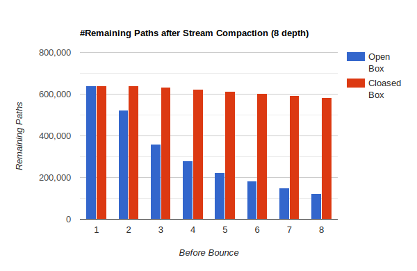

CUDA Path Tracer
================

**University of Pennsylvania, CIS 565: GPU Programming and Architecture, Project 3**

* Yuanqi Wang
  * [LinkedIn](https://www.linkedin.com/in/yuanqi-wang-414b26106/), [GitHub](https://github.com/plasmas).
* Tested on: Windows 11, i5-11600K @ 3.91GHz 32GB, RTX 4090 24GB (Personal Desktop)

# Overview

A CUDA-based path tracer based on Monte Carlo sampling.

This path tracer harnesses the parallel processing power of modern NVIDIA GPUs using CUDA to simulate the transport of light in a 3D scene. The Monte Carlo approach allows for accurate simulations of complex lighting phenomena, such as global illumination, caustics, and multiple reflections.

## Feature List

- **Optimized Performance**: By leveraging the CUDA platform, the path tracer significantly boosts ray tracing speeds, distributing ray computations across numerous GPU cores. Additional optimizations include:
  - Stream compaction and material sorting to minimize warp divergence.
  - Caching primary rays and first intersections to eliminate redundant calculations.

- **Versatile Surface Shading**: The path tracer supports a diverse range of surfaces, encompassing:
  - Ideal diffusive (Lambertian) surfaces.
  - Perfect and imperfect specular surfaces.
  - Refractive materials.

- **Multiple Importance Sampling (MIS)**: For shading imperfect specular surfaces, MIS is judiciously utilized to mitigate fireflies and reduce variance.

- **Advanced Antialiasing**: Stochastic sampling with sub-pixel space jittering enhances antialiasing, ensuring smooth and polished edge renderings.

- **Authentic Depth-of-Field**: The path tracer offers a physically-based depth-of-field, allowing for user-specified aperture diameters and focal lengths, enhanced with random aperture jittering.

- **Specialized Camera Effects**:
  - **Fish-Eye Camera**: Create wide-angle, distorted visual effects characteristic of a fish-eye lens.
  - **Panorama Camera**: Capture sweeping, wide-angle views perfect for panoramic visuals.

- **Dynamic Motion Blur**: Introducing motion into static scenes, the `VELOC` tag lets users assign velocity vectors to objects. Combined with adjustable shutter time, this feature vividly captures the effects of motion blur.

## Path Tracing Pipeline

Our path tracer meticulously constructs a detailed rendering of a scene by iterating over rays projected from the camera, accumulating the final colors of each ray. The iterative process can be delineated into the following phases:

1. **Primary Ray Generation**:
   - In this phase, rays emanating from the camera are synthesized in a parallelized manner.
   - A caching system is in place that, when activated, preserves primary rays and their initial intersections for reuse in subsequent iterations. 
   - In scenarios where caching is disabled, advanced features such as antialiasing, motion blur, and other intricate camera effects are operational.

2. **Intersection Computation**:
   - A parallelized computation is carried out to determine each ray's intersection against the entirety of the scene.
   - The system is equipped to handle some of primitives, like cubes and spheres.

3. **Shading & Ray Scattering**:
   - Drawing from each ray's properties and its intersection data, the ray's color is refined using a selection of BSDFs. Furthermore, a direction is charted for the succeeding ray in the next iteration.

4. **Partial Color Accumulation**:
   - Rays that either intersect with a light source or reach their bounce threshold have their colors aggregated.
   - Stream compaction is utilized to remove these rays post color collection.

5. **Termination Assessment**:
   - The iteration is concluded if no active rays remain. If active rays persist, the process returns to the second phase.

# Features

## 1. BSDFs for Basic Materials

The path tracer has support for basic BSDFs, including pure diffusive (Lambertian) surfaces, and pure specular (mirror-like) surfaces.

Pure Diffusive (5000 iters, 8 depth)   |  Pure Specular (5000 iters, 8 depth)
:-------------------------:|:-------------------------:
  |  

## 2. Active Path Stream Compaction

To minimize wrap divergence, terminated paths are removed at each bounce. This is done by first collect colors of terminated paths and then stream compaction which checks the remaining number of bounces for each ray. Stream compaction is implemented by `thrust::remove_if` function.

To quantify the benefits of stream compaction, the number of active paths are recorded in every bounce, within one iteration. The original cornell box (open) and a closed cornell box are used to compare the benefits between open systems and close systems.

The graphs shows that for both open and closed boxes, the number of remaining active paths decrease as the number of bounces increases, but the decrease is more obvious in the open box. This is expected as open box allows paths to escape the box to enter the void, but not for closed boxes. Open box also has a steady decrease of active paths, which is due to paths hitting light sources and terminating prematurely. Therefore we can say that for this specific path tracer, the benefits of stream compaction increases for more closed system and also fore systems with more light sources.

Compared to no stream compaction - launching 640,000 thread for 8 time, - stream compaction eliminates over 51.5% of number of threads launched in an open box, and only about 3.8% in a closed box. These threads correspond to inactive paths, and would cause an unnecessary overhead.

## 3. Material Sorting

Also to minimize wrap divergence, paths and their intersections are sorted acccording to the material type they hit in each iteration, so that each wrap will contain more threads that will access the same material info. `thust::sequence` is used to generate a sequence of indices, and then sorted with `thrust::sort` according to intersection material ids. Finally, paths and intersections are shuffled according to the sorted indices.

To understand the outcome of this optimization, we measure average time to generate a frame, using the original Cornell box with only 4 material types.

Without material sorting, it takes about 3.0ms per frame. And with sorting, the time comes to 7.7ms. It is obvious that for this specific scene, sorting materials actually has negative impact on performance. Even though sorting materials indeed enhance memory coarsening, the sorting overhead dwarfs the benefit of memory coarsening, especially when the number of materials is low.

## 4. Primary Ray & First Interaction Caching

In situations where there is no randomization in the generation of first ray and the objects are static, primary rays are always the same, as well as their first intersections with the scene. Therefore, we can cache the primary rays at the beginning of the first iteration, in the `pathtraceInit()` method. When the camera moves, the init function will be called again, and the cache will be updated.

From the testing result under different maximum bounce limit, it seems that the performance difference is a constant factor, and does not increase with the bounce limit. This is expected because the only computation eliminated is the first bounce of each iteration, and subsequent bounces are the same. On my GPU, the performance gain of caching is on average 0.28ms.

## 5. Refraction

The path tracer also supports ideal refraction, combined with Frensel's effect, which is emulated by Schlick's approximation.

# Reference