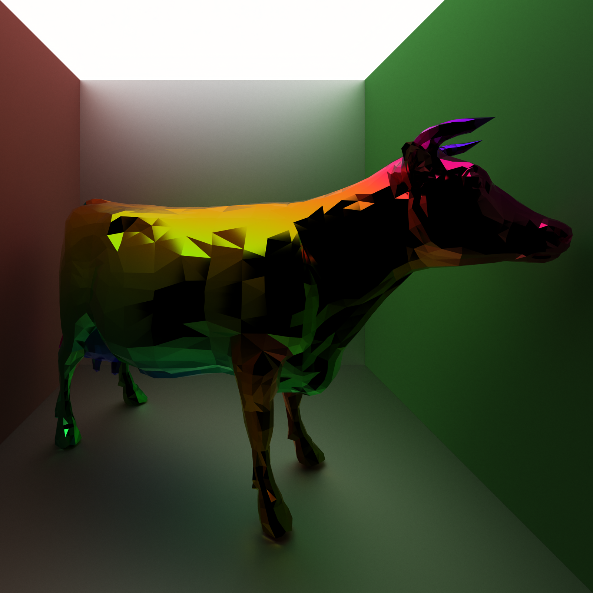
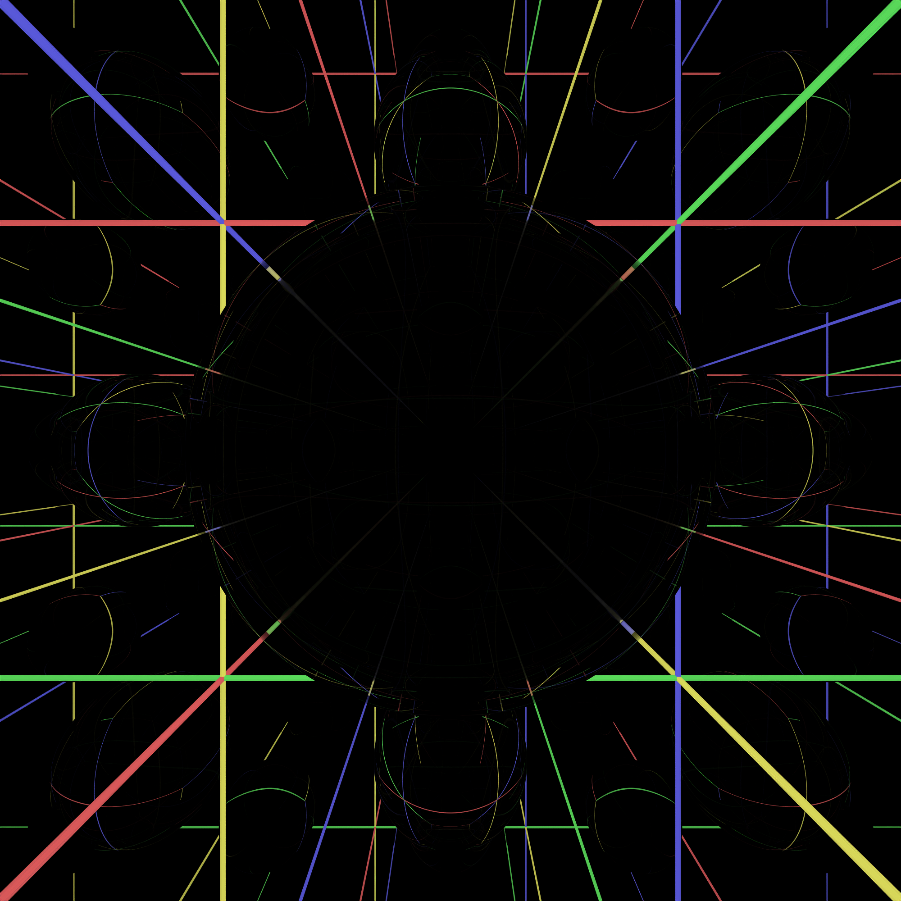
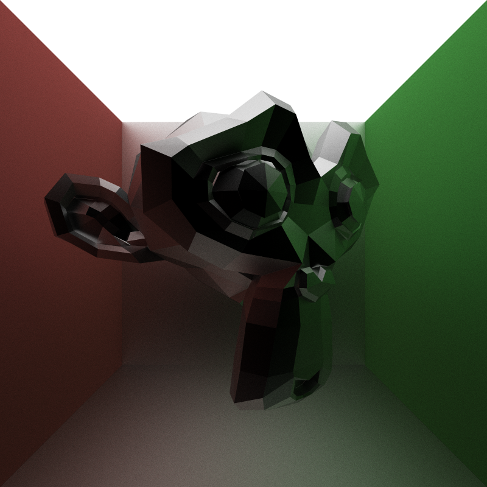

CUDA Path Tracer
================

**University of Pennsylvania, CIS 565: GPU Programming and Architecture, Project 3**

* Zhenzhong Tang
  * [LinkedIn](https://www.linkedin.com/in/zhenzhong-anthony-tang-82334a210), [Instagram](https://instagram.com/toytag12), [personal website](https://toytag.net/)
* Tested on: Windows 11 Pro 22H2, AMD EPYC 7V12 64-Core Processor (4 vCPU cores) @ 2.44GHz 28GiB, Tesla T4 16GiB (Azure)

---
## Overview

A path tracer is a rendering technique that simulates the behavior of light in a scene. It uses Monte Carlo method to estimate the radiance at each pixel of an image by tracing the path of light through the scene. The algorithm is iterative and parallel in nature, so it runs intuitively and fairly well on CUDA. And it is able to simulate many effects that are difficult with other rendering techniques, such as soft shadows, depth of field, caustics, ambient occlusion, and indirect lighting.

| Coffee Shop | Stanford Bunny |
| :------------------: | :---------------: |
|  |  |
| **Cow** | **Gear** |
|  |  |

All the above scenes were rendered in $2000 \times 2000$ resolution with $1000$ samples per pixel and $8$ light bounces.

And we also have an interesting mirror scene, where a glossy sphere is placed in a cube with all sides mirrors, rendered in $2000 \times 2000$ resolution with $200$ samples per pixel and with different number of light bounces.

| 1 Bounce | 8 Bounces | 64 Bounces |
| :------: | :-------: | :--------: |
|  |  |  |

## Visual Features

### Material System

Material system is adopted on the above rendering implementation from [glTF Specification](https://registry.khronos.org/glTF/specs/2.0/glTF-2.0.html#appendix-b-brdf-implementation).

- **Albedo**: The color of the material.
- **Metallic**: The ratio of diffuse and specular reflection. A value of $0$ means the material is dielectric, and a value of $1$ means the material is metal.
- **Roughness**: The roughness of the material. A value of $0$ means the material is perfectly smooth, and a value of $1$ means the material is pure diffuse reflection.
- **IOR**: The index of refraction of the material. A value of $1$ means the material is vacuum, and a value of $1.5$ is a good compromise for most opaque, dielectric materials.
- **Opacity**: The opacity of the material. A value of $0$ means the material is fully transparent, and a value of $1$ means the material is fully opaque.
- **Emittance**: The emittance of the material. A value of $0$ means the material is not emissive, and a value greater than $0$ means the material is emissive, controlling the brightness of the material.

Using the `metallic` and `roughness` parameter, the material can be either dielectric or metal, and its reflection model can be either diffuse or specular. In addition with multiple importance sampling, the path tracer is able to render imperfect specular materials and produce better roughness effect. Also, by controlling the `ior` and `opacity` of dielectrics, the material can produce glass-like refraction with fresnel effect.

|| Diffuse | Imperfect Specular | Pure Specular |
|-:| :----------: | :-----------: | :----------------: |
|**Dielectric**|  |  |  |
|**Metal**|  |  |  |
|**Glass**|  |  |  |

Use the material system, we can mimic many real-world materials. For example, we have the following materials like aluminum, titanium, stainless steel, and different glasses.

| More of Metal | More of Glass |
| :----: | :---: |
|  |  |

And many Suzanne

| Glass | Aluminum | Yellow Plastic | Stainless Steel |
| :----: | :---: | :---: | :---: |
|  |  |  |  |

All scenes were rendered in $800 \times 800$ resolution with $2000$ spp and $8$ light bounces.

### Anti-Aliasing

Anti-aliasing can be achieved by jittering rays within a pixel. In the following example, the image is rendered in low resolution to exaggerate the effect.

| AA OFF | AA ON |
| :----: | :---: |
|  |  |

All scenes were rendered in $200 \times 200$ (up-sampled to $800 \times 800$) resolution with $2000$ spp and $8$ light bounces.

### Physically-Based Depth-of-Field

Depth-of-field can be achieved by jittering rays within an aperture. In the following example, the aperture is modeled as a circle with a radius of $0.5$ and the focal length is $10$.

| DoF OFF | DoF ON |
| :-----: | :----: |
|  |  |

All scenes were rendered in $800 \times 800$ resolution with $2000$ spp and $8$ light bounces.

### Mesh Loading

With the help of [tinyobjloader](https://github.com/syoyo/tinyobjloader) and [tinygltf](https://github.com/syoyo/tinygltf/) libraries, the path tracer is able to load `.obj` and `.gltf` files (partially). Thus, we can render more complex scenes.

### Procedural Textures

Procedural textures can be achieved by using the barycentric interpolated uv coordinate of the intersection point. Check out the following example.

| Gradient Mario | Checkerboard Mario |
| :-----: | :----: |
|  |  |

All scenes were rendered in $800 \times 800$ resolution with $1000$ spp and $8$ light bounces.

### Open Image Denoise

[Open Image Denoise](https://www.openimagedenoise.org/) is a high-performance, high-quality denoising library for ray tracing. It is able to remove noise from rendered images without losing much details. Additional filters like albedo and normal map are added to the denoiser pre-filter to improve the quality of the denoised image.

The denoiser is integrated into the system as a post-processing step. Triggered every fixed number of intervals, the denoised image is merged to the original image using exponential moving average.

The following example shows the effect of the denoiser with $200$ samples per pixel, a relatively low sample rate.

| Denoiser OFF | Denoiser ON |
| :----------: | :---------: |
|  |  |

All scenes were rendered in $800 \times 800$ resolution with $200$ spp and $8$ light bounces.

## Performance Features

### Stream Compaction

When a ray hits a light source, goes into void, or exceeds the maximum number of bounces, it is terminated. The terminated rays are removed from the ray pool using stream compaction. Luckily the stream compaction algorithm is already implemented in the [CUDA Thrust](https://docs.nvidia.com/cuda/thrust/index.html) library, we can use `thrust::remove_if` or in this case `thrust::partition` to remove the terminated rays from the ray pool. Any custom work efficient stream compaction implementation with shared memory optimization and bank conflict avoidance, like [Project2-Stream-Compaction](https://github.com/toytag/Project2-Stream-Compaction), will do just fine.

### First Bounce Caching

When anti-aliasing is not enabled, the first ray from the camera is always the same for every iteration. So we can cache the first ray bounce and reuse it for every iteration. However, this optimization is not particularly useful when more advanced visual features like anti-aliasing, depth-of-field, and motion blur are enabled.

### Material Sorting

Additionally, we could sort the rays by material type to improve the performance. The idea is that rays with the same material type will have similar process time so that we can reduce warp divergence. However, this optimization later proved to be not very useful and even harmful to the performance. The reason is that the sorting process itself is very expensive compared to the performance gain. There is not no significant performance improvement to compensate for the cost.

### Bounding Volume Hierarchy

Bounding volume hierarchy (BVH) is a tree structure on top of the scene geometry to accelerate ray tracing. The idea is to group the scene geometry into a hierarchy of bounding volumes, and the ray tracer can quickly discard the entire group of primitives if the ray does not intersect with the bounding volume.

Image from [PBRT 4.3](https://pbr-book.org/3ed-2018/Primitives_and_Intersection_Acceleration/Bounding_Volume_Hierarchies) is a good illustration of BVH true. The BVH is built using the equal count partition method, which tries to split the primitives into two equal sized groups. The BVH is built on the CPU in a linear buffer (heap like structure) and then copied to the GPU for ray tracing.

## Performance Analysis

Let's take a look at the performance of the path tracer with different features enabled. We will use most loved Mario as the test scene. Stream compaction plays a important role in the correctness of the algorithm in addition to its performance benefits. So stream compaction will be enabled in all tests and we will use path tracer with only stream compaction method enabled as the baseline.

## References
