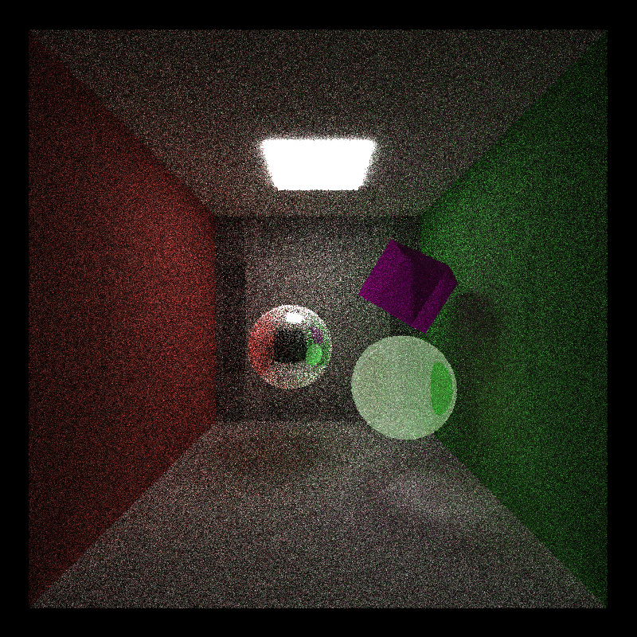

CUDA Path Tracer
================

**University of Pennsylvania, CIS 565: GPU Programming and Architecture, Project 3**

* Zhiyu Lei
  * [LinkedIn](https://www.linkedin.com/in/zhiyu-lei/), [Github](https://github.com/Zhiyu-Lei)
* Tested on: Windows 22, i7-2222 @ 2.22GHz 22GB, GTX 222 222MB (CETS Virtual Lab)

(This output is generated from the scene in [scenes/customize.txt](scenes/customize.txt))

### Project Features
#### A shading kernel with BSDF evaluation for diffuse and specular-reflective surfaces
For a non-reflective (i.e. diffuse) surface like the side wall in the output image, a ray intersected with the surface changes its direction to a cosine-weighted random direction in a hemisphere around the surface normal.

For a specular-reflective surface like the metal ball in the output image, a ray intersected with the surface has a 50% probability to change its direction according to the specular reflection law, while another 50% probability to change its direction as diffuse reflection.

#### Path continuation/termination using Stream Compaction
A path terminates when the corresponding ray intersects with a light source or no longer intersects with any objects. Those terminated paths no longer need to be traced any more and can already have their pixels colored. In this case, Stream Compaction can be applied to filter and continue with only unterminated paths for the next bounces.

The plot below shows how many unterminated paths remain after each bounce within one iteration in the reference scene:

Also, for a closed scene where no light can escape, Stream Compaction can still improve efficiency. This is because though every ray must intersect with some objects, there can be some rays terminating by intersecting with light sources.

#### Sorting intersections and pathSegments by material types
In each bounce after the intersections are computed, the intersections and the corresponding pathSegments are reordered so that the same materials are contiguous in memory before shading. However, I did not experience much performance improvement, and the process of sorting by material types could be even more costly than randomly accessing in memory.

#### Refraction with Frensel effects using Snell's law
For a refractive material like the glass ball or the purple crystal cube in the output image, a ray intersected with the material has a 99% probability to pass through the material following Snell's law, while another 1% probability to change its direction as diffuse or specular reflection on the surface.

#### Stochastic Sampled Antialiasing
The following two images show a comparison of outputs after 50 iterations between with and without antialiasing where the rays are somewhat jittered through the pixels. The output without antialiasing is quite noisier than the one with, particularly on the glass ball.
|With antialiasing|Without antialiasing|
|:---:|:---:|
|||

#### Direct lighting by taking a final ray directly to a random point on an emissive object acting as a light source
The following two images show a comparison of outputs after 50 iterations between with and without direct lighting where the final rays intersect with objects acting as light sources. The output without direct lighting is darker than the one with, and even comtains some incorrect black pixels.
|With direct lighting|Without direct lighting|
|:---:|:---:|
|||

#### Jittered sampling for Monte Carlo ray tracing
The following two images show a comparison of outputs after 50 iterations between jittered sampling (on a grid with the same resolution as the output) and normal random sampling. The output with normal random sampling is a little bit noisier than the one with jittered sampling.
|Jittered sampling|Random sampling|
|:---:|:---:|
|||
