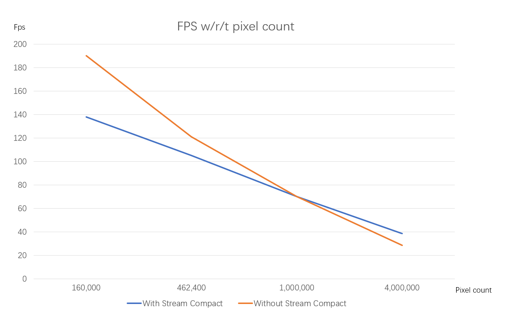

CUDA Path Tracer
================
A GPU Path Tracer implemented on CUDA C++.

**University of Pennsylvania, CIS 565: GPU Programming and Architecture, Project 3**

* Mengxuan Huang
  * [LinkedIn](https://www.linkedin.com/in/mengxuan-huang-52881624a/)
* Tested on: Windows 11, i9-13980HX @ 2.22GHz 64.0 GB, RTX4090-Laptop 16384MB
## Outcome
Astartes of Warhammer 40,000


- **Thanks [Constantine Nikolaenko](https://www.cgtrader.com/badmaker91) from [cgtrader](https://www.cgtrader.com/) and [Games Workshop](https://www.games-workshop.com/en-US/Warhammer-40-000?_requestid=20431942) for this fantastic [Astartes of Steppe Hawks chapter Free 3D model](https://www.cgtrader.com/free-3d-models/character/sci-fi-character/astartes-of-steppe-hawks-chapter)!!**
- **Thanks for this [Rathaus Environment Map](https://polyhaven.com/a/rathaus) HDR environment map.**

## Features
- [Camera Controll & GUI](#camera-control--gui)
- [Customized JSON scene file](#json-scene-file)
- [Stochastic Sampled Anti-aliasing]()
- [Bounding Volume Hierarchy]()
- [Tone mapping]()
- [Mesh Loader(obj) and texture mapping]()
- [BSDFs]()
  - Diffuse Reflection
  - Specular Reflection
  - Specular Refraction
  - Microfacet Reflection
  - Subsurface Scattering
- [Physically-based depth-of-field]()
### Camera Control & GUI
-----------------------------
#### Camera
- `ctrl + LMB` : Rotate camera around reference point
- `shift + LMB` : Pan camera and reference point 
- `mouse scroll whell`: camera zomm in/out
#### GUI
|Description|ImGui|
|-------|------|
|Display fram time, frame rate per second, and same image button||
|Display and adjust camera configuration||
|Display and adjust parameters of the default material||

### JSON scene file
-----------------------------
To accelerate develop, testing, and scene set-up, I defined json-basde scene files as well as implemented a json reader based on [Json File Reader](https://github.com/nlohmann/json).
Here is a simple example of a scene with a camera, a Cube and a Light.
```
{
  "resources path": "resources/",
  "camera": {
    "ref": [ 0, 2.5, 0 ],
    "position": [ 0, 5.5, -30 ],
    "fovy": 19.5,
    "resolution": [ 680, 680 ],
    "interation": 1000,
    "depth": 8
  },
  "materials": [
    {
      "name": "WhiteLight",
      "albedo": [ 1, 1, 1 ],
      "emittance": 40.0
    },
    {
      "name": "MatteWhite",
      "type": "DiffuseReflection",
      "albedo": [ 0.85, 0.81, 0.78 ]
    }
  ],
  "geomerties": [
    {
      "type": "obj",
      "path": "meshes/plane.obj",
      "name": "light",
      "material": "WhiteLight",
      "translation": [ 0, 7.45, 0 ],
      "rotation": [ 0, 0, 0 ],
      "scale": [ 1.5, 1, 1.5 ]
    },
    {
      "type": "obj",
      "path": "meshes/cube.obj",
      "name": "Cube",
      "material": "MatteWhite",
      "translation": [ -2, -1, 0.75 ],
      "rotation": [ 0, -17.5, 0 ],
      "scale": [ 1.5, 1.5, 1.5 ]
    }
  ]
}
```
This is an example of [CornellBox scene](/resources/scenes/CornellBox). You can find more samples in [Resources](/resources/scenes/)
<p align = "center">
 
</p>

**Defualt material will be applied to a geomertiy if not explicit indicate its material in both scene file and obj file**

### Stochastic Sampled Anti-aliasing
-----------------------------------
|Without Anti-aliasing|With Anti-aliasing|
|:---------:|:---------:|
|||
|||

### Bounding Volume Hierarchy
----------------------------------
If we want to make the scene interesting, polygons with more triangles are required, which means more ray-scene intersection testing time! To optimize this, I implemented Bounding Volume Herearchy (BVH) in the project to accelerate the intersection testing process.

I test the BVH with a [Astartes of Steppe Hawks chapter Free 3D model](https://www.cgtrader.com/free-3d-models/character/sci-fi-character/astartes-of-steppe-hawks-chapter) *338869 triangles*

*2560x1369 resolution with only 1 ray-intersection test per pixel per frame*

||without BVH| Middle Split BVH| SAH BVH|
|------|------|------|------|
|fps|0.1|130.27|134.7|

### Tone mapping
-----------------------------
|Without tone mapping|With tone mapping|
|---------|---------|
|||

In this project, I simply used $x = \frac{x}{1 + x}$. However, there are more interesting tone mapping  to be tried.

### Mesh Loader(obj) and texture mapping
-----------------------------
Now, it is time to make the scene vivid! I implemented a mesh loader based on [TinyObjLoader](https://github.com/tinyobjloader/tinyobjloader) to load obj files with materials(albedo map, normal map, roughness map, and metallic map). 
|Without normal mapping|With normal mapping|
|---------|---------|
|||

Here are two image render with diffuse reflection material
|mario|astartes|
|---------|---------|
|||

### BSDFs
-----------------------------
To make the scene more fancy, I implement multiple BSDFS
<p align = "center">
 
</p>

|Diffuse Reflection|Specular Reflection|Specular Refraction|Microfacet Reflection|Microfacet Reflection(with metallic parameter)|
|------|-------|-------|------|------|
||||||

#### Subsurface Scattering
<p align = "center">
 
</p>
I implemented a simple subsurface scattering by allowing rays to scatter randomly within the object, which requires large path depth(usually larger than 16) to obtain a relatively clear image.

#### BSDF with texture mapping
After applying texture mapping, we can have an impressive rendered Astartes! 


### Physically-based depth-of-field
Finally, I implemented Physically-based depth-of-field to make photo-realistic image.
|CornellBox | Material Ball| Environment only|
|------|-------|------|
||||

### Performance Analysis
-----------------------------
#### Compact terminated pathes

- *[Astartes of Steppe Hawks chapter Free 3D model](https://www.cgtrader.com/free-3d-models/character/sci-fi-character/astartes-of-steppe-hawks-chapter) *338869 triangles*
- *1 ray-intersection test per pixel per frame*
- *Trace depth is 8*

As shown in this chart, compact terminated pathes are not always an optimization. When pixel count is small. This might because when the number of path is small, GPU computation resources are not fully utilized, compact path-segments will not accelerate GPU computation but introduce extra time for compacting.

Therefore, I set a threshold of pixel count to dynamic determine whether to compact terminated pathes.

#### Sort by materials
I tried this method, but it increased the frame time significantly, up to 150 ms/frame, even for a simple scene. I suppose the sorting is costly and morden GPU can group threads that executing same instructions without we explicitly do that.

#### First intersection cache
This is a common technique used in real-time ray tracing, which is based on the G-Buffer computed by rasterization. However, this is not a feasible optimization on path tracer since we need to stochastic sample each pixel to perform anti-aliasing and we have physically-based depth of field camera, which means the intersection point of each frame (or interation) are not fixed.

#### Try used shared memory as stack when traverse BVH
Considering the use of large number of registers in thread will limit the occupancy. I tried to used shared memeory performanced as `stack` when traverse the BVH. This won't have bank conflict when each thread within a warp use a `bank` as a `stack`. However, this method increased the frame time and the traverse slower.

I guess this might because large shared memory also limits the occupany, which is the even worse than using registers.

### Third Party Credit
-----------------------------
#### Third party Resources
- [Astartes of Steppe Hawks chapter Free 3D model](https://www.cgtrader.com/free-3d-models/character/sci-fi-character/astartes-of-steppe-hawks-chapter)
- [Rathaus Environment Map](https://polyhaven.com/a/rathaus)

#### Third Party Library
- [Json File Reader](https://github.com/nlohmann/json)
- [TinyObjLoader](https://github.com/tinyobjloader/tinyobjloader)
