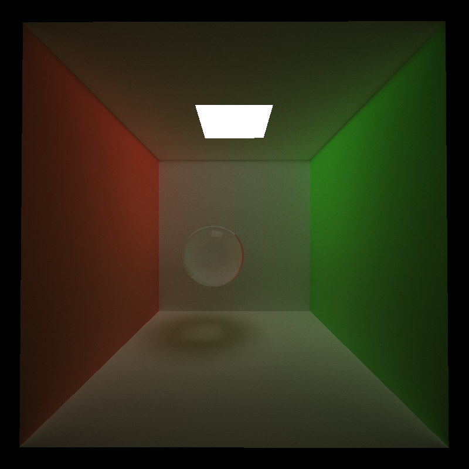
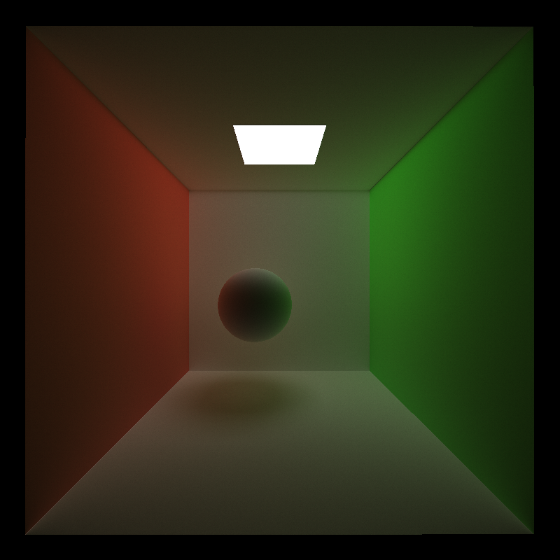

CUDA Path Tracer
================

**University of Pennsylvania, CIS 565: GPU Programming and Architecture, Project 3**

* Helena Zhang
* Tested on: Windows 11, i7-10750 @ 2.6GHz 16GB, Geforce RTX 2060 6GB

Note: All renders are rendered at 5000 samples at 800 * 800 resolution, 128 blocksize, with Direct Lighting and Cache first bounce enabled, no depth of field, unless stated otherwise

Features
================
**Mesh import (glTF)**

Performance impact: To check a path's intersection with a mesh, the naive approach would be checking the path's intersection with every triangle comprised of the vertices on the mesh. The more vertices the mesh has, the longer it takes to check for a path's intersection with the mesh. 

**Direct Lighting**

Performance impact: Direct lighting adds contribution from a light source at every bounce of a ray. In an naive approach, this would involve sampling a light source at every bounce, and checking to see if there are no obstructions between the light source and the intersection point. Since there's an extra intersection check per bounce, shading with direct lighting would slow down runtime, especially with complex meshes. For the octopus mesh in the Cornell box, naive lighting runs at 12.6 FPS, while lighting with direct lighting runs at 6 FPS. This feature can be optimized with an accelerated structure, such as kd-tree or BVH. 

**Refraction**

Performance impact: There is little to no performance impact for refraction as it adds a singular and constant computation for any intersection with a refractive object. 

**Depth of Field Camera**

Lens Radius:

Focus Distance Effect: 

Performance impact: There is little to no performance impact for refraction as it adds a singular and constant computation for each starting path. 

Analysis
================
**Stream compaction**
For Stream compaction, the pathtracer uses thrust::partition to remove any rays that did not encounter an intersection, since they will no longer contribute any colors on the pixel. For the cornell box, the following figure shows the number of paths remaining after each bounce. 

Starting with 640,000 (800 * 800) paths in the first bounce, the decrease from depth 1 to 2 is constant. This is because the first path for each pixel is the same; it goes from the eye of the camera to the direction of the pixel. Then, as the path bounces around the scene, the number of rays will exponentially decrease, as a certain percentage of rays will leave the box at every bounce. 

Stream compaction improves performance by eliminating any rays that will no longer contribute to a pixel's accumulated color. However, stream compaction would not have any effect in say, a closed scene. 

 

Open Cornell Box

Closed Cornell Box

In these two renders, one is an open box and one is a closed box. In terms of appearance, the closed box is brighter than the open box. This is because none of the paths will be eliminated, so every path will get 8 bounces to accumulate light on the pixel, whereas most pixels on the open box will not get the same number of chances to accumulate color on itself. However, as mentioned before, this brighter image comes at the cost of its runtime. The FPS of the open Cornell box is 28.6 FPS, whereas the FPS of the closed Cornell box is 17.4 FPS.

