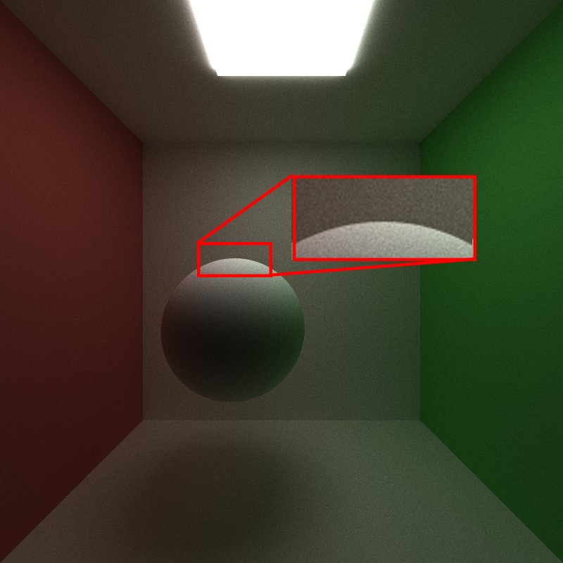

CUDA Path Tracer
================

**University of Pennsylvania, CIS 565: GPU Programming and Architecture, Project 3**

* Utkarsh Dwivedi
  * [LinkedIn](https://www.linkedin.com/in/udwivedi/), [personal website](https://utkarshdwivedi.com/)
* Tested on: Windows 11 Home, AMD Ryzen 7 5800H @ 3.2GHz 16 GB, Nvidia GeForce RTX 3060 Laptop GPU 6 GB

# CUDA Path Tracer


## Introduction

This is a CUDA implementation of a simple path tracer with bounding volume heirarchy (BVH) based acceleration. The basic path tracer setup shoots a ray from every single pixel in the image resolution (width * height) and traces each ray for `n` bounces, or until the rays hit a light source. At each bounce, luminance information is captured as a throughput value and a final gather on all the rays gets the final colour for each pixel. This is performed using a Monte Carlo estimation of the Light Transport Equation Integral (LTE), which is as follows:


```math
L_O(p,\omega_o) = L_E(p,\omega_o) + \int_{s} f(p,\omega_o,\omega_i)  L_i(p,\omega_i) V(p\prime,p) |dot(\omega_i, N)| \,d\omega_i
```

## Table of Contents

- [Features](#features)
  - [1. Bidrectional Scattering Distribution Functions](#1-bidrectional-scattering-distribution-function-computation)
- []()
- 
## Visual Features

### 1. Bidrectional Scattering Distribution Function Computation

**Quick note on terminology**

- BSDF = Bidirectional **Scattering** Distribution Function
- BRDF = Bidirectional **Reflection** Distribution Function
- BTDF = Bidirectional **Transmission** Distribution Function

<ins>**Lambertian Diffuse BRDF, Perfect Specular BRDF, Perfect Refraction BTDF**</ins>

This path tracer supports lambertian diffuse and perfectly specular (reflective), and perfectly transmissive (refractive) materials.

||||
|:-:|:-:|:-:|
|Lambertian Diffuse|Perfect Specular|Perfect Refraction|

In **diffuse BRDF**, light is reflected in all directions, with in the hemisphere with a probability distribution function (PDF) based on cosine weighted hemisphere sampling, i.e., there is a higher probability of light bouncing in a direction that is more aligned with the surface normal. The PDF accounts for any bias that results from the cosine weighting.

In **reflection (specular BRDF)**, light is always reflected in a direction that is the *perfect reflection* along the surface normal.

In **refraction (specular BTDF)**, light is refracted in exactly one direction based on the **indices of refraction** of the two media (one of the object that the light is exiting, and the other of the object that the light is entering). In the case where the angle of incidence is greater than the critical angle, total internal reflection happens, in which case the reflection falls back to **specular BRDF** reflection along the surface normal.

The Index of Refraction (IOR) value of the material can be specified in the `<sceneName>.txt` file under the `MATERIAL` (for example, in the case of glass, this would be `IOR 1.55`). The path tracer assumes that the main transport medium is air, and hard-codes that IOR to 1.

<ins>**Glass and Plastic Materials**</ins>

Additionally, there is support for imperfect specular and refractive materials, using **fresnel computation**. If a material has either  both reflective and refractive (glass) properties, or both reflective and diffuse (plastic) properties, then the ray either performs reflective BSDF calculation, or diffuse/refractive BSDF computation with an equal weight given to both. Specular reflection is only applied to areas on the geometry where the surface normal is not aligned to the view direction (fresnel), and diffuse and refractive BSDFs are applied to the other directions. Since both reflection and diffuse/refraction are only computed half the times, their contributions are boosted twice to account for bias.

|||
|:-:|:-:|:-:|
|Glass|Plastic|Plastic + Glass|

**Caustics**

Caustics are a direct result of light refracting through surfaces, as seen above in the glass example image. It becomes more apparent with a more complex shape like an icosphere.

||
|:-:|
|Caustics from refraction through glass|

**Fireflies**

Because there is indirect illumination (global illumination) support in this path tracer, some scenes may result in *fireflies*, which are very brightly coloured dots on surfaces where the colours of the dots does not match the material of that surface. This happens because light that bounces off surfaces that have very bright caustics effects will carry illumination from those surfaces. This effect can be seen in this below example, where a sphere is close enough to a box behind it to cause a region of very bright yellow caustics. Any light ray bouncing off of this region carries high luminance with it and deposits that in the form of fireflies.

||
|:-:|
|Fireflies|

### 2. Anti-aliasing with subpixel ray jittering

When rays are generated, instead of shooting them directly through the center of each pixel, the rays are offset by a slight amount. This jittering helps reduce aliasing. The effect can be seen in the below comparison, where the left image has aliased edges on the sphere, but the right one does not.

|||
|:-:|:-:|
|Without anti-aliasing|With anti-aliasing|

### 3. Depth of Field using Thin Lens Camera Model

This path tracer assumes a *pinhole camera model* to be the default camera model, but it can be overriden to be a *thin lens camera model* to produce approximated depth-of-field effects. A thin lens camera has a radius instead of a single point through which the ray passes, as well as a focal length. These values can be added to the `CAMERA` model in the `<sceneName>.txt` file by adding `APERTURE` and `FOCALLENGTH`.

The implementation is as follows: if the aperture size is greater than zero, then after generating a ray from the center of the lens (so the same ray as the pinhole camera ray), a focal point is found where the ray would intersect the focal plane. Then, a new ray is generated from a random point on the lens to this focal point, and this is the ray that is used for the path tracing. The random point generation is done by sampling 2 random floating point numbers in the range [0,1] and mapping that square (x,y) sample point to a sample point on a concentric disk, since the lens is a disk.

<table>
    <tr>
        <td></td>
        <td></td>
        <td></td>
    </tr>
    <tr>
        <td>Aperture size 0.0 (no DoF)</td>
        <td>Aperture size 0.2 (low DoF)</td>
        <td>Aperture size 0.5 (high DoF)</td>
    </tr>
    <tr>
        <td colspan=3 align="center">Varying aperture size | middle object in focus </td>
    </tr>
</table>

<table>
    <tr>
        <td></td>
        <td></td>
        <td></td>
    </tr>
    <tr>
        <td>Low focal length</td>
        <td>Medium focal length</td>
        <td>High focal length</td>
    </tr>
    <tr>
        <td colspan=3 align="center">Varying focal length | different objects in focus </td>
    </tr>
</table>

### 4. GLTF Mesh Loading

This path tracer supports loading of mesh data from GLTF files stored with the GLTF 2.0 spec.

|||
|:-:|:-:|

**Mesh Triangulation**: if indices buffers exist in the GLTF data, they're used in the triangulation of the mesh, otherwise *fan triangulation* is applied on the position buffers.

**Interleaved vs separate buffers**: This project supports loading of position-vertex-normal data that is either stored as separate buffers or as a single interleaved buffer.

**Normals**: if normal buffers exist for every vertex, they're barycentrically interpolated to find the normal at the intersection point for lighting calculation, otherwise a flat-shaded model is used. The normal for each triangle is calculated using the cross-product of any two of its edges.

|||
|:-:|:-:|
|Flat Shaded Normals|Barycentrically Interpolated Normals|

### 5. High Dynamic Range (HDR) and Gamma Correction

## Performance Optimization Features

### 1. Ray termination using stream compaction

During path tracing, there are many rays that hit nothing, and this is especially true for open scenes with not a lot of geometry to intersect with. Unnecessary computations on these rays impact performance. Stream compaction helps with terminating the rays that don't hit anything for a further bounce. This can be toggled using the `STREAM_COMPACT` preprocessor directive in `utilities.h`.

### 2. Mesh sort by materials for GPU coherency

This project handles all material calculations in a single CUDA kernel. Meshes exist in a mesh array. Each mesh has a material index associated with it, that is used to index into a separate material array from which the material for that mesh is retreived in the kernel. This is a coherency and thread divergence problem, as meshes with the same material are not aligned in the mesh array, therefore divergence will increase with increasing number of materials.

To help with this, there is an option to toggle sorting of meshes by their material ids to reduce thread divergence. This can be toggled using the `SORT_BY_MATERIAL` preprocessor directive in `utilities.h`.

### 3. First bounce cache

In the scenario where the first rays are always cast from the center of the pixel into the pinhole camera, the first bounce for each ray can be cached, as these rays are deterministic and will always be the same. However, this caching becomes useless as soon as more complex features are added, such as a the thin-lens camera model or subpixel jittering for anti-aliasing. First bounce caching can be toggled using the `CACHE_FIRST_INTERSECTION` preprocessor directive in `utilities.h`. Warning: using this will automatically disable thin-lens camera and anti-aliasing.

### 4. Ray termination via russian roulette

Ray termination via russian roulette terminates rays that are less likely to contribute to the overall colour of the scene, and boosts the contribution of rays that do contribute to combat the bias introduced by early ray termination. In this implementation, each ray is terminated based on a random probability `q` if the maximum of the ray's throughput is less than the probability. Otherwise, the ray's contribution is divided by `q` to boost its contribution. Russian roulette can be enabled using the `ENABLE_RUSSIAN_ROULETTE` preprocessor directive in `utilities.h`.

### 5. Simple Axis-Aligned Bounding Box (AABB) Acceleration


### 6. Bounding Volume Hierarchy (BVH) Acceleration


## Performance Analysis

## References

- Adam Mally's CIS 561 Advanced Computer Graphics course at University of Pennsylvania
- TinyGLTF
- PBRT