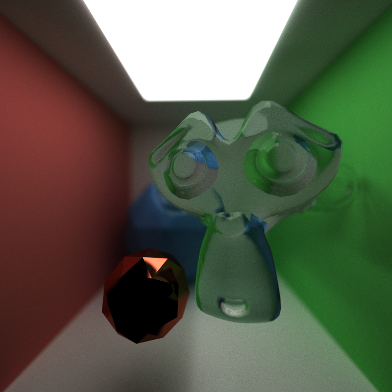
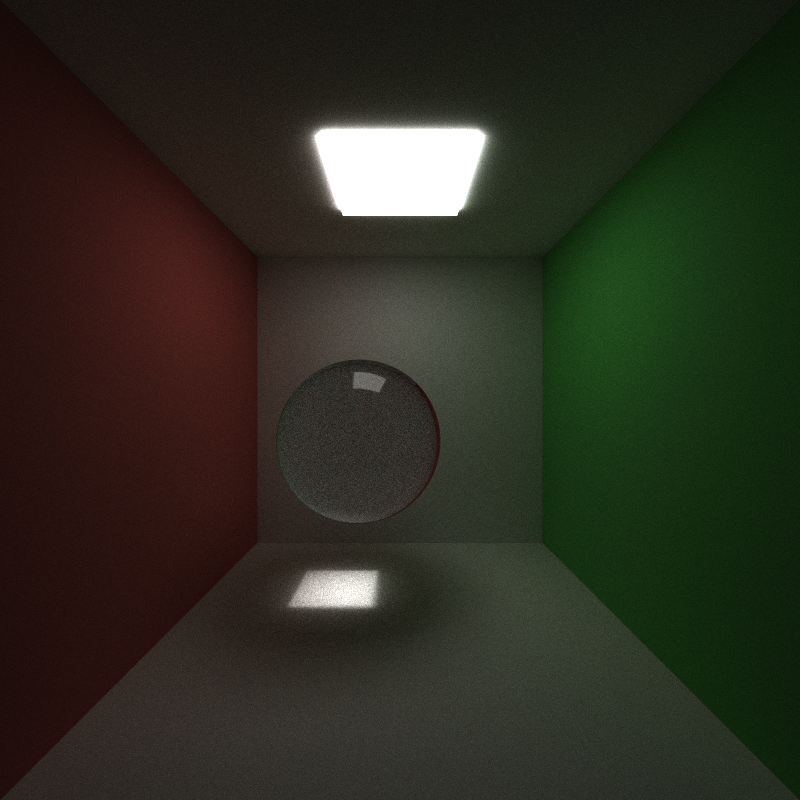

CUDA Path Tracer
================

**University of Pennsylvania, CIS 565: GPU Programming and Architecture, Project 3**

* Utkarsh Dwivedi
  * [LinkedIn](https://www.linkedin.com/in/udwivedi/), [personal website](https://utkarshdwivedi.com/)
* Tested on: Windows 11 Home, AMD Ryzen 7 5800H @ 3.2GHz 16 GB, Nvidia GeForce RTX 3060 Laptop GPU 6 GB

---



## Introduction

This is a CUDA implementation of a simple path tracer with bounding volume heirarchy (BVH) based acceleration. The basic path tracer setup shoots a ray from every single pixel in the image resolution (width * height) and traces each ray for `n` bounces, or until the rays hit a light source. At each bounce, luminance information is captured as a throughput value and a final gather on all the rays gets the final colour for each pixel. This is performed using a Monte Carlo estimation of the Light Transport Equation Integral (LTE), which is as follows:


```math
L_O(p,\omega_o) = L_E(p,\omega_o) + \int_{s} f(p,\omega_o,\omega_i)  L_i(p,\omega_i) V(p\prime,p) |dot(\omega_i, N)| \,d\omega_i
```

Rays are cast for `n` bounces every frame. Rays collect material and global illumination information if and until they hit a light source. This result is gathered at the end of the frame and the result is blended together using lerp on the blended result so far and the current frame render. This produces more accurate results than simple additive blending where the current frame's render is divided by the frame number.

## Table of Contents

- [CUDA Path Tracer](#cuda-path-tracer)
  - [Introduction](#introduction)
  - [Table of Contents](#table-of-contents)
  - [Visual Features](#visual-features)
    - [1. Bidrectional Scattering Distribution Function Computation](#1-bidrectional-scattering-distribution-function-computation)
    - [2. Anti-aliasing with subpixel ray jittering](#2-anti-aliasing-with-subpixel-ray-jittering)
    - [3. Depth of Field using Thin Lens Camera Model](#3-depth-of-field-using-thin-lens-camera-model)
    - [4. GLTF Mesh Loading](#4-gltf-mesh-loading)
    - [5. Tone Mapping](#5-tone-mapping)
  - [Acceleration Features \& Performance Analysis](#acceleration-features--performance-analysis)
    - [1. Ray termination using stream compaction](#1-ray-termination-using-stream-compaction)
    - [2. Mesh sort by materials for GPU coherency](#2-mesh-sort-by-materials-for-gpu-coherency)
    - [3. First bounce cache](#3-first-bounce-cache)
    - [4. Ray termination via russian roulette](#4-ray-termination-via-russian-roulette)
    - [5. Naive Axis-Aligned Bounding Box (AABB) Acceleration](#5-naive-axis-aligned-bounding-box-aabb-acceleration)
    - [6. Bounding Volume Hierarchy (BVH) Acceleration](#6-bounding-volume-hierarchy-bvh-acceleration)
 - [References](#references)

## Visual Features

### 1. Bidrectional Scattering Distribution Function Computation

**Quick note on terminology**

- BSDF = Bidirectional **Scattering** Distribution Function
- BRDF = Bidirectional **Reflection** Distribution Function
- BTDF = Bidirectional **Transmission** Distribution Function

<ins>**Lambertian Diffuse BRDF, Perfect Specular BRDF, Perfect Refraction BTDF**</ins>

This path tracer supports lambertian diffuse and perfectly specular (reflective), and perfectly transmissive (refractive) materials.

||||
|:-:|:-:|:-:|
|Lambertian Diffuse|Perfect Specular|Perfect Refraction|

In **diffuse BRDF**, light is reflected in all directions, with in the hemisphere with a probability distribution function (PDF) based on cosine weighted hemisphere sampling, i.e., there is a higher probability of light bouncing in a direction that is more aligned with the surface normal. The PDF accounts for any bias that results from the cosine weighting.

In **reflection (specular BRDF)**, light is always reflected in a direction that is the *perfect reflection* along the surface normal.

In **refraction (specular BTDF)**, light is refracted in exactly one direction based on the **indices of refraction** of the two media (one of the object that the light is exiting, and the other of the object that the light is entering). In the case where the angle of incidence is greater than the critical angle, total internal reflection happens, in which case the reflection falls back to **specular BRDF** reflection along the surface normal.

The Index of Refraction (IOR) value of the material can be specified in the `<sceneName>.txt` file under the `MATERIAL` (for example, in the case of glass, this would be `IOR 1.55`). The path tracer assumes that the main transport medium is air, and hard-codes that IOR to 1.

<ins>**Glass and Plastic Materials**</ins>

Additionally, there is support for imperfect specular and refractive materials, using **fresnel computation**. If a material has either  both reflective and refractive (glass) properties, or both reflective and diffuse (plastic) properties, then the ray either performs reflective BSDF calculation, or diffuse/refractive BSDF computation with an equal weight given to both. Specular reflection is only applied to areas on the geometry where the surface normal is not aligned to the view direction (fresnel), and diffuse and refractive BSDFs are applied to the other directions. Since both reflection and diffuse/refraction are only computed half the times, their contributions are boosted twice to account for bias.

|||
|:-:|:-:|:-:|
|Glass|Plastic|Plastic + Glass|

**Caustics**

Caustics are a direct result of light refracting through surfaces, as seen above in the glass example image. It becomes more apparent with a more complex shape like an icosphere.

||
|:-:|
|Caustics from refraction through glass|

**Fireflies**

Because there is indirect illumination (global illumination) support in this path tracer, some scenes may result in *fireflies*, which are very brightly coloured dots on surfaces where the colours of the dots does not match the material of that surface. This happens because light that bounces off surfaces that have very bright caustics effects will carry illumination from those surfaces. This effect can be seen in this below example, where a sphere is close enough to a box behind it to cause a region of very bright yellow caustics. Any light ray bouncing off of this region carries high luminance with it and deposits that in the form of fireflies.

||
|:-:|
|Fireflies|

### 2. Anti-aliasing with subpixel ray jittering

When rays are generated, instead of shooting them directly through the center of each pixel, the rays are offset by a slight amount. This jittering helps reduce aliasing. The effect can be seen in the below comparison, where the left image has aliased edges on the sphere, but the right one does not.

|||
|:-:|:-:|
|Without anti-aliasing|With anti-aliasing|

### 3. Depth of Field using Thin Lens Camera Model

This path tracer assumes a *pinhole camera model* to be the default camera model, but it can be overriden to be a *thin lens camera model* to produce approximated depth-of-field effects. A thin lens camera has a radius instead of a single point through which the ray passes, as well as a focal length. These values can be added to the `CAMERA` model in the `<sceneName>.txt` file by adding `APERTURE` and `FOCALLENGTH`.

The implementation is as follows: if the aperture size is greater than zero, then after generating a ray from the center of the lens (so the same ray as the pinhole camera ray), a focal point is found where the ray would intersect the focal plane. Then, a new ray is generated from a random point on the lens to this focal point, and this is the ray that is used for the path tracing. The random point generation is done by sampling 2 random floating point numbers in the range [0,1] and mapping that square (x,y) sample point to a sample point on a concentric disk, since the lens is a disk.

<table>
    <tr>
        <td></td>
        <td></td>
        <td></td>
    </tr>
    <tr>
        <td>Aperture size 0.0 (no DoF)</td>
        <td>Aperture size 0.2 (low DoF)</td>
        <td>Aperture size 0.5 (high DoF)</td>
    </tr>
    <tr>
        <td colspan=3 align="center">Varying aperture size | middle object in focus </td>
    </tr>
</table>

<table>
    <tr>
        <td></td>
        <td></td>
        <td></td>
    </tr>
    <tr>
        <td>Low focal length</td>
        <td>Medium focal length</td>
        <td>High focal length</td>
    </tr>
    <tr>
        <td colspan=3 align="center">Varying focal length | different objects in focus </td>
    </tr>
</table>

### 4. GLTF Mesh Loading

This path tracer supports loading of mesh data from GLTF files stored with the GLTF 2.0 spec.

|||
|:-:|:-:|

**Mesh Triangulation**: if indices buffers exist in the GLTF data, they're used in the triangulation of the mesh, otherwise *fan triangulation* is applied on the position buffers.

**Interleaved vs separate buffers**: This project supports loading of position-vertex-normal data that is either stored as separate buffers or as a single interleaved buffer.

**Normals**: if normal buffers exist for every vertex, they're barycentrically interpolated to find the normal at the intersection point for lighting calculation, otherwise a flat-shaded model is used. The normal for each triangle is calculated using the cross-product of any two of its edges.

|||
|:-:|:-:|
|Flat Shaded Normals|Barycentrically Interpolated Normals|

### 5. Tone Mapping

This path-tracer supports tone mapping using High Dynamic Range (HDR) and gamma correction. Tone mapping can be enabled using the `ENABLE_HDR_GAMMA_CORRECTION` preprocessor directive in `utilities.h`.

[HDR tone mapping](https://bruop.github.io/tonemapping/) uses the Reinhard Operator. This helps reduce washed-out images that have a very large range of bright and dark values.

```math
RGB = RGB_{HDR} / (1.0 + RGB_{HDR})
```

[Gamma Correction](https://www.cambridgeincolour.com/tutorials/gamma-correction.htm) helps convert the images to colours that feel more natural to our eyes using the formula

```math
RGB = RGB^{1/2.2}
```

Without these changes, images may appear very dark or very bright.

|||
|:-:|:-:|
|No tone mapping|HDR + Gamma Correction|

## Acceleration Features & Performance Analysis

### 1. Ray termination using stream compaction

During path tracing, there are many rays that hit nothing, and this is especially true for open scenes with not a lot of geometry to intersect with. Unnecessary computations on these rays impact performance. Stream compaction helps with terminating the rays that don't hit anything for a further bounce. This can be toggled using the `STREAM_COMPACT` preprocessor directive in `utilities.h`.

||
|:-:|:-:|
|Open Scene|Closed Scene|

Based on the graphs above, stream compaction based ray termination does not really impact performance much. In fact, it *reduces* performance in scenes with low complexity. This is likely due to the fact that the benefit of reducing warp divergence from stream compaction is not nearly as much as the overhead of performing stream compaction itself.

### 2. Mesh sort by materials for GPU coherency

This project handles all material calculations in a single CUDA kernel. Meshes exist in a mesh array. Each mesh has a material index associated with it, that is used to index into a separate material array from which the material for that mesh is retreived in the kernel. This is a coherency and thread divergence problem, as meshes with the same material are not aligned in the mesh array, therefore divergence will increase with increasing number of materials.

To help with this, there is an option to toggle sorting of meshes by their material ids to reduce thread divergence. This can be toggled using the `SORT_BY_MATERIAL` preprocessor directive in `utilities.h`.

||
|:-:|
|Material sort performance in low and high complexity scenes|

From the above graph, we can see that for scenes with low complexity (400 triangles in this case), material sort reduces performance. We start seeing performance benefits once we pass a scene complexity threshold. This is because the overhead of sorting by material index is more than the performance gain for smaller scenes like the ones in this readme, but we can start seeing real benefits with more complicated scenes. It is also possible that the BSDF computations in the current project are not that complex, and with more complex BSDFs sorting would show real value. Perhaps a dynamic toggle based on scene and material complexity would be ideal. 

### 3. First bounce cache

In the scenario where the first rays are always cast from the center of the pixel into the pinhole camera, the first bounce for each ray can be cached, as these rays are deterministic and will always be the same. First bounce caching can be toggled using the `CACHE_FIRST_INTERSECTION` preprocessor directive in `utilities.h`. Warning: using this will automatically disable thin-lens camera and anti-aliasing.

||
|:-:|
|Material sort performance in low and high complexity scenes|

There is a very slight performance boost from this additional caching, and the amount of performance gained does not justify the amount of memory required to store the first bounce. Additionally, this caching becomes useless as soon as more complex features are added, such as a the thin-lens camera model or subpixel jittering for anti-aliasing.

Further testing and evaluation of first bounce cache is done below along with ray termination via russian roulette.

### 4. Ray termination via russian roulette

Ray termination via russian roulette terminates rays that are less likely to contribute to the overall colour of the scene, and boosts the contribution of rays that do contribute to combat the bias introduced by early ray termination. In this implementation, each ray is terminated based on a random probability `q` if the maximum of the ray's throughput is less than the probability. Otherwise, the ray's contribution is divided by `q` to boost its contribution. Russian roulette can be enabled using the `ENABLE_RUSSIAN_ROULETTE` preprocessor directive in `utilities.h`.

To test performance, the following scene configurations were used:
- Open scene: 3 Blender Monkeys (16k total tris) a light, everything surrounded by cornell box with camera side of cornell box without wall (3 walls, a floor and a ceiling)
- Closed scene: 3 Blender Monkeys (16k total tris), a light, everything surrounded by cornell box (4 walls, a floor and a ceiling)

||
|:-:|:-:|
|Open Scene|Closed Scene|

From above graphs we can see that stream compaction does not do nearly as much ray termination as russian roulette does, while the image quality stays the same in both. Also, stream compaction helps mostly with open scenes where rays *have already terminated* and thus are moved to one side of the array. Russian roulette, however, works equally in both open and closed scenes and is an *active ray termination concept*. **Stream compaction removes already terminated rays while russian roulette randomly terminates additional rays.** With this in mind, it seems that combining both processes would get us ideal benefit: russian roulette would terminate extra rays, and then stream compaction would move those rays to one side of the array. This hypothesis is tested on the open scene:

||
|:-:|
|FPS gains for different modes of ray termination|

As we can see, the above hypothesis is indeed correct. Combining both stream compaction and russian roulette results in most performance gains!

### 5. Naive Axis-Aligned Bounding Box (AABB) Acceleration

The basic mesh intersection test iterates through every single triangle in meshes and tests for intersections to find the closest intersecting geometry. This is okay for very simple meshes, but with increasing mesh complexity this becomes unusable.

To help with performance, the CPU side GLTF mesh parsing code computes the AABB for each mesh and stores that information. This can later be used to naively accelerate performance while path-tracing. Before intersecting with all triangles in a mesh, rays can first check intersections with the bounding box of each mesh. If the ray does not intersect with the bounding box, it can avoid checking intersections with every single triangle in that mesh.

Even though this is a naive approach, it helps increase performance to a usable degree. However, this only works when the meshes are small compared to the screen size. Once the meshes become big and cover more of the screen area, more and more rays will intersect with the AABB and pass this test.

This can be enabled using the `ENABLE_NAIVE_AABB_OPTIMISATION` preprocessor directive in `utilities.h`.

This acceleration is tested on the same closed scene used in testing [russian roulette](#4-ray-termination-via-russian-roulette).

||
|:-:|
|Naive acceleration method performance|

From the above graph, we can see that the stream compact + Russian roulette combination is still the dominant king, but combining the two with even more acceleration methods does indeed help! The rightmost bar where all three methods are combined is the best performing one, which makes sense because now in addition to rays being terminated by Russian roulette, even more rays are terminated by AABB checks, and then compacted away by stream compaction.

### 6. Bounding Volume Hierarchy (BVH) Acceleration

The naive AABB intersection check acceleration has its flaws, and was only useful for testing my path-tracer as I was working on it, but did not have a proper acceleration algorithm programmed yet. As I started importing more complex meshes I realised it would be impossible to render those scenes without an accelaration algorithm like the Bounding Volume Hierarchy (BVH).

A BVH subdivides each mesh into two child *nodes* by splitting **by triangles**. The implementation of a BVH in this project closely follows the implementation mentioned in PBRT. At each subdivision step, the AABB for the overall triangles in the node is calculated. Triangles are sorted based on their centroid location on the *longest axis* of the calculated AABB, and then split into equal halves. The splitting continues until a *leaf node* only has a single triangle.

There are a few differences in this project's BVH compared to the one in PBRT:

- The PBRT construction works in two steps: a pointer based step that recursively subdivides the BVH into children nodes, and a second "flattening" step that flattens the BVH into an array that would make the access-order of the BVH nodes coherent in memory. In this path-tracer, both operations happen in a single step: instead of sorting the triangles themselves, indirection is applied by sorting their indices and directly storing BVH nodes in an array.
- The PBRT BVH comprises the entire scene, but this project has a separate BVH per mesh.

BVH acceleration can be enabled using the `ENABLE_BVH` preprocessor directive in `utilities.h`. This will automatically turn off the naive AABB acceleration, as that becomes pointless with the BVH turned on.

BVH acceleration is tested on the same closed scene used in testing [russian roulette](#4-ray-termination-via-russian-roulette).

||
|:-:|
|Naive acceleration method performance|

This one is very interesting! I'll try and break down what is seen here:

- **Just adding BVH *significantly* improved performance**: this much makes sense. A BVH reduces the number of intersections from linear to logarithmic.
- **Performing stream compaction in addition to BVH *reduces* performance**: This is because now that we've already reduced the number of intersections significantly, the performance overhead of using stream compaction outweighs the gains.
- **Performing Russian roulette ray termination in addition to BVH acceleration is the fastest**: this also makes sense. As opposed to stream compaction, there is relatively little to no overhead of performing Russian roulette ray termination. A simple probability check simply terminates even more rays that were not already terminated from the BVH.
- **Combining stream compaction with everything is also slow**: again, the BVH and Russian roulette combined have so much performance boost without the need for any kind of sorting or shuffling, that adding stream compaction starts to show its limitations.

# References

- Adam Mally's CIS 561 Advanced Computer Graphics course at University of Pennsylvania
- [TinyGLTF](https://github.com/syoyo/tinygltf)
- [PBR Book](https://www.pbr-book.org/)
- [Gamma Correction Notes](https://www.cambridgeincolour.com/tutorials/gamma-correction.htm)
- [Tone Mapping Notes](https://bruop.github.io/tonemapping/)
