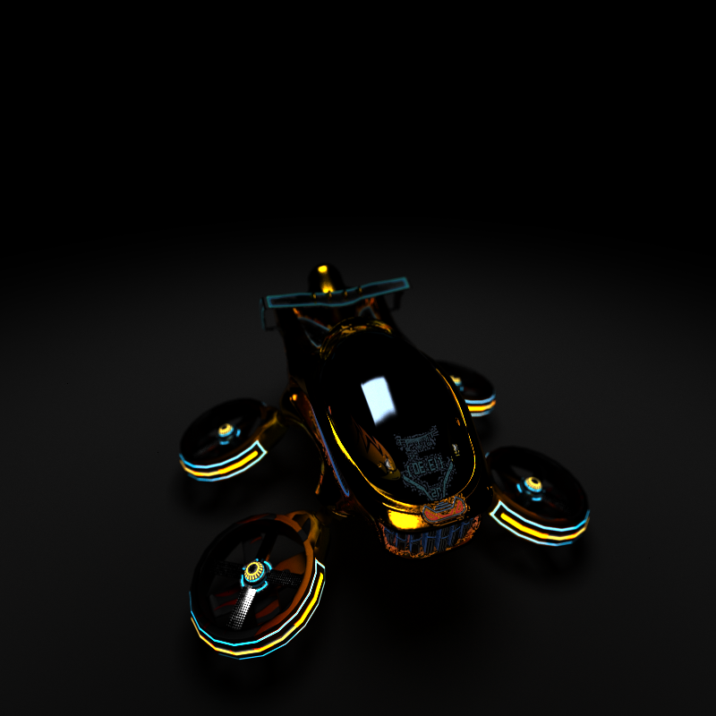

CUDA Path Tracer
================
[pbrt]: https://pbrt.org/

**University of Pennsylvania, CIS 565: GPU Programming and Architecture, Project 3**

* Yian Chen
* Tested on: (TODO) Windows 22, i7-2222 @ 2.22GHz 22GB, GTX 222 222MB (Moore 2222 Lab)

    
    
    
    
    

### Implemeted Feature 

- [x] Core(as required in Project 3)
    - [x] Diffuse & Specular
    - [x] Jittering (Antialiasing)
    - [x] First Bounce Cache
    - [x] Sort by material
- [x] Load gltf
- [x] BVH
- [x] Texture mapping & bump mapping
- [x] Environment Mapping
- [x] Microfacet BSDF
- [x] Emissive BSDF (with Emissive Texture)
- [x] Direct Lighting
- [x] Multiple Importance Sampling
- [x] Depth of Field
- [x] Tone mapping && Gamma Correction

### Core features (As required by project instruction)
- Diffuse & Specular

- Jittering
<table>
    <tr>
        <th>Before jittering</th>
        <th>After jittering</th>
    </tr>
    <tr>
        <th></th>
        <th></th>
    </tr>
</table>

- 

### BVH
On host, we can construct and traverse BVH recursively. While in this project, our code run on GPU. While recent cuda update allows recursive function execution on device, we cannot take that risk as raytracer is very performance-oriented. Recursive execution will slow down the kernel function, as it may bring dynamic stack size. 

Thanks to , a novel BVH constructing and traversing algorithm is adopted in this pathtracer. 

This pathtracer only implements a simple version of MTBVH. Instead of constructing 6 BVHs and traversing one of them at runtime, only 1 BVH is constructed. *It implies that this pathtracer still has the potential of speeding up*.

- With BVH & Without BVH:

### Texture Mapping & Bump Mapping

<table>
    <tr>
        <th>Before bump mapping</th>
        <th>After bump mapping</th>
    </tr>
    <tr>
        <th></th>
        <th></th>
    </tr>
</table>

### Microfact BSDF

To use various material, bsdfs that are more complicated than diffuse/specular are required. Here, we will first implement the classic microfacet BSDF to extend the capability of material in this pathtracer.

This pathtracer uses the Microfacet implementation basd on [pbrt].

Metallness = 1. Roughness 0 to 1 from left to right.

> Please note that the sphere used here is not an actual sphere but an icosphere. 

With texture mapping implemented, we can use `metallicRoughness` texture now. Luckily, `gltf` has a good support over metallic workflow.

### Environment Mapping

### Direct Lighting & MIS

> To stress the speed up of convergence in MIS, Russian-Roulette is disabled in this part's rendering.

> The tiny dark stripe is visible in some rendering result. This is because by default we do not allow double-sided lighting in this pathtracer.

> By default, number of light sample is set to 3.

<table>
    <tr>
        <th>Only sample bsdf 500spp</th>
        <th>Only sample light 500spp</th>
        <th>MIS 500spp</th>
    </tr>
    <tr>
        <th></th>
        <th></th>
        <th></th>
    </tr>
</table>

<table>
    <tr>
        <th>Without MIS 256spp</th>
        <th>With MIS 256spp</th>
    </tr>
    <tr>
        <th></th>
        <th></th>
    </tr>
    <tr>
        <th>Without MIS 5k spp</th>
        <th>With MIS 5k spp</th>
    </tr>
        <th></th>
        <th></th>
    </tr>
</table>

### Depth of Field

<table>
    <tr>
        <th>Depth of Field (Aperture=0.3)</th>
    </tr>
    <tr>
        <th></th>
    </tr>
</table>

### Future (If possible)

- [ ] Adaptive Sampling
- [ ] ReSTIR
- [ ] Refractive
- [ ] True B**S**DF (Add some subsurface scattering if possible?)
- [ ] Volume Rendering ~~(Ready for NeRF)~~

---

### History

- [x] Load mesh within arbitrary scene
    - [x] Triangle
    - [x] Integrate `tinygltf`
    - [x] Scene Node Tree

- [ ] Core
    - [x] G Buffer
    - [x] Russian Roulette
    - [x] Sort by material

- [ ] More BSDF
    - [x] Diffuse
    - [x] Emissive
    - [x] Microfacet
    - [ ] Reflective
    - [ ] Refractive
    - [ ] Disney

- [ ] BVH
    - [x] Basic BVH
        - [x] BoundingBox Array
        - [x] Construct BVH
        - [x] Traverse BVH
    - [x] Better Heuristics
        - [x] SAH 
    - [ ] MTBVH

- [ ] Texture
    - [x] Naive texture sampling
        - A Resource Mananger to help get the handle to texture?
    - [x] Bump mapping
    - [ ] Displacement mapping
    - [ ] Deal with antialiasing

- [ ] Better sampler
    - [ ] Encapsulate a sampler class
        - Gotta deal with cmake issue
    - [x] Monte carlo sampling
    - [x] Importance sampling
    - [x] Direct Lighting
    - [x] Multiple Importance Sampling

- [ ] Camera
    - [x] Jitter
    - [x] Field of depth
    - [ ] Motion blur 

- [ ] Denoiser 
    - [ ] Use Intel OpenImage Denoiser for now

### Log
09.20
- Basic raytracer
- Refactor integrator
- First triangle!

09.21-22
- Load arbitrary scene(only geom)
    - Triangle
    - ~~Primitive assemble phase~~(This will not work, see `README` of this commit)
    - Use tinygltf
        Remember to check [data type]((https://registry.khronos.org/glTF/specs/2.0/glTF-2.0.html#accessor-data-types)) before using accessor
    
    - Done with loading a scene with node tree!
            
            
        > Can't tell how excited I am! Now my raytracer is open to most of the scenes!
        - Scene with parenting relationship
            

09.23-09.26
> Waste too much time on OOP. Eventually used C-style coding.

09.26
Finally, finish gltf loading and basic bsdf.

- A brief trial
    - Note that this difference might be due to different bsdf we are using right now. For convenience, we are using the most naive Diffuse BSDF, while Blender use a standard BSDF by default.

09.27

Naive BVH (probably done...)
Scene with 1k faces
- One bounce, normal shading
    - Without BVH: FPS 10.9
    

    - With BVH: FPS 53.4
    
    - 5 times faster
- Multiple bounces
    - Without BVH: FPS 7.6
        
    - With BVH: FPS 22.8
        

09.28

- SAH BVH(probably done...)

- Texture sampling
    - Try billboarding
    

09.29

- Texture mapping
    - Texture mapping test(only baseColor shading)
    
    - Bump mapping
        - Normals in world coordinate
    
        - Before bump mapping
    
        - After bump mapping
    
    It might be a little difficult to notice the difference before and after bump mapping. **Please observe the logo on the box, more details are added.**

    - [ ] Texture aliasing is indeed quite serious!
        - [ ] However, to implement antialiasing for texture mapping, I may need to consider implementing mipmapping. 

- [ ] Microfacet model pbr failed...
    - [ ] Need to read through microfacet part and think about how to use roughness and metallic indeed

09.30

- [ ] Microfacet
    - [x] Metal Fresnel hack
    - [ ] Conductor
        - [ ] After mixing, need to consider how to sample
- [x] Camera 
    - [x] Antialiasing

10.1-10.2
Try to refactor camera
- Failed. gltf seems to have a really ambiguous definition of camera.

10.3
- [ ] Denoising
    - [x] OpenImage Denoiser built
        - CPU only for now
        - [ ] Figure out how to build `oidn` for cuda
    - [ ] Integrate it into project

10.4-10.6

- Microfacet

10.7 

- Environment map

10.8

- Fix random number issue(Maybe try to generate a better random number array in future?)
    - Before

    - After

    **Please notice the fracture on rabbit head before fixing**

10.9
- MIS (Finally!)

- Russian Roulette 
    - Pro: Speed up by 60%
    - Con: Lower the converge speed

- Depth of field
    - Add a realtime slider to adjust