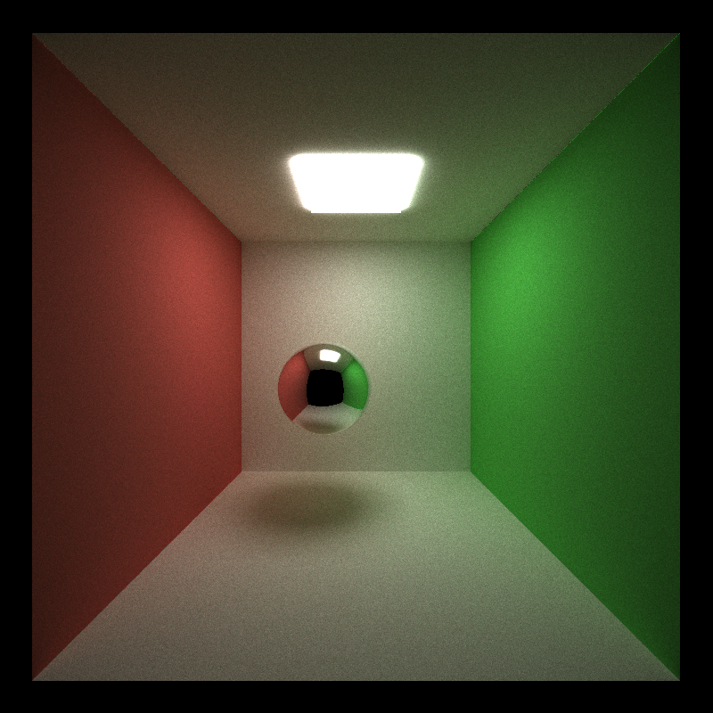

CUDA Path Tracer
================

**University of Pennsylvania, CIS 565: GPU Programming and Architecture, Project 3**

* Tong Hu
* Tested on: Windows 11, Ryzen 7 1700X @ 3.4GHz 16GB, RTX 2060 6GB (Personal Desktop)

# Visual Improvement
## Different surfaces material

The visualization of light on surfaces is predominantly governed by the material properties of the object. Based on different material properties, Combining with various sampling methods, we can greatly simulate the visual effects produced by the interaction of light with objects. Following two figures from wikipedia described the reflection and refraction of light.

On an ideal diffuse surface, light scatters uniformly in all directions, irrespective of the incident angle. Such surfaces appear soft and non-glossy. Examples might include chalk, unpolished wood, or matte paint. 

A perfectly specular-reflective surface acts like a mirror, reflecting light in a singular direction dictated by the law of reflection. Such surfaces exhibit sharp, clear reflections and are found in materials like polished metals or mirrors. 

A refractive object, like glass or water, can transmit light due to a change in medium and cause refraction. The precise nature of this bending is governed by the material's refractive index. Additionally, such materials can also reflect light.

  

    
    
Reflection of light

  

  
  

     
    
Refraction of light

  

This can be fixed

  
  

    
    
Diffusion

  

  
  

     
    
Reflection

  

  
  

     
    
Refraction

  

5000 iterations, depth = 15
light emitance: 10

## Anti-aliasing

  

    
    
Without Anti-aliasing

  

  
  

     
    
With Anti-aliasing

  

light emitance:15

## Physically-based depth-of-field

  

    
    
focus distance: 7.6

  

  
  

     
    
focus distance: 8.7

  

  

     
    
focus distance: 12.6

  

  

     
    
focus distance: 115

  

  

    
    
focus distance: 10, aperture: 0.5

  

  
  

     
    
focus distance: 8.7, aperture: 1

  

  

     
    
focus distance: 12.6, aperture: 2

  

## Motion Blur

  

    
    
Static

  

  
  

     
    
Motion Blur

  

## Subsurface Scattering

  

    
    
Without Subsurface Scattering

  

  
  

     
    
Subsurface Scattering

  

# Performance Improvement
## Stream Compaction

## Material Sorting

## Cache First Bounce

## Core Features
* Ideal diffuse surface, perfectly specular-reflective surface
* Path continuation/termination using Stream Compaction
* Sort by material
* Toggleable option to cache the first bounce

## Other Features:
* Refraction
* Physically-based depth-of-field
* Stochastic Sampled Antialiasing
* Subsurface scattering
* Motion Blur

## Bloopers
(share any images, debug images, etc.)