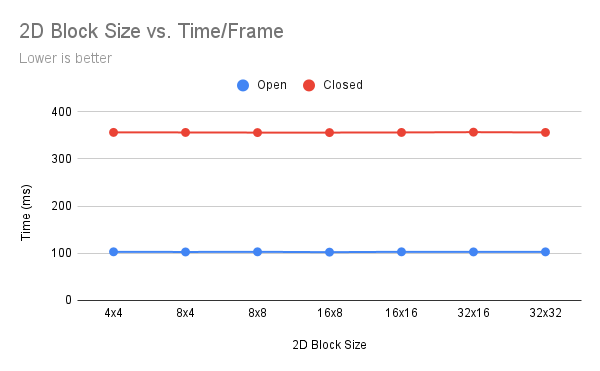
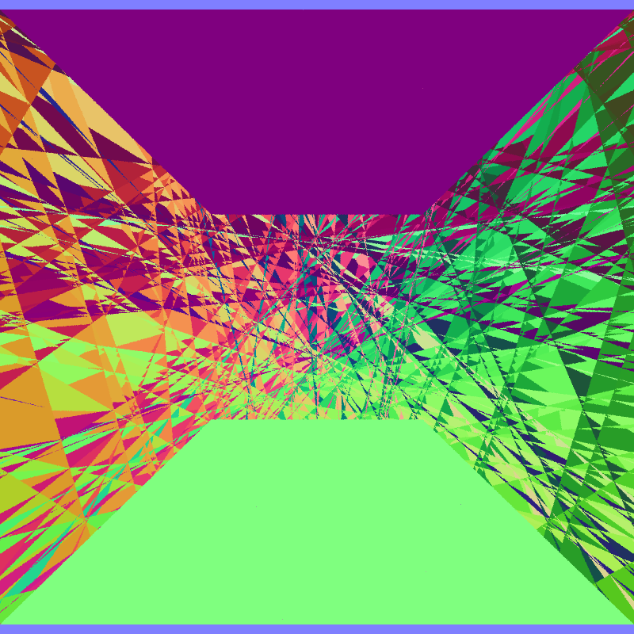

this readme is still in progress, pls be patient thank you

# CUDA Path Tracer

**University of Pennsylvania, CIS 5650: GPU Programming and Architecture, Project 3**

* Aditya Gupta
  * [Website](http://adityag1.com/), [GitHub](https://github.com/AdityaGupta1), [LinkedIn](https://www.linkedin.com/in/aditya-gupta1/), [3D renders](https://www.instagram.com/sdojhaus/)
* Tested on: Windows 10, i7-10750H @ 2.60GHz 16GB, NVIDIA GeForce RTX 2070 8GB (personal laptop)
  * Compute capability: 7.5

## Introduction

TODO

## Features

### BRDFs

#### Lambertian shading

Basic Lambertian shading, shown here in a Cornell box scene.

#### Specular reflection and refraction

Perfect specular reflection and refraction, shown in the same Cornell box scene as above.

Note that this project also has code for microfacet reflection and refraction but it currently does not work properly. The second render at the top of the page does use a roughness value of 0.3 for the transparent character but the calculations aren't entirely accurate even if the effect looks cool.

### Scene building tools

#### glTF mesh loading

Using [tinygltf](https://github.com/syoyo/tinygltf). The above images show, from left to right:
- Final render
- Albedo (base color)
- Normals (with normal map applied)

#### Environment map lights

#### BVH construction and traversal

The [above scene](#environment-map-lights) renders at 40.9 FPS using a BVH and 2.2 FPS without a BVH. The mesh has 17,386 triangles and it takes about 11.5 ms to construct the BVH.

More detailed performance analysis is given [below](#bvh).

### Other features

#### Depth of field

Using a thin lens camera model.

#### Denoising

Using [Intel Open Image Denoise](https://www.openimagedenoise.org/). Left is raw output and right is denoised. Both images were taken after 20 samples per pixel (~8 seconds). Denoising also takes albedo and normals into account (see example auxiliary images [above](#gltf-mesh-loading)).

## Performance Analysis

I started with the following set of parameters:
- 1D block size of 768, 2D block size of 8x8
- Enable BVH, partition rays, and russian roulette
- Disable sorting rays by material and first bounce cache
- Max ray depth = 8
- Denoising every 3 frames

Most of the following analyses will refer to the two scenes at the [top of this page](#cuda-path-tracer): Open (red ocean with a bright plushie in the backround) and Closed (yellow room with a guy in a chair). Open is rendered at 1080x1350 and Closed is rendered at 1920x1080.

### Block size

First, I compared various 1D block sizes to find which one would give the best performance. 1D block dimensions are used for most of the kernels, including checking for intersections and shading materials.

From this, I found that a 1D block size of 64 gave the best performance. Then, I compared 2D block sizes, which are used solely for generating initial rays from the camera:

There was almost no difference between the performance given by these block sizes, so I stuck with the original size of 8x8.

### Partition rays

By default, after every round of intersections and shading, the path tracer partitions the rays by whether they have bounces left. Then, only those that can still bounce are considered for the next round. With this feature, the number of drops with each successive round:

However, this feature is toggleable. When partitioning is off, the path tracer will instead send all rays to all kernels every time and simply return immediately in threads where the associated ray has no bounces left.

Comparing the two options, I initially thought partition would increase performance since all warps would be densely packed. However, the results surprised me:

My guess is that partitioning large amounts of rays (more than 2 million for a 1920x1080 image) simply takes too much time for the kernel speedup to be worth it. With that in mind, I turned ray partitioning off for the remaining analyses.

TODO: look at timeline in Nsight and answer this more concretely

### Sort rays by material type

TODO

### Russian roulette path termination

TODO

- Compare number of rays per depth with and without russian roulette

### First bounce cache

TODO

This option exists for performance comparisons but does not make sense to use for actual renders because it doesn't play nice with anti-aliasing or depth of field.

- Provide performance benefit analysis across different max ray depths.

### BVH

TODO

## Bloopers

This appeared when I sorted intersections by material ID without also sorting the path segments in tandem.

Really not sure where this came from, but it appeared while I was working on the first bounce cache.

Evil monkey.

Seems like the monkey exploded?

The monkey is empty inside, just like me after spending two weeks on this assignment.

🤨 (I was trying to fix the shading artifacts on the eye sockets.)

## Attribution

### Code

- BVH tutorial: https://jacco.ompf2.com/2022/04/13/how-to-build-a-bvh-part-1-basics/
- Barycentric coordinates: https://gamedev.stackexchange.com/questions/23743/whats-the-most-efficient-way-to-find-barycentric-coordinates/23745#23745
- Normal map: http://www.thetenthplanet.de/archives/1180

### Models

- Freddy Fazbear: https://sketchfab.com/3d-models/fnaf-ar-freddy-fazbear-f6e019333d694cbfbb2f3fbc9e791763
- Chair: https://sketchfab.com/3d-models/metal-folding-chair-c4428a7f4a2f472689a914a3373befc3
- Hair: https://sketchfab.com/3d-models/anime-style-short-hair-c396587aee6a4e63a6476c1400b613eb
- Human character: https://www.mixamo.com/
- Backrooms: https://sketchfab.com/3d-models/simple-backrooms-b7e72135d97b4c81b6c135413e6e2168
- Among Us crewmate: https://sketchfab.com/3d-models/among-us-astronaut-clay-20b591de51eb4fc3a4c5a4d40c6011d5
- Rei plush: https://sketchfab.com/3d-models/rei-ayanami-plushie-0bda564e1d804c2f84950cec57db15d3
