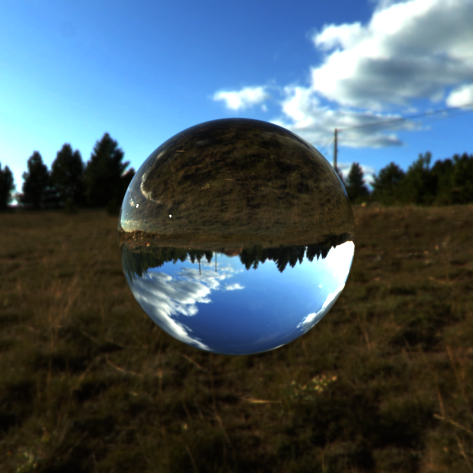

CUDA Path Tracer
================

**University of Pennsylvania, CIS 565: GPU Programming and Architecture, Project 3**

* Licheng CAO
  * [LinkedIn](https://www.linkedin.com/in/licheng-cao-6a523524b/)
* Tested on: Windows 10, i7-10870H @ 2.20GHz 32GB, GTX 3060 6009MB

Result
==============

  

Features
============
### Textures

* [texture.cuh](https://github.com/LichengCAO/Project3-CUDA-Path-Tracer/blob/main/src/texture.cuh) and [texture.cu](https://github.com/LichengCAO/Project3-CUDA-Path-Tracer/blob/main/src/texture.cu) are used to handle textures with CUDA. I applied bump mapping and texture mapping to help me render meshes. And other textures like roughness maps can also be loaded to help render meshes as long as the shading parts supports that material attribute.

|bump map| base map | result|
|:-----:|:-----:|:-----:|
||||

### Depth of field
* To achieve depth of field (DOF) effects, I referred to [PBRT 6.2.3](https://www.pbr-book.org/3ed-2018/Camera_Models/Projective_Camera_Models#TheThinLensModelandDepthofField) and successfully implemented the thin lens model. This implementation significantly contributes to generating high-quality output images for the ray tracer.

|without DOF| with DOF |
|:-----:|:-----:|
|||

### .obj loading and BVH tree
* I employed the tinyobjloader library to efficiently load meshes into the scene. Additionally, I implemented a Bounding Volume Hierarchy (BVH) to optimize ray-mesh intersection tests, thereby enhancing the rendering performance.
  * The BVH tree is built on CPU based on [PBRT 4.3.1](https://www.pbr-book.org/3ed-2018/Primitives_and_Intersection_Acceleration/Bounding_Volume_Hierarchies).
* During each iteration of ray bouncing, the ray undergoes a series of tests. Initially, it checks for intersections with the bounding boxes in the scene. If an intersection with a bounding box occurs, the ray proceeds to check for intersections with the child nodes of that bounding box. This process continues until the ray finds the nearest intersection with a triangle in the scene, ensuring accurate rendering of the scene's geometry.
  * I utilized a stack data structure to help me implement the ray's behavior in an iterative way since GPUs don't have good support for recusive bahaviors.
  * To expedite the intersection process, I introduced two crucial optimizations. First, I implemented an early termination mechanism by checking if we already have a hit point closer than the one present within the current bounding box. If such a hit point exists, we skip further examination of the current bounding box. Second, I strategically determined the order in which to test the children of a bounding box based on the parent node's split axis. This allows us to prioritize testing the child that is closer to the current ray's position, increasing the likelihood of early termination and further improving the ray tracing efficiency.
* These optimizations have significantly improved the frames per second (FPS), making the rendering process much more efficient:

  

|Naive|BVH|
|:-----:|:-----:|
|||

### Cache first frame
* Cache first frame feature is implemented to improve fps. And the test result is shown as follow:

  

* The result shows that caching first frame will slightly improve fps, especially with lower ray bounce. However, it will also introduce some artifacts if the ray is jittered by some random number for anti-aliasing as shown:

|no cache|cache first frame|
|:-----:|:-----:|
||| 

### Reflection and Refraction
* Implementing basic reflection in ray tracing is quite straightforward. However, it's crucial to handle the Lambertian reflection model carefully.
* For the refraction, I referred [here](https://zhuanlan.zhihu.com/p/303168568) for the Schlick's approximation and the accurate fresnel evaluation and use [glm::refract](https://registry.khronos.org/OpenGL-Refpages/gl4/html/refract.xhtml) to calculate the ray direction.

|reflection| refraction |
|:-----:|:-----:|
|| |

### Stream compaction
* Path continuation/termination
  * I used thrust::copy_if and thrust::remove_if to remove paths that hit light or nothing and record them in a output array, so that the path tracer will have less path to check after each bounce and early terminations, which results in a higher fps:
 
|no compaction| compaction |
|:-----:|:-----:|
|||

* Sort materials
  * I tried to sort the paths based on the material of intersections with thrust::sort_by_key, but it actually resulted in a lower fps. The reason may be that the cost of sorting overweighed the performance improvement it brings to my path tracer.

|without sort| sorted |
|:-----:|:-----:|
|||

Third Party
============
* Code
  * [tinyobjloader](https://github.com/tinyobjloader/tinyobjloader)
  * [imgui](https://github.com/ocornut/imgui)
  * [stb_image](https://github.com/nothings/stb/blob/master/stb_image.h)
* Assets
  * [bunny](https://github.com/harzival/stanford_bunny_obj_mtl_jpg/blob/master/bunny.obj)
  * [planet](https://www.turbosquid.com/3d-models/3d-stylized-planet-system-4k-free-1973128)

