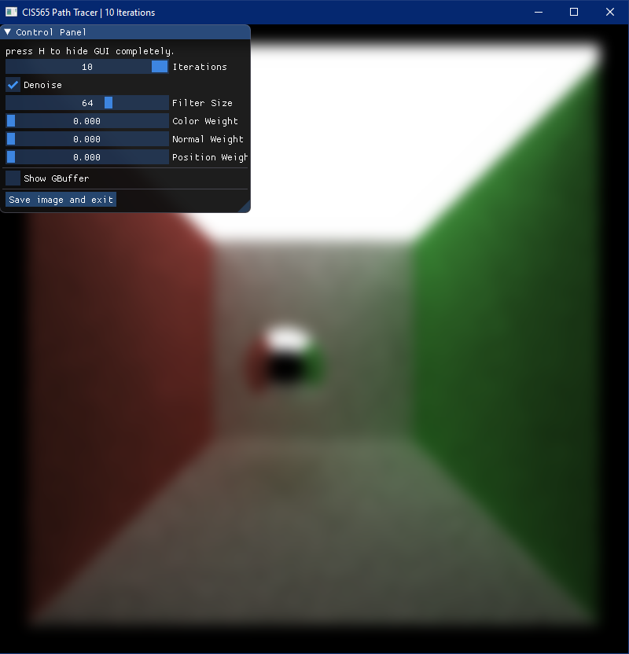

 # Denoised for CUDA GPU-Accelerated Path Tracing

**University of Pennsylvania, CIS 565: GPU Programming and Architecture, Project 2**

* Ruijun(Daniel) Zhong
    * [LinkedIn](https://www.linkedin.com/in/daniel-z-73158b152/)    
    * [Personal Website](https://www.danielzhongportfolio.com/)
 * Tested on: Windows 11 pro, 12th Gen Intel(R) Core(TM) i7-12700K 3.61 GHz 32.0 GB, NVIDIA GeForce RTX 3070 Ti (personal computer)

 ## Abstract
 This repository showcases a state-of-the-art CUDA-accelerated path tracer, innovatively integrated with the A-Trous denoising technique. The A-Trous denoising method, inspired by the seminal work [Wojciech Jarosz's paper](https://jo.dreggn.org/home/2010_atrous.pdf), enhances the quality of rendered images by effectively reducing the noise produced in path tracing, offering both visual clarity and computational efficiency.

## Demo
 |||
 |:-:|:-:|
 |Original|Denoised|

 |||
 |:-:|:-:|
 |Original|Denoised|

## Break Down  
1. implement G-Buffers for normals and positions and visualize  

||||
|:-:|:-:|:-:|
|Time of Flight|Normals|Positions|

||||
|:-:|:-:|:-:|
|Time of Flight|Normals|Positions|

2. Simple blur effect  

||
|:-:|
|Simple blur|

3. Add weight parameters & use the G-Buffers to preserve perceived edges

 |||
 |:-:|:-:|
 |Denoised|Denoised|

## Runtime  analysis
  ### Filter size impact on time:  
  
   
  Resolution size impact on time:
  ### 
  
  Both filter size and resolution will impact denoise time as they increase. However, overall denoise time is acceptable.

## Quality analysis
  ### Filter Size Impact:
  ||||
|:-:|:-:|:-:|
|10|30|50|

  As we can see in the pictures, more filter size will denoise the scene better.

  ### Different material(Same parameter weight):
  ||||
|:-:|:-:|:-:|
|Metal|Diffuse|Texture & Glass|

From the images, it's evident that texture and glass pose significant challenges for denoising. The transparency appears overly blurred, and regarding the texture, further refinement is likely needed. Incorporating the texture value into the gbuffer might enhance the results when using the À-Trous wavelet approach.

 ### Different Scene(Same parameter weight):
|||
 |:-:|:-:|
 |Regular Cornell Box|Larger Ceiling Light Cornell Box|

 Based on the pictures, we can tell that a larger light source in path tracing reduces noise better. Becuase A-Trous wavelet denoising technique is applied to such images. it calculates scene details and noise, preserving edges and details while efficiently eliminating residual noise, resulting in a clearer and sharper denoised image.