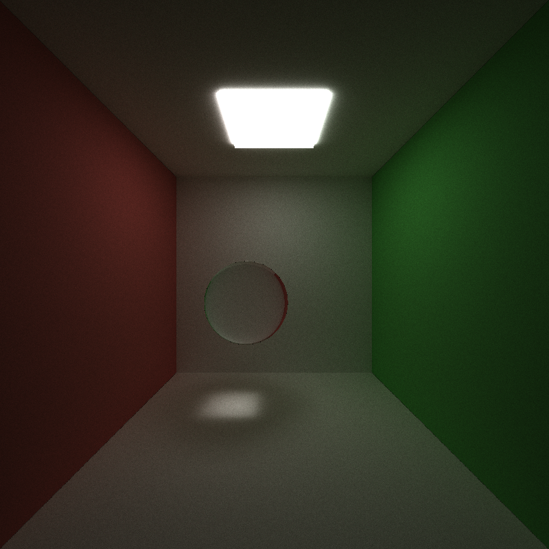

CUDA Path Tracer
================

**University of Pennsylvania, CIS 565: GPU Programming and Architecture, Project 3**

* Utkarsh Dwivedi
  * [LinkedIn](https://www.linkedin.com/in/udwivedi/), [personal website](https://utkarshdwivedi.com/)
* Tested on: Windows 11 Home, AMD Ryzen 7 5800H @ 3.2GHz 16 GB, Nvidia GeForce RTX 3060 Laptop GPU 6 GB

# CUDA Path Tracer


## Introduction

This is a CUDA implementation of a simple path tracer with bounding volume heirarchy (BVH) based acceleration. The basic path tracer setup shoots a ray from every single pixel in the image resolution (width * height) and traces each ray for `n` bounces, or until the rays hit a light source. At each bounce, luminance information is captured as a throughput value and a final gather on all the rays gets the final colour for each pixel. This is performed using a Monte Carlo estimation of the Light Transport Equation Integral (LTE), which is as follows:


```math
L_O(p,\omega_o) = L_E(p,\omega_o) + \int_{s} f(p,\omega_o,\omega_i)  L_i(p,\omega_i) V(p\prime,p) |dot(\omega_i, N)| \,d\omega_i
```

## Features

### 1. Bidrectional Scattering Distribution Function Computation

**Lambertian Diffuse, Perfect Specular, Perfect Refraction**

This path tracer supports lambertian diffuse and perfectly specular (reflective), and perfectly transmissive (refractive) materials. The Index of Refraction (IOR) value of the material can be specified in the `<sceneName>.txt` file under the `MATERIAL` (for example, in the case of glass, this would be `IOR 1.55`). The path tracer assumes that the main transport medium is air, and hard-codes that IOR to 1.

||||
|:-:|:-:|:-:|
|Lambertian Diffuse|Perfect Specular|Perfect Refraction|

Additionally, there is support for imperfect specular and refractive materials.

### Tattti
### Hag
### GOOO
### POOp
### turd


## Performance Analysis

## References

- Adam Mally's CIS 561 Advanced Computer Graphics course at University of Pennsylvania
- TinyGLTF
- PBRT