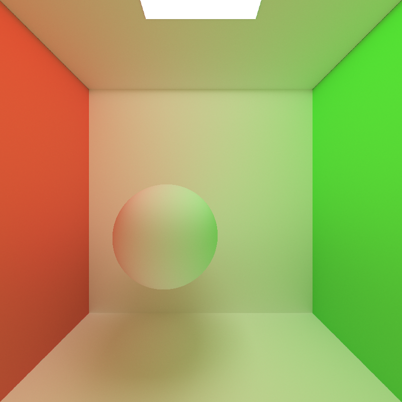

CUDA Path Tracer
================

**University of Pennsylvania, CIS 565: GPU Programming and Architecture, Project 3**

* Helena Zhang
* Tested on: Windows 11, i7-10750 @ 2.6GHz 16GB, Geforce RTX 2060 6GB

Features
================
**Mesh import (glTF)**

Performance impact: tbd, compare # vertices vs performance

**Direct Lighting**

Performance impact: tbd

**Refraction**

Performance impact: tbd

**Depth of Field Camera**

Lens Radius:

Focus Distance Effect: 

Performance impact: none

Analysis
================
**Stream compaction**
For Stream compaction, the pathtracer uses thrust::partition to remove any rays that did not encounter an intersection, since they will no longer contribute any colors on the pixel. For the cornell box, the following figure shows the number of paths remaining after each bounce. 

Starting with 640,000 (800 * 800) paths in the first bounce, the decrease from depth 1 to 2 is constant. This is because the first path for each pixel is the same; it goes from the eye of the camera to the direction of the pixel. Then, as the path bounces around the scene, the number of rays will exponentially decrease, as a certain percentage of rays will leave the box at every bounce. 

Stream compaction improves performance by eliminating any rays that will no longer contribute to a pixel's accumulated color. However, stream compaction would not have any effect in say, a closed scene. 

 

Open Cornell Box

Closed Cornell Box

In these two renders, one is an open box and one is a closed box. In terms of appearance, the closed box is brighter than the open box. This is because none of the paths will be eliminated, so every path will get 8 bounces to accumulate light on the pixel, whereas most pixels on the open box will not get the same number of chances to accumulate color on itself. However, as mentioned before, this brighter image comes at the cost of its runtime. The FPS of the open Cornell box is 28.6 FPS, whereas the FPS of the closed Cornell box is 17.4 FPS.

**Cache first hit**

**Material sort**
  

